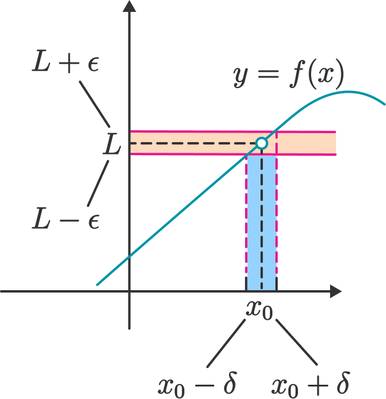
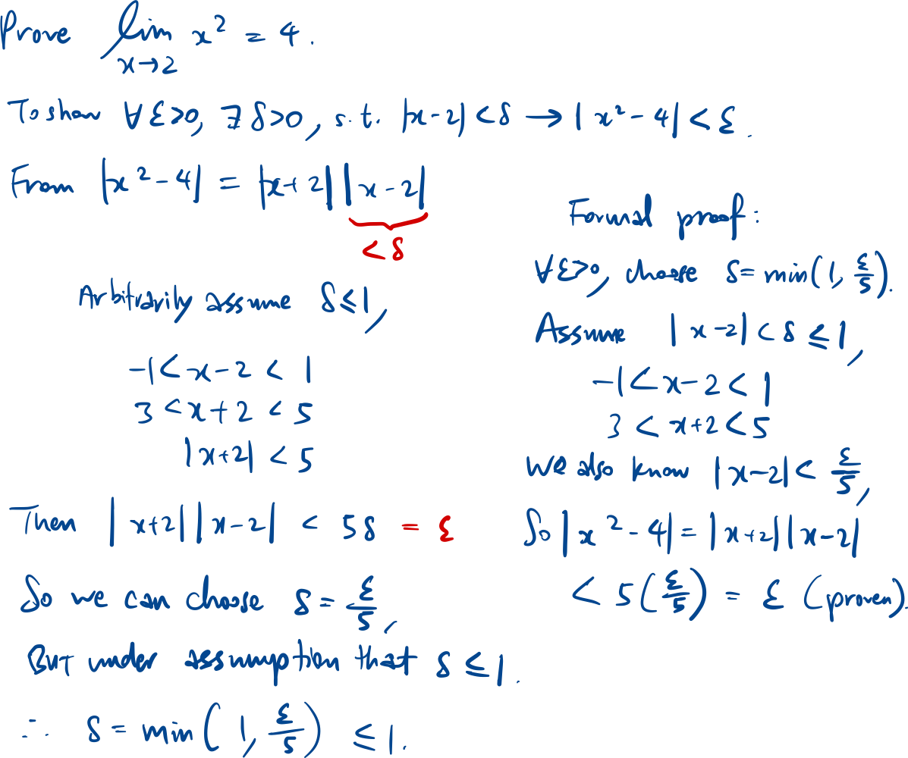
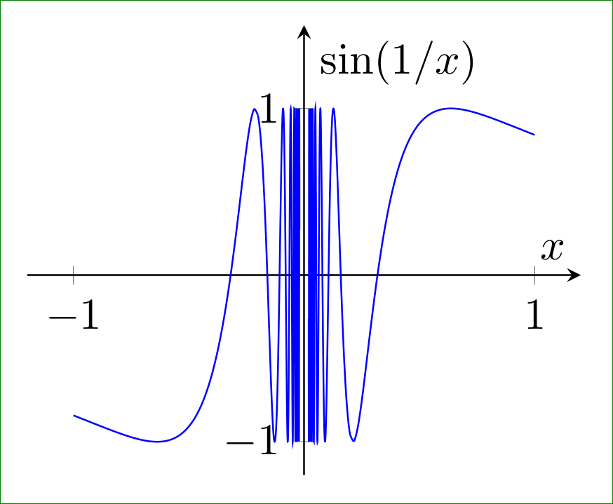
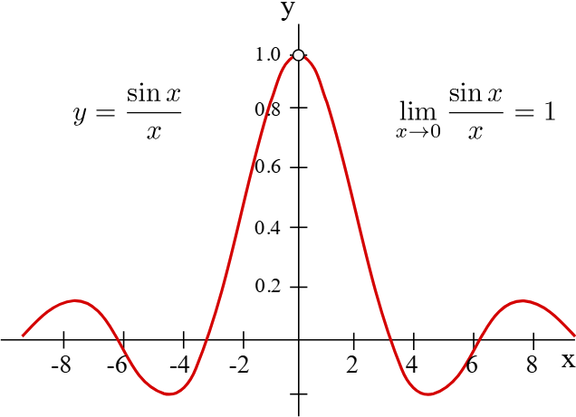
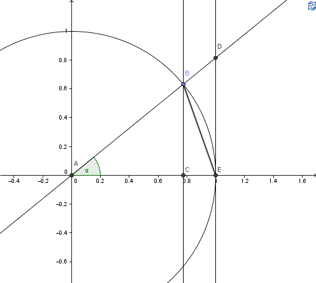
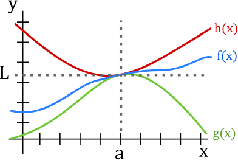

## Limit point

a is limit point of set A if:

$$\forall \, \delta > 0, \, \exists \, x \in A \text{ such that } 0 < |x - a| < \delta.$$

i.e. there are some x∈A around the limit point a.

## Limit of a function

$$\begin{aligned} \lim_{x \to a} f(x) = L \\ \quad \text{if} \quad \forall \, \varepsilon > 0, \, \exists \, \delta > 0 \text{ such that } \\ \forall x \in A, \; 0 < |x - a| < \delta \implies |f(x) - L| < \varepsilon. \end{aligned}$$

### To prove a limit using epsilon-delta

Technique: Reverse engineer from |f(x) - L| < ϵ.

## Limit at infinity

$$\lim_{x \to \infty} f(x) = L \text{ if } \forall \, \varepsilon > 0, \, \exists \, N > 0 \text{ such that } \forall x > N, \; |f(x) - L| < \varepsilon.$$

$$\lim_{n \to \infty} a_n = L \text{ if } \forall \, \varepsilon > 0, \, \exists \, N > 0 \text{ such that } \forall n > N, \; |a_n - L| < \varepsilon.$$

## Showing limit d.n.e

### Limit tends to infinity

$$\lim_{x \to a} f(x) = \infty \text{ if } \forall \, M > 0, \, \exists \, \delta > 0 \text{ such that }\forall x \in A, \; 0 < |x - a| < \delta \implies f(x) > M.$$

$$\lim_{x \to \infty} f(x) = \infty \text{ if } \forall \, M > 0, \, \exists \, N > 0 \text{ such that } x > N \implies f(x) > M.$$

### Construction of two sequences

$$\text{If there are two sequences } \{a_n\} \text{ and } \{b_n\} \text{ such that }$$

$$a_n \ne a, \; b_n \ne a, \text{ and both } a_n \to a \text{ as } n \to \infty, \text{ but }\lim_{n \to \infty} f(a_n) \ne \lim_{n \to \infty} f(b_n),$$

$$\text{then } \lim_{x \to a} f(x) \text{ does not exist.}$$

$$\text{Take two sequences: } a_n = \frac{1}{\pi n}, b_n = \frac{1}{\frac{\pi}{2} + 2\pi n}.$$

$$\lim_{n \to \infty} f(a_n) = 0, \quad \lim_{n \to \infty} f(b_n) = 1.$$

### Left-hand vs right-hand limit

$$\lim_{x \to a} f(x) = L \;\Longleftrightarrow\;\lim_{x \to a^-} f(x) = \lim_{x \to a^+} f(x) = L.$$

## Asymptotes

$$x = a \text{ is a vertical asymptote if } \lim_{x \to a^-} f(x) = \infty \text{ or } \lim_{x \to a^+} f(x) = \infty.$$

$$y = L \text{ is a horizontal asymptote if } \lim_{x \to +\infty} f(x) = L \text{ or } \lim_{x \to -\infty} f(x) = L.$$

$$y = ax + b \text{ is an oblique asymptote if } \lim_{x \to \infty} \bigl(f(x) - (ax + b)\bigr) = 0.$$

## Methods to find limits

### Limit laws

$$\begin{aligned} \text{For } f: A_1 \to \mathbb{R}, \; g: A_2 \to \mathbb{R}, \text{ and } a \in A_1 \cap A_2,\\ \quad \text{if } \lim_{x \to a} f(x) = l \text{ and } \lim_{x \to a} g(x) = m: \end{aligned}$$

1. $\lim_{x \to a} \bigl( \alpha f(x) + \beta g(x) \bigr) = \alpha l + \beta m.$
1. $\lim_{x \to a} \bigl( f(x) g(x) \bigr) = l m.$
1. $\lim_{x \to a} \left( \frac{f(x)}{g(x)} \right) = \frac{l}{m}\quad \text{if } m \ne 0.$
1. $\lim_{x \to a} \bigl( f(x) \bigr)^{1/n} = l^{1/n}.$

Limits on RHS should exist for limit law to be applied.

**

$$\text{If } \lim_{x \to a} f(x) \text{ does not exist and } \lim_{x \to a} g(x) = m,$$

1. $\lim_{x \to a} \bigl( \alpha f(x) + \beta g(x) \bigr) \text{ d.n.e.}$
1. $\text{If } m \ne 0, \text{ then } \lim_{x \to a} \bigl( f(x) g(x) \bigr) \text{ d.n.e.}$

If m=0 or both limits don’t exist, we have no conclusion.

**

### Continuous

Continuous f(x) at x=a: substitute x=a into equation.

### Useful equations

1. $\text{If } \lim_{x \to 0} f(x) = 0, \text{ then } \lim_{x \to 0} \left( \frac{\sin(f(x))}{f(x)} \right) = 1.$

Derivation:

For the above unit circle:

$$\text{Area of } \triangle ABE = \tfrac{1}{2} (BC)(AE) = \tfrac{1}{2} \sin \alpha$$

$$\text{Area of sector } ABE = \tfrac{1}{2} \alpha$$

$$\text{Area of } \triangle ADE = \tfrac{1}{2} (DE)(AE) = \tfrac{1}{2} \tan \alpha$$

$$\text{Clearly, } \tfrac{1}{2}\sin \alpha < \tfrac{1}{2}\alpha < \tfrac{1}{2}\tan \alpha$$

$$\text{Divide by } \tfrac{1}{2}\sin \alpha \text{ and take reciprocals:} \quad 1 > \frac{\sin \alpha}{\alpha} > \cos \alpha$$

$$\lim_{\alpha \to 0} 1 = \lim_{\alpha \to 0} \cos \alpha = 1$$

$$\text{So } \lim_{\alpha \to 0} \frac{\sin \alpha}{\alpha} = 1$$

1. Triangle inequality

$$|x + y| \le |x| + |y|.$$

Reverse triangle inequality.

$$\Big| |x| - |y| \Big| \leq |x - y|$$

1. For large x, factorial > exponential > polynomial > ln/lg.

$$\begin{aligned} \text{For any } p > 0, \, \varepsilon > 0, \quad \\ \lim_{x \to +\infty} \frac{x!}{x^x} = 0, \quad \\ \lim_{x \to +\infty} \frac{e^{\varepsilon x}}{x!} = 0, \quad \\ \lim_{x \to +\infty} \frac{x^p}{e^{\varepsilon x}} = 0, \quad \\ \text{and} \quad \\ \lim_{x \to +\infty} \frac{(\ln x)^p}{x^{\varepsilon}} = 0. \end{aligned}$$

### Squeeze theorem

$$\text{If } g(x) \le f(x) \le h(x) \text{ for } x \in I \setminus \{a\},\text{ and } \lim_{x \to a} g(x) = \lim_{x \to a} h(x) = L,\text{ then } \lim_{x \to a} f(x) = L.$$

$$\lim_{x \to a} f(x) = L \;\Longleftrightarrow\;\lim_{x \to a} \bigl| f(x) - L \bigr| = 0.$$

If L = 0, we can use squeeze theorem on |f(x)|, and we instantly get a lower bound of 0.

E.g. $\lim_{h \to 0} h \sin \frac{1}{h}$

We can guess that L = 0, since h→0 and although sin(1/h) oscillates near 0, it is still bounded.

Thus $0 \le \left| h \sin \frac{1}{h} \right| = |h| \cdot \left| \sin \frac{1}{h} \right| \le |h| \to 0, \quad \text{as } h \to 0,$

### Other tricks

- $\lim_{x \to \infty} (f)^x = \lim_{x \to \infty} e^{x \ln(f)} = e^{\lim_{x \to \infty} (x \cdot f)}$
- L’hopital rule
- If there are multiple special functions, use series expansion & ordo notation
