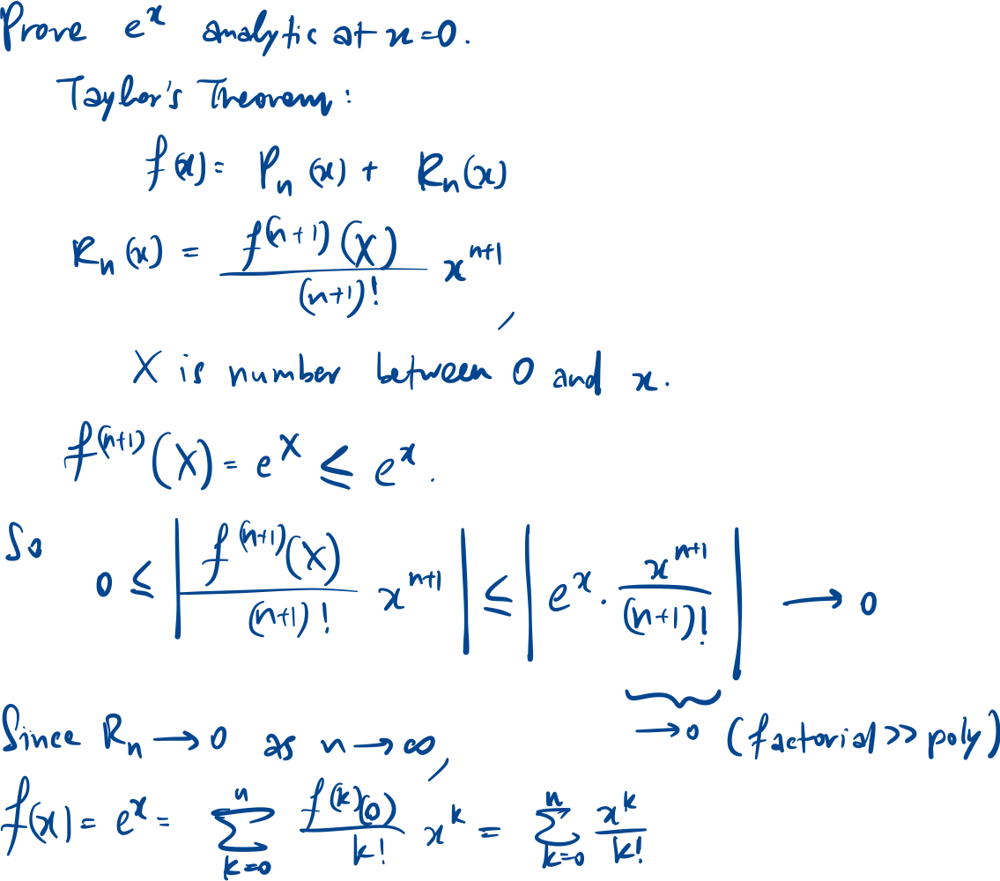

Taylor series is a specific type of power series, we can use the derivatives at some point x=c to find an.

$$\text{Taylor series: } \sum_{n=0}^{\infty} \frac{f^{(n)}(c)}{n!}(x-c)^n = f(c) + \frac{f'(c)}{1!}(x-c) + \frac{f''(c)}{2!}(x-c)^2 + \ldots$$

## Maclaurin series

Taylor series centered at x=0.

$$\text{Maclaurin series: } \sum_{n=0}^{\infty} \frac{f^{(n)}(0)}{n!}x^{n}= f(0) + f'(0)x + \frac{f''(0)}{2!}x^{2} + \frac{f'''(0)}{3!}x^{3} + \ldots$$

$$\text{mth degree polynomial: } P_m(x) = \sum_{n=0}^{m} \frac{f^{(n)}(c)}{n!}(x-c)^n = f(c) + \ldots + \frac{f^{(m)}(c)}{m!}(x-c)^m$$

$$\text{Then } P_m^{(n)}(c) = f^{(n)}(c) \text{ for } n = 0, 1, \ldots, m,\ \text{and } 0 \text{ for } n \ge m + 1.$$

## Taylor’s theorem, with Lagrange remainder

$$\text{If } f \text{ is } (n+1) \text{ times differentiable on an open interval containing } c \text{ and } x, \text{ then}$$

$$f(x) = P_n(x) + R_n(x) = \sum_{k=0}^{n} \frac{f^{(k)}(c)}{k!}(x - c)^k + \frac{f^{(n+1)}(X)}{(n + 1)!}(x - c)^{n + 1},$$

$$\text{where } P_n(x) \text{ is the nth-degree Taylor polynomial, and } X \text{ is some number between } c \text{ and } x.$$

$$f(x) = f(c) + f'(c)(x-c) + \frac{f''(c)}{2!}(x-c)^2 + \dots + \frac{f^{(n)}(c)}{n!}(x-c)^n + \frac{f^{(n+1)}(X)}{(n+1)!}(x-c)^{n+1}$$

## Analytic function

$f(x)$ with derivatives of all orders is analytic at $x=c$ if

its Taylor series at $x=c$ converges to $f(x)$ on an open interval containing ${x=c}$.

$$\exists \text{ an open interval } (c-R, c+R) \text{ such that } \forall x \text{ in that interval,}$$

$$f(x) = \sum_{n=0}^{\infty} \frac{f^{(n)}(c)}{n!} (x-c)^n$$

In other words, the behaviour at one point of the function tells us the behaviour of the whole function.

The elementary functions like sinx, cosx, lnx, ex, etc, are analytic.

To show some function is analytic at x=0, express f = Pn + Rn, then show Rn → 0.

$$\text{Useful equation: }\lim_{n \to \infty} \frac{x^n}{n!} = 0$$

Example

## Ordo notation

Used when asked to find limit of some function by breaking down each special term into the first few terms of its Maclaurin expansion.

### Definition

$$f = \mathcal{O}(g) \text{ as } x \to c, \text{ if } \exists\, D, \delta > 0 \text{ such that } |f| \le D|g|, \ \forall\, x \in (c - \delta,\, c + \delta).$$

### Properties

$$\text{For } 0 \le m \le n,\ \mathcal{O}(x^m) + \mathcal{O}(x^n) = \mathcal{O}(x^m), \text{ as } x \to 0$$

$$\mathcal{O}(g_1) \cdot \mathcal{O}(g_2) = \mathcal{O}(g_1 g_2) \text{ as } x \to c.$$

$$\frac{\mathcal{O}(g_1)}{g_2} = \mathcal{O}\!\left(\frac{g_1}{g_2}\right) \text{ as } x \to c.$$

*Try to make the largest power the same on numerator & denominator.

### Useful equations

$$(a + b + c)^2 = a^2 + b^2 + c^2 + 2ab + 2bc + 2ca$$

$$(x + \mathcal{O}(x^2))^4 = x^4(1 + \mathcal{O}(x))$$

## Taylor’s theorem, asymptotic version\text{If } f \text{ is } (n+1) \text{ times differentiable on an open interval containing } c

$$\text{and } f^{(n+1)} \text{ is continuous at } c,$$

$$\text{then } f(x) = \sum_{k=0}^{n} \frac{f^{(k)}(c)}{k!}(x - c)^k + \mathcal{O}\!\left((x - c)^{n+1}\right), \text{ as } x \to c.$$

**we can cut off a Taylor series after some term and approximate the error.

$$e^x \approx 1 + x + \frac{x^2}{2} + \mathcal{O}(x^3).$$

$$\lvert \text{error} \rvert \le C x^3 \text{ for } x \in (-\delta,\delta), \text{ for some } C,\delta > 0.$$
