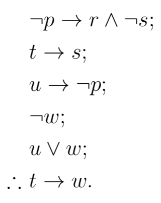
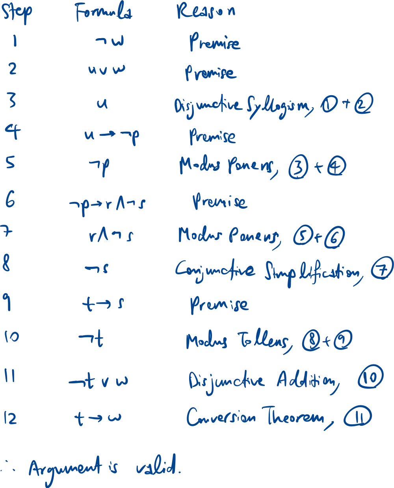
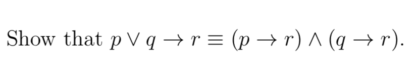
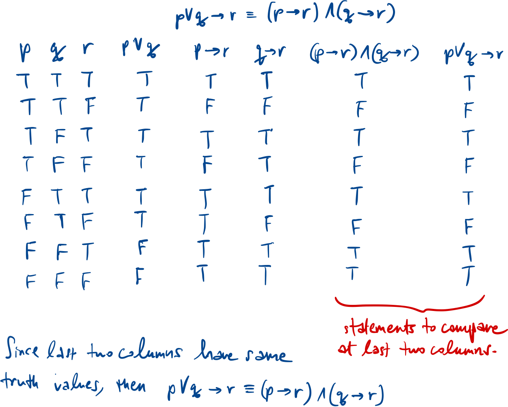
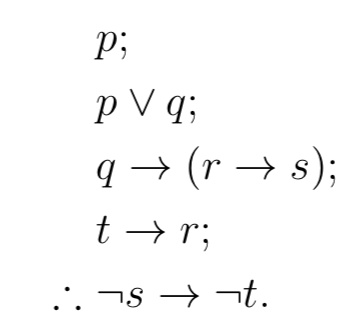
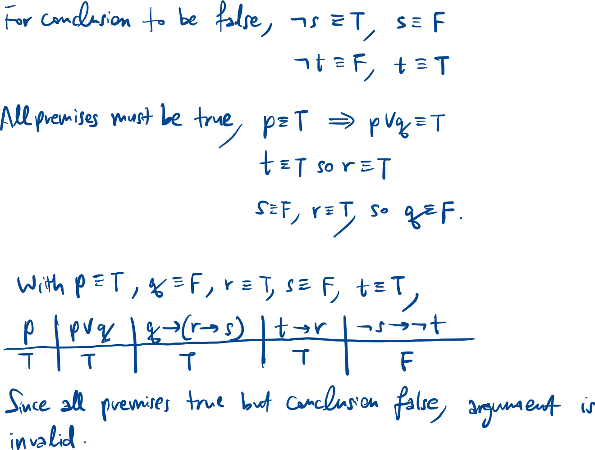

Proposition is a statement that is either true or false.

| Original | $p \to q$ |
|---|---|
| Contrapositive | $\neg q \to \neg p$ |
| Converse | $q \to p$ |
| Inverse | $\neg p \to \neg q$ |

| $p$ | $q$ | $p \to q$ |
|---|---|---|
| T | T | T |
| T | F | F |
| F | T | T |
| F | F | T |

## Logical equivalences

| De Morgan’s | $\neg(p \land q) \equiv \neg p \lor \neg q$ $\neg(p \lor q) \equiv \neg p \land \neg q$ |
|---|---|
| Conversion Theorem | $p \to q \equiv \neg p \lor q$ |
| Commutativity | $p \land q \equiv q \land p$ |
| Double negation | $\neg(\neg p) \equiv p$ |
| Idempotent | $p \land p \equiv p$ $p \lor p \equiv p$ |
| Absorption | $p \lor (p \land q) \equiv p$ $p \land (p \lor q) \equiv p$ |
| Distributivity | $p \lor (q \land r) \equiv (p \lor q) \land (p \lor r)$ $p \land (q \lor r) \equiv (p \land q) \lor (p \land r)$ |

## Inference rules

| Modus Ponens | $p \to q$ $p$ $\therefore q$ |
|---|---|
| Modus Tollens | $p \to q$ $\neg q$ $\therefore \neg p$ |
| Conjunctive simplification | $p \land q$ $\therefore p$ |
| Conjunctive addition | $p$ $q$ $\therefore p \land q$ |
| Disjunctive syllogism | $p \lor q$ $\neg p$ $\therefore q$ |
| Disjunctive addition | $p$ $\therefore p \lor q$ |
| Hypothetical syllogism | $p \to q$ $q \to r$ $\therefore p \to r$ |

To show some statement/argument is valid, either truth table or logical equivalences or counterexample.

## Common questions

### Logical inference

Determine if this argument is valid:

### Truth table

### Counter example for invalid argument

Determine if this argument is valid:

