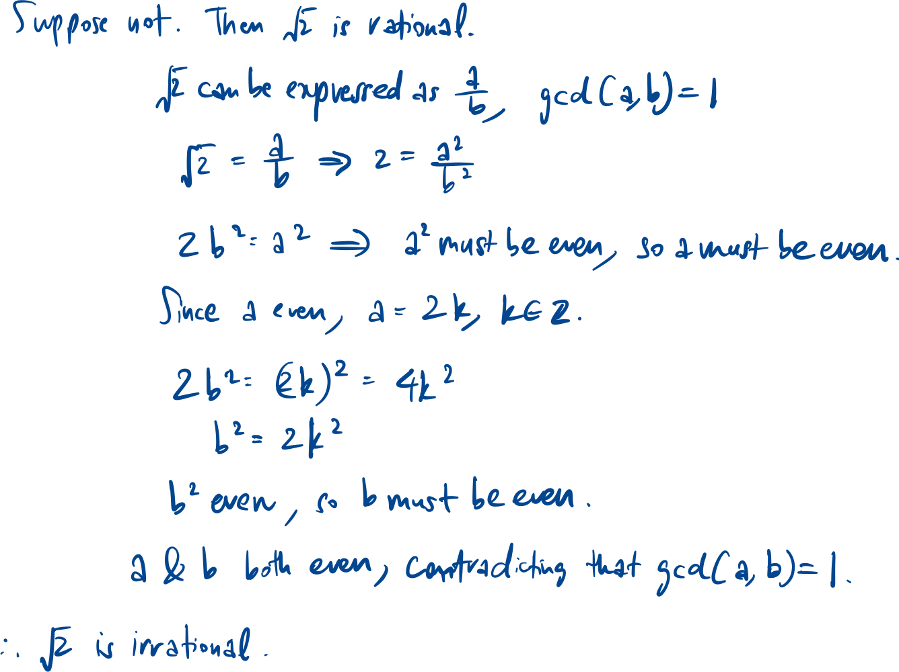
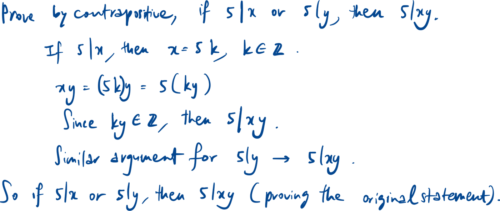
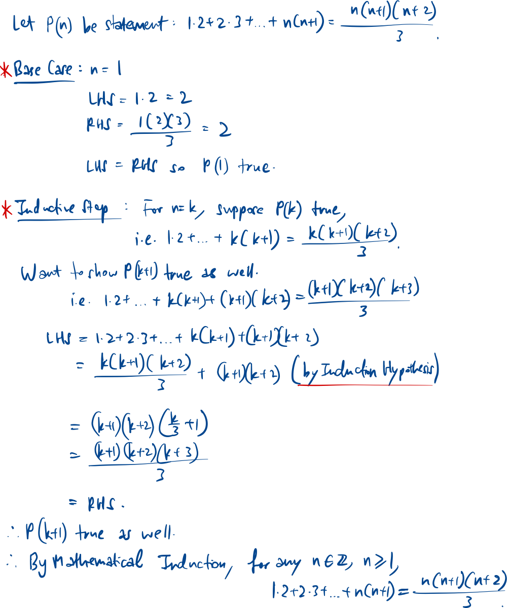
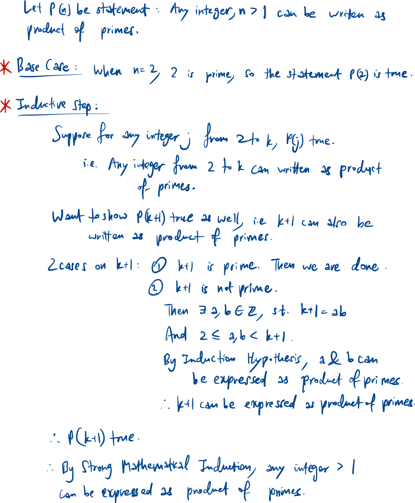

## Proof by contradiction

$$\text{Prove that } \sqrt{2} \text{ is irrational.}$$

## Proof by contrapositive

$$\text{If }x \text{ and } y \text{ are integers such that } 5 \nmid xy, \text{ then } 5 \nmid x \text{ and } 5 \nmid y.$$

## Induction template

### Mathematical Induction

$$\text{Prove that for any positive integer } n, 1\cdot2 + 2\cdot 3 + \ldots + n(n+1) = \frac{n(n+1)(n+2)}{3}$$

### Strong Mathematical Induction

$$\text{Show that if }n \text{ is an integer } \ge 1, \text{then } n \text{ can be written as a product of primes.}$$

