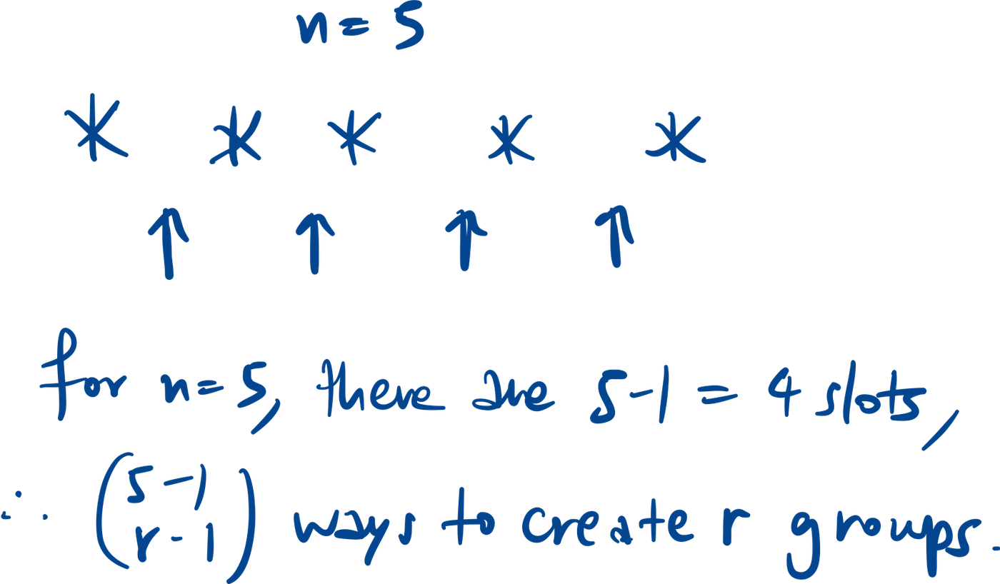
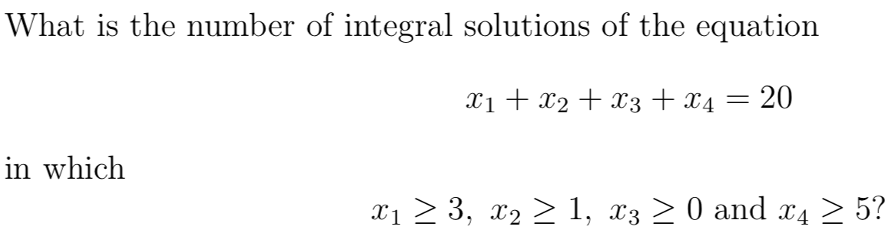
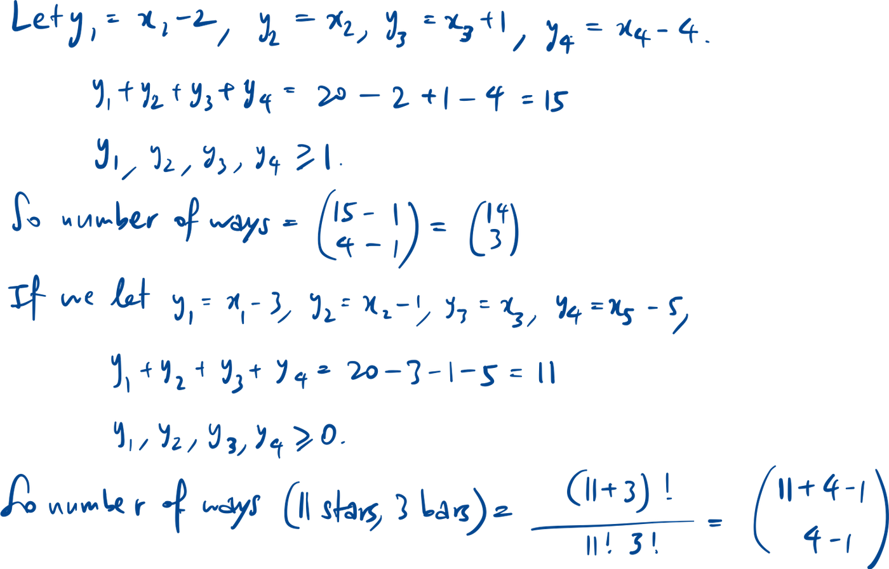

$$nCr = \binom{n}{r} = \frac{n!}{r! (n-r)!}$$

$$nPr = \binom{n}{r} \cdot r! = \frac{n!}{(n-r)!}$$

$$\text{Number of ways to order } n \text{ distinct items in a circle } = \frac{n!}{n}$$

$$\text{Arranging } n \text{ distinct items with } r \text{ indistinguishable items among them } = \frac{n!}{r!}$$

## Stars and bars

$$x_1 + x_2 + \dots + x_r = n$$

$$\text{If } \forall i, x_i > 0, \text{ then \# of ways } = \binom{n-1}{r-1}$$

$$\text{If } \forall i, x_i \ge 0, \text{ then \# of ways } = \binom{n+r-1}{r-1}$$

*Try to normalise all the xi to be >0.

## Common questions

