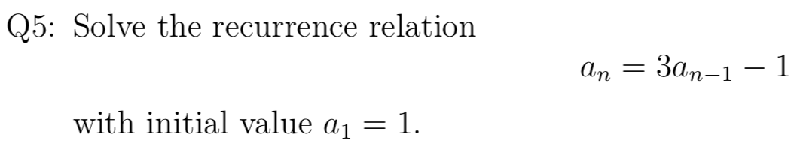
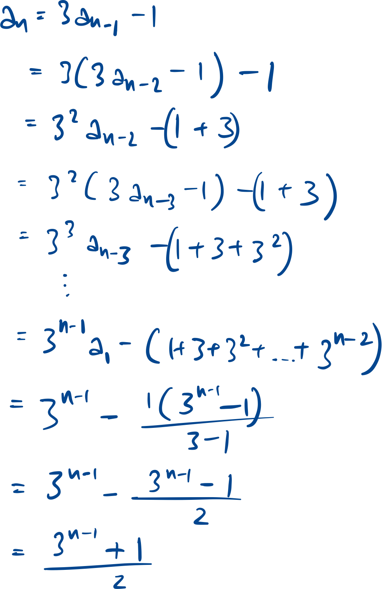
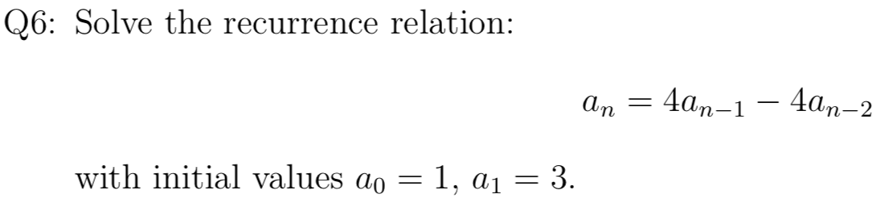
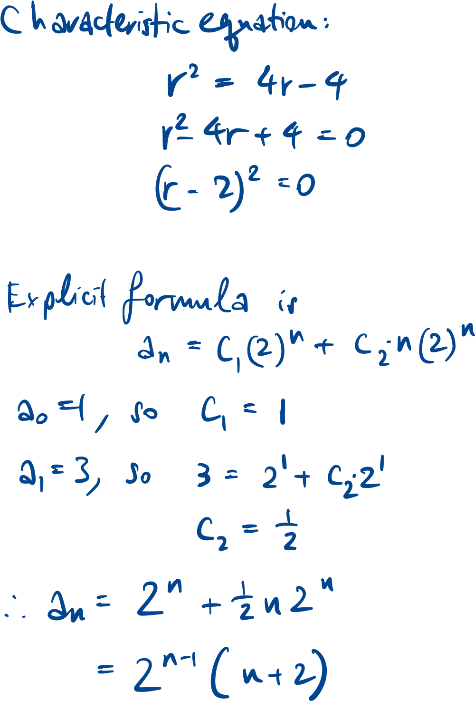
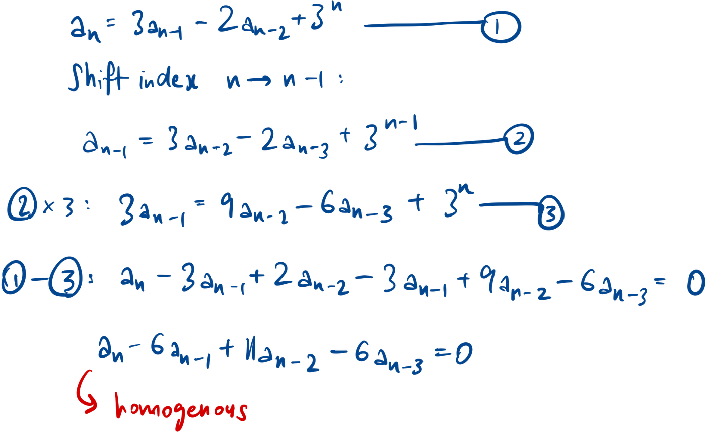
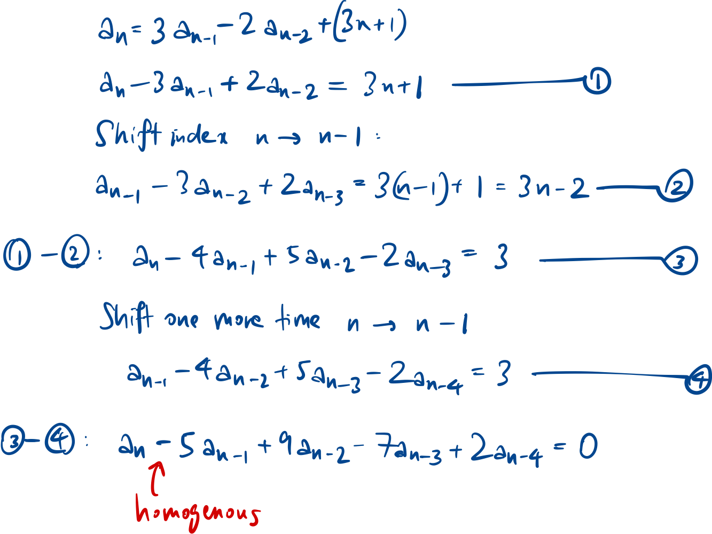
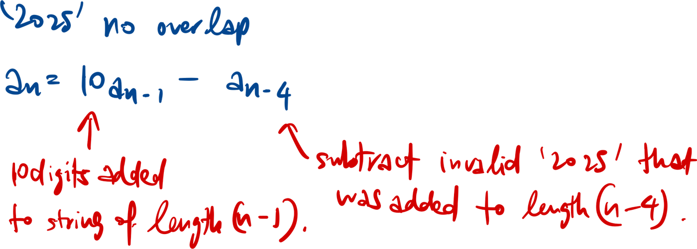
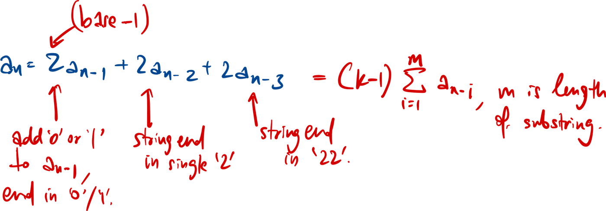
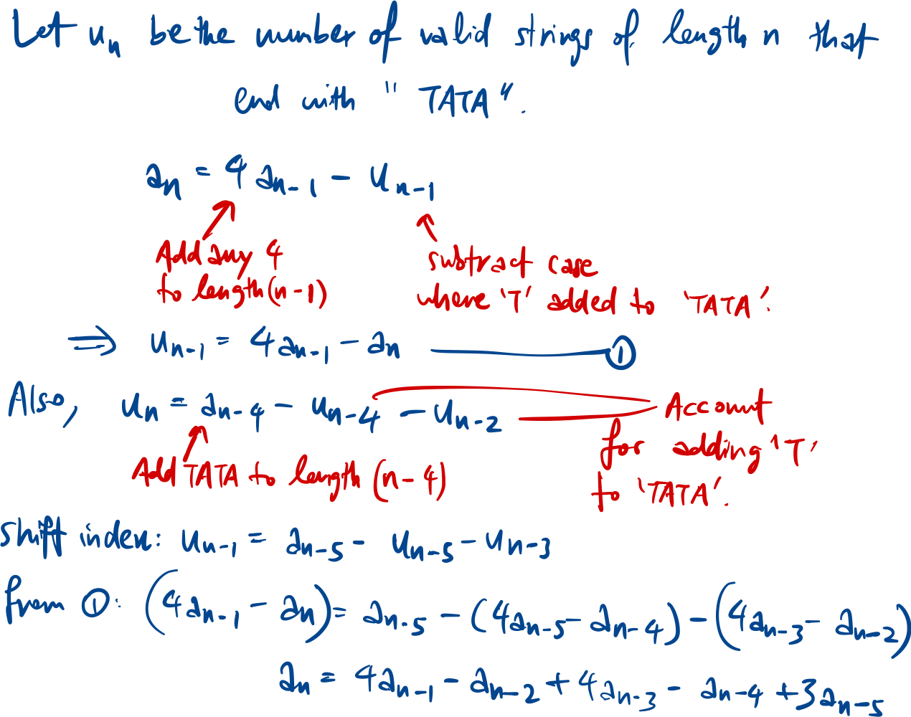

$$\text{Geometric progression } 1, q, q^2, q^3, \ldots$$

$$\text{Sum } = \frac{a(1 - r^n)}{1 - r}$$

$$\text{Arithmetic progression } a, a+d, a+2d, \ldots$$

$$\text{Sum } = \frac{n}{2}(a_{1} + a_{n}) = \frac{n}{2}[2a + (n - 1)d]$$

Linear recurrence relation

$$\text{Linear recurrence relation of order } k \text{ is of the form: }$$

$$a_n = c_{1}a_{n-1} + c_{2}a_{n-2} + \ldots + c_{k}a_{n-k} + d$$

$$\text{If } d=0\text{, the relation is homogenous.}$$

$$\text{Finding the explicit form of } a_n \text{ means expressing } a_n \text {without any of its previous terms.}$$

## Backtracking

Replacing each term with its previous terms and try to find patterns.

## Characteristic equation

### Homogenous

For homogeneous linear rr:

$$a_n = c_{1}a_{n-1} + c_{2}a_{n-1} + \ldots + c_{k}a_{n-k}$$

$$x^k = c_{1}x^{k-1} + c_{2}x^{k-2}+ \ldots + c_k$$

$$\text{For root } x_{1} \text{ with multiplicity } 1 \text{ and root } x_{2} \text{ with multiplicity 2:}$$

$$a_n = u_{1} \cdot x_{1}^n + u_{2} \cdot x_{2}^n + u_{3} \cdot n \cdot x_{2}^n$$

## Non-homogenous

Exponential constant

$$\text{Solve the linear recurrence relation } a_n = 3a_{n-1} - 2a_{n-2} + 3^n.$$

Polynomial constant

$$\text{Solve the linear recurrence relation } a_n = 3a_{n-1} - 2a_{n-2} + 3n + 1.$$

## Deriving recurrence relation

$$\text{Let } a_n \text{ be the number of decimal strings of length } n,$$

$$\text{that do not contain the substring } '2025'.$$

$$\text{Find the recurrence relation for }a_n.$$

$$\text{Let } a_n \text{ be the number of ternary } \{0, 1, 2\} \text{ strings of length } n,$$

$$\text{that do not contain the substring } '222'.$$

$$\text{Find the recurrence relation for }a_n.$$

$$\text{Let } a_n \text{ be the number of DNA } \{A, T, C, G\} \text{ sequences of length } n,$$

that do not contain the substring 'TATAT'.

$$\text{Find the recurrence relation for }a_n.$$

