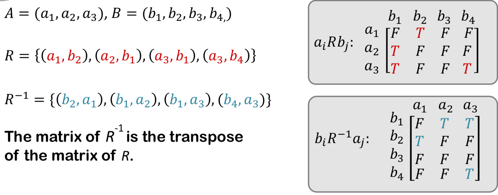
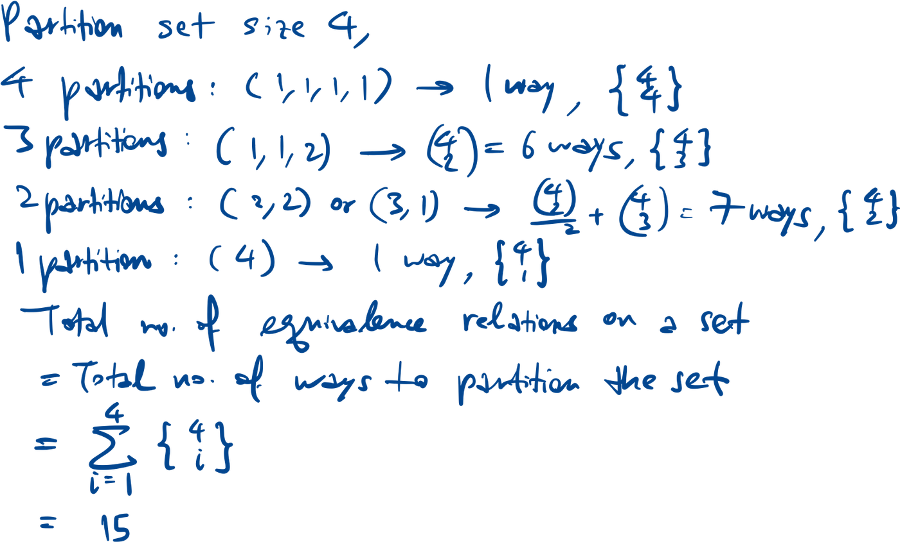
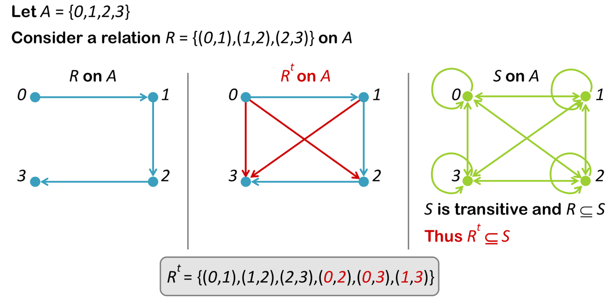

$$\text{For a binary relation } R \text{ from } A \text{ to } B, \ R \subseteq A \times B.$$

$$\text{Given } (x, y) \text{ in } A \times B, xRy \leftrightarrow (x, y) \in R.$$

$$R^{-1} = \{(y, x) \in B \times A \ | \ (x, y) \in R\}.$$

## Matrix representation

## Number of relations

$$\text{Number of relations R on set} = 2^{n^{2}}.$$

$$\text{Number of possible reflexive relations} = 2^{n^{2} - n}.$$

$$\text{Number of possible symmetric relations} = 2^{n} \cdot 2^{\binom{n}{2}} = 2^{n} \cdot 2^{\frac{n(n - 1)}{2}} = 2^{\frac{n(n + 1)}{2}}.$$

$$\text{Number of possible antisymmetric relations } = 2^{n} \cdot 3^{\binom{n}{2}}.$$

## Composition

$$\text{For } R \text{ in } A \times B, \text{ and } S \text{ in } B \times C, \text{the composition of R and S is a relation on } A \times C.$$

$$S \circ R = \{(a, c) \in A \times C \ | \ \exists b \in B \text{ s.t. } aRb \text{ and } bSc.\}$$

$$R^{2} = R \circ R$$

$$R^{2} = R \text{ if } R \text{ is reflexive and transitive.}$$

## Properties of relations

- $\text{Reflexive }R: \ \forall x \in A, xRx.$
- $\text{Symmetric } R: \forall x, y \in A, xRy \rightarrow yRx.$
- Between two distinct elements, either no arrow or bidirectional arrow.
- $\text{Antisymmetric }R: \forall x, y \in A, xRy \land yRx \rightarrow x = y.$
- Between two distinct elements, no bidirectional arrow.
- $\text{Transitive }R: \forall x, y, z \in A, xRy \land yRz \rightarrow xRz.$

## Equivalence relation

1. Reflexive
1. Symmetric
1. Transitive

E.g. xRy ⇔ (x-y) is even.

$$\text{Equivalence class of }a \in A: [a] = \{x \in A | aRx\}$$

Equivalence classes form a partition of A.

$$\text{For any } a, b \in S, \text{ either } [a] = [b] \text{ or } [a] \cap [b] = \varnothing, \text{ provable by contradiction.}$$

Number of equivalence classes on a set is the number of ways to partition the set.

$$\text{Bell number, }B: B_1 = 1, B_2 = 2, B_3 = 5, B_4 = 15, B_5 = 52.$$

### Example for set of size 4

## Partial order

1. Reflexive
1. Antisymmetric
1. Transitive

## Transitive closure

For transitive closure Rt,

1. Rt is transitive
1. R ⊆ Rt
1. Rt ⊆ S, if S is any other transitive relation that contains R.

$$\text{To get the transitive closure, add }(x,z) \text{ if } \forall x, y, z \in A, xRy \land yRz \text{ for } R \text{ on set } A.$$

$$R^{t} = R \cup R^{2} \cup R^{3} \cup \ldots$$

$$\text{Generalise n-ary relation }R \subseteq A_1 \times \ldots \times A_n. \ (a_1, \ldots, a_n) \in R \rightarrow a_1, \ldots, a_n \text{ are related.}$$

## Relational complement

$$\overline{R} = (A_1 \times A_2 \times \ldots \times A_n - R)$$

$$(a_1, a_2, \ldots, a_n) \in \overline{R} \leftrightarrow (a_1, a_2, \ldots, a_n) \notin R.$$

## Operations on relations

$$R \cup S: (a_1, a_2, \ldots, a_n) \in R \cup S \leftrightarrow (a_1, a_2, \ldots, a_n) \in R \lor (a_1, a_2, \ldots, a_n) \in S.$$

$$R \cap S: (a_1, a_2, \ldots, a_n) \in R \cup S \leftrightarrow (a_1, a_2, \ldots, a_n) \in R \land (a_1, a_2, \ldots, a_n) \in S.$$
