$$\text{Graph } G = (V,E), \text{with set } V \text{ of vertices/nodes, set } E \text{ of edges.}$$

$$\text{If edge e connects vertices }u, v, \text{ then }u \ \& \ v \text{ are adjacent, and } e \text{ is incident with }u \ \& \ v.$$

## Subgraph

$$H = (V_H, E_H) \text{ is subgraph of } G = (V_G, E_G), \text{ if } V_H \subseteq V_G, E_H \subseteq E_G.$$

Every edge must be connected to its vertices, but not every vertex must be connected.

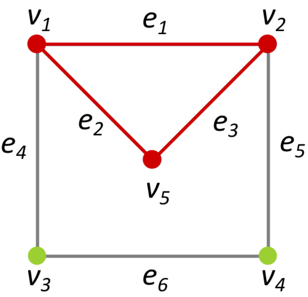

## Simple graph

No loops (e={u,v}, u=v).

No parallel edges.

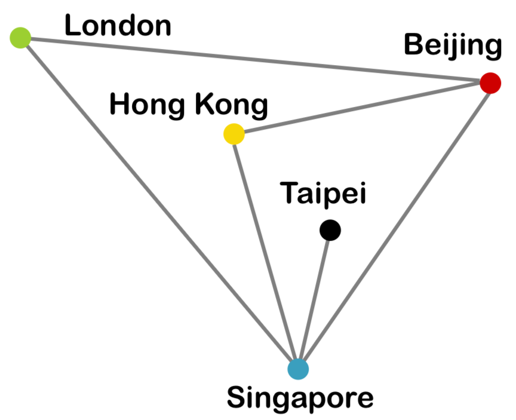

## Multigraph

No loops.

At least two parallel edges between some pair of vertices.

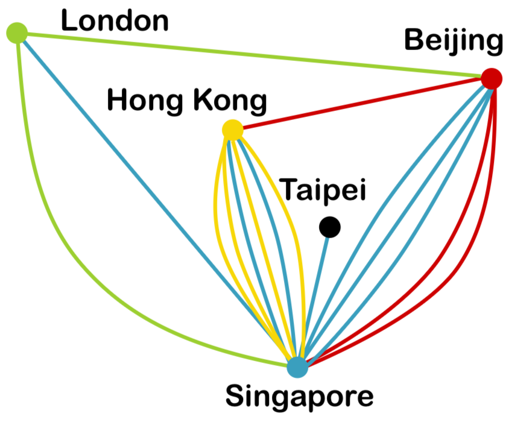

## Directed graph

Edges are ordered (have a direction).

Loops and parallel edges are allowed.

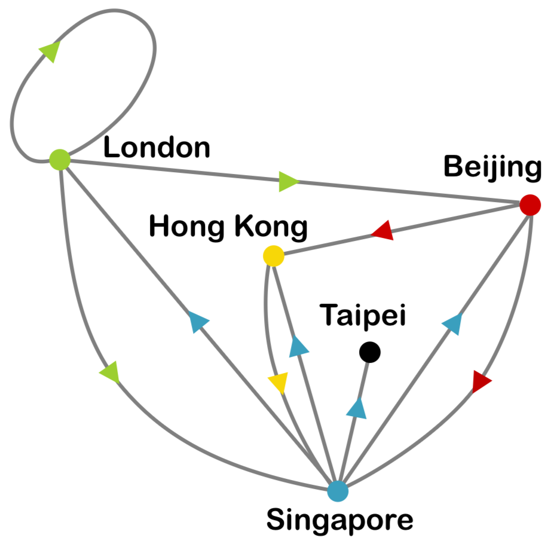

## Complete graph

Simple graph + every vertex is adjacent to every other distinct vertex.

Number of vertices = nC2

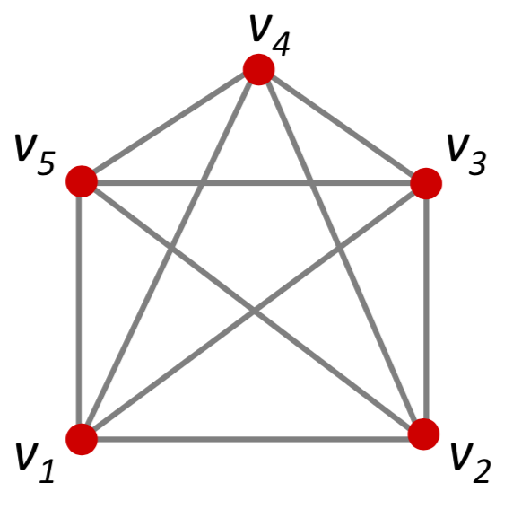

## Bipartite graph

$$\text{Vertices can be partitioned into 2 disjoint subsets } W, X,$$

$$\text{ s.t. each edge connects } w \in W \text{ to } x \in X.$$

Use the 2 colour method to determine if a graph is bipartite

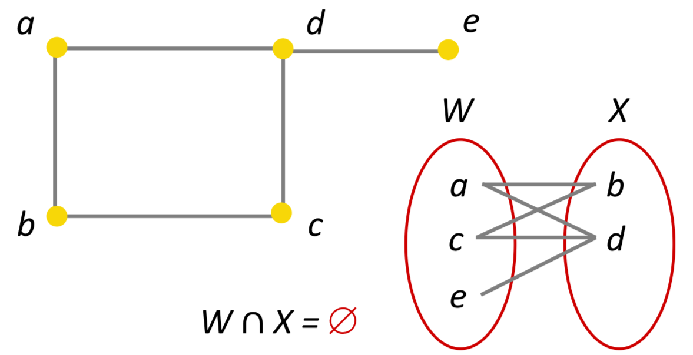

## Euler paths/circuits

Euler path - a walk in a graph that visits every edge exactly once.

Euler circuit - a walk in a graph that visits every edge exactly once & starts and ends at the same vertex.

Euler circuits are a subset of Euler paths.

## Euler’s Theorem

A graph has an Euler circuit iff

- The graph is **connected**
- Every vertex has an even degree.

An connected graph has an Euler path if it has either 0 or 2 vertices with odd degrees.

An unconnected graph with all vertices having even degrees may not have an Euler circuit.

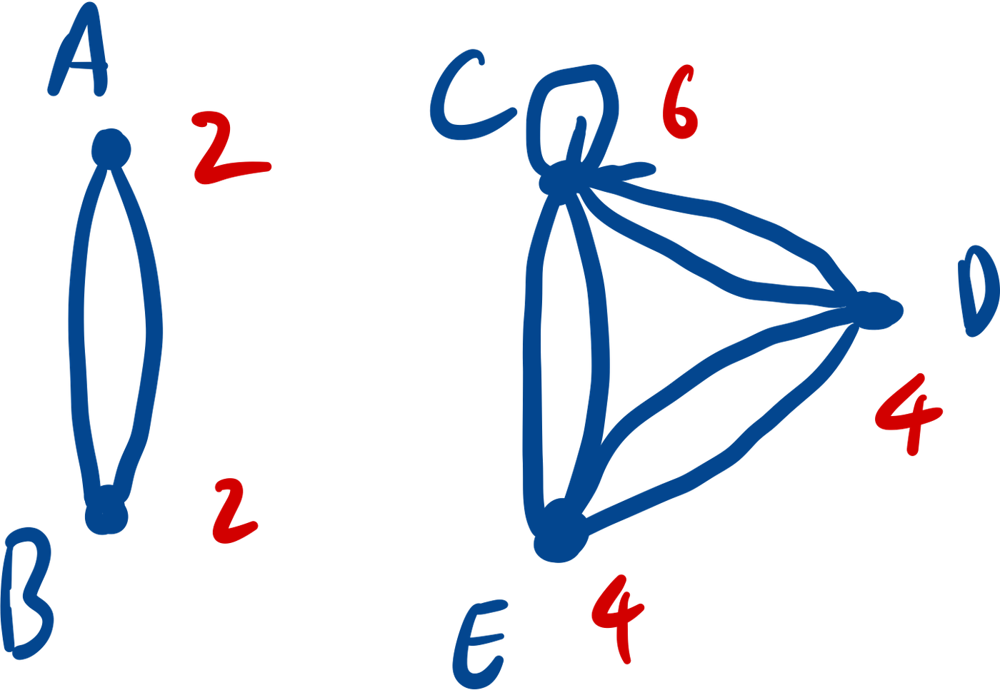

## Hamiltonian path/circuit

Hamiltonian path - a walk in a graph that visits every vertex exactly once.

Hamiltonian circuit - a closed walk in a graph that visits every vertex exactly once & starts and ends at the same vertex.

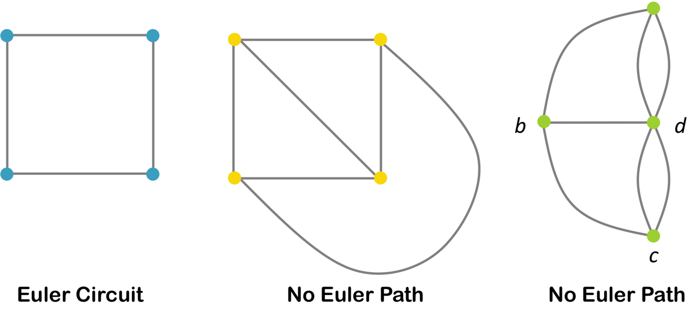

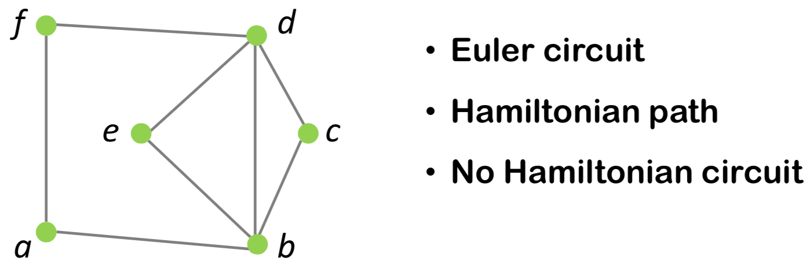

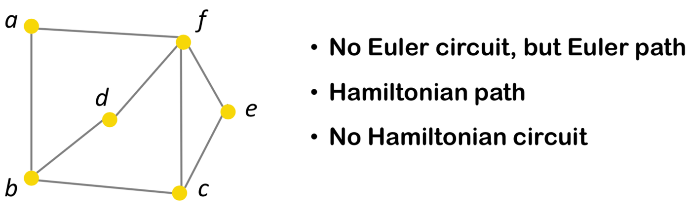

## Handshaking theorem

$$\text{For a graph }G = (V, E), \text{ with } e \text{ edges, then}$$

$$\sum_{v \in V} \text{deg}(v) = 2e$$

$$\text{Because every edge } e=\{u,v\} \text{ contributes } 1 \text{ to deg}(u) \text{ and } 1 \text{ to deg}(v), \text{ even if } u=v.$$

## Adjacency matrix

$$a_{ij} = \text{ number of arrows from vertex }v_i \text{ to }v_j.$$

For undirected graph, adjacency matrix is symmetric along the negative diagonal.

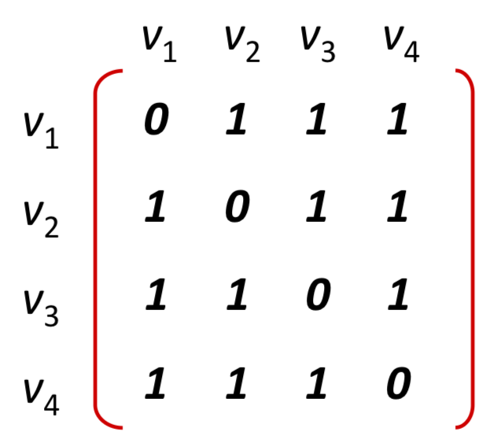

## Isomorphic graphs

$$\text{Graphs }G = (V_G, E_G), H = (V_H, E_H) \text{ are isomorphic iff}$$

there are two bijective functions

$$g: V_G \Rightarrow V_H \text{ and } h: E_G \Rightarrow E_H$$

$$\text{such that an edge }e \in E_G, e=\{v, w\}, v, w \in V_G \iff \text{edge } h(e) \in E_H, h(e)=\{g(v), g(w)\}.$$

**i.e. any two vertices v and w are adjacent in G if and only if g(v) and g(w) are adjacent in H.

How to tell if not isomorphic

- Number of edges
- Number of vertices
- total degree
- Maximum degree
- Minimum degree
- Degree sequence

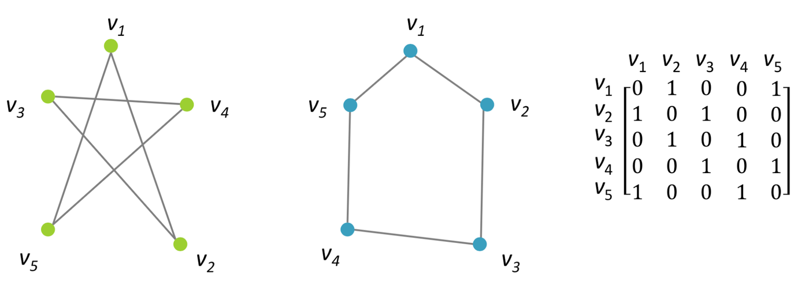
