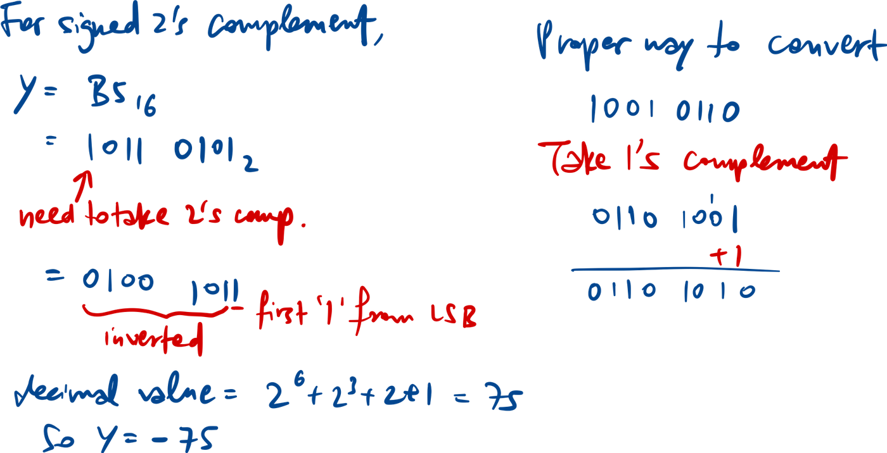
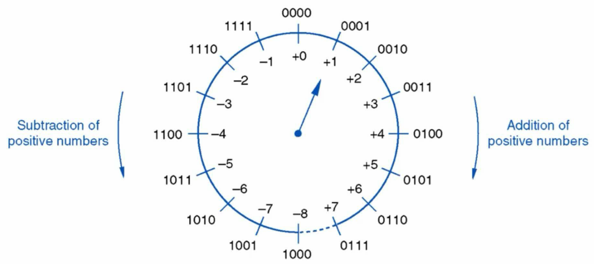

Range: {-(2N-1) to (2N-1-1)}, because zero is not duplicated.

2’s complement doesn’t work on the most negative number in a certain bit range. E.g. -8 in 4-bit system has no corresponding positive value 

Converting between 2’s complement forms:

Subtraction: A - B = A + (-B)

