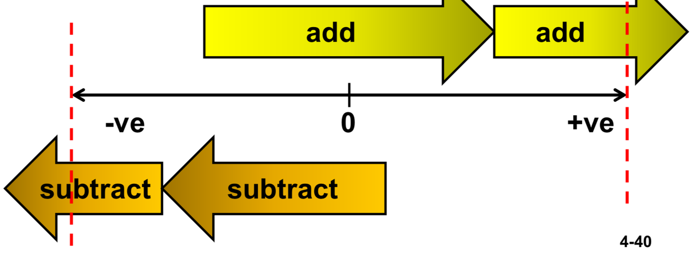

Result produced from two N-bit operands cannot be sufficiently represented by N-bits

For addition, if operands have the same sign but arithmetic sum has opposite sign.

**detecting overflow in circuit: If Cin of MSB != Cout of MSB. (Cin XOR Cout)

