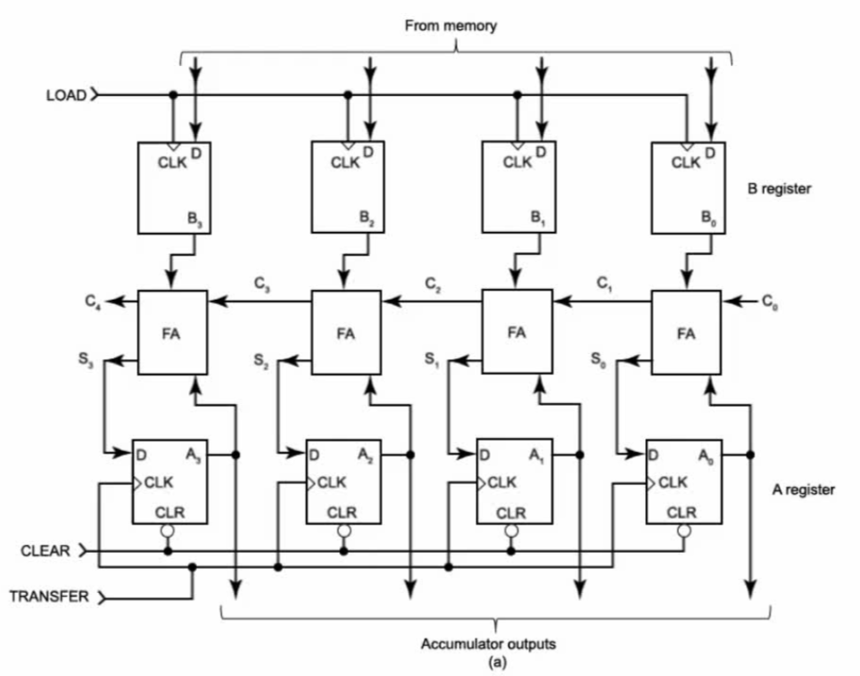
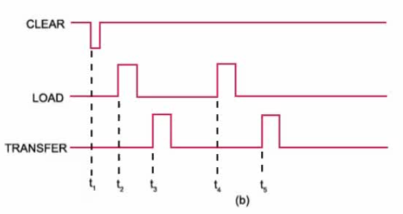

- T1: CLEAR the contents of A register
- t2: PGT of first LOAD pulse transfers operand X from memory into B register
- t3: PGT of first TRANSFER pulse transfers FA output (X) into A register
- t4: PGT of second LOAD pulse transfers operand Y from memory into B register
- t5: PGT of second TRANSFER pulse transfers FA output (X+Y) into A register
- The speed of addition is limited by propagation delays of FAs (carry propagation).
- Carry propagation: carry output from one adder becomes the carry input to the next adder, causing delays.

Carry look-ahead circuit uses logic equations to predict carry outputs in advance, so carries can be generated simultaneously rather than sequentially, reducing delay caused by carry propagation.
