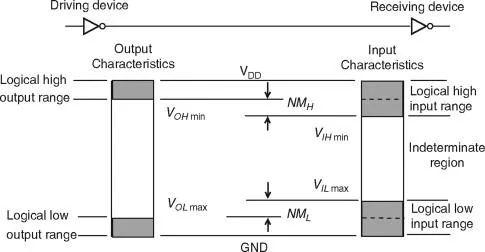
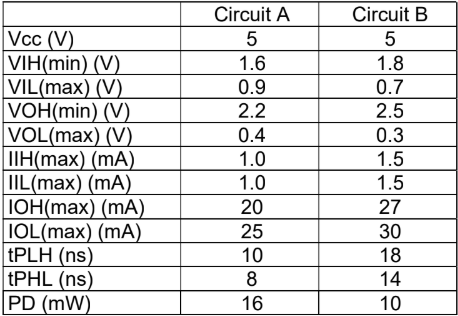
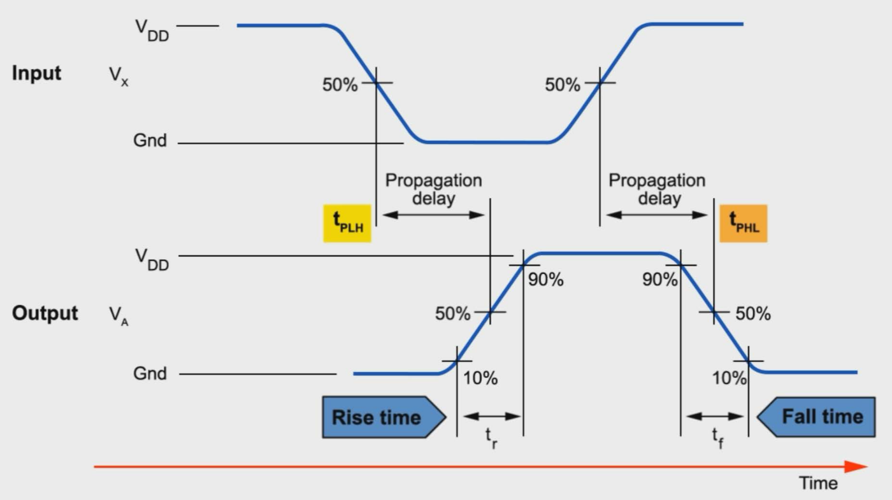

## Voltage, current levels

- VOH(min): minimum output voltage to be recognised as logic 1
- VIH(min), VOL(max), VIL(max)
- High-state DC Noise margin, MHH: VOH(min) - VIH(min)
- Low-state DC Noise margin, HML: VIL(max) - VOL(max)
- 

- IIH: maximum current that flows into input at logic 1
- IIL: maximum current that flows into input at logic 0
- IOH: maximum current that flows from output at logic 1
- IOL: maximum current that flows from output at logic 0
- 

- High-state DC noise margin:
- A: 2.2 - 1.6 = 0.6V
- B: 2.5 - 1.8 = 0.7V
- Low-state DC noise margin:
- A: 0.9 - 0.4 = 0.5V
- B: 0.7 - 0.3 = 0.4V
- DC noise margin for A = min(0.6, 0.5) = 0.5V
- DC noise margin for B = min(0.7, 0.4) = 0.4V
- A has better DC noise margin.
- Low-state DC fan-out:
- A: 25 / 1.0 = 25
- B: 30 / 1.5 = 20
- High-state DC fan-out:
- A: 20 / 1.0 = 20
- B: 27 / 1.5 = 18

DC fan-out for A = min(25, 20) = 20

DC fan-out for B = min(20, 18) = 18

A has better DC fan-out.

For A to drive B:

1. VOH, A >= VIH, B
1. VOL, A <= VIL, B
1. IOH, A >= IIH, B
1. IOL, A >= IIL, B

Fan-out: number of standard loads the output gate can drive

Power dissipation: P = CV2f, voltage V and switching frequency f

## Time propagation

- Rise time: Time taken for signal to rise from 10% of max signal to 90% of max signal
- Fall time: Time taken for signal to fall from 90% of max signal to 10% of max signal
- Propagation delay: average transition delay time for signal to propagate from input to output
- tPHL: delay when output changes from high to low (50% of input to 50% of output)
- tPLH: delay when output changes from low to high (50% of input to 50% of output)

