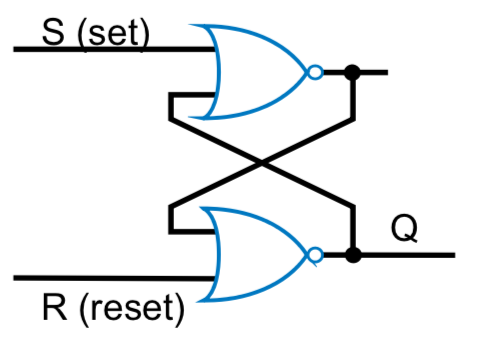
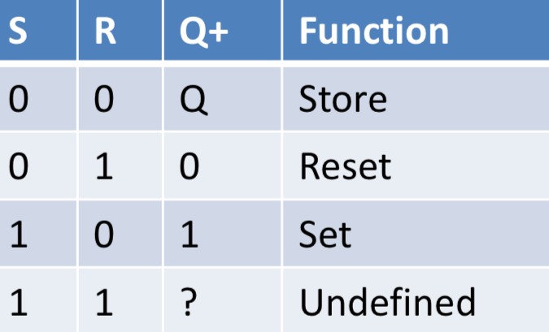
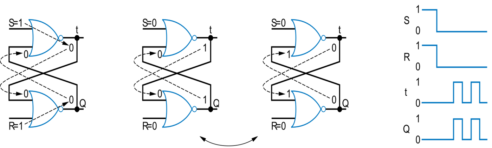
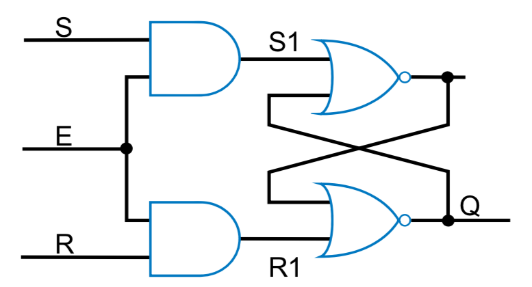
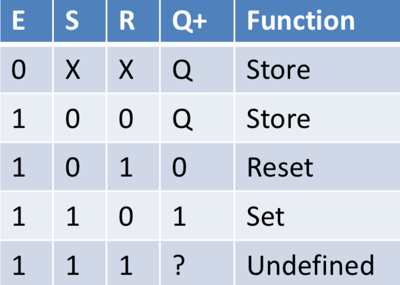
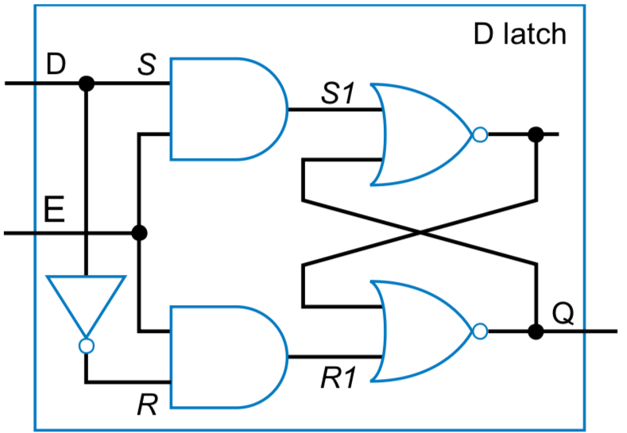
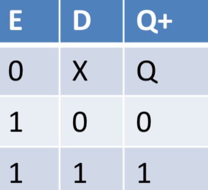
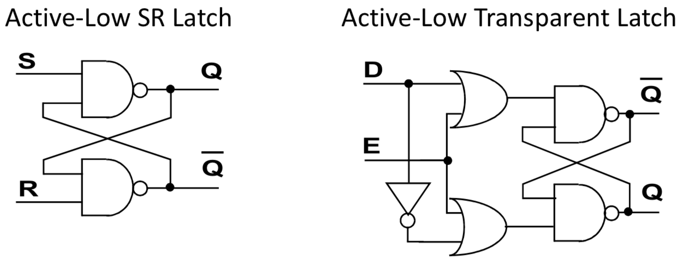

Level sensitive, outputs change whenever enable is high

## SR LATCH

When both S&R asserted, then both de-asserted at the same time, may get oscillation (undefined output). Race condition to see which output changes faster.

## Enabled SR latch

## Transparent D latch - no invalid inputs

## Active low latches

