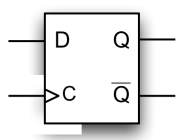
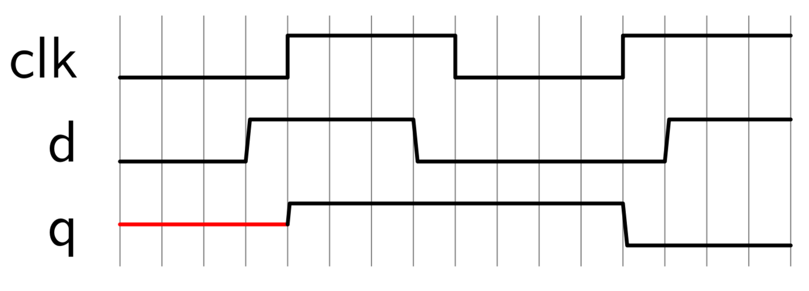
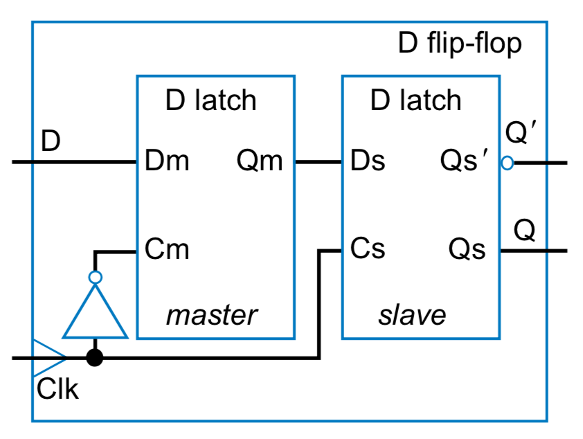
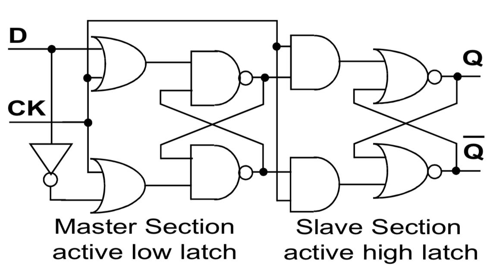
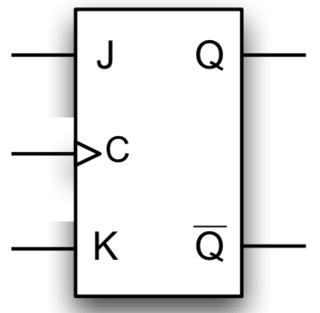
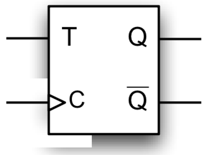
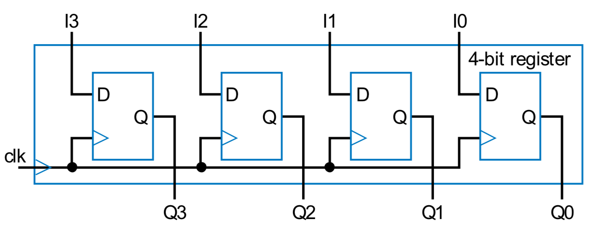
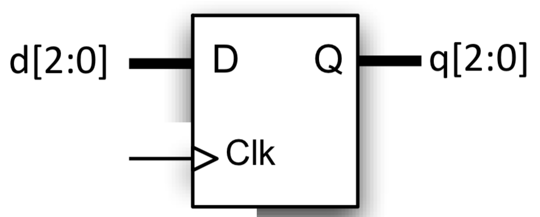
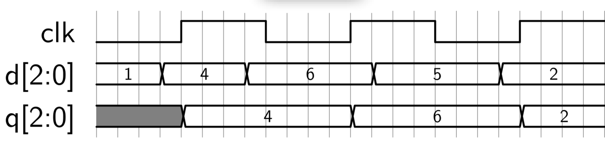

Edge-triggered, outputs change only at control signal’s edges

## D FLIP-FLOP

Q takes on value of D at rising edge of C.

## J-K FLIP-FLOP

Q becomes 1 if J is asserted at rising edge, and 0 if K is asserted.

If both J and K asserted, Q toggles at rising edge of clock.

Truth table

| J | K | Q+ |
|---|---|---|
| 0 | 0 | Q |
| 1 | 0 | 1 |
| 0 | 1 | 0 |
| 1 | 1 | Q’ |

## T FLIP-FLOP

Q toggles at rising edge if T=1

Truth table

| T | Q+ |
|---|---|
| 0 | Q |
| 1 | Q’ |

## REGISTER

Formed by combining D FLIP-FLOPS

