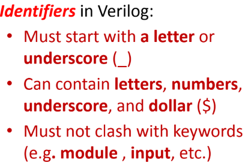
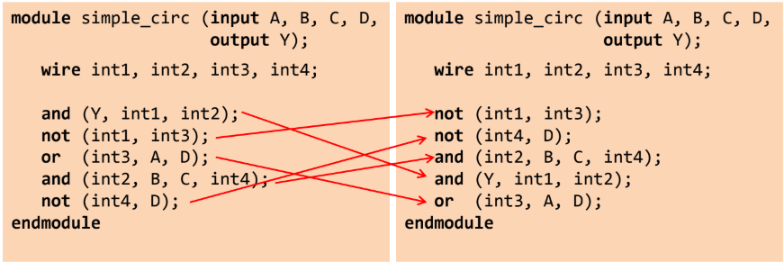
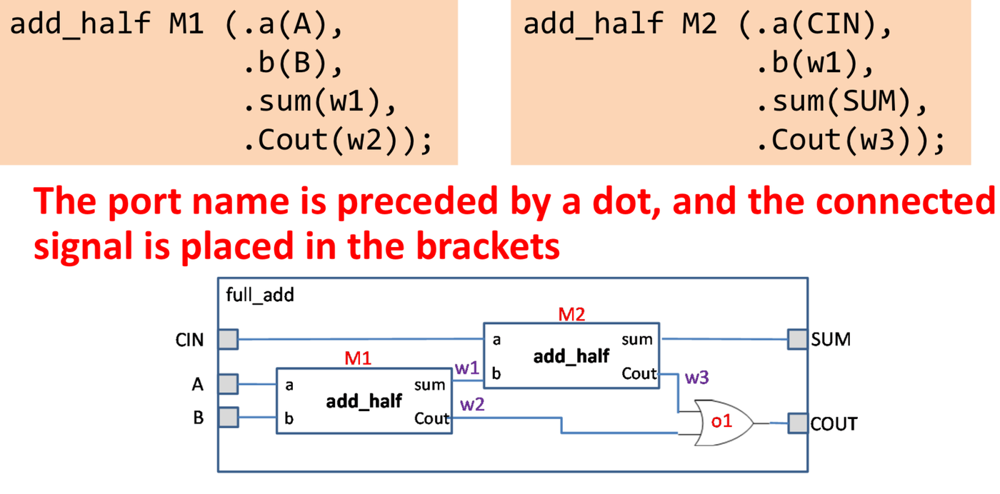
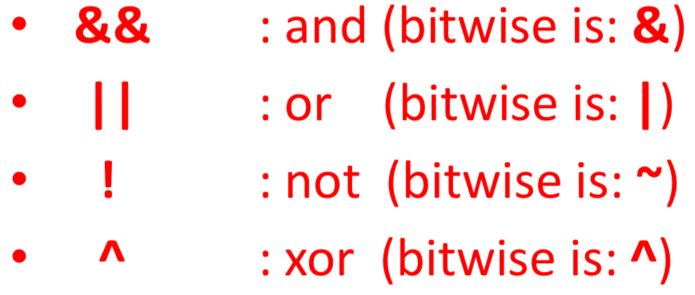
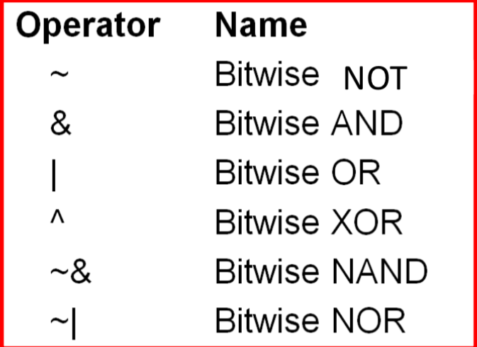
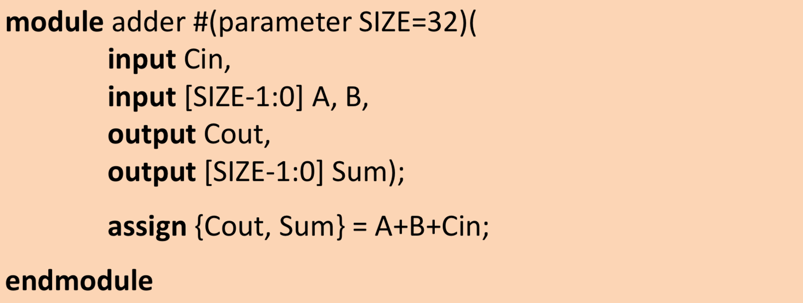

Structural verilog

Ports, wires, regs (reg only assigned to within always blocks)

Primitives (and, or, etc)

Conditional assignment (assign y = x ? a : b)

* Verilog uses if-else-if (not elif).

Naming identifiers in verilog

Order does not matter for structural verilog

Named instantiation (.a(...), .b(...))

Operators

Usage of parameters

Behavioural verilog
