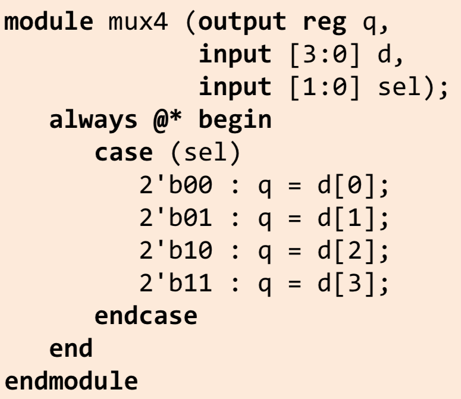
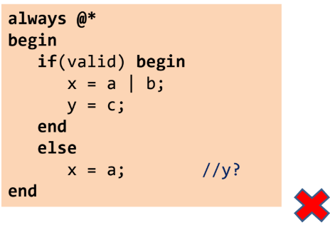

- Can only assign to reg signals.
- Use blocking assignment [=], order matters.
- Can use if statements.
- Can use case statements [cover all cases, use default if needed].
- Don’t use assign in always block!
- Cannot instantiate modules/gate-level primatives in always block
- Sensitivity list contains all signals that affect the output. Output should not be in the sensitivity list.

Avoid latches!!

