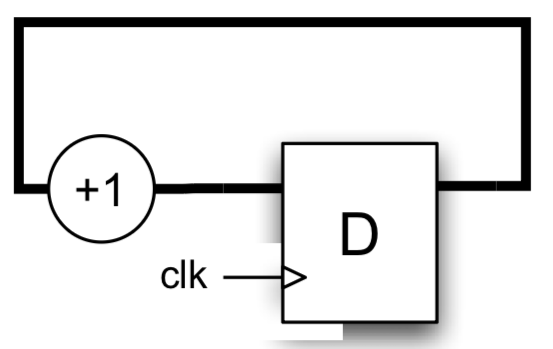
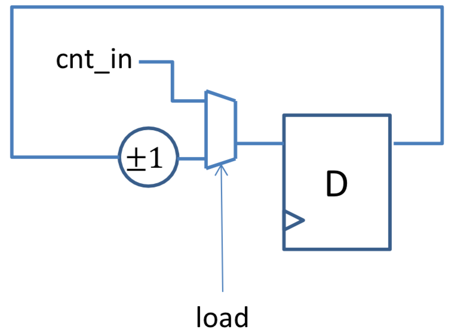
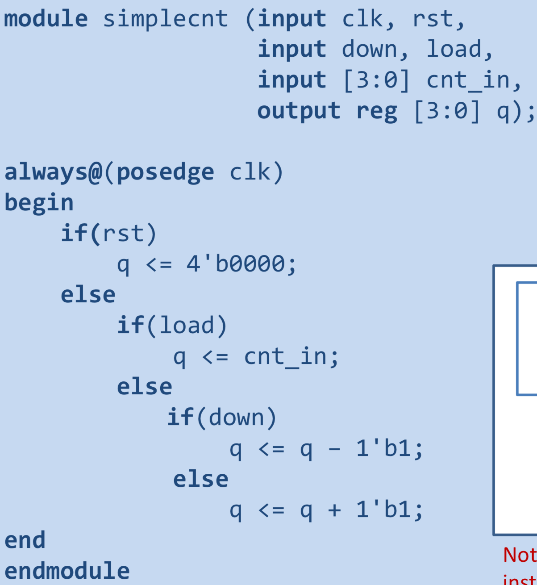
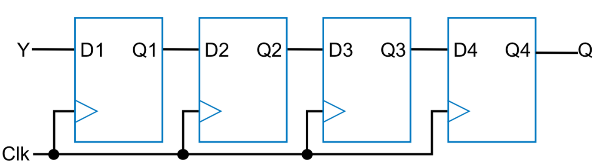
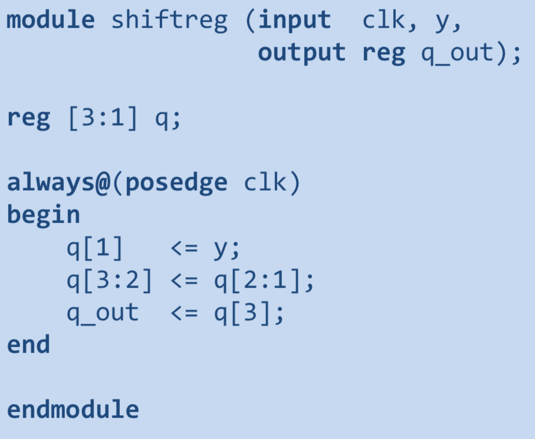
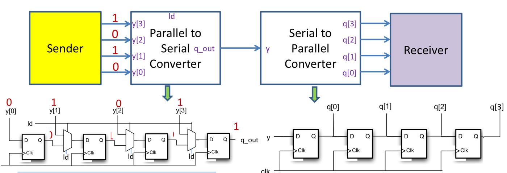
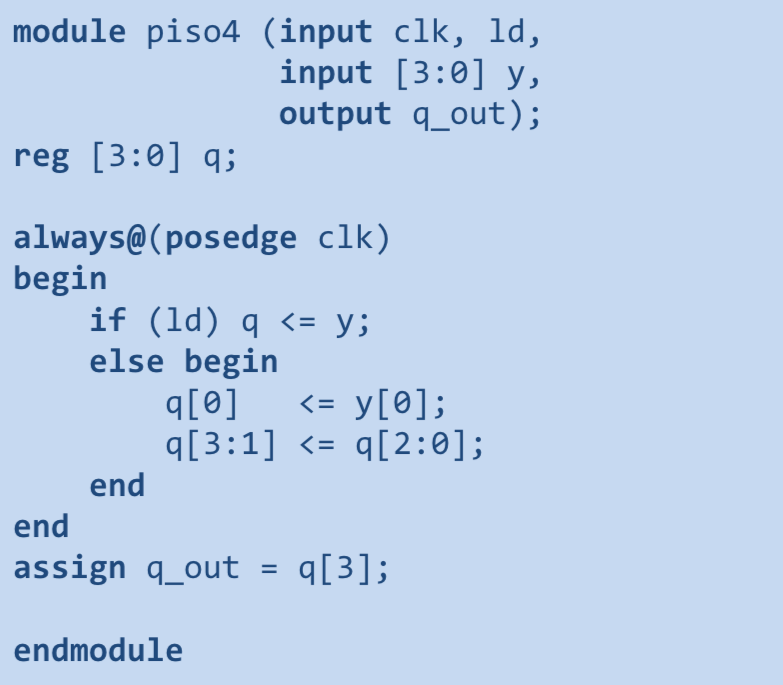
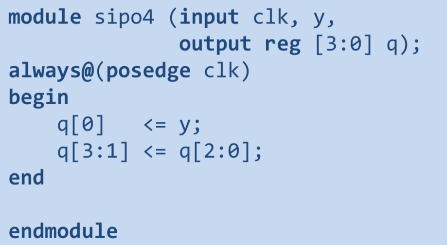
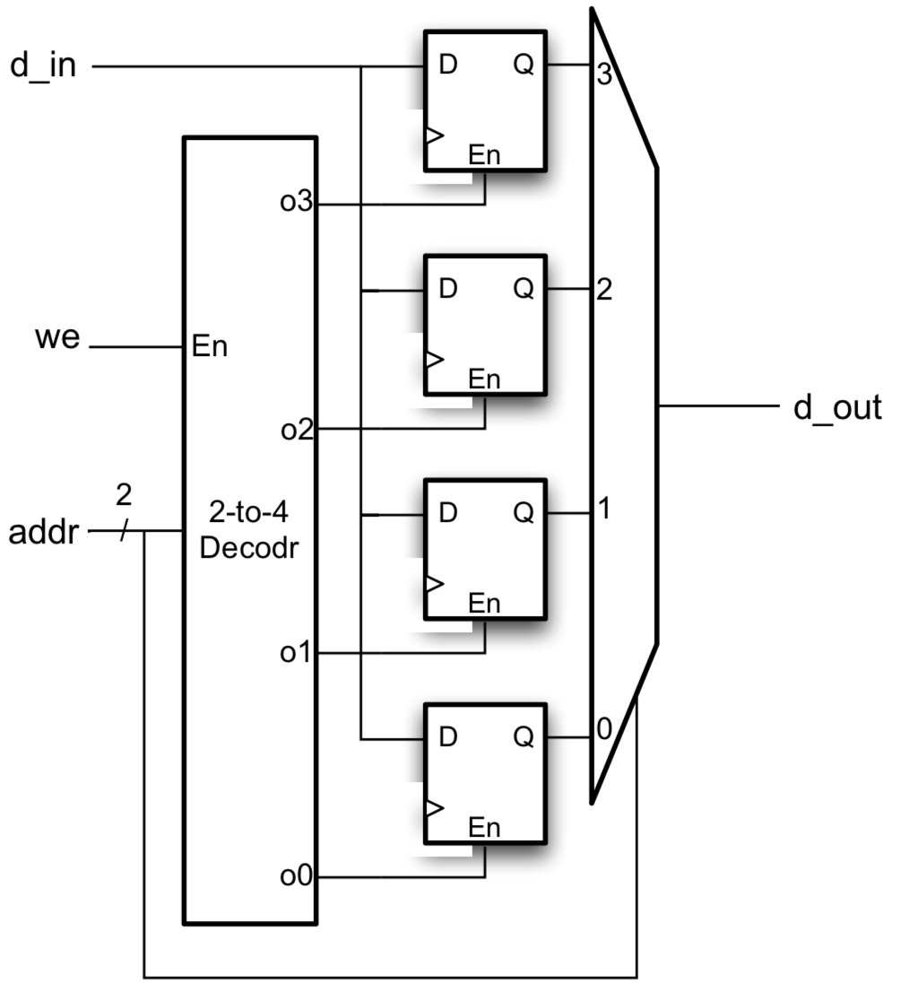

## Counters

increment/decrement values

## Shift registers

One input passed through chain of registers, make use of vectors

## Serial data transfer

Parallel to serial, serial to parallel

## Memories

Decoder + mux, select register to use by address

