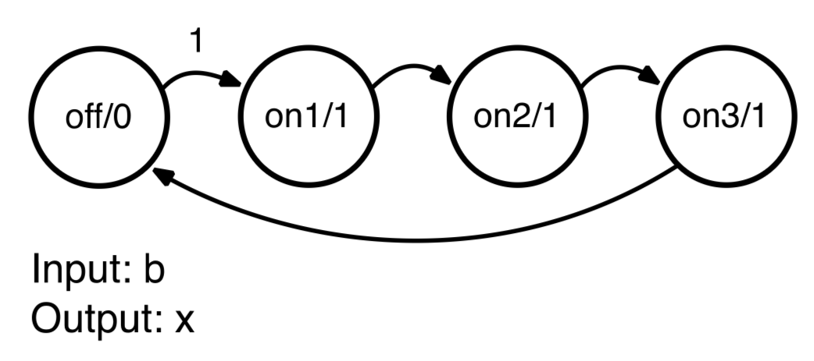
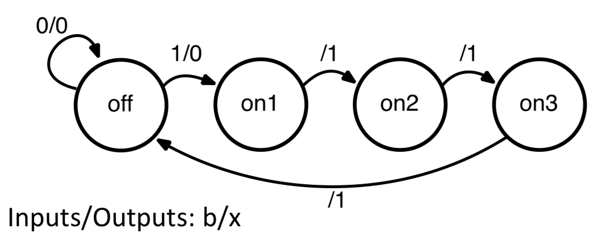
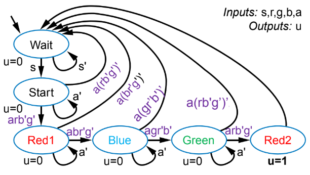
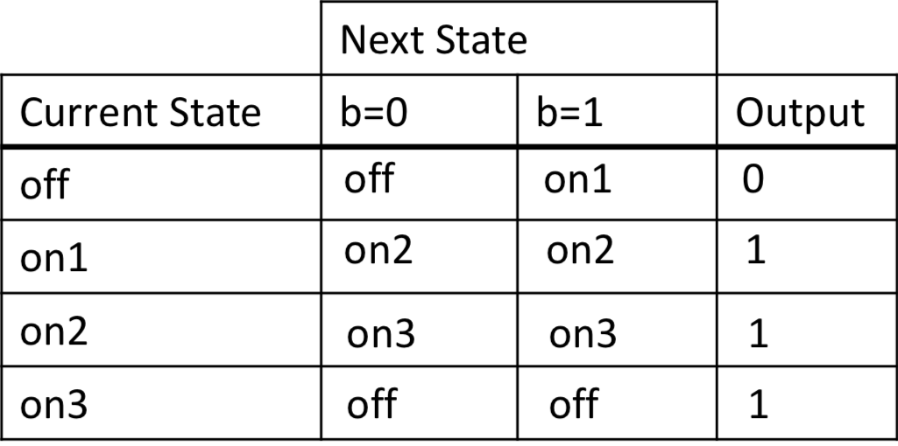
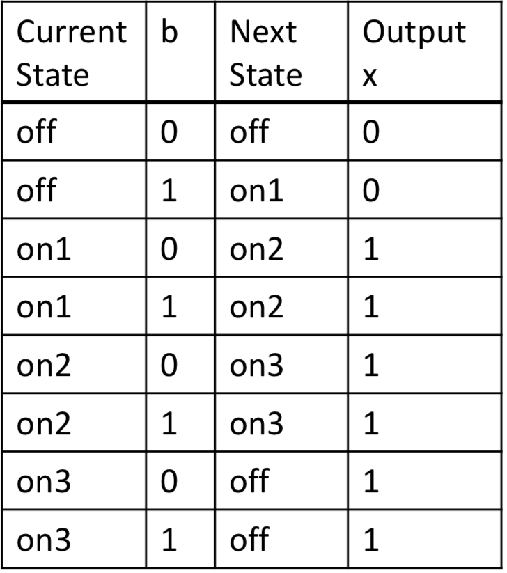
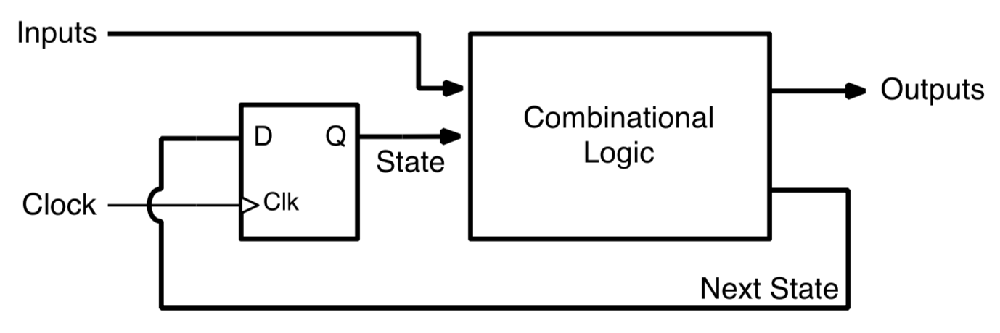
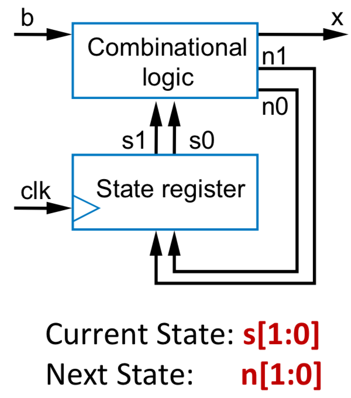
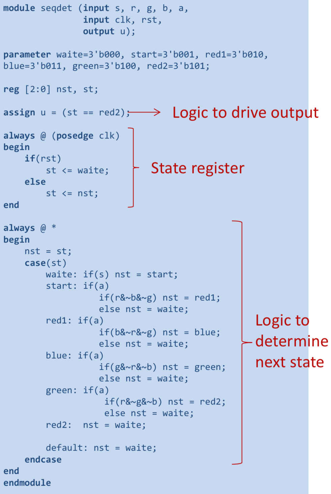
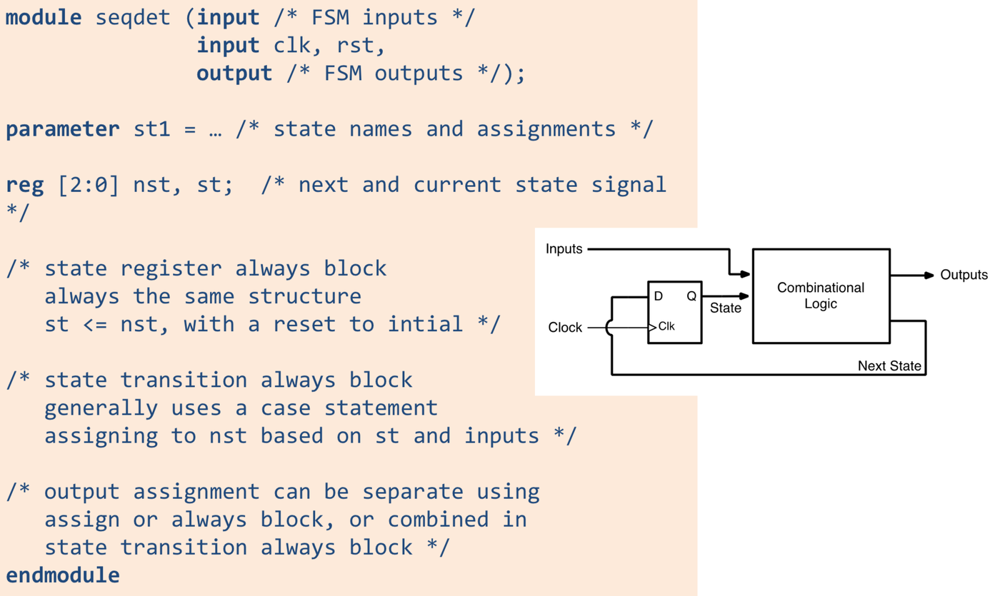

State transition diagram:

Moore machines - output fixed per state

Mealy Machines - outputs can change mid-state, write outputs on the arrows

Multiple inputs

State transition table

Implementation:

Need to encode states in binary values (hence log2 m bits needed for m states)

