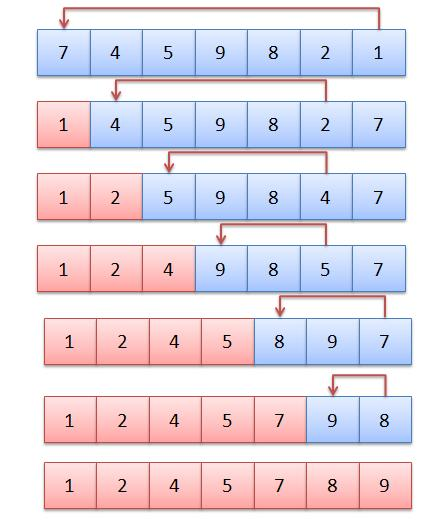

Repeatedly find the smallest element in the unsorted portion and swap it to the front.

Smallest element at index 0 after first pass.

Comparisons = (N – 1) + … + 1 = (N² - N)/ 2; worst-case swaps = N – 1

Steps: N²/2 + N/2 - 1, O(N²)

Best case still O(N²)

Roughly half the number of operations compared to bubble sort.



```
def selectionSort(array, size):

    for ind in range(size):
        min_index = ind

        for j in range(ind + 1, size):
            # select the minimum element in every iteration
            if array[j] < array[min_index]:
                min_index = j
         # swapping the elements to sort the array
        (array[ind], array[min_index]) = (array[min_index], array[ind])
```

Select kth smallest element

```
def selectionSortk(array, size, k):

    for ind in range(size):
        min_index = ind

        if ind + 1 > k:
            break

        for j in range(ind + 1, size):
            # select the minimum element in every iteration
            if array[j] < array[min_index]:
                min_index = j
         # swapping the elements to sort the array
        (array[ind], array[min_index]) = (array[min_index], array[ind])

    return array[k-1]
```
