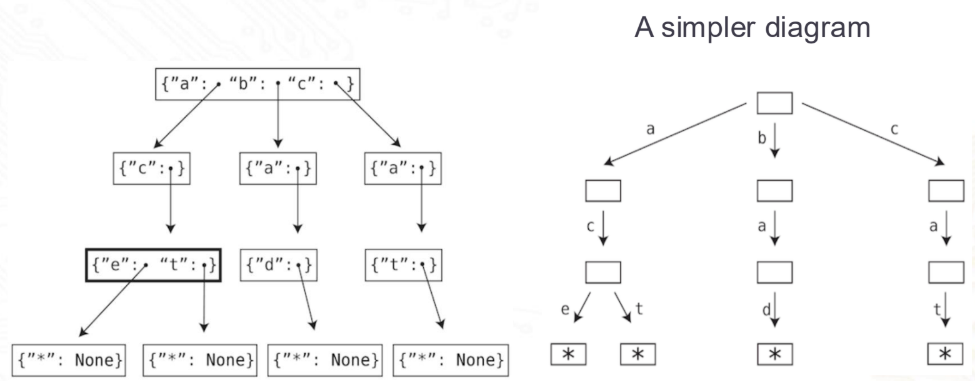

Each node contains a hash table, keys are English characters, values are the child nodes

```
class TrieNode:
    def __init__(self):
        self.children = {}
        self.isEndOfWord = False
```



---

Insertion/search: O(K), K  = length of word/prefix

---

| Advantages | Disadvantages |
|---|---|
| Fast look up, prefix matching Supports autocomplete | High memory usage (many nodes/pointers) |

---

Graphs

```
from collections import deque

class Vertex:

    def __init__(self, value):
        self.value = value
        self.adjacent_vertices = [ ]

    def add_adjacent_vertex(self, vertex):
        self.adjacent_vertices.append(vertex)

def dfs_traverse(vertex, visited_vertices):
    visited_vertices[vertex] = True
    print(vertex.value)

    for adjacent_vertex in vertex.adjacent_vertices:
        if not visited_vertices.get(adjacent_vertex):
            dfs_traverse(adjacent_vertex, visited_vertices)

def bfs_traverse(start_vertex):
    visited_vertices = {}
    queue = deque([start_vertex])
    visited_vertices[start_vertex] = True

    while queue:
        current_vertex = queue.popleft()
        print(current_vertex.value)

        for adjacent_vertex in current_vertex.adjacent_vertices:
            if not visited_vertices.get(adjacent_vertex):
                queue.append(adjacent_vertex)
                visited_vertices[adjacent_vertex] = True
```

Dijkstra’s

---
