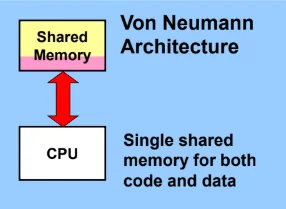
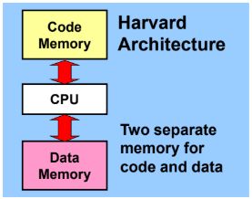
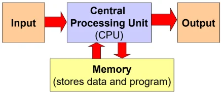
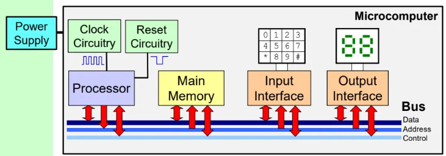
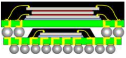
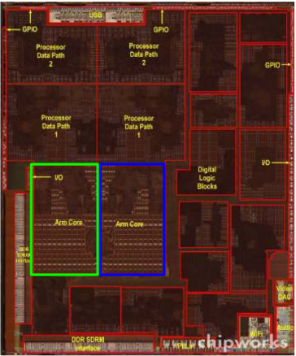

# Introduction

## 2 Classes of computer architecture

<figure data-latex-placement="h">
<figure>

<figcaption>Von Neumann architecture</figcaption>
</figure>
<figure>

<figcaption>Harvard Architecture</figcaption>
</figure>
</figure>

The modern day design (and most of the course) is based on von Neumann’s architecture.

<figure data-latex-placement="H">

<figcaption>CPU interacts with Memory</figcaption>
</figure>

The components of a microcomputer.

<figure data-latex-placement="H">

<figcaption>Components of a Microcomputer</figcaption>
</figure>

1.  The 3 main components - Processor (CPU), Main Memory (DRAM), I/O interfaces - are conencted by a bus structure, where binary information can be transferred in parallel.

2.  A master clock drives the synchronous operations. Operations closer to the CPU core are clocked faster, those involving external components are clocked slower.

3.  Reset circuitry - Active low signal on reset pin for a substantial duration (several clock cycles) is required to reset the CPU.

Package on Package (PoP) for smaller devices, like iPad.

<figure data-latex-placement="H">

<figcaption>Package on Package</figcaption>
</figure>

PoP is an IC packaging technique that vertically stacks and interconnects separate packages (like the CPU and memory) via ball grid array connections.

This saves space, minimises track length between CPU and memory and allows separate testing of memory units.

Example Apple A4 chip

<figure data-latex-placement="H">

<figcaption>A4 chip</figcaption>
</figure>

PoP design where the memory is stacked on top of the processor.
