# Data Organisation in Memory

## Memory Hierarchy

<figure data-latex-placement="H">
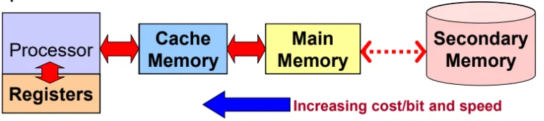
</figure>

1.  **Registers** Very fast access, but limited numbers within the CPU (2-128 registers). Operates at CPU clock rate.

2.  **Cache memory** Fast access static RAM close to CPU. Typical access time 3-20ns, size up to 512kB.

3.  **Main memory** Dynamic RAM or ROM. Typical access time 30-70nS, size up to 16GB.

4.  **Secondary memory** Not always random access but non-volatile. Maybe be based on magnetic or flash technology. Typical access time 0.03-100mS, size: up to 4TB.

### Main Memory

<figure data-latex-placement="H">
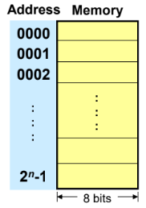
<figcaption>Main memory</figcaption>
</figure>

- Each address location is byte-size (8 bits).

- The memory size (the number of addresses) i.e. $`2^n`$ bytes, is dependent on the number of lines $`n`$ in the address bus.

- Based on Von Neumann’s architecture, the memory stores both code (instructions) and data.

## Number representation

| **Type** | **Bytes** | **Bits** | **Range** |
|---:|:--:|:--:|:---|
| signed char | 1 | 8 | $`-128 \to +127`$ |
| unsigned char | 1 | 8 | $`0 \to +255`$ |
| short int | 2 | 16 | $`-32,768 \to +32,767 \quad (\pm 32\text{KB})`$ |
| unsigned short int | 2 | 16 | $`0 \to +65,535 \quad\qquad (64\text{KB})`$ |
| unsigned int | 4 | 32 | $`0 \to +4,294,967,295 \quad (4\text{GB})`$ |
| int | 4 | 32 | $`-2,147,483,648 \to +2,147,483,647 \ (\pm 2\text{GB})`$ |
| long int | 4 | 32 | $`-2,147,483,648 \to +2,147,483,647 \ (\pm 2\text{GB})`$ |
| long long int | 8 | 64 | $`-(2^{63}) \to (2^{63})-1`$ |
| float | 4 | 32 |  |
| double | 8 | 64 |  |
| long double | 12 | 96 |  |

Note:

- Integers can be signed or unsigned.

- Floating point numbers are always signed.

### Two ways of storing a multi-byte number

<figure data-latex-placement="H">
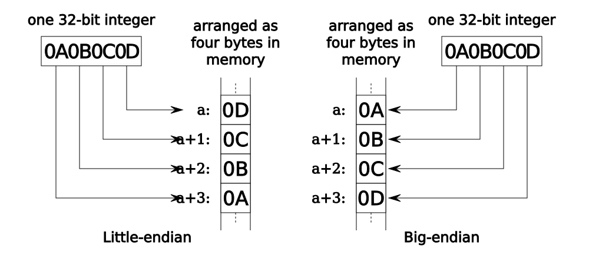
<figcaption>Little vs Big Endian format</figcaption>
</figure>

- Little Endian - LSB at lowest address.

- Big Endian - MSB at lowest address.

## Character Representation

A char requires one byte (8 bits) of memory. The binary data is transformed to some representative characters through some encoding standard.\
Some encoding standards:

- 7-bit ASCII code

- DEC’s Sixbit (6-bit)

- IBM’s EBCDIC (8-bit)

- Unicode (16-bit)

<figure data-latex-placement="H">

<figcaption>7-bit ASCII table</figcaption>
</figure>

Note that lower and upper case characters and digits are contiguous.\

Boolean variables have 2 states:

1.  False = 0

2.  True = non-zero

Most implementations use one byte (8 bits) to store a 1-bit Boolean value (inefficient). Some processors like the 8051 support a small portion of bit-addressable memory.

<figure data-latex-placement="H">
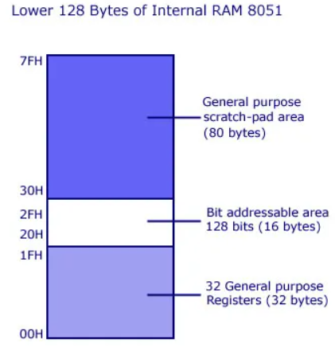
<figcaption>8051 processor supports bit-addressable memory.</figcaption>
</figure>

## Array, String and Structure Representations

### Arrays

A linear array is a consecutive area in memory storing a homogenous data type.\
Elements are accessed through some offset from the base address.

<figure data-latex-placement="H">
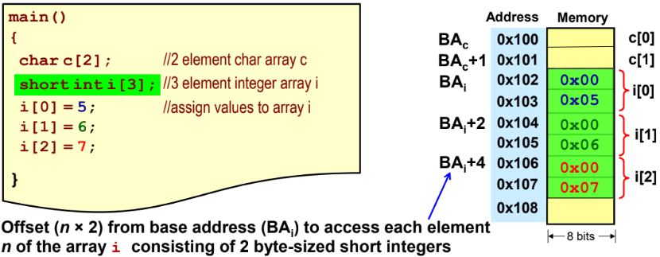
<figcaption>Offset calculated from number of elements and size of the data type.</figcaption>
</figure>

<figure data-latex-placement="H">
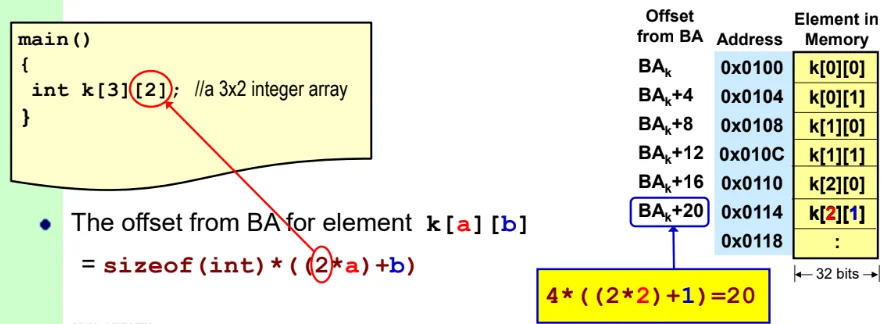
<figcaption>Nested arrays</figcaption>
</figure>

### Strings

<figure data-latex-placement="H">
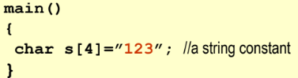
<figcaption>Strings are initialised as array of characters.</figcaption>
</figure>

<figure data-latex-placement="H">
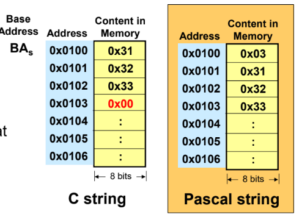
<figcaption>C string terminates with null character, Pascal string stores the length of the string at the start of the string.</figcaption>
</figure>

- C strings have no length limit, whereas Pascal strings are limited to number of bytes used to store the length (e.g. 1 byte $`\rightarrow`$ max 255 characters.)

- C strings have no overhead (only one byte for \0) for length metadata, Pascal strings require space to store the length prefix.

- Determining length of C string is O(n), for Pascal string is O(1).

### Structures

<figure data-latex-placement="H">
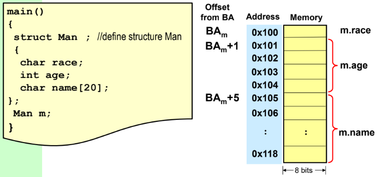
<figcaption>Each data type is ordered according to declaration, and allocated their own data size based on their type.</figcaption>
</figure>

## Pointer representation

<figure data-latex-placement="H">
<figure>
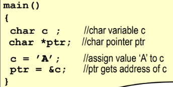
<figcaption>Initialising pointer</figcaption>
</figure>
<figure>
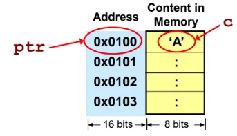
<figcaption>Assuming addresses are 16 bits.</figcaption>
</figure>
<figcaption>Size of pointer is fixed regardless of data type.</figcaption>
</figure>

Use `*ptr` to dereference a pointer.

## Data Alignment

| **Data Type** | **Size (Byte)** | **Example of allowable start addresses due to alignment** |
|:---|:--:|:---|
| char | 1 | 0x..0000, 0x..0001, 0x..0002 |
| short | 2 | 0x..0000, 0x..0002, 0x..0004 |
| int | 4 | 0x..0000, 0x..0004, 0x..0008 |
| float | 4 | 0x..0000, 0x..0004, 0x..0008 |
| double | 8 | 0x..0000, 0x..0008, 0x..0010 |
| pointer | 8 | 0x..0000, 0x..0008, 0x..0010 |

Multi-byte data should be aligned to addresses that are multiples of their data type size.

*Assuming* a 64-bit processor that uses 64-bits to represent an address.

<figure data-latex-placement="H">
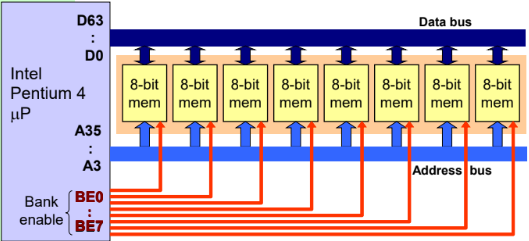
<figcaption>Intel Pentium 4</figcaption>
</figure>

- 64-bit data bus $`\rightarrow`$ The CPU fetches 64-bits every memory cycle.

- 33 address pins $`\rightarrow`$ There are $`2^33`$ 8 byte "blocks".

- 8 Bank Enable pins select which 8-bits in that 64-bits block to read from.

- The CPU has a 64-bit data word size.

<figure data-latex-placement="H">
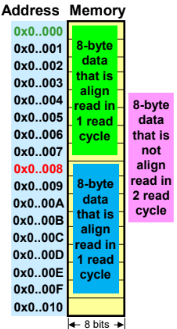
<figcaption>8-byte data should be aligned to addresses that are multiples of 8.</figcaption>
</figure>

- Since the CPU fetches 8 bytes at a time, any 8-byte data that is not aligned needs two memory cycles to be fetched.

- If a processor has an 8 bit (1 byte) data bus, there won’t be any alignment issues.\
  Multi-byte data takes the same number of cycles to be fetched, regardless of the memory address.

- If a processor has a 16 bit (2 bytes) data bus, then 2, 4 or 8 byte data should be aligned to even addresses.

### Data alignment in structures

<figure data-latex-placement="H">
<figure>
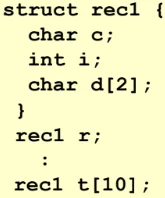
<figcaption>Defining struct in C</figcaption>
</figure>
<figure>
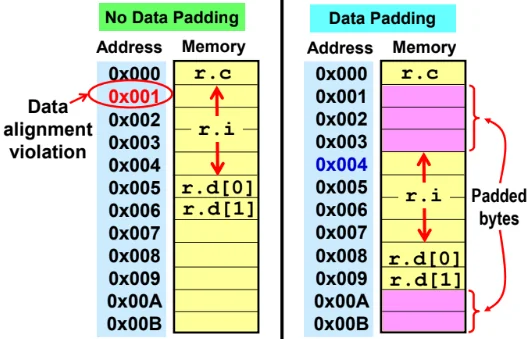
<figcaption>Padded bytes are added to maintain alignment for each data type.</figcaption>
</figure>
</figure>

<figure data-latex-placement="H">
<figure>
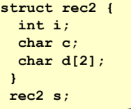
<figcaption>Rearranging order of data objects</figcaption>
</figure>
<figure>
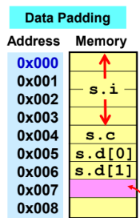
<figcaption>New struct takes 8 bytes instead of 12 previously.</figcaption>
</figure>
</figure>
