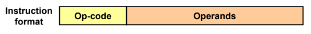
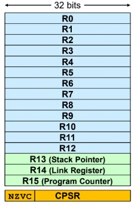
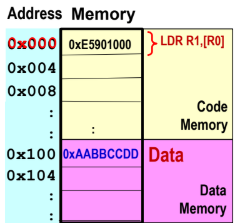
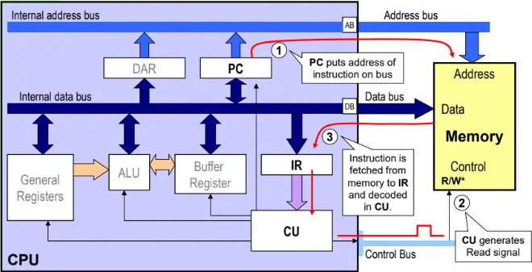
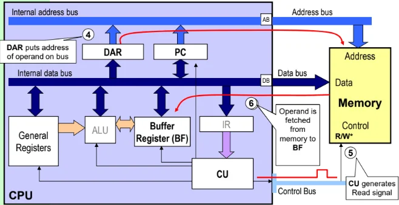
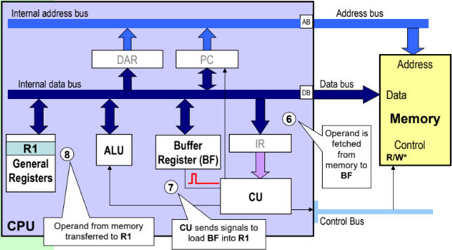

# Instruction Organisation in Memory

Instructions are stored in memory as machine codes (binary patterns).\
ARM instructions are human-readable representations of machine code.

ARM instructions are 32 bits long.

<figure data-latex-placement="H">

<figcaption>ARM Instruction format (32 bits long)</figcaption>
</figure>

- Opcode specifies the operation to be carred out (Chapter 5 - Instruction Set)

- Operands specify the data or location of data to be used / stored. (Chapter 4 - Addreessing Modes).

## ARM Programmer’s Model

Programmer’s model is an abstract, simplified view of the processor.\
It includes just the parts a programmer needs to write and run code.

<figure data-latex-placement="H">

<figcaption>Visible registers in User Mode of the ARM processor</figcaption>
</figure>

- There are 16 32-bit registers.

- R13 (SP) stores address of some space in memory, that temporarily stores away register information that may be needed.\
  Used to maintain full descending stack etc.

- R14 (LP) Used as Link Register when calling of subroutines.\
  For example, when $`\texttt{BL}`$ (Branch with Link) called, R14 stores PC (R15) value so that the program can return when subroutine is completed.\
  R14 can also be a general purpose register at other times.

- R15 (PC) stores the start address of the next instruction to be **fetched**.\
  PC will automatically increment by the length of the instruction executed (4 for ARM CPU).\
  Jump or branch instruction will alter the sequential execution.\
  The value of PC is the address of the current instruction being executed plus 8 bytes (due to the fetch-decode-execute pipeline).

- CPSR stores the 4 condition code flags.\
  Bit 31: N (Negative), Bit 30: Z (Zero), Bit 29: C (Carry out), Bit 28: V (Overflow)

## Execution Cycle

The CPU repeatedly performs the Fetch-Decode-Execute cycle.

Considering the instruction $`\texttt{LDR R1, [R0]}`$, and where the instruction and data are stored:

<figure data-latex-placement="H">

</figure>

We get this execution cycle:

1.  Fetch cycle - Instruction

    <figure data-latex-placement="H">
    
    <figcaption>PC points to address of next instruction, the opcode fed into IR.</figcaption>
    </figure>

2.  Fetch cycle - Operand

    <figure data-latex-placement="H">
    
    <figcaption>Another fetch required to retrieve operand in CPU.</figcaption>
    </figure>

3.  Execute Cycle - Load

    <figure data-latex-placement="H">
    
    <figcaption>The operand fetched from memory is loaded into memory.</figcaption>
    </figure>

Takeaways:

1.  Different instructions require multiple accesses to memory, hence taking different number of clock cycles.

2.  von Neumann bottleneck - System performance limited by data traffic bandwidth between CPU and memory, because data transfer on the external bus is slower than within CPU’s internal bus. Hence keeping regularly used operands in the CPU registers may help reduce memory access.

3.  Keeping instructions and data in separate memories (i.e. Harvard architecture) can make instructions execute in more regular cycles (using parallel fetches).
