# Addressing Modes

Addressing Modes refers to how data is accessed, so that CPU can identify the actual operand or address location where operand is stored.

1.  Immediate data

2.  Register direct

3.  Register indirect

4.  Register indirect with offset

5.  Register indirect with index register

6.  Pre and post auto-indexing

## Register Direct

<figure data-latex-placement="H">

<figcaption>[MOV] Copy data from operand on the right to operand on the left.</figcaption>
</figure>

<figure data-latex-placement="H">
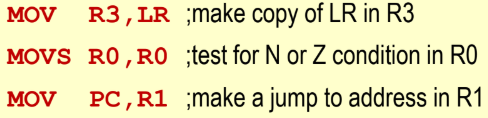
<figcaption>Any of the 16 registers in the processor can be an operand.</figcaption>
</figure>

Execution of register direct instruction involves no access to memory.

## Immediate Addressing

<figure data-latex-placement="H">

<figcaption>Source operand can be a constant value, that is copied into destination operand.</figcaption>
</figure>

<figure data-latex-placement="H">
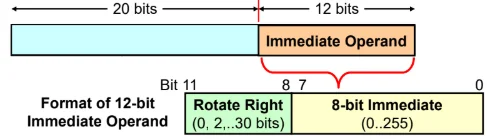
<figcaption>32-bit ARM instruction has 12-bits for the immediate value.</figcaption>
</figure>

The 8-bit immediate value must be between 0 to 255.

That value is rotated right by $`2n`$ bits, where $`n`$ is the value of the 4 rotate right bits. Hence range of rotation is $`0, 2, 4, \ldots, 30`$.

Therefore, to check if a 32-bit hexadecimal number can be an immediate value:

1.  The ’1’ bits must be maximum of 8 bits apart.\
    E.g. 0x111 $`= ... 0001\:0001\:0001_2`$. The furthest ’1’s are separated by 9 bits, so 0x101 cannot be an immediate value.

2.  The 8 bit immediate can only be rotated by an even number of bits.\
    E.g. 0x102 $`= ... 0001\:0000\:0010_2`$. The 8-bit immediate value would be $`1000\:0001`$, which has to be ROR by 31 bits (not even number). Hence, 0x102 cannot be an immediate value.

<figure data-latex-placement="H">
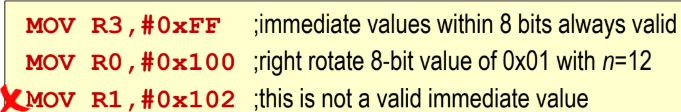
<figcaption>Some immediate values cannot be stored.</figcaption>
</figure>

Exeuction of immediate addressing involves no access to memory.

Only a subset of immediate values is available since data is encoded within fixed-length instruction.

## Register Indirect with Base Register

### LDR Instruction

<figure data-latex-placement="H">
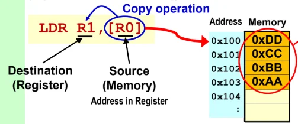
<figcaption>Source operand register stores an address.</figcaption>
</figure>

Data is fetched from that address in memory and coped into the destination operand.

### STR instruction

<figure data-latex-placement="H">
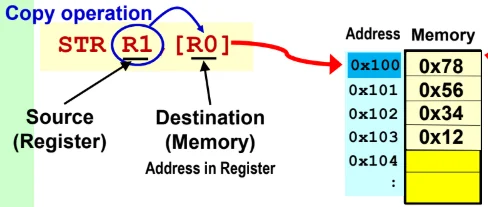
<figcaption>Destination operand (on the right) stores an address.</figcaption>
</figure>

Data in source operand (on the left) is copied into that address in memory.

<figure data-latex-placement="H">
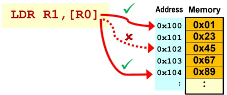
<figcaption>4-byte data being read or written to memory must start at address that is multiple of 4.</figcaption>
</figure>

Otherwise, there may be performance degradation issues.

## Register Indirect with Offset

<figure data-latex-placement="h">
<figure>
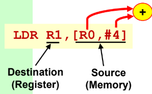
<figcaption>Offset applied to address stored in indirect register (source operand).</figcaption>
</figure>
<figure>
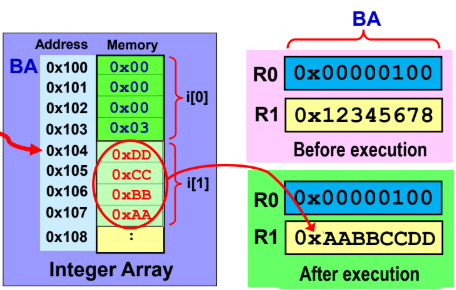
<figcaption>Data in array accessed with respect to base address (BA).</figcaption>
</figure>
</figure>

<figure data-latex-placement="H">
<figure>
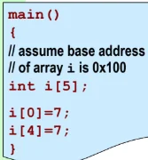
<figcaption>C program - First and last element of array = 7.</figcaption>
</figure>
<figure>
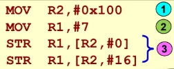
<figcaption>Assembly - Offset of 16 to store 7 at first and last element.</figcaption>
</figure>
</figure>

Note: When computing offset, each integer element occupies 4 bytes in memory.

Offset addressing does not change the indirect register’s content.

Used when the position of array element is known when coding the program.

## Register Indirect with Index Register

<figure data-latex-placement="H">
<figure>
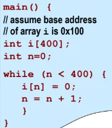
<figcaption>C program - Initialise all 400 elements in array to zero.</figcaption>
</figure>
<figure>
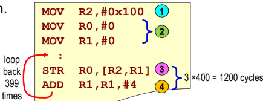
<figcaption>Assembly - R1 (index register) continually incremented by 4.</figcaption>
</figure>
</figure>

Base (indirect) register’s content is not changed, but index register’s (R2) value can be modified.

Used if array position is to be computed during run time.

## Register Indirect with Autoindexing

Aim is to modify the indirect register’s content.

<figure data-latex-placement="H">
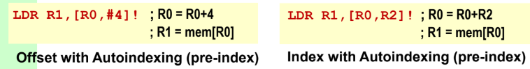
<figcaption>Pre-index - Indirect register is autoindexed BEFORE computing effective address.</figcaption>
</figure>

<figure data-latex-placement="H">
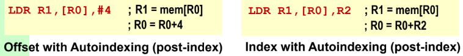
<figcaption>Post-index - Indirect register used to compute effective address BEFORE being autoindexed.</figcaption>
</figure>

<figure data-latex-placement="H">
<figure>
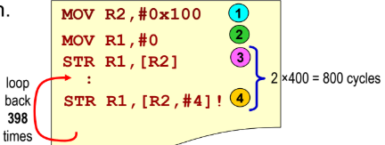
<figcaption>Preindex - Storing into R0 with effective address of R2 plus offset 4. EA then stored in R2.</figcaption>
</figure>
<figure>
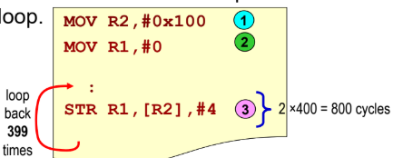
<figcaption>Postindex - Storing into R0 with effective address of R2. R2 is then offset by 4 and stored in R2.</figcaption>
</figure>
</figure>

## Stacks

<figure data-latex-placement="H">
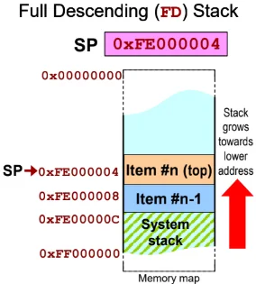
<figcaption>Stack Pointer (SP)/R13 in ARM processor maintains the system stack.</figcaption>
</figure>

The 4 possible stack implementations:

1.  Full Descending

2.  Full Ascending

3.  Empty Descending

4.  Empty Ascending

FD stack implementation:

Full: SP points to top item of stack.

Descending: Stack grows towards lower memory addresses.

<figure data-latex-placement="H">
<figure>
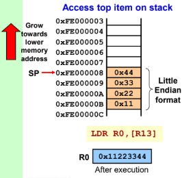
<figcaption>LDR R0, [R13]; R13 stores address to top item in stack.</figcaption>
</figure>
<figure>
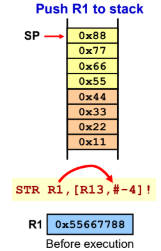
<figcaption>Preindexing used to jump 4 bytes, then store the data from source operand.</figcaption>
</figure>
<figure>
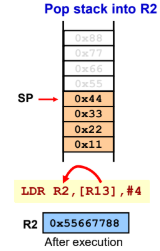
<figcaption>Postindexing used to store data in destination, then jump to new top of stack.</figcaption>
</figure>
</figure>

EA stack implementation:

Empty: SP points to unoccupied stack space.

Ascending: Stack grows towards higher memory address.

<figure data-latex-placement="H">
<figure>
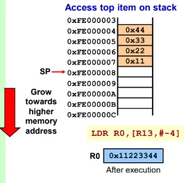
<figcaption>LDR R0, [R13, #-4]; Offset to get the lowest address of top item.</figcaption>
</figure>
<figure>
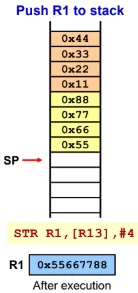
<figcaption>Postindexing used to store data at lowest address, then jump 4 bytes up.</figcaption>
</figure>
<figure>
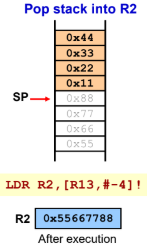
<figcaption>Preindexing used to jump to lowest address of top item, then pop it to destination register.</figcaption>
</figure>
</figure>

## PC-related addressing modes

### Absolute Jump

<figure data-latex-placement="H">
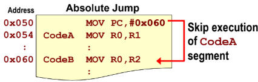
<figcaption>Loading the actual address into PC.</figcaption>
</figure>

Loading a new address into PC will alter the sequence of program execution.

Absolute jump is not position-independent. If the whole chunk of code memory was shifted, the code would fail.

### Relative Jump

<figure data-latex-placement="H">
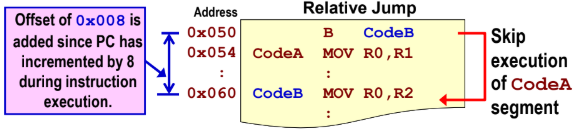
<figcaption>Telling the PC to jump to CodeB.</figcaption>
</figure>

Due to FETCH-DECODE-EXECUTE pipeline architecture of the ARM processor, the PC points 8 bytes ahead of the current executed intsruction.

At $`0x050`$, the PC value during execution is $`0x058`$. To jump to CodeB at $`0x060`$, the offset applied is $`0x060-0x058=0x008`$.

### Position-independent code

Relative jump supports position-independent code.

<figure data-latex-placement="H">
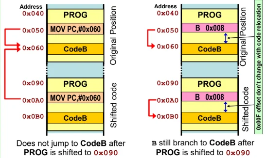
<figcaption>Position-independent (P-I) code doesn’t hardcode the address, instead a signed offset is calculated relative to the PC.</figcaption>
</figure>

<figure data-latex-placement="H">
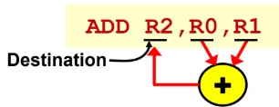
<figcaption>Destination and middle operands must be registers, rightmost operand can be a register or immediate value.</figcaption>
</figure>

-bit instruction: 4-bits for condition flag, 8-bits for opcode, 4-bits for each register, hence only 12-bits left for only one immediate value.

<figure data-latex-placement="H">
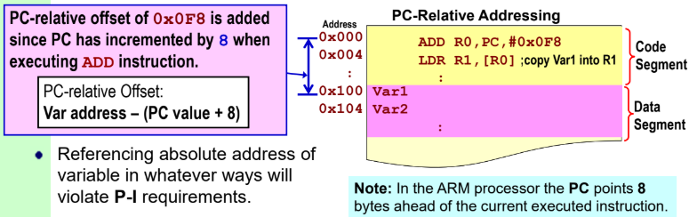
<figcaption>PC-relative addressing used to access variables in data segment in memory.</figcaption>
</figure>
