# Instruction Set

<figure data-latex-placement="H">
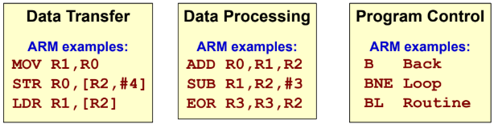
<figcaption>The 3 types of instructions.</figcaption>
</figure>

## Data Transfer Instructions

Instructions that move data between registers and/or memory.

### Register Data Transfer

- MOV instruction utilises register direct or immediate addressing.

  <figure data-latex-placement="H">
  
  <figcaption>MOV/MOVS instruction.</figcaption>
  </figure>

- MVN instruction inverts the source operand bitwise by moving into the destination register.

  <figure data-latex-placement="H">
  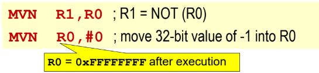
  <figcaption>MVN instruction.</figcaption>
  </figure>

### Memory Data Transfer

- LDR accesses memory at effective address using indirect register addressing modes.

  <figure data-latex-placement="H">
  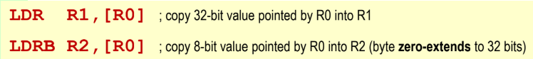
  <figcaption>LDR/LDRB instruction.</figcaption>
  </figure>

- STR copies data to effective address using indirect register addressing modes.

  <figure data-latex-placement="H">
  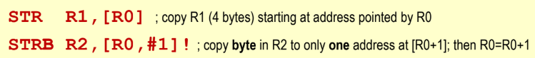
  <figcaption>STR/STRB instruction.</figcaption>
  </figure>

## Data Processing Instructions

### Arithmetic Instructions

Supports register direct and immediate addressing (for rightmost operand only).

- ADD/ADDS

  <figure data-latex-placement="H">
  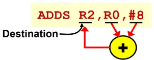
  <figcaption>Rightmost operand can be immediate value or register.</figcaption>
  </figure>

  <figure data-latex-placement="H">
  <figure>
  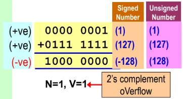
  <figcaption>V=1: overflow when adding <strong>signed</strong> numbers.</figcaption>
  </figure>
  <figure>
  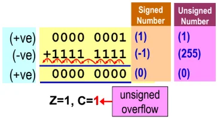
  <figcaption>C=1: overflow when adding <strong>unsigned</strong> numbers.</figcaption>
  </figure>
  <figcaption>ADDS affects all the flags NZVC.</figcaption>
  </figure>

- SUB/SUBS/RSB/RSBS

  <figure data-latex-placement="H">
  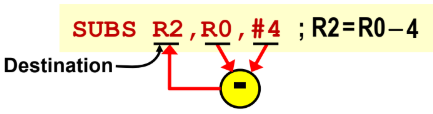
  <figcaption>SUB is not commutative; rightmost operand can be immediate value or register.</figcaption>
  </figure>

  <figure data-latex-placement="H">
  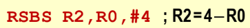
  <figcaption>RSB reverses the subtraction order.</figcaption>
  </figure>

  <figure data-latex-placement="H">
  <figure>
  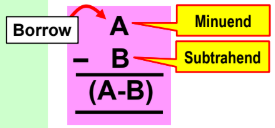
  </figure>
  <figure>
  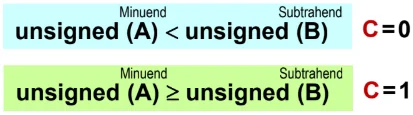
  </figure>
  <figcaption>SUBS affecting C flag.</figcaption>
  </figure>

  <figure data-latex-placement="H">
  <figure>
  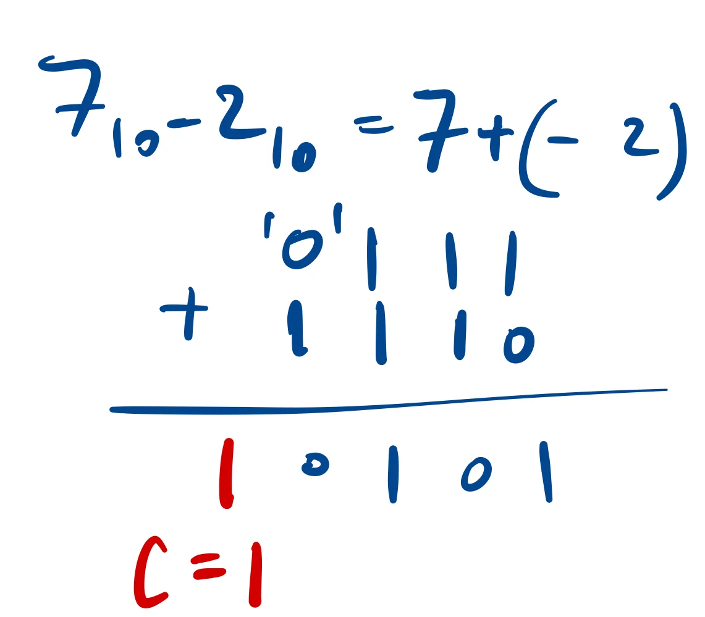
  <figcaption>C=1 if minuend &gt; subtrahend</figcaption>
  </figure>
  <figure>
  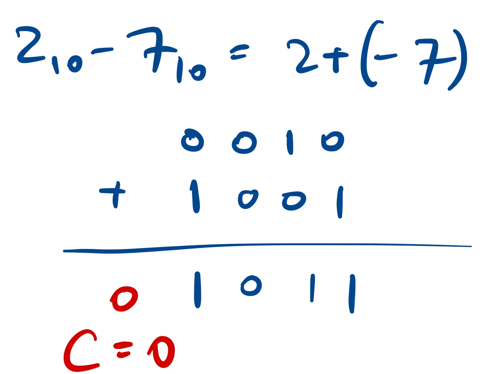
  <figcaption>C=0 if minuend &lt; subtrahend.</figcaption>
  </figure>
  </figure>

  <figure data-latex-placement="H">
  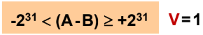
  <figcaption>V=1 when the result is out of the signed 32-bit range.</figcaption>
  </figure>

- ADC/SBC/RSC \[with S suffix to influence NZVC\]

  <figure data-latex-placement="H">
  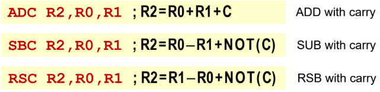
  <figcaption>Uses value of C flag at that point.</figcaption>
  </figure>

### Logical instructions

Boolean operators; S suffix influences N/Z flags.

- MVN/MVNS

  <figure data-latex-placement="H">
  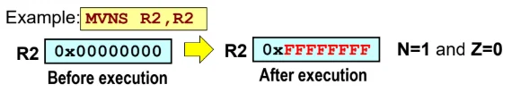
  <figcaption>MVN takes two operands, performs bitwise inversion.</figcaption>
  </figure>

- AND/ANDS

  <figure data-latex-placement="H">
  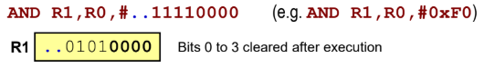
  <figcaption>AND can be used to clear bits to 0.</figcaption>
  </figure>

- ORR/ORRS

  <figure data-latex-placement="H">
  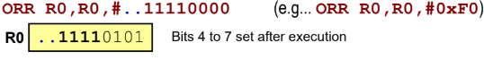
  <figcaption>ORR can be used to set bits to 1.</figcaption>
  </figure>

- EOR/EORS

  <figure data-latex-placement="H">
  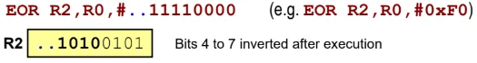
  <figcaption>EOR used to complement bits.</figcaption>
  </figure>

- Logical shift left (LSL) & Logical Shift Right (LSR)

  <figure data-latex-placement="H">
  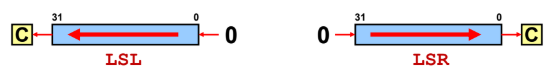
  <figcaption>Multiply (shift left) or divide (shift right) by factor of 2<em>N</em>, for N bits shifted.</figcaption>
  </figure>

  LSL: For signed/unsigned multiply, ’0’s are shifted into the LSB of the register from the right.\
  LSR: For unsigned divide, ’0’s are shifted into the MSB of the register from the left.\
  ’S’ suffix will influence C flag.

  <figure data-latex-placement="H">
  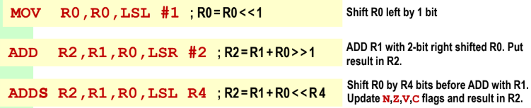
  <figcaption>Shift operation is applied to the rightmost operand, number of bits to be shifted can be specified as immediate value or within a register.</figcaption>
  </figure>

- Arithmetic shift right (ASR)

  <figure data-latex-placement="H">
  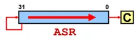
  </figure>

  ASR: For signed divide, the sign bit is shifted into the MSB from the left.\
  ’S’ suffix will influence C flag.

- Rotate right (ROR) or Rotate Right Extended (RRX)

  <figure data-latex-placement="H">
  <figure>
  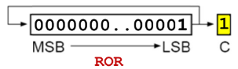
  <figcaption>Bits shifted out are returned in at leftmost end, and also placed in C flag.</figcaption>
  </figure>
  <figure>
  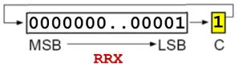
  <figcaption>C flag is shifted into the register at the leftmost end, while the bit shifted out replaces the C flag.</figcaption>
  </figure>
  </figure>

  <figure data-latex-placement="H">
  
  <figcaption>Rotate operation is applied to the rightmost operand.</figcaption>
  </figure>

## Program Control Instructions

To disrupt the program’s normal sequential flow, the contents of the Program Counter (PC) is modifed, either directly or by using Branch instruction.

If a branch is executed based on some condition(s), it is a Conditional Branch or Branch on Conditional Code (Bcc).

If the condition in the conditional code (cc) is true, a displacement is added to the PC. Note that the PC value is 8 bytes ahead of the current Bcc being executed.

The displacement range is $`\pm32`$MB.

<figure data-latex-placement="H">
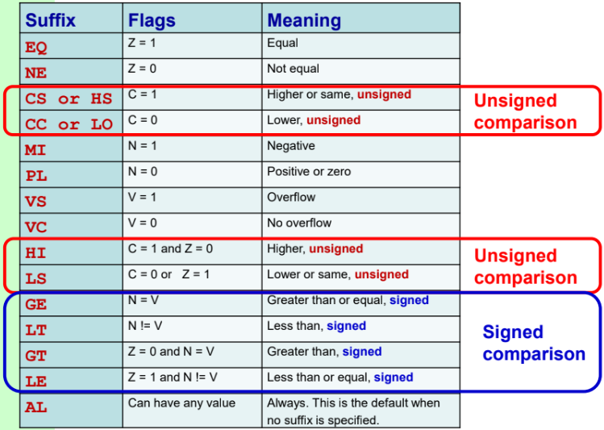
<figcaption>The 15 conditional codes. Each code will be prefixed with ’B’ in the code.</figcaption>
</figure>

Signed vs unsigned values

- For testing signed values, use **GT, LT, GE, LE**.

- For testing unsigned values, use **HI, LO, HS, LS**.

Example of using different condition codes for the same function.

<figure data-latex-placement="H">
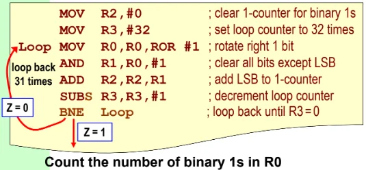
<figcaption>BNE tests for Z=0</figcaption>
</figure>

<figure data-latex-placement="H">
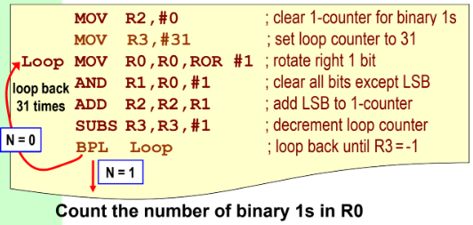
<figcaption>BPL test for N=0</figcaption>
</figure>

- CMP instruction subtracts source operand from destination register and sets the CC flags (does not ’S’ suffix).

  <figure data-latex-placement="H">
  <figure>
  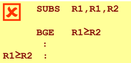
  <figcaption>R1 is modified here.</figcaption>
  </figure>
  <figure>
  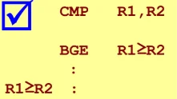
  <figcaption>R1 unchanged. CMP tests (R1 - R2).</figcaption>
  </figure>
  </figure>

- CMN (Compare negative)

  <figure data-latex-placement="H">
  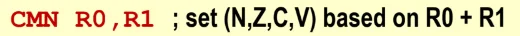
  <figcaption>Tests for (R0 + R1). Essentially ADDS without modifying the destination register.</figcaption>
  </figure>

- TST (Test bits)

  <figure data-latex-placement="H">
  
  <figcaption>Performs bitwise AND between the two operands, without modifying the destination register.</figcaption>
  </figure>

- TEQ (Test equivalence)

  <figure data-latex-placement="H">
  
  <figcaption>Performs bitwise XOR between the two operands, without modifying the destination register.</figcaption>
  </figure>
