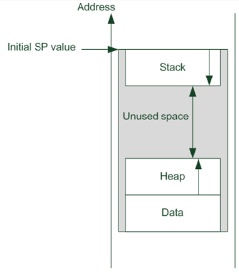
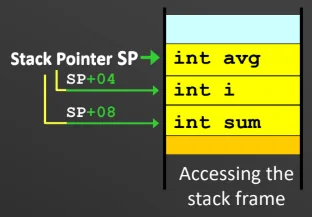
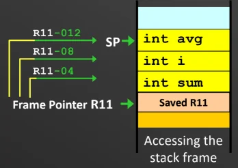
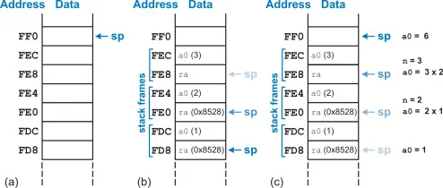

# Modular Programming

A good software module features loose coupling (local variables: data within module is independent of other modules) and strong modularity (performs a single logically coherent task).

## Subroutines

Modules are implemented as subroutines.\

To **call** a subroutine: Use branch with link. `BL SUB1`\
**\*\***Do not use standard branch `B` because it just overwrites the PC value without saving it, and we lose that value.\
When `BL` executed, the return address (current address of `BL` + 4) is stored into Link Register R14.\
Note: PC and LR modified.\

To **return control** to caller program: Use Branch and Exchange. `BX LR` or `MOV PC LR`.\
This instuction copies the saved address from LR to PC.\
Note: PC modified.

#### Transparent subroutine

If a subroutine needs to modify certain registers, it should restore their original contents before returning control to the caller.\
This guarantees that the subroutine does not affect the proper operation of the calling program.

### Parameter Passing via Registers / Pass by value

Parameters are placed directly into specific registers right before the subroutine is called.\
Register convention:

- **R0-R3**: For passing argument values into the subroutine and returning results back to the caller. A standard subroutine is free to modify these values (and not restore them).

- **R4–R11**: Strictly used to hold local variables, not for passing arguments. If a subroutine uses them, it must preserve their original values.

- **R12**: This acts as a scratchpad register and does not need to be preserved (for standard subroutine).

This is the fastest method as the subroutine does not need to fetch the parameters from memory.\
However, it lacks generality because the number of parameters you can pass is limited by the hardware registers available. It is only useful when dealing with a small number of parameters.

**Bit Counting Subroutine (Register passing)**

    ; --- Calling Program ---
    Main    MOV   R1, #0xFF           ; Load a test word into R1
            BL    Count1s             ; Call the subroutine
    Stop    B     Stop                ; End of program loop

    ; --- Subroutine ---
    Count1s EOR   R0, R0, R0          ; Clear R0
            ADD   R2, R0, #32         ; Set counter R2 with 32
            ADD   R3, R0, #1          ; Set R3 with 1
    Loop    AND   R4, R3, R1, ROR R2  ; Set R3 as a mask with value 1, apply to rotated R1
            ADD   R0, R0, R4          ; Add the lsb to R0
            SUBS  R2, R2, #1          ; Decrement counter by 1
            BNE   Loop                ; Loop if not zero
            MOV   PC, LR              ; Return from subroutine

- **Purpose**: To calculate the total number of ’1’ bits present within a 32-bit data word.

- **Parameter passing**: The calling program places the target word directly into R1.

- **Transparency**: Registers R0, R2, R3, R4 were modified, and were not restored. This subroutine is not transparent.

### Parameter Passing via Memory / Pass by reference

The parameters are gathered into a block at a predefined memory location.\
The caller passes the start address of the memory block to the subroutine using a address register (like R0).\
This method is useful for passing a large number of parameters or larger data types like arrays and strings.

**Lower to Upper Case Subroutine (Efficient Memory Passing)**

    ; --- Calling Program ---
    Main    MOV R0, #0x100      ; move start addr. of string to R0
            BL  Lo2Up           ; branch to Lo2Up subroutine
    Stop    B   Stop            ; End of program loop

    ; --- Subroutine ---
    Lo2Up   STMFD SP!, {r0,r1}  ; save registers used within subroutine
    Loop    LDRB R1, [R0], #1   ; get current char from string in memory
            CMP R1, #0          ; Compare with NULL
            BEQ Done            ; if NULL char, branch to Done
            CMP R1, #0x061      ; compare with lower limit 'a'
            BLT Loop            ; if smaller than 'a', do not convert
            CMP R1, #0x07A      ; compare with upper limit 'z'
            BGT Loop            ; if greater than 'z', do not convert
            SUB R1, R1, #32     ;convert to upper case by subtracting 32
            STRB R1, [R0, #-1]  ; write modified char back to memory
            B   Loop            ; branch back to Loop
    Done    LDMFD SP!, {r0,r1}  ;  restore saved registers
            MOV PC, LR          ; return from subroutine

- **Purpose**: To convert a null-terminated ASCII string stored in memory from lowercase letters to uppercase letters in place.

- **Parameter passing**: The calling program places the starting memory address of the string into R0.

- **Transparency**: Yes. Original values of registers R0, R1 were pushed onto the system stack at the start of the subroutine. They were then modifed, and subsequently pops the values from the system stack back into R0, R1.

## System Stack

The system stack is managed by SP/R13.\
The stack grows towards lower memory addresses.

- Stack starts from highest address and grows downwards, as opposed to the heap (used for dynamic memory allocation) that starts from the lowest memory addresses and grows upwards.

  <figure data-latex-placement="H">
  
  <figcaption>Stack grows downwards.</figcaption>
  </figure>

**Pushing data**: Decrease SP before pushing: `STR R0, [SP,#-4]!`.\
For multiple registers: STMFD SP!, list of registers.\
**Popping data**: Update SP after read: LDR R0, \[SP\], \#4.\
For multiple registers: LDMFD SP!, list of registers.\
Note that popping data does not erase it; it justs shifts the SP.\
Note that for `STMFD` and `LDFMD`, higher register number corresponds to higher memory address. Lower register number corresponds to lower memory address (closer to SP).

#### Local variables

These only exist during the execution of the subroutine.\
The system stack is used to create a temporary memory space, called a "stack frame," to hold these local variables upon subroutine entry.\
Accessing the stack frame:

- Using a Frame Pointer (FP): A dedicated register (usually R11 in ARM) acts as a fixed reference point. Variables are accessed using a negative displacement from the FP.

- Using the Stack Pointer (SP): Variables are accessed using a positive displacement directly from the SP. This is more efficient (no need to set up an FP) but more restrictive, as any push/pop within the subroutine shifts the SP, ruining your reference offsets.

R4-R11 are designated for local variables, so transparent subroutines must restore the original values of these registers.

<figure data-latex-placement="htbp">
<figure>

<figcaption>Stack pointer</figcaption>
</figure>
<figure>

<figcaption>Frame pointer</figcaption>
</figure>
</figure>

### Parameter passing via Stack

Parameters are pushed onto the stack by the calling program before executing the BL instruction. The subroutine then retrieves these parameters using calculated offsets from the SP.\
This method is required for **recursive programming**.\
To prevent stack overflow, the calling program must remove the parameters from the stack immediately after the subroutine returns. This is usually done by adding a value back to the SP.\

**Sum from 1 to N Program (Stack Parameter Passing)**

    ; --- Calling Program ---
    Main    MOV   R1, #5              ; Load value N=5 into R1
            MOV   R0, #0x100          ; Load address of Answer into R0
            STMFD SP!, {R0, R1}       ; Push Address and N to stack
            BL    Sum1N               ; Call subroutine Sum1N
            ADD   SP, SP, #8          ; Pop parameters, free stack space
    Stop    B     Stop                ; End of program loop

    ; --- Subroutine ---
    Sum1N   STMFD SP!, {R4, R5, R6}   ; Save local registers to stack
            LDR   R5, [SP, #16]       ; Load N from stack into R5
            LDR   R6, [SP, #12]       ; Load Answer's address into R6
            MOV   R4, #0              ; Clear summation register R4 to 0
    Loop    ADD   R4, R4, R5      ; Add current value in R5 to sum in R4
            SUBS  R5, R5, #1          ; Decrement loop counter (N) in R5
            BNE   Loop                ; Loop if R5 is not yet zero
            STR   R4, [R6]            ; Write final sum to memory at Answer's address
            LDMFD SP!, {R4, R5, R6}   ; Restore saved local registers
            MOV   PC, LR              ; Return from subroutine

- **Purpose**: Computes the sum of positive numbers from 1 to a given value, N.

- **Parameter passing**: The calling program pushes two distinct parameters onto the stack before calling the subroutine.\
  N passed by value, memory address of Address passed by reference.

- **Transparency**: Yes, R4, R5, R6 were modified, and were stored onto stack then popped off to restore their values.

## Nested Subroutines

Nested subroutines is when a subroutine calls another subroutine (nested call).\
**The problem**: When Subroutine 1 uses the BL instruction to call Subroutine 2, the Link Register is immediately overwritten with a new return address. Consequently, the original return address back to the Main Program is permanently lost, leaving the program stuck in the nested subroutine.\
**The solution**: The Link Register must be preserved by saving it to a safe location, specifically the System Stack. You have two options for when to save it: just before executing any BL instruction, or at the very beginning of the subroutine alongside your local registers (e.g., STMFD SP!, R4-R7, LR).\
If you decide to push additional registers (like the LR) to the stack at the start of your subroutine, it changes the current position of the Stack Pointer. Therefore, you must recalculate and update the offset values used in your LDR instructions to correctly retrieve any parameters that were passed via the stack by the main program.

**Dot product example**:

**Multiplication Subroutine (Used by Dot Product)**

    Mult    MOV R12, #0         ; Clear R12
    Loop    ADD R12, R12, R0    ; Add R0 to R12
            SUBS R1, R1, #1     ; Decrement R1 with 1
            BNE Loop            ; Loop if not zero
            MOV PC, LR          ; same as bx lr (Return)

**Nested Subroutine: Dot Product (Option 1: Save LR before BL)**

    DotProd STMFD SP!, {R4-R7}      ; Store regs to stack
            LDR R4, [SP, #28]       ; Read location of X
            LDR R5, [SP, #24]       ; Read location of Y
            LDR R6, [SP, #20]       ; Read arrays length
            MOV R7, #0              ; Clear R7 (Sum)
    Loop1   LDR R0, [R4], #4        ; Get X[i]
            LDR R1, [R5], #4        ; Get Y[i]
            STR LR, [SP, #-4]!      ; Push Link register to SP just before BL
            BL Mult                 ; Call Mult Subroutine
            LDR LR, [SP], #4        ; Pop Link Register from SP immediately after
            ADD R7, R7, R12         ; Add the product to R7
            SUBS R6, R6, #1         ; Reduce the counter by 1
            BNE Loop1               ; not 0 then repeat
            LDR R4, [SP, #16]       ; read destination address
            STR R7, [R4]            ; Store in destination address
            LDMFD SP!, {R4-R7}      ; Restore registers
            MOV PC, LR              ; same as bx lr

**Nested Subroutine: Dot Product (Option 2: Save LR at Beginning)**

    DotProd STMFD SP!, {R4-R7, LR}  ; Store regs to stack (including LR)
            LDR R4, [SP, #32]       ; Read loc of X (Offset updated +4 due to LR push)
            LDR R5, [SP, #28]       ; Read loc of Y (Offset updated)
            LDR R6, [SP, #24]       ; Read arrays length (Offset updated)
            MOV R7, #0              ; Clear R7 (Sum)
    Loop1   LDR R0, [R4], #4        ; Get X[i]
            LDR R1, [R5], #4        ; Get Y[i]
            BL Mult                 ; Call Mult Subroutine (LR is already safe)
            ADD R7, R7, R12         ; Add the product to R7
            SUBS R6, R6, #1         ; Reduce the counter by 1
            BNE Loop1               ; not 0 then repeat
            LDR R4, [SP, #20]       ; read destination address (Offset updated)
            STR R7, [R4]            ; Store in destination address
            LDMFD SP!, {R4-R7, LR}  ; Restore registers
            MOV PC, LR              ; same as bx lr

## Recursive subroutines

A recursive routine is a subroutine that calls itself within its own body.\
Two critical requirements:

1.  Preserving the Return Address: Because recursion relies heavily on the BL instruction, execution will get stuck if the LR is not systematically saved to the stack during every single recursive call.

2.  A Stopping Condition: There must be a specific terminating condition established that allows the program to skip the recursive BL instruction. Without this, the subroutine will execute infinitely.

**Recursive Subroutine: Fibonacci Sequence**

    Fib     STMFD SP!, {R4-R6, LR}  ; Store regs to stack (Satisfies LR preserve req)
            LDR R4, [SP, #16]       ; Read Value of n
            CMP R4, #1              ; Compare with 1 (if n==1)
            MOVEQ R12, #0           ; Assign result with 0
            CMP R4, #2              ; Compare with 2 (if n==2)
            MOVEQ R12, #1           ; Assign result with 1
            BLE Done                ; if n <= 2 finish (Satisfies stopping condition req)
            
            SUB R5, R4, #1          ; Get n-1
            STMFD SP!, {R5}         ; Push n-1 to stack
            BL Fib                  ; calculate Fib(n-1)
            LDMFD SP!, {R5}         ; Pop from stack
            MOV R6, R12             ; Save result in temp register
            
            SUB R5, R4, #2          ; Get n-2
            STMFD SP!, {R5}         ; Push n-2 to stack
            BL Fib                  ; calculate Fib(n-2)
            LDMFD SP!, {R5}         ; Pop from stack
            
            ADD R12, R12, R6        ; Calculate Fib(n-1) + Fib(n-2)
    Done    LDMFD SP!, {R4-R6, LR}  ; Restore registers
            MOV PC, LR              ; same as bx lr

### Visualising recursion

<figure data-latex-placement="H">

<figcaption>Visualising recursion.</figcaption>
</figure>

**(a)**: The stack pointer (SP) is resting at memory address FF0.\
**(b)**:

1.  The stack pointer (SP) is resting at memory address FF0.

2.  Frame 1: It pushes the current argument a0 (3) and the return address ra onto the stack so it remembers what to multiply later. SP moves down 8 bytes to FE8.

3.  Frame 2: The function calls itself with n=2. It needs to call itself again for n=1, so it saves a0 (2) and the exact same ra (0x8528). SP moves down to FE0.

4.  Frame 3: It calls itself with n=1. It saves a0 (1) and ra (0x8528). SP moves to FD8.

**(c)**:

1.  The function hits its base case (when n=1), meaning it no longer needs to call itself.

2.  The processor starts reading the saved states, moving the sp back up the stack (popping the frames off).

3.  The stack pointer is back at FF0, the memory is cleaned up, and the final answer 6 is sitting in the a0 register ready for the main program to use.

**Inferring the number of recursive calls**:

1.  Identify the Recursive Signature: Scan the stack for a repeating hex address in the position where the Link Register or Return Address is normally saved. In this example, it is 0x8528.

2.  Count the Duplicates: The initial call to the function from the main program will have a unique return address (or it might not be explicitly shown if it’s the top of the trace). Every time the function recursively calls itself, it pushes an identical ra onto the stack. Note that ra at 0xFE8 is different from ra and 0xFE0 and 0xFD8.

3.  The Formula: The number of times you see that identical ra value equals the number of recursive calls executed. In panel (b), 0x8528 is saved twice (at FE0 and FD8), meaning the function recursively called itself exactly two times after the initial start.
