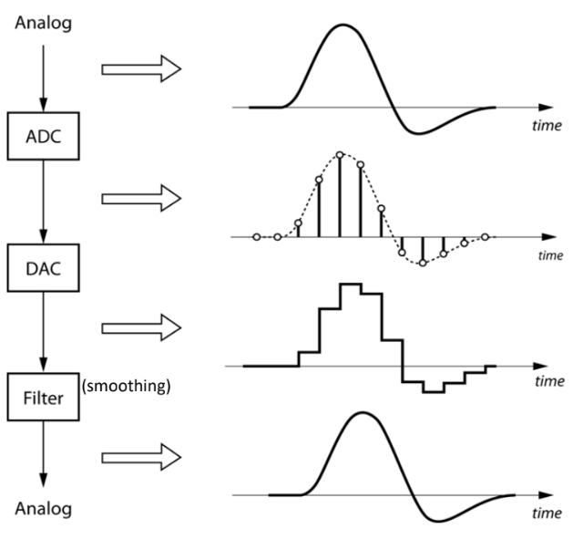
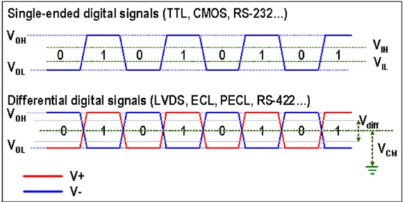
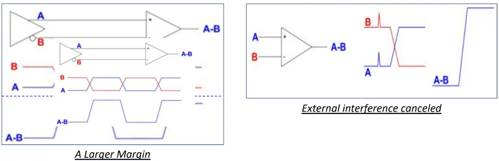
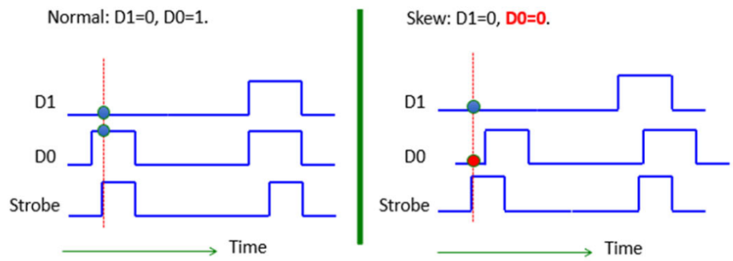
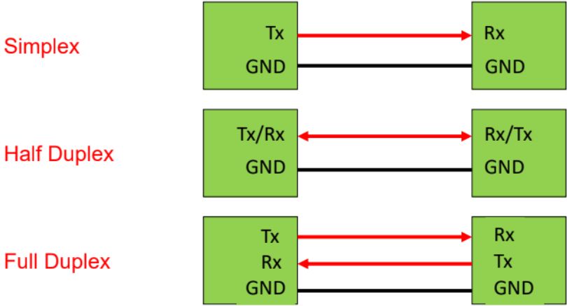
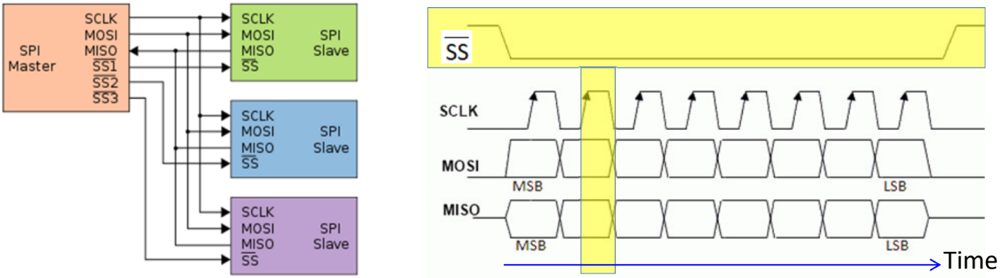
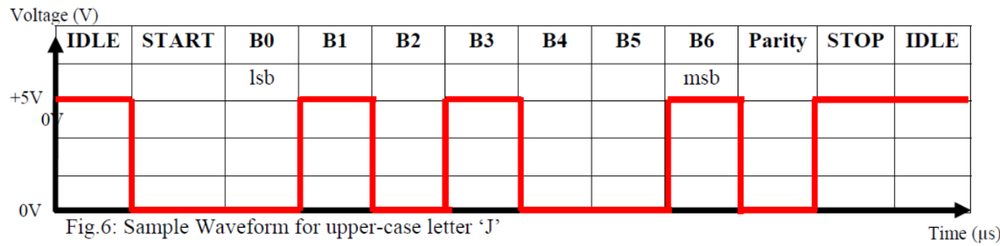
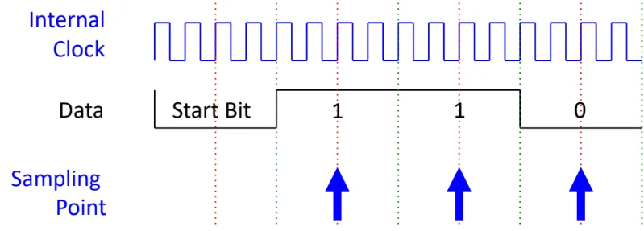
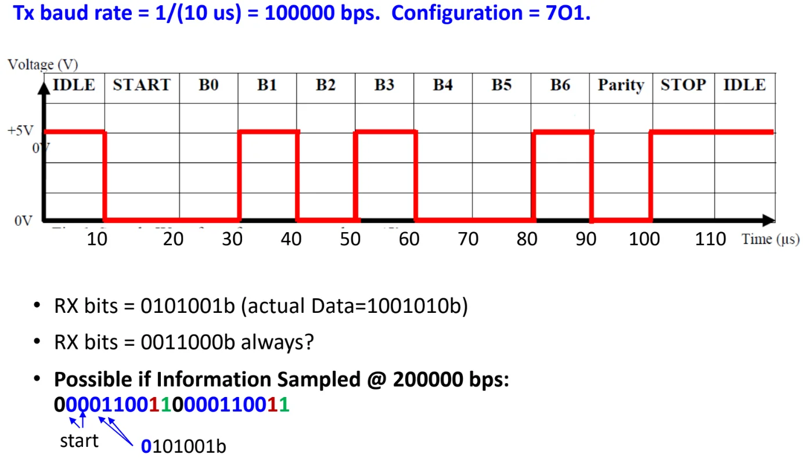
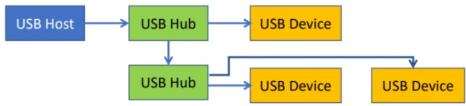

# Interfaces

Analog signal is continuous (real world), digital is discrete (for processing).\

- Analog signal is equivalent to a digital signal with infinitely small sampling interval.\

- Nyquist Theorem: For digital signal to be able to represent its analog equiv adequately, minimum sampling rate is 2x the freq of analog signal

Sequence of processing real-world data:

- ADC $`\to`$ Digital Processor $`\to`$ DAC $`\to`$ smoothing filter.

Interface is a boundary where 2 or more devices meet to exchange info.\
Considerations when interfacing devices:

- Electrical signal level: output voltage level should not exceed the max allowable input voltage of the input.

- Check compatibility: $`V_{OH} > V_{IH}`$ and $`V_{OL} < V_{IL}`$.

Signals transmitted by differential signals have better noise tolerance.

## Parallel data trf

SRAM, DRAM, ROM uses parallel data trf. Synchronous in nature with some strobe signal to inform receiver when to latch in the data.\
Problems:

- Signal skew: Signals arrive at diff times

  - Because of variation in propagation delay between signals from the same data bus.

  - Caused by difference in resistance and capacitance of different wires, so time taken for voltage change on wire to reach steady state differs (time constant $`\tau=RC`$).\

  - Could be further caused by variation in PCB trace length/width (serpentine/trombone).

  

  

  

- Crosstalk: Undesired coupling of signals from one circuit to another

  - Beacuse of close placement of data lines.

  - Interferance could be via electromagnetic domain (act like antenna) or electrical domain.

- Both signal skew and crosstalk limit: the max no. of lines on the bus, max clock rate, max no. of bytes trfed in 1 block, min delay bw each byte trf.

So parallel data trf has faster data trf rate, but susceptible to signal skew and crosstalk, and higher hardware cost and bulkier.\

## Serial data trf

Data trf one bit a time, so trf rate lower compared to parallel trf, and hardware interface design more complex as it needs to handle serial to parallel conversion (processor process in bytes).\
But able to trf data reliably over longer distance with lower cost, and less affected by signal skew and crosstalk.\
**Serial data trf modes**

- Simplex: data trf in one direction

- Half-duplex: data trf in both directn, but RX/TX mutually exclusive

- Full duplex: 2 data lines, simultaneous RX/TX

**Nature of communication**

- Synchronous: common clock signal bw TX and RX

  - I2C: not tested

  - SATA: not tested

  - Serial Peripheral Interface (SPI) Bus.

    - Initiate trf: master pulls the Slave Select (SS) low to enable the target SPI slave.

    - Data on the Master-Out-Slave-In (MOSI) and MISO are latched on the rising edge of the SCLK signal.

    - Multiple slaves can be connected to one master.

    

    

    

- Asynchronous: no common clock, have to agree on pre-fixede clock freq

  - Universal Asynchronous Receiver Transmitter (UART)

    - IDLE = logic 1.

    - TX sends START bit (logic 0). Receiver detects the start of transmission.

    - Then DATA is sent at some Baud rate = no. of bits/second.

    - PARITY bit may be sent for error checking.

    - STOP bit (logic 1) terminates the transmission.

    - The transmission configuration will follow DATA:PARITY:STOP. E.g. 7O1 means 7 data bits, Odd parity, 1 Stop bit.\
      Parity can be Odd, Even, or No parity. Stop bit can be 1 or 2.

    - LSB is sent first.

    - Time for each bit $`T = \frac{1}{\text{Baud Rate}}`$.

    

    

    

  - Internal clock of UART RX will typically run a multiple times (4X here) of the baud rate, to time the sampling close to the middle of each data bit.

    

    

    

  - If RX samples at different baud rate, the result will be different.

    

    

    

## Wired

**USB**

- Tiered-star topology: USB host (usually the computer) connected to peripherals (e.g. mouse) directly or through USB hub.

  

  

  

- Upon connection, the host and device have to undergo enumeration (exchange info on capability & requirement), then the host checks for device driver to support the USB device.

**High-definition Multimedia Interface (HDMI)**

- Audio/video interface for transmitting uncompressed video/audio data.

## Wireless

Industrial, Scientific, Medical (ISM) radio freq (RF) bands are free-to-use frequency bands. The 2.4Ghz and 5.8Ghz bands are standard world wide.\
**WiFi**

- Operates in 2.4Ghz and 5.8Ghz RF range.

- Infrastructure mode: uses Star topology, at the center of the network is an Access Point or Router, connected to devices at the end.

- Adhoc mode: Peer to Peer connection.

- Transmission range generally 20m-150m.

**Bluetooth**

- Mainly for low data rate wireless transmission, focus on low power consumption.

- Operates in 2.4Ghz range.

- Star topology.

- Tranmission range up to 100m but kept to 10-20m for lower power consump.

- 2 protocols: BT classic and BLE (Low energy), but most BT hosts can connect to both.

**Factors affecting transmission range**

- Transmissn power: higher means greater range.

- Transmissn freq: higher freq, higher attenuation, lower range

- Interferance between closer transmitters in the same freq band.

  - To mitigate, the freq band is divided into channels, and each device uses different channels.

  - Another solution is frequency hopping from one channel to another, which is what BT uses.
