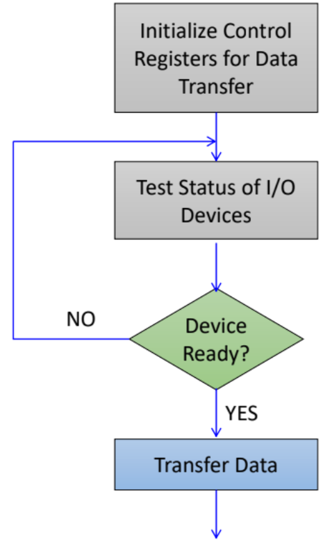
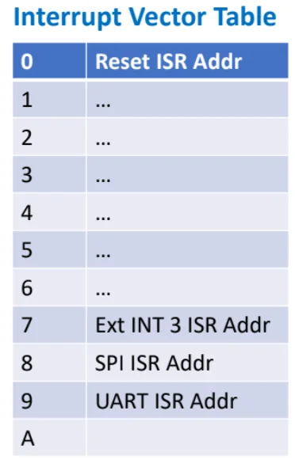
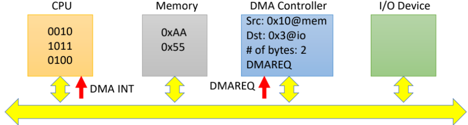
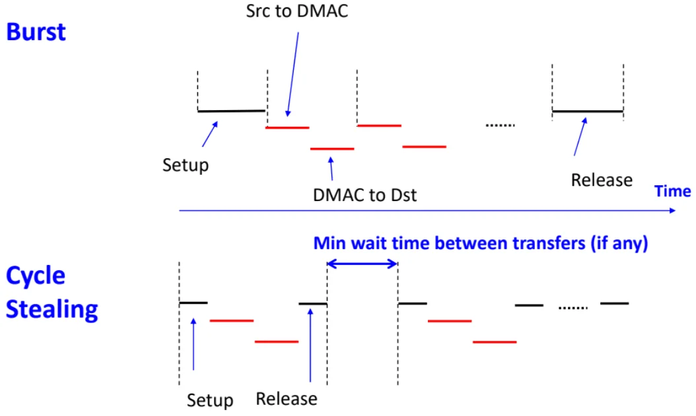

# Data Transfer Mechanisms

<table>
<caption>I/O Data Transfer Mechanisms Summary</caption>
<thead>
<tr>
<th style="text-align: left;"><strong>Mechanism</strong></th>
<th style="text-align: left;"><strong>Controller / Nature</strong></th>
<th style="text-align: left;"><strong>Latency</strong></th>
<th style="text-align: left;"><strong>CPU Eff.</strong></th>
<th style="text-align: left;"><strong>Transfer Rate / Modes</strong></th>
<th style="text-align: left;"><strong>Debugging</strong></th>
</tr>
</thead>
<tbody>
<tr>
<td style="text-align: left;"><strong>Polling</strong></td>
<td style="text-align: left;"><strong>CPU</strong> 
SW-driven active check.</td>
<td style="text-align: left;"><strong>Very Fast</strong> 
1–3 cycles.</td>
<td style="text-align: left;"><strong>Very Low</strong> 
100% blocked.</td>
<td style="text-align: left;"><strong>Low</strong> 
CPU fetches per byte.</td>
<td style="text-align: left;"><strong>Easy</strong> 
Deterministic.</td>
</tr>
<tr>
<td style="text-align: left;"><strong>Interrupt</strong></td>
<td style="text-align: left;"><strong>CPU</strong> 
HW trigger, SW exec.</td>
<td style="text-align: left;"><strong>Slower</strong> 
Context switch.</td>
<td style="text-align: left;"><strong>High</strong> 
Free until signaled.</td>
<td style="text-align: left;"><strong>Moderate</strong> 
CPU still moves data.</td>
<td style="text-align: left;"><strong>Difficult</strong> 
Asynchronous.</td>
</tr>
<tr>
<td style="text-align: left;"><strong>DMA</strong></td>
<td style="text-align: left;"><strong>DMAC</strong> 
Pure HW controller.</td>
<td style="text-align: left;"><strong>Moderate</strong> 
Bus arbitration.</td>
<td style="text-align: left;"><strong>Very High</strong> 
CPU fully freed.</td>
<td style="text-align: left;"><strong>Maximum</strong> 
Burst, Steal, Transparent.</td>
<td style="text-align: left;"><strong>Moderate</strong> 
Silent RAM alters.</td>
</tr>
</tbody>
</table>

Data transfer can be initiated by the CPU or the DMAC.

## Polling (Programmed I/O)

CPU polls a certain I/O port continuously (using software) for data or readiness of the port to perform a data transaction.\
CPU uses 100% of its resource to do the polling. It cannot entertain any other requests.

<figure data-latex-placement="H">

</figure>

- Programmer has complete control over the process, easier to test and debug.

- Program execution of CPU held up while waiting for I/O device to get ready, inefficient use of CPU resources.

## Interrupt Triggered

- Uses hardware: A signal from external/internal peripheral, or a change in status of some special registers notifies the CPU that some event has occur.

- If the CPU decide to service the interrupt, it will suspend its current program temporarily.

- The interrupt will come with some interrupt vector table (IVT) index.

- CPU look up the IVT to check the starting address of the interrupt service routine (ISR) for the corresponding interrupt.

- CPU then proceed to execute the ISR linked to the interrupt that was triggered (typically a short routine).

- Once the ISR is completed, CPU restore the saved context, returns to the interrupted routine and continue from where it had left previously.

- **Interrupt latency**: delay bw CPU receiving the interrupt req, and the pt of entering the ISR.

- CPU does not need to monitor I/O device status, more efficient use of CPU resources.

- But more hardware interface circuitry required between I/O device and processor. Program is slightly more complex and difficult to debug.

## Direct Memory Access (DMA)

DMAC is a Data Bus Controller module that performs data transfer independent of CPU.

- CPU configures some parameters for DMAC to trf data

  - Src and Dest addr of data

  - No. of bytes to trf

  - Trigger signal telling DMAC when to start the trf.

- DMAC waits till trigger signal comes in.

- It requests for system bus and start data trf. (Data goes into internal buffer of DMAC before transferred to dest)

- After trf, DMAC releases the system bus, notifies CPU of data completion via interrupt.

3 modes of transfer:

- Burst: During control of the system bus, DMAC trf multiple units of data.

  - Could be entire block of data that DMAC tasked to trf, or just a subset of that block.

  - CPU can continue with its operation as long it does not need the particular system bus that DMAC is using.

  - So Burst has faster trf rate but CPU may be suspended/inactive if CPU has to wait for DMAC to complete its trf.

- Cycle stealing: DMAC trfs one unit of data aft taking control, then releases control of system bus to CPU.

  - DMAC can execute the data trf between CPU instructions or between pipeline stages.

  - CPU may be suspended if it need to access the system bus but suspend time is shorter as only one unit is transferred at one time.

  - Transfer rate is slower than in Burst Mode but will CPU will only be inactive for very short period of time.

  - Favoured if CPU needs to be responsive.

    

    

    

- Transparent: DMAC trfs data only when CPU not using the system bus.

  - CPU performance not affected, but potentially slowest trf rate.

  - More complex hardware needed to detect when CPU not using the system bus.

- So from burst to cycle-stealing to transparent, data trf gets slower but CPU performance/response improves.

- Transferring via CPU can be faster than DMA as CPU speed is typically faster, just that it means wasting CPU resources to just transfer data.
