# Memory

<div class="table-wrap">

<table>
<caption>Volatile Memory Summary</caption>
<thead>
<tr>
<th style="text-align: left;"><strong>Memory</strong></th>
<th style="text-align: left;"><strong>Layout &amp; Cost</strong></th>
<th style="text-align: left;"><strong>Speed</strong></th>
<th style="text-align: left;"><strong>Implementation Insights</strong></th>
<th style="text-align: left;"><strong>Transistor Function</strong></th>
</tr>
</thead>
<tbody>
<tr>
<td style="text-align: left;"><strong>SRAM</strong></td>
<td style="text-align: left;">Larger (6T)<br />
High Cost</td>
<td style="text-align: left;">Very Fast</td>
<td style="text-align: left;"><strong>CPU Cache:</strong> Demands raw speed. Small capacity (KB/MB) justifies cost. High R/W endurance.</td>
<td style="text-align: left;">Store data &amp; control signal transfer.</td>
</tr>
<tr>
<td style="text-align: left;"><strong>DRAM</strong></td>
<td style="text-align: left;">Smaller (1T, 1C)<br />
Low Cost</td>
<td style="text-align: left;">Slower<br />
(Refresh)</td>
<td style="text-align: left;"><strong>System RAM:</strong> OS/Apps need massive capacity (GBs); SRAM is too expensive. Handles heavy R/W cycles.</td>
<td style="text-align: left;">Access switch to charge/discharge data capacitor.</td>
</tr>
</tbody>
</table>

</div>

<div class="table-wrap">

<table>
<caption>Non-Volatile Memory Summary</caption>
<thead>
<tr>
<th style="text-align: left;"><strong>Memory</strong></th>
<th style="text-align: left;"><strong>Layout &amp; Arch.</strong></th>
<th style="text-align: left;"><strong>Cost / Cap.</strong></th>
<th style="text-align: left;"><strong>Erasure / Granularity</strong></th>
<th style="text-align: left;"><strong>Implementation Insights</strong></th>
</tr>
</thead>
<tbody>
<tr>
<td style="text-align: left;"><strong>EPROM</strong></td>
<td style="text-align: left;"><strong>1T</strong>. Needs quartz window for UV.</td>
<td style="text-align: left;">High<br />
Low Cap.</td>
<td style="text-align: left;">Very Slow (<span class="math inline">∼</span>15m)<br />
Full Chip Erase</td>
<td style="text-align: left;">Legacy storage; rarely used today.</td>
</tr>
<tr>
<td style="text-align: left;"><strong>EEPROM</strong></td>
<td style="text-align: left;"><strong>2T</strong> (Storage + Access). Large footprint.</td>
<td style="text-align: left;">Very High<br />
Very Low</td>
<td style="text-align: left;">Slow (<span class="math inline">∼</span>5ms/byte)<br />
Byte-level erase</td>
<td style="text-align: left;"><strong>Micro-storage:</strong> Saves small system variables. 2T isolates bytes.</td>
</tr>
<tr>
<td style="text-align: left;"><strong>NOR Flash</strong></td>
<td style="text-align: left;"><strong>1T</strong>. <strong>Parallel</strong> wiring. Dedicated buses.</td>
<td style="text-align: left;">Medium<br />
Medium Cap.</td>
<td style="text-align: left;">Moderate (<span class="math inline">∼</span>1s/blk)<br />
Block Erase</td>
<td style="text-align: left;"><strong>Boot Memory:</strong> Parallel wiring allows random access &amp; XIP.</td>
</tr>
<tr>
<td style="text-align: left;"><strong>NAND Flash</strong></td>
<td style="text-align: left;"><strong>1T</strong>. <strong>Series</strong> strings. Multiplexed I/O.</td>
<td style="text-align: left;">Very Low<br />
Very High</td>
<td style="text-align: left;">Fast (<span class="math inline">∼</span>1.5ms/blk)<br />
Page write, Block erase</td>
<td style="text-align: left;"><strong>SSDs/Storage:</strong> Series wiring maximizes density. No XIP.</td>
</tr>
</tbody>
</table>

</div>

<div class="table-wrap">

| **Feature** | **Solid-State Drive (SSD)** | **Hard Disk Drive (HDD)** | **Implementation Insights** |
|:---|:---|:---|:---|
| **Mechanics & Weight** | **Lighter**, with less/no moving parts. | Heavier, relies on mechanical spinning platters and read/write heads. | **SSD Advantage:** Highly resistant to physical shock and ideal for portable electronics (laptops/phones). |
| **Transfer Rate** | **Higher** (purely electronic memory access). | Lower (bottlenecked by mechanical seek time and disk RPM). | **SSD Advantage:** Drastically faster OS boot times and application loading. |
| **Cost per Bit** | Higher. | **Lower**. | **HDD Advantage:** The most cost-effective solution for massive, terabyte-scale bulk storage and backups. |
| **Erase Cycles** | **Finite** (Flash memory cells physically degrade with repeated writes). | **Infinite** (Magnetic polarity can be flipped endlessly without wear). | **HDD Advantage:** Superior for systems that require constant, heavy, 24/7 data rewriting (e.g., security camera DVRs). |

Storage Architecture Comparison: SSD vs. HDD

</div>

## Volatile

Data lost when electric power is removed. Used as system memory.

- **Static Random Access Memory (SRAM)**

  - Large, 4-6 transistors per cell.

  - Fast, optimised for speed/access latency.

  - Low power consumption.

  - One chip can contain 1M SRAM cells. Each SRAM contains 6 transistors.

    - Word Line (WL) controls which cells are enabled for read & write.

    - Bit Lines (BL) carry the actual data.

    - M1, M2, M3, M4 stores the data bit (equivalent to the 2 invertors: the logic state that is stored remains unchanged so long as the gates are powered).

    - M5, M6 are pass (switch) transistors, controls the cell to be connected for read/write operation.

    <div class="center">

    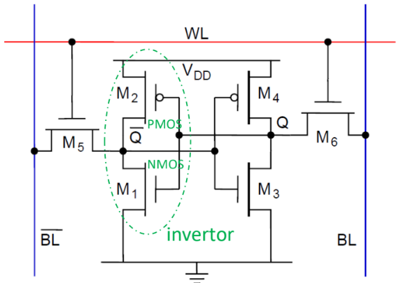

    </div>

    <div class="center">

    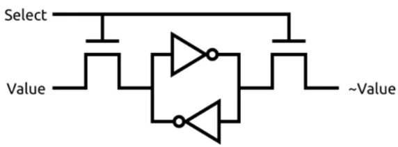

    </div>

  - Best for implementing cache as cache needs fast memory.

- **Dynamic RAM (DRAM)**

  - Small, 1-3 transistors per cell. (Less transistors doesn’t imply simpler interface design!)

  - Slower, optimised for density/higher capacity.

  - Requires periodic refresh (because of capacitor), higher power consumption.

    <div class="center">

    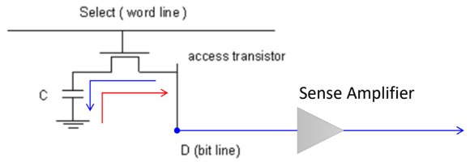

    </div>

  - DRAM cell contains 1 transistor & 1 capacitor.

    - Store logic ’1’ (blue): enable transistor, transfer charge into capacitor.

    - Store logic ’0’ (red): enable transistor, discharge capacitor.

    - Read: enable transistor, measure capacitor charge using sense amplifier.

  - Reading process destroys data, so the original data has to be written back after every read.

  - Periodic refresh is needed as the charges leak over time.

  - Modern version of DRAM is SynchronousDRAM (SDRAM)

    - uses clock signal from host to synchronise data transfer.

    - employs pipeline architecture that allows faster, overlapping operations.

## Non-volatile

Data is retained even if electric power is removed. Used as storage memory.\
**Floating Gate Transistor (FGT)**\

<div class="center">

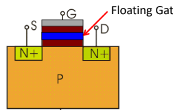

</div>

<div class="center">

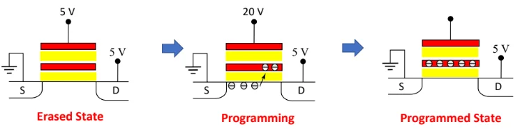

</div>

- To program the FGT, a large +ve voltage is applied to the gate.

- Some electrons tunnel through the oxide and embed into the floating gate.

- In the programmed state, the excess electrons in the floating gate will continue to be trapped there even if the power is removed.

<div class="center">

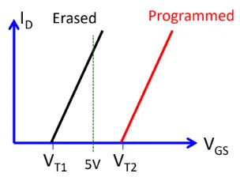

</div>

- FGT becomes conductive when gate voltage (V$`_{\text{GS}}`$) above the threshold voltage (V$`_{\text{T}}`$).

- In the programmed state, the excess -trons in the floatg gate lower the voltage potential, so a larger voltage is needed to attract enough electrons to form the conductive layer.

- Hence we can perform these operations on FGT:

  - Read content: apply voltage between the two thresholds. If FGT ON, it is in erased state (bit ’1’). If OFF, it is programmed state (bit ’0’).

  - To write ’1’: erase the FGT (using UV light or electrically).

  - To write ’0’: program the FGT.

- In practice, after a flash is erased, it contains all ’1’s in memory. Programming stores ’0’s.

- To write data to a memory location and bits need to be changed, the whole block (multiple bytes) is erased to ’1’s, then programming sets some of the ’1’s to ’0’s.

**Erasable Programmable Read-Only Memory (EPROM) / Electrically Erasable PROM (EEPROM)**\
Implementation of the FGT.\

- EPROM requires UV light to erase the stored program. Legacy technology.

- EEPROM can be electrically erased.

- Compared to Flash, smaller page size (tens of bytes) and larger erase cycle endurance (can tolerate larger no. of erasures before failing).

- Higher cost per bit.

**Flash**\
Uses FGT technology.\

- Can be erased in larger blocks compared to EEPROM.

- Faster speed than EEPROM when performing write operations.

- Costs less per bit.

**NOR Flash**\
Used mainly as system memory.\
Has multiple Address and Data lines.

<div class="center">

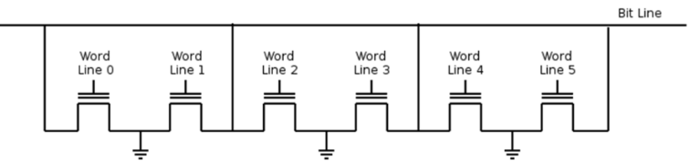

</div>

FGT cells are connected to resemble NOR gate logic.\
To read, the CPU sends voltage down the specific Word Line, and the transistor either turns ON or stays OFF, depending on erased or programmed state.

- If erased state, current flows from Bit Line into Ground, so the sense amplifier detects this as logic 1.

- If programmed state, no current flows from Bit Line, detected as Logic 0.

NOR flash supports XIP (execute-in-place): Code can be executed directly from flash memory without loading the code into RAM (main memory).

- This is possible as NOR flash allows random reading, i.e. can read data using only address information.

So we have the following operations for NOR flash:

- Reading: Very fast.

- Writing (programming): require the high voltages to program the FGTs, one byte at a time.

- Erasing: Done at block level.

**NAND Flash**\
Has only one I/O bus so all Commands, Addresses, Data has to go through this bus.\
Data is accessed a page at a time. Command used to open a particular page followed by the individual bytes read/write.

<div class="center">

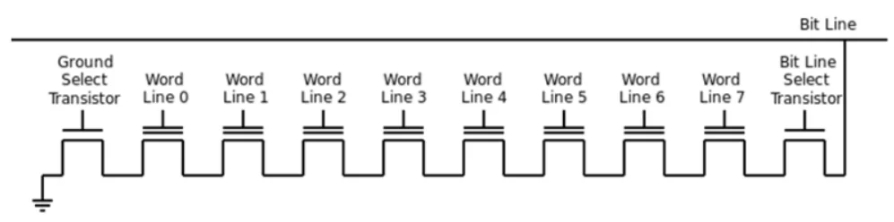

</div>

FGT cells are connected to resemble NAND gate logic.\
To read Word Line 3,

- the system first applies a huge voltage to the transistors we don’t want to read.

- This voltage is so high that it forces them to turn ON, regardless of what data they are holding.

- Then, it applies the normal "Read Voltage" to the specific transistor you do want to read (Word Line 3) to see if it turns on or stays off.

NAND does not support XIP. E.g. for read op,

- CPU first sends a Command telling the NAND flash what operation to be carried out.

- CPU then sends the address.

- The NAND chip reads an entire page. (page contains multiple bytes, block contains multiples pages).

Why use NAND flash? Less connecting wires, higher density, lower cost per bit, used for main storage like SSD, USB.\
**Hard Disk Drive (HDD)**

<div class="center">

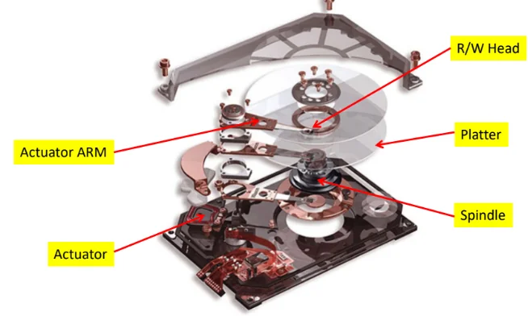

</div>

<div class="center">

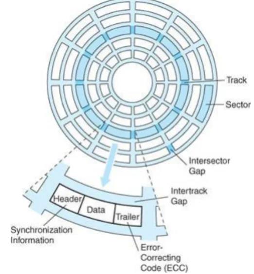

</div>

Platters rotate on the spindle. Each platter has two surfaces. Each surface is served by a R/W head.\
Data is stored on the platters, which is organised in concentric rings called **tracks** or **cylinders**.\
Tracks are divided into **sectors**, each containing header, data and trailer.

<div class="center">

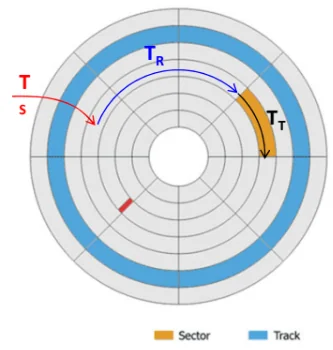

</div>

Note that the platter is always spinning.

- Define RPS = RPM / 60.

- Seek Time $`T_S`$: Time taken for RW head to swing such that it hovers over the specific Track.

- Rotational Delay $`T_R`$: Time taken for platter to spin until the target sector pass under the RW head.\
  On average,
  ``` math
  T_R = \frac{0.5}{RPS}s
  ```

- Access Time $`T_A`$: $`T_S`$ + $`T_R`$

- Transfer Time $`T_T`$: Time taken for the sector to sweep past the head, during which the RW head interacts with the magnetic fields of the magnetic domains to read/write.\
  Defining the track density $`D_T`$ (no. of sectors/track) and sector density $`D_S`$ (no. of bytes/sector), and the no. of bytes $`N`$ for the transfer, then
  ``` math
  T_T = \frac{N}{RPS\times D_T \times D_S}
  ```

- Usually, $`T_A \gg T_T`$, so if data is spread across different sectors in diff tracks, the effective HDD trf rate drops a lot. Defragmentation will bytes of a file in consecutive sectors.

- $`T_T=\frac{1}{RPS}`$ for one full track.

<div class="center">

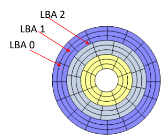

</div>

- Early HDD had equal no. of sectors per track, which wastes space as bit density of those sectors are not optimal.

- Logical layout used Cylinder-Head-Sector (CHS), but obselete now due to limitation in HDD capacity it can support.

- Modern HDD implements zone bit recording, where tracks are divided into zones, with differing no. of sectors per track for diff zones.

- Modern logical layout uses Logical Block Addressing (LBA): the first block in HDD has addr LBA0, next LBA1, so on. 48 bits allocated to specify this number.

**Solid state drive (SSD)**

<div class="center">

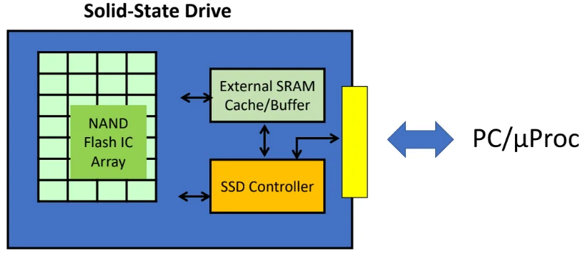

</div>

- Main storage element in SSD is NAND flash.

- Flash memory has limited program-erase cycles. Techniques to extend life of SSD:

  - Wear levelling: distributing data erase/write operations evenly over the entire disk.

  - Use external RAM as buffer to minimise the no. of writes to Flash.

  - Error correction code: ability to recover from one or more bits of error in media.

- The SSD controller is a microprocessor, which handles address translation b/w logical & physical layout, caching and buffering out of the SSD, and wear levelling algorithm.

- External SRAM and cache improve the trf rate for r/w ops.

**HDD vs SSD**:

- HDD has lower cost per bit and almost infinite erasure cycles.

- But HDD has many moving parts, vulnerable.

- SSD more expensive, but higher trf rate and smaller form factor than HDD.

- But SSD has limit on no. of erasure cycles. Some techniques to mitigate:

  - Wear levelling - extend life of SSD by distributing erase/write ops evenly over the entire disk.

  - use ext RAM as buffer to minimise no. or writes to flash in SSD.

- HDD is still the dominant storage in data centres, because there is huge cost difference.
