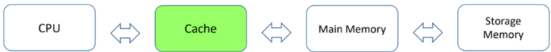
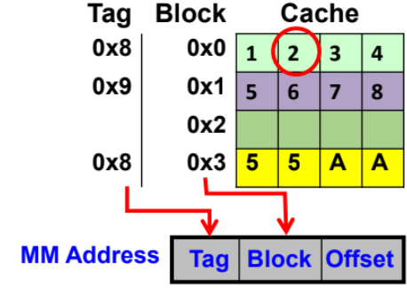
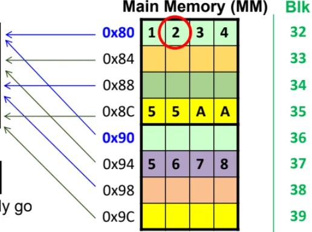

# Cache

Cache is a fast memory, act as buffer between CPU and MM.

- Best implemented with SRAM. DRAM is too slow and its trf procedure is too complex for cache ops. Flash is not suitable due to finite erase cycles and slower speed.

CPU first checks cache, then main memory and finally system memory.\
A subset of the code and data that is frequently used is stored in cache.\

## Principle of Locality

When a byte of code/data is accessed in a program, it is very likely that nearby code or data will be needed soon.

- Locality of space: code/data near each tgt likely to be accessed tgt, so transfers between cache and main memory happen in blocks.

- Locality of time: recently used code/data likely to be used again. Used when designing cache replacement policy.

## Direct mapped cache

<figure data-latex-placement="H">

</figure>

- Each main memory block can only go to 1 specific block in cache.

- The main memory address can be partitioned into TAG:BLK:OFFSET.

  - OFFSET = no. of bits needed to represent cache block size. 4 byte block size = 2 bits for OFFSET.

  - BLK = no. of bits to represent no. of cache blocks. 4 cache blocks = 2 bits for BLK.

  - TAG = the remaning no. of bits. The unique identifier for each MM block.

- Note that MM physical address is used as the basis.

- Data retrieval from cache:

  1.  Derive the block number from address.

  2.  Check the TAG associated with that block. If it matches the address we want to retrieve from, it is Cache Hit. Otherwise, it’s a Cache Miss.

      - If Cache Hit, CPU will retrieve the data and proceed.

      - If Cache Miss, the corresponding MM block will be trf into the block.

- DMC does not need cache replacement policy as the mapping is one-to-one. Some policies are Least Recently Used algorithm and FIFO approach.

- When the CPU writes to the cache (causing Dirty Blocks), it can either be Write Hit or Write Miss.

  - Write Hit: Can implement Write Through (update cache and MM simultaneously) or Write Back (update MM only when cache block selected for replacement).\
    Trade off between overloading system bus and cache coherency issue.

  - Write Miss: Can implement Write Allocate (corresponding MM block will be loaded into Cache, allowing future R/W) or Write-no-allocate (CPU just writes directly to MM block, and cache is not updated).

- Effective Access Time: With $`H`$ as the Cache Hit Rate, and assuming a sequential access of cache and MM, $`EAT = H \times \text{Access}_C + (1-H) \times (\text{Access}_C + \text{Access}_{MM})`$
