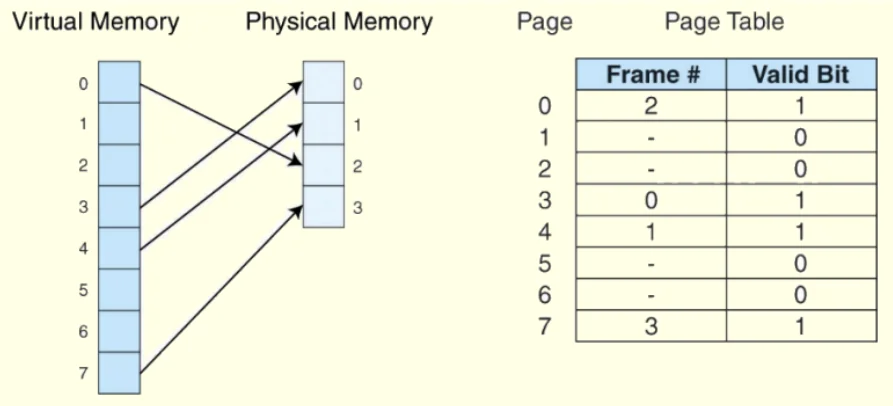
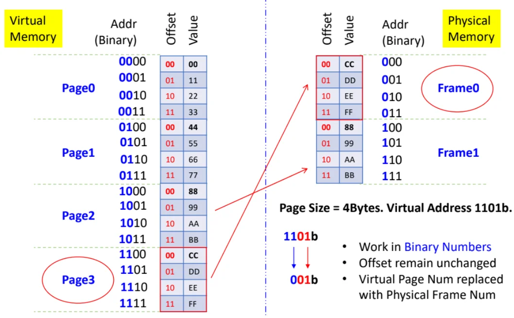
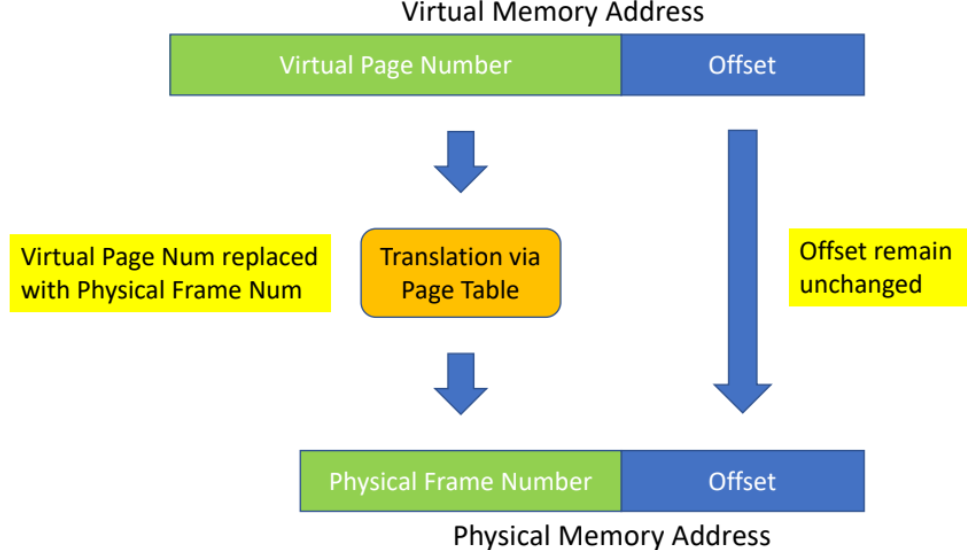
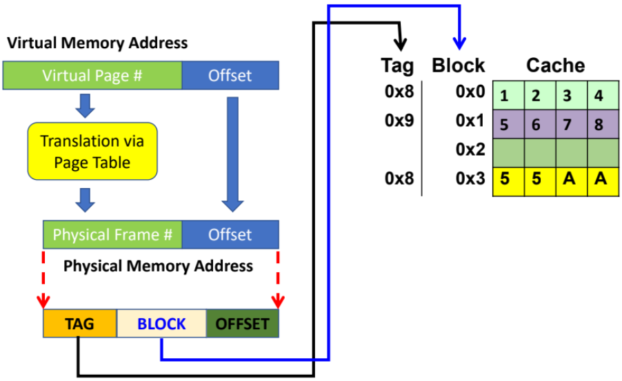
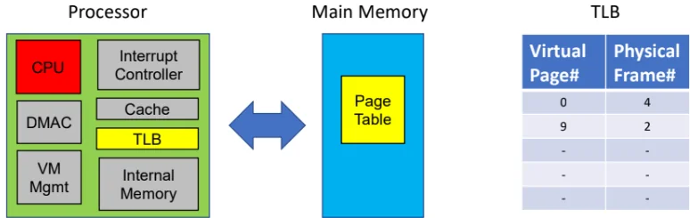

# Virtual Memory

Each program has its own Virtual Memory Space.\
The OS converts virtual memory to physical memory.\
Virtual Memory allows for

- More capacity - can run more applications at once than physical RAM can hold.

- Every program has its own virtual memory space, so programs cannot overwrite each other’s memory.

- Virtual addresses can seem contiguous when it is actually fragmented in physical memory.

## Paging with Page Table

- Virtual Memory space is partitioned into Pages.

- Physical memory partitioned into Frames.

- Pages are mapped to frames in a page table.

  

  

  

- In the page table, every page (virtual) has a row. If mapped to a frame, the frame no. will show, and the valid bit will be ’1’ if it is valid mapping.

  

  

  

  

  

  

- Virtual address partitioned into PAGE:OFFSET, physical mem partitioned into FRAME:OFFSET.

- The offsets within a page are unchanged when mapped to a frame. OFFSET can be calculated by page size or frame size.

- Then just replace the PAGE bits with FRAME bits from page table.

- Page Fault occurs when a page has no mapping to a frame in MM (valid bit = 0). The OS is triggered to load the data from storage mem to MM.

  

  

  

- If Cache uses physical memory, then virtual address need to be converted before checking cache.

- If Cache uses virtual memory, then CPU checks cache first. If cache hit, CPU retrieves data and proceeds. Else, OS has to translate to physical memory first addr before fetching the required data from main memory.

## TLB

- Translation Lookaside Buffer (TLB) is in the CPU, stores subset of the Page Table info. Functions like a cache to the Page table, if TLB hit rate is high, overall speed of address translation will increase.

- All entries in the TLB are valid.

  

  

  

