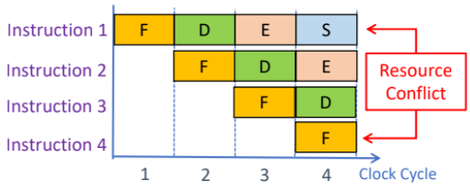
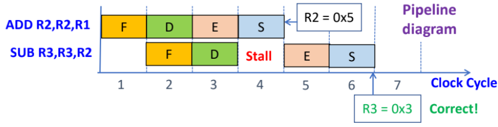
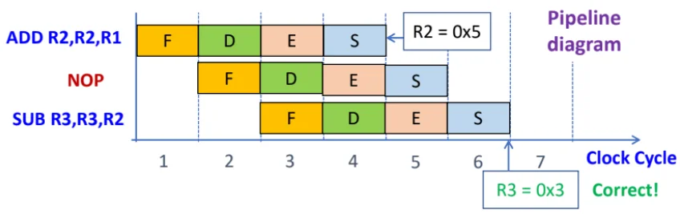
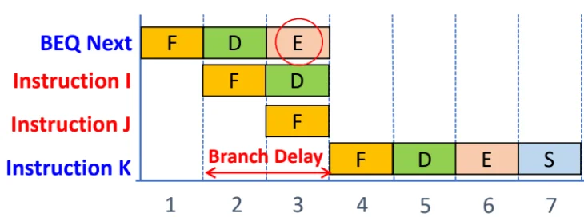
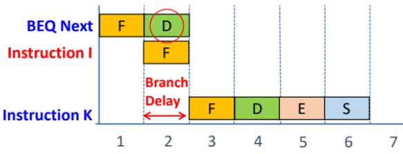
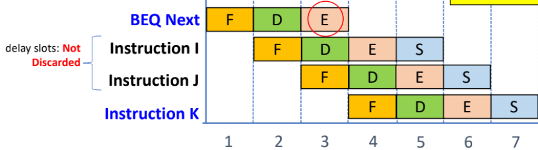
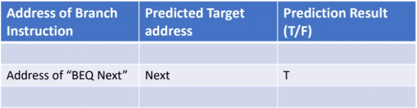

# Pipeline

**Pipelining**: partition an instruction into simpler stages (like Fetch-Decode-Execute) and assigning indep resources so these stages can execute simultaneously.\
E.g. Executing 3 instructions takes 5 clock cycles instead of 9.\

## Pipeline conflict

1.  **Resource conflict**: two instructions attempt to access the same resource in the same clock cycle.

    - E.g. F-D-E-S: Instruction1 wants to store data (using system bus) while instruct4 wants to fetch instruction (using the same system bus).

    - **Solution**: Have sufficient resources, like multiple internal buses, processing units like ALUs etc.

    

    

    

2.  **Data dependency conflict**: Instructions overlap & the destination operand of instruct1 may be the source operand of instruct2 $`\to`$ that operand may not be updated when instruct2 executes.

    - E.g. F-D-E-S: instruct1 (`ADD R2, R2, R1`), instruct2 (`SUB R3, R3, R2`); at the start of E for instruct2, R2 is not updated (only updated at end of S of instruct1).

    - **Solution 1**: Hardware detects data dependency (by comparing dest identifier in E stage with sources in the D stage), and stalls the E stage of subsequent instruction for one cycle (to allow the overlapped operand to be updated).

      <figure data-latex-placement="H">
      
      </figure>

    - **Solution 2**: Compiler inserts `NOP` (no operation) instructs betwen instruct with data dependencies, at compilation time. Total execution time increases.

      

      

      

3.  **Branch instruction**: The branch target is only known after E stage of branch instructions. By this time, the next 2 instructions would have been fetched (during the D and E stage of B instruct).

    - If the branch is true, the two instructs are discarded, resulting in 2-cycle branch delay, and the 2 slots are Delay Slots.

    - (Ignoring pipeline conflicts) Calculation of Total Cycles = Total Instructions + (Pipeline Depth - 1) + Wasted Cycles

      

      

      

    - **Solution 1**: Reduce branch delay - introduce an additional adder during D stage of B instruct, to calc the branch target earlier. If branch is true, only 1 instruct discarded, so 1-cycle branch delay.

      

      

      

    - **Solution 2**: Delayed branching - Change the program so that 2 independent instructions (earlier in sequence than the B instruct & don’t affect the branch conditions) to occupy the 2 delay slots after the B instruct.

      - These delay slots instructs will get executed regardless of the branch outcome, so no instructions are discarded.

      - If there are insufficient indep instructions, use NOP instructions to preserve the correctness of program logic.

      - If the branch is part of a loop, delay slot instructs must be sourced from within the loop to preserve correct number of iterations.

      

      

      

    - **Solution 3**: Dynamic branch prediction: Implement branch history table that stores (1) address of B instruct, (2) predicted target address, (3) Prediction result (T/F).

      - Processor loads instructions based on the prediction. If predict is correct, continue execution and no wasted cycles. If wrong, flush instructions, wasted cycles and update prediction bit and target address for future use.

      

      

      

