# Vectors

## 2-D, 3-D

Scalar: Only magnitude, notation: $`a, t, x, y`$

Vector: Magnitude & direction, notation: **f, x, v, w**

Vectors **v** = **w** if they have the same length & direction.\
Origin point does not matter.

<div class="center">

 

</div>

Vector addition: Parallelogram rule and Triangle rule give the same result.

<div class="center">

 

</div>

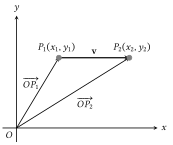

Vector subtraction. $`\mathbf{v} = \overrightarrow{P_1P_2} = \overrightarrow{P_1O} + \overrightarrow{OP_2} =
\overrightarrow{OP_2} - \overrightarrow{OP_1}`$

<div class="center">

 

</div>

Scalar multiple $`k`$**v** of the vector **v** is the same whether it is collinear or parallel.

<div class="center">

<div class="minipage">


$`\mathbf{v} = (v_1, v_2)`$ or $`\begin{bmatrix} v_1 \\ v_2 \end{bmatrix}`$

</div>

<div class="minipage">

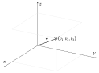

$`\mathbf{v} = (v_1, v_2, v_3)`$

</div>

</div>

Two vectors $`\mathbf{v}`$ = $`(v_1, v_2, v_3)`$, $`\mathbf{w}`$ = $`(w_1, w_2, w_3)`$ are equal iff $`v_1 = w_1, v_2 = w_2, v_3 = w_3`$.

## *n*-D space

Real line: $`\mathbb{R}^1`$

$`\mathbf{v} \in \mathbb{R}^2: \mathbf{v} = (v_1, v_2)`$

$`\mathbf{v} \in \mathbb{R}^3: \mathbf{v} = (v_1, v_2, v_3)`$

$`\mathbf{v} \in \mathbb{R}^n: \mathbf{v} = (v_1, v_2, \ldots, v_n)`$ (Set of all ordered *n*-tuples called *n*-D space).

Zero vector $`\mathbf{v} \in \mathbb{R}^n: \mathbf{v} = \mathbf{0} = (0, 0, \ldots, 0)`$

#### Definition

If $`\mathbf{v} = (v_1, v_2, \ldots, v_n)`$ and $`\mathbf{w} = (w_1, w_2, \ldots, w_n)`$ in $`\mathbb{R}^n`$, and for any scalar $`k`$, then

1.  $`\mathbf{v} + \mathbf{w} = (v_1 + w_1, v_2 + w_2, \ldots, v_n + w_n)`$

2.  $`k\mathbf{v} = (kv_1, kv_2, \ldots, kv_n)`$

3.  $`-\mathbf{v} = (-v_1, -v_2, \ldots, -v_n)`$

4.  $`\mathbf{w} - \mathbf{v} = \mathbf{w} + (-\mathbf{v})
        = (w_1 - v_1, w_2 - v_2, \ldots, w_n - v_n)`$

#### Theorem

If $`\mathbf{u}, \mathbf{v}`$ and $`\mathbf{w}`$ are vectors in $`\mathbb{R}^n`$, and if $`k`$ and $`m`$ are scalars, then

1.  $`\mathbf{u} + \mathbf{v} = \mathbf{v} + \mathbf{u}`$

2.  $`(\mathbf{u} + \mathbf{v}) + \mathbf{w} = \mathbf{u} + (\mathbf{v} + \mathbf{w})`$

3.  $`\mathbf{u} + 0 = 0 + \mathbf{u} = \mathbf{u}`$

4.  $`\mathbf{u} + (-\mathbf{u}) = 0`$

5.  $`k(\mathbf{u} + \mathbf{v}) = k\mathbf{u} + k\mathbf{v}`$

6.  $`(k + m)\mathbf{u} = k\mathbf{u} + m\mathbf{u}`$

7.  $`k(m\mathbf{u}) = (km)\mathbf{u}`$

8.  $`1\mathbf{u} = \mathbf{u}`$

9.  $`0\mathbf{v} = 0`$

10. $`k0 = 0`$

11. $`-1\mathbf{v} = -\mathbf{v}`$

#### Linear combination

If $`\mathbf{w}`$ is a vector in $`\mathbb{R}^n`$, then $`\mathbf{w}`$ is a linear combination of vectors $`v_1, v_2,\ldots, v_n`$ in $`\mathbb{R}^n`$ if it can be expressed in the from
``` math
\mathbf{w} = k_1\mathbf{v_1} + k_2\mathbf{v_2} +\ldots + k_n\mathbf{v_n}
```
where $`k_1, k_2, \ldots, k_n`$ are scalars and the coefficients of the linear combination.

## Norm, Dot Product and Distance in $`\mathbb{R}^n`$

<div class="center">

<div class="minipage">

<div class="minipage">


</div>

<div class="minipage">

``` math
\|\mathbf{v}\| = \sqrt{v_1^2 + v_2^2}
```

</div>

</div>

</div>

For a vector $`\mathbf{v} = (v_1, v_2,\ldots, v_n)`$ in $`\mathbb{R}^n`$, the norm/length/magnitude of $`\mathbf{v}`$ is
``` math
\|\mathbf{v}\| = \sqrt{v_1^2 + v_2^2 + \dots + v_n^2}
```

#### Norm of a vector

For vectors $`\mathbf{v}`$, $`\mathbf{w}`$ in $`\mathbb{R}^n`$ and a scalar $`k`$,

1.  $`\|\mathbf{v}\| \geq 0`$

2.  $`\|\mathbf{v}\| = 0 \iff \mathbf{v} = 0`$

3.  $`\|k\mathbf{v}\| = |k|\|\mathbf{v}\|`$

4.  $`\|\mathbf{v} + \mathbf{w}\| \leq \|\mathbf{v}\| + \|\mathbf{w}\|`$

#### Unit vector

For $`\mathbf{v}`$ a nonzero vector in $`\mathbb{R}^n`$, by normalising $`\mathbf{v}`$ we get a unit vector $`\mathbf{u}`$, with the same direction as $`\mathbf{v}`$, defined as
``` math
\mathbf{u} = \frac{1}{\|\mathbf{v}\|}\mathbf{v}
```

Standard unit vectors are unit vectors that point along the positive axes of the coordinate axes.

In $`\mathbb{R}^3`$, standard unit vectors are $`\mathbf{i} = (1, 0, 0)`$, $`\mathbf{j} = (0, 1, 0)`$, $`\mathbf{k} = (0, 0, 1)`$.

In $`\mathbb{R}^n`$, we have standard unit vectors

$`\mathbf{e}_1 = (1, 0, 0, \ldots, 0), \mathbf{e}_2 = (0, 1, 0, \ldots, 0), \mathbf{e}_3 = (0, 0, \ldots, 1)`$.

#### Distance in $`\mathbb{R}^n`$

For points $`\mathbf{u} = (u_1, u_2, \ldots, u_n)`$, $`\mathbf{v} = (v_1, v_2, \ldots, v_n)`$ in $`\mathbb{R}^n`$, the distance between $`\mathbf{u}`$ and $`\mathbf{v}`$ is
``` math
d(\mathbf{u}, \mathbf{v}) = \|\mathbf{u} - \mathbf{v}\|
= \sqrt{(u_1 - v_1)^2 + (u_2 - v_2)^2 + \ldots + (u_n - v_n)^2}
```

### Dot Product

For two vectors $`\mathbf{u}`$ and $`\mathbf{v}`$ in $`\mathbb{R}^n`$, their dot product (in geometric form) is
``` math
\mathbf{u} \cdot \mathbf{v} = \|\mathbf{u}\|\|\mathbf{v}\|\cos\theta
```

The component form of the dot product is
``` math
\mathbf{u} \cdot \mathbf{v} = u_1v_1 + u_2v_2 + \ldots + u_nv_n
```

Since $`\cos\theta = \frac{\mathbf{u} \cdot \mathbf{v}}{\|u\|\|v\|}`$,

- If $`\mathbf{u} \cdot \mathbf{v} > 0`$, $`0 \leq \theta < \frac{\pi}{2}`$

- If $`\mathbf{u} \cdot \mathbf{v} < 0`$, $`\frac{\pi}{2} < \theta \leq \pi`$

- If $`\mathbf{u} \cdot \mathbf{v} = 0`$, $`\theta = \frac{\pi}{2}`$

### Properties

$`\mathbf{v} \cdot \mathbf{v} = v_1^2 + v_2^2 + \ldots + v_n^2 = \|v\|^2`$

We can get length of a vector in terms of its dot product: $`\|v\| = \sqrt{\mathbf{v}\cdot\mathbf{v}}`$

For vectors $`\mathbf{u}`$, $`\mathbf{v}`$, $`\mathbf{w}`$ in $`\mathbb{R}^n`$ and $`k`$ a scalar,

1.  $`\mathbf{u} \cdot \mathbf{v} = \mathbf{v} \cdot \mathbf{u}`$ \[Symmetry\]

2.  $`\mathbf{u}(\mathbf{v} + \mathbf{w}) = \mathbf{u} \cdot \mathbf{v} + \mathbf{u} \cdot \mathbf{w}`$ \[Distributivity\]

3.  $`k(\mathbf{u} \cdot \mathbf{v}) = (k\mathbf{u})\cdot\mathbf{v}`$ \[Homogeneity\]

4.  $`\mathbf{v}\cdot\mathbf{v} \geq 0`$ and $`\mathbf{v}\cdot\mathbf{v} = 0 \iff \mathbf{v} = \mathbf{0}`$ \[Positivity\]

5.  $`\mathbf{0}\cdot\mathbf{v} = \mathbf{v}\cdot\mathbf{0} = 0`$

6.  $`(\mathbf{u} + \mathbf{v})\cdot\mathbf{w} = \mathbf{u}\cdot\mathbf{w} + \mathbf{v}\cdot\mathbf{w}`$

7.  $`\mathbf{u}\cdot(\mathbf{v} - \mathbf{w}) = \mathbf{u}\cdot\mathbf{v} - \mathbf{u}\cdot\mathbf{w}`$

8.  $`(\mathbf{u} - \mathbf{v}) \cdot \mathbf{w} = \mathbf{u} \cdot \mathbf{w} - \mathbf{v} \cdot \mathbf{w}`$

9.  $`k(\mathbf{u} \cdot \mathbf{v}) = \mathbf{u} \cdot (k\mathbf{v})`$

#### Cauchy-Schwarz Inequality

If $`\mathbf{u} = (u_1, u_2, \ldots, u_n)`$ and $`\mathbf{v} = (v_1, v_2, \ldots, v_n)`$ are vectors in $`\mathbb{R}^n`$, then
``` math
|\mathbf{u}\cdot\mathbf{v}| \leq \|\mathbf{u}\|\|\mathbf{v}\|
```
Hence, $`-1 \leq \frac{\mathbf{u}\cdot\mathbf{v}}{\|\mathbf{u}\|\mathbf{v}\|} \leq 1`$, and $`\theta`$ is always defined, where $`\theta = \arccos(\frac{\mathbf{u}\cdot\mathbf{v}}{\|\mathbf{u}\|\mathbf{v}\|})`$.

#### Triangle Inequality

For vectors $`\mathbf{u}`$, $`\mathbf{v}`$ and $`\mathbf{w}`$ in $`\mathbb{R}^n`$ and a scalar $`k`$,

1.  $`\|\mathbf{u} + \mathbf{v}\| \leq \|\mathbf{u}\| + \|\mathbf{v}\|`$ \[For vectors\]

2.  $`d(\mathbf{u}, \mathbf{v}) \leq d(\mathbf{u}, \mathbf{w}) + d(\mathbf{w}, \mathbf{v})`$ \[For distances\]

#### Orthogonality

Two nonzero vectors $`\mathbf{u}`$ and $`\mathbf{v}`$ in $`\mathbb{R}^n`$ are orthogonal if $`\mathbf{u}\cdot\mathbf{v} = 0`$. This means the two vectors are perpendicular to each other, from
``` math
\theta = \cos^{-1}\left(\frac{\mathbf{u}\cdot\mathbf{v}}{\|u\|\|v\|}\right)
```
A nonempty set of vectors in $`\mathbb{R}^n`$ is an orthogonal set if all pairs of distinct vectors in the set are orthogonal.

### Equations of lines and planes

<div class="minipage">

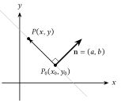

</div>

<div class="minipage">

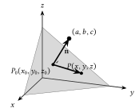

</div>

For **point-normal equations**, we need two things:

1.  Coordinates of a point on the line/plane, $`P_0`$.

2.  The normal from that point, $`\mathbf{n}`$, which is orthogonal to the line/plane.

We make use of the property $`\mathbf{n}\cdot\overrightarrow{P_0P} = 0`$, where $`P`$ is the variable point of the line/plane.

For a line (in $`\mathbb{R}^n`$):
``` math
\begin{align*}
\mathbf{n} \cdot \overrightarrow{P_0P} &= 0 \\
\overrightarrow{P_0P} &= (x - x_0, y - y_0) \\
\mathbf{n} &= (a, b) \\
a(x - x_0) + b(y - y_0) &= 0
\end{align*}
```

For a plane:
``` math
\begin{align*}
\mathbf{n} \cdot \overrightarrow{P_0P} &= 0 \\
\overrightarrow{P_0P} &= (x - x_0, y - y_0, z - z_0) \\
\mathbf{n} &= (a, b, c) \\
a(x - x_0) + b(y - y_0) + c(z - z_0) &= 0
\end{align*}
```

If $`ax + by + cz = 0`$, then the line/plane passes through the origin.\
Note that the coefficients of the line/plane are the normal vector values.

### Vector/Parametric Equations

<div class="minipage">

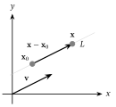

</div>

<div class="minipage">

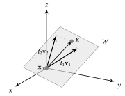

</div>

For a line containing point $`x_0`$ and parallel to vector $`\mathbf{v}`$, the vector form is
``` math
\mathbf{x} - \mathbf{x_0} = t\mathbf{v}
```
and the parametric form is
``` math
\begin{align*}
    x &= x_0 + ta \\
    y &= y_0 + tb \\
    z &= z_0 + tc
\end{align*}
```

For a vector containing point $`x_0`$ and parallel to noncollinear vectors $`v_1`$ and $`v_2`$, the vector form is
``` math
\mathbf{x} - \mathbf{x}_0 = t_1\mathbf{v}_1 + t_2\mathbf{v}_2
```
and the parametric form is
``` math
\begin{align*}
    x &= x_0 + t_1a_1 + t_2a_2 \\
    x &= y_0 + t_1b_1 + t_2b_2 \\
    x &= z_0 + t_1c_1 + t_2c_2
\end{align*}
```

If $`\mathbf{x}_0`$ is $`\mathbf{0}`$, then the line/plane passes through the origin.

# Matrices

## Notation

A square matrix, $`A`$, of order $`n`$ has $`n`$ columns and $`n`$ rows.

Then,
``` math
\text{trace } A = a_{11} + a_{22} + \ldots + a_{nn}
```

A diagonal matrix is a square matrix where all entries off the main diagonal are 0.

If $`A`$ is a diagonal matrix,
``` math
A = \begin{bmatrix}
    a_{11} & 0 & 0 & \cdots & 0 \\
    0 & a_{22} & 0 & \cdots & 0 \\
    0 & 0 & a_{33} & \cdots & 0 \\
    \vdots & \vdots & \vdots & \ddots & 0\\
    0 & 0 & 0 & 0 & a_{nn}
\end{bmatrix}
```

If $`A`$ is an identity/unit matrix,
``` math
A = \begin{bmatrix}
    1 & 0 & 0 & \cdots & 0 \\
    0 & 1 & 0 & \cdots & 0 \\
    0 & 0 & 1 & \cdots & 0 \\
    \vdots & \vdots & \vdots & \ddots & 0\\
    0 & 0 & 0 & 0 & 1
\end{bmatrix}
```

The transpose of an $`m\times n`$ matrix $`A`$ is an $`n\times m`$ matrix $`A^T`$.

$`(A^T)^T = A`$.
``` math
A = \begin{bmatrix}
a_{11} & a_{12} & \cdots & a_{1n} \\
a_{21} & a_{22} & \cdots & a_{2n} \\
\vdots & \vdots & \ddots & \vdots \\
a_{m1} & a_{m2} & \cdots & a_{mn}
\end{bmatrix}, \quad
A^T = \begin{bmatrix}
a_{11} & a_{21} & \cdots & a_{m1} \\
a_{12} & a_{22} & \cdots & a_{m2} \\
\vdots & \vdots & \ddots & \vdots \\
a_{1n} & a_{2n} & \cdots & a_{mn}
\end{bmatrix}
```

If $`A`$ is a symmetric matrix, then $`A^T = A`$, and $`a_{ij} = a_{ji}`$.
``` math
A = \begin{bmatrix}
1 & 7 & 3 \\
7 & 4 & 5 \\
3 & 5 & 2
\end{bmatrix}
```

If $`A`$ is a skew-symmetric matrix, then $`A^T = -A`$, and $`a_{ij} = -a_{ji}`$.

Diagonal elements must be zero, because each element must be its own negative.
``` math
A = \begin{bmatrix}
0 & 2 & -45 \\
-2 & 0 & -4 \\
45 & 4 & 0
\end{bmatrix}, \quad
A^\top = \begin{bmatrix}
0 & -2 & 45 \\
2 & 0 & 4 \\
-45 & -4 & 0
\end{bmatrix} = -A.
```

### Example

Let $`Y`$ be an arbitrary $`3\times3`$ non-zero skew-symmetric matrix and $`Z`$ be an arbitrary $`3\times3`$ non-zero symmetric matrix. Is $`Y^3Z^4-Z^4-Y^3`$ symmetric?

Note: $`A^k`$, where $`k`$ is a scalar, refers to $`A\times A \cdots A`$ for $`k`$ times.

If $`k=0`$, then $`A^0 = I`$, the identity matrix.

We have that

- $`Y^T = -Y`$

- $`Z^T = Z`$

First, we find the transpose of $`Y^3`$ and $`Z^4`$:
``` math
\begin{align*}
    (Y^3)^T &= (Y^T)^3 = (-Y)^3 = -Y^3 \\
    (Z^4)^T &= (Z^T)^4 = Z^4
\end{align*}
```

Let $`A = Y^3Z^4 - Z^4Y^3`$. We calculate $`A^T`$:
``` math
\begin{align*}
    A^T &= (Y^3Z^4 - Z^4Y^3)^T \\
    &= (Y^3Z^4)^T - (Z^4Y^3)^T \tag{Distributive property} \\
    &= (Z^4)^T (Y^3)^T - (Y^3)^T (Z^4)^T \tag{Reversal law} \\
    &= (Z^4)(-Y^3) - (-Y^3)(Z^4) \tag{Substitution} \\
    &= -Z^4Y^3 + Y^3Z^4 \\
    &= Y^3Z^4 - Z^4Y^3 \\
    &= A
\end{align*}
```

Since $`A^T = A`$, the matrix is symmetric.

## Operations

Define $`m\times n`$ matrices $`A = [a_{ij}], B=[b_{ij}], C=[c_{ij}]`$.

For two matrices $`A`$ and $`B`$ to be **equal**,

1.  $`A`$ and $`B`$ are of same size, $`m\times n`$

2.  $`a_{ij} = b_{ij}`$ for $`1\leq i\leq m`$ and $`1\leq j\leq n`$

**Addition and subtraction** of matrices require matrices of similar sizes and are calculated entrywise.

i.e. For $`C=A+B`$, $`c_{ij} = a_{ij} + b_{ij}`$.

**Scalar multiplication** multiplies each entry by a scalar $`s`$.

i.e. For $`C=sA`$, $`c_{ij} = s\cdot a_{ij}`$.

Basic properties:

- $`A + B = B + A`$

- $`A + (B + C) = (A + B) + C = A + B + C`$

- $`(s + q)A = sA + qA`$

- $`q(sA) = (qs)A`$

- $`s(A + B) = sA + sB`$

- $`(A + B)^T = A^T + B^T`$ and $`(sA)^T = sA^T`$

### Matrix Multiplication

If $`A`$ is an $`m\times n`$ matrix and $`B`$ is an $`n\times p`$ matrix, then the product $`C = AB`$ is an $`m\times p`$ matrix.
``` math
c_{ij} = a_{i1}b_{1j} + a_{i1}b_{1j} +\ldots + a_{in}b_{nj} = \sum_{k=1}^{n}a_{ik}b_{kj}
```

<figure id="fig:dot_product_method" data-latex-placement="H">
<figure>
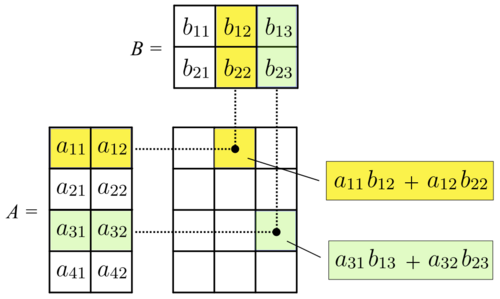
<figcaption>Visualisation of matrix multiplication</figcaption>
</figure>
<figure>
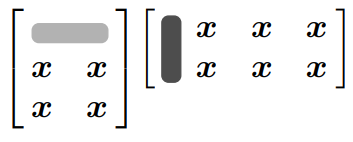
<figcaption>(Row <span class="math inline"><em>i</em></span> of A)<span class="math inline">⋅</span>(Column <span class="math inline"><em>k</em></span> of B) = Each number <span class="math inline"><em>c</em><sub><em>i</em><em>k</em></sub></span> in <span class="math inline"><em>A</em><em>B</em></span></figcaption>
</figure>
<figcaption>Dot Product method</figcaption>
</figure>

Properties:

- $`AB\neq BA`$\
  If $`A`$ is $`m\times n`$ matrix and $`B`$ is $`p\times q`$ matrix, then only if $`m=n=p=q`$ are both products $`AB`$ and $`BA`$ defined and of the same size. Even then, $`AB \neq BA`$ in general.

- $`AB=0 \nRightarrow A=0 \lor B=0`$

- $`(kA)B = k(AB) = A(kB)`$

- $`A(BC) = (AB)C`$

- $`(A + B)C = AC + BC`$

- $`A(B + C) = AB + AC`$

- $`I_m A = AI_n = A`$ where $`I_m`$ is an $`m \times m`$ Identity Matrix

- $`(AB)^T = B^T A^T`$

More properties involving vectors:

- $`\mathbf{u}\cdot\mathbf{v} = \mathbf{u}^T\mathbf{v} = \mathbf{v}^T\mathbf{u}`$

- $`A\mathbf{u}\cdot\mathbf{v} = \mathbf{u}\cdot A\mathbf{v}`$

- $`\mathbf{u}\cdot A\mathbf{v} = A^T\mathbf{u}\cdot\mathbf{v}`$

Matrix Multiplication by columns
``` math
AB = A\begin{bmatrix}
    \bm{b}_1 & \bm{b}_2 & \cdots & \bm{b}_p
\end{bmatrix}
= \begin{bmatrix}
    A\bm{b}_1 & A\bm{b}_2 & \cdots & A\bm{b}_p
\end{bmatrix}
```

<figure id="fig:matrix_multiplication by columns" data-latex-placement="htbp">
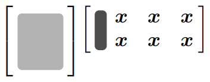
<figcaption><span class="math inline"><em>A</em>⋅</span>(Column <span class="math inline"><em>k</em></span> of B) = Column <span class="math inline"><em>k</em></span> of <span class="math inline"><em>A</em><em>B</em></span></figcaption>
</figure>

Matrix Multiplication by rows
``` math
AB = \begin{bmatrix}
\bm{a}_1 \\
\bm{a}_2 \\
\vdots \\
\bm{a}_m
\end{bmatrix} B = \begin{bmatrix}
\bm{a}_1 B \\
\bm{a}_2 B \\
\vdots \\
\bm{a}_m B
\end{bmatrix}
```

<figure id="fig:matrix_multiplication by rows" data-latex-placement="H">
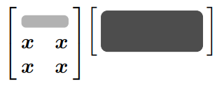
<figcaption>(Row <span class="math inline"><em>i</em></span> of A)<span class="math inline">⋅<em>B</em></span> = Row <span class="math inline"><em>i</em></span> of <span class="math inline"><em>A</em><em>B</em></span></figcaption>
</figure>

Matrix multiplication as linear combination

<figure id="fig:matrix_multiplication" data-latex-placement="H">
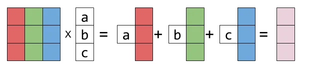
<figcaption>Linear combination of column vectors of <span class="math inline"><em>A</em></span>, where the coefficients are elements of the single column vector.</figcaption>
</figure>

Example:

Let $`A = \begin{bmatrix}
    1 & 2 \\
    3 & 4
\end{bmatrix}`$ and $`B = \begin{bmatrix}
    5 & 6 \\
    7 & 8
\end{bmatrix}`$

Method 1: Multiply $`A`$ with each column in $`B`$, producing a column of $`AB`$.

``` math
A\bm{b}_1 = 
\begin{bmatrix} 1 & 2 \\ 3 & 4 \end{bmatrix} 
\begin{bmatrix} 5 \\ 7 \end{bmatrix} = 
\begin{bmatrix} \text{row } 1 \cdot \bm{b}_1 \\ \text{row } 2 \cdot \bm{b}_1 \end{bmatrix} = 
\begin{bmatrix} 1 \cdot 5 + 2 \cdot 7 \\ 3 \cdot 5 + 4 \cdot 7 \end{bmatrix} = 
\begin{bmatrix} 19 \\ 43 \end{bmatrix}
```

``` math
A\bm{b}_2 = 
\begin{bmatrix} 1 & 2 \\ 3 & 4 \end{bmatrix} 
\begin{bmatrix} 6 \\ 8 \end{bmatrix} = 
\begin{bmatrix} \text{row } 1 \cdot \bm{b}_2 \\ \text{row } 2 \cdot \bm{b}_2 \end{bmatrix} = 
\begin{bmatrix} 1 \cdot 6 + 2 \cdot 8 \\ 3 \cdot 6 + 4 \cdot 8 \end{bmatrix} = 
\begin{bmatrix} 22 \\ 50 \end{bmatrix}
```

``` math
AB = \begin{bmatrix}
19 & 22 \\
43 & 50
\end{bmatrix}
```

Method 2: Multiple each row in $`A`$ with $`B`$, producing a row of $`AB`$.
``` math
\bm{a}_1B = 
\begin{bmatrix} 1 & 2 \end{bmatrix} \begin{bmatrix} 5 & 6 \\ 7 & 8 \end{bmatrix} = 
\begin{bmatrix} 1\cdot5 + 2\cdot7 & 1\cdot6 + 2\cdot8 \end{bmatrix} = 
\begin{bmatrix} 19 & 22 \end{bmatrix}
```
``` math
\bm{a}_2B = 
\begin{bmatrix} 3 & 4 \end{bmatrix} \begin{bmatrix} 5 & 6 \\ 7 & 8 \end{bmatrix} = 
\begin{bmatrix} 3\cdot5 + 4\cdot7 & 3\cdot6 + 4\cdot8 \end{bmatrix} = 
\begin{bmatrix} 43 & 50 \end{bmatrix}
```
``` math
AB = 
\begin{bmatrix} 19 & 22 \\ 43 & 50 \end{bmatrix}
```

Method 3: Each column $`i`$ of $`AB`$ as a linear combination of columns of $`A`$, with coefficients from corresponding column $`i`$ of $`B`$.
``` math
\begin{aligned}
\bm{c}_1 &= 5 \begin{bmatrix} 1 \\ 3 \end{bmatrix} + 7 \begin{bmatrix} 2 \\ 4 \end{bmatrix}
= \begin{bmatrix} 19 \\ 43 \end{bmatrix}
\end{aligned}
```
``` math
\begin{aligned}
\bm{c}_2 &= 6 \begin{bmatrix} 1 \\ 3 \end{bmatrix} + 8 \begin{bmatrix} 2 \\ 4 \end{bmatrix}
= \begin{bmatrix} 22 \\ 50 \end{bmatrix}
\end{aligned}
```

### Example

If the order of $`A`$ is $`4\times3`$, $`B`$ is $`4\times5`$ and $`C`$ is $`7\times3`$, then what is the order of $`(A^TB)^TC^T`$?

``` math
\begin{align*}
    (A^T B)^T C^T &= (B^T (A^T)^T) C^T \\
    &= B^T A C^T \\
    &= (5 \times 4 \cdot 4 \times 3) \times (3 \times 7) \\
    &= (5 \times 3) \times (3 \times 7) \\
    &= \mathbf{5 \times 7}
\end{align*}
```

### Inverse of a matrix

An $`n\times n`$ square matrix $`A`$ is invertible if $`\exists`$ an $`n\times n`$ square matrix $`B`$ s.t.
``` math
AB = BA = I_n
```
where $`I_n`$ is the $`n\times n`$ identity matrix.

For a $`2\times2`$ square matrix $`\begin{bmatrix}
    a & b \\ c & d
\end{bmatrix}`$, it is invertible if and only if
``` math
\det(A) = |A| = ad - bc \neq 0
```
and the inverse of A is denoted by
``` math
A^{-1} = \frac{1}{ad-bc}\begin{bmatrix}
    d & -b \\ -c & a
\end{bmatrix}
```

If $`\det(A) = 0`$, then $`A`$ is singular and is non-invertible.

If $`A`$ and $`B`$ are invertible matrices of the same size, then $`AB`$ is invertible, and
``` math
(AB)^{-1} = B^{-1}A^{-1}
```

If $`A`$ is invertible, then $`A^T`$ is invertible, and
``` math
(A^T)^{-1} = (A^{-1})^T
```
