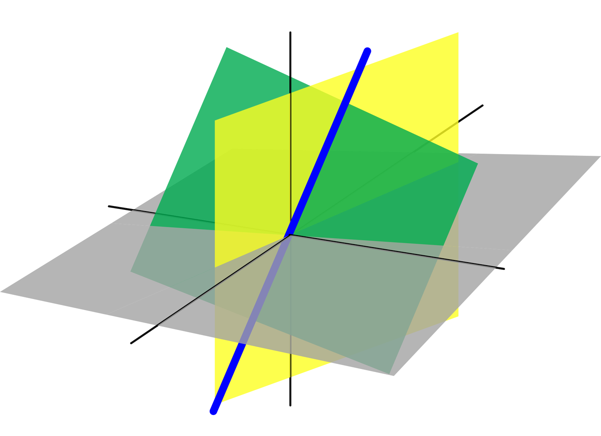

# System of Linear Equations

## Linear Equations

A linear equation in $`n`$ variables is
``` math
a_1x_1 + a_2x_2 + \cdots + a_nx_n = b
```
The coefficients $`a_1,\ldots,a_n`$ cannot all be 0, and variables $`x_1,\ldots,x_n`$ are raised only to the first power.

A linear system consisting of $`m`$ linear equations in $`n`$ variables $`x_1, x_2, \cdots, x_n`$, is represented as
``` math
\begin{alignat*}
{4}
    a_{11}x_1 &+ a_{12}x_2 &+ \cdots &+ a_{1n}x_n &&= b_1 \\
    a_{21}x_1 &+ a_{22}x_2 &+ \cdots &+ a_{2n}x_n &&= b_2 \\
    \vdots    & \quad &         & \quad \vdots && \quad \vdots \\
    a_{m1}x_1 &+ a_{m2}x_2 &+ \cdots &+ a_{mn}x_n &&= b_m
\end{alignat*}
```

The solution of a linear system in $`n`$ unknowns is a sequence of $`n`$ numbers $`s_1, s_2,\ldots,s_n`$.

Any system of linear equations behave in one of these ways:

1.  The system has no solution

2.  The system has a unique solution

3.  The system has infintely many solutions

If the linear system has at least one solution, it is **consistent**.

## Homogenous Linear System

If $`b_1=b_2=\ldots=b_n=0`$, it is a homogenous linear system. Every homogenous system has at least one solution, known as the trivial solution,
``` math
x_1 = x_2 = \ldots = x_n = 0
```
Hence, every homogenous system is consistent, and

1.  has only the trivial solution, or

2.  has infintely many solutions in addition to the trivial solution

## Representation as Matrix

Consider a linear system of two equations:
``` math
\begin{align*}
    5x + y &= 3 \\
    2x - y &= 4
\end{align*}
```

Coefficient matrix: $`\begin{bmatrix} 
    5 & 1 \\ 
    2 & -1 
\end{bmatrix}`$

Augmented matrix: $`\begin{bmatrix} 
    5 & 1 & 3 \\ 
    2 & -1 & 4 
\end{bmatrix}`$

## The two fundamental questions about any linear system

1.  Is the system consistent?

2.  If a solution exists, is it unique?

The following concepts are tools to answer these questions.

## Row Echelon and Reduced Row Echelon Form

Row equivalent matrices can be transformed to each other by one of these elementary row operations:

1.  **Swap**: Swapping two rows

2.  **Scale**: Multiply a row by a non-zero constant

3.  **Pivot**: Add a multiple of one row to another row

### Row Echelon Form

Properties:

1.  All rows having only zero entries are at the bottom.

2.  The leftmost non-zero entry (i.e. leading entry) of every non-zero row (i.e. the pivot) is to the right of the leading entry of every row above.

A matrix can have multiple REF forms, depending on the steps taken. Matrix in row echelon form (and not in reduced row echelon form):
``` math
\begin{bmatrix}
    1 & a_0 & a_1 & a_2 & a_3 \\
    0 & 0   & 2   & a_4 & a_5 \\
    0 & 0   & 0   & 1   & a_6 \\
    0 & 0   & 0   & 0   & 0
\end{bmatrix}
```

### Reduced Row Echelon Form

Properties:

1.  The matrix is in row echelon form.

2.  The leading entry (or pivot) of every non-zero row is 1.

3.  Every column containing a leading 1 has zeroes in its other entries.

Every matrix has a unique RREF matrix, regardless of the steps taken.

Example matrix in reduced row echelon form:
``` math
\begin{bmatrix}
    1 & 0 & 0 & a_1 & a_2 \\
    0 & 1 & 0 & a_3 & a_4 \\
    0 & 0 & 1 & a_5 & a_6 \\
    0 & 0 & 0 & 0   & 0
\end{bmatrix}
```

### Gaussian and Gauss-Jordan elimination

Consider this linear of system equations:
``` math
\begin{alignat*}
{4}
     2x &+  y &&-  z &&= &  8 \\
    -3x &-  y &&+ 2z &&= &-11 \\
    -2x &+  y &&+ 2z &&= &-3
\end{alignat*}
```

<div class="table-wrap">

| **Row operations** | **Augmented matrix** |
|:---|:---|
|  | $`\left[
    \begin{array}{ccc|c}
         2 &  1 & -1 &   8 \\
        -3 & -1 &  2 & -11 \\
        -2 &  1 &  2 &  -3
    \end{array}
    \right]`$ |
| $`\begin{aligned}
        L_2 + \tfrac{3}{2}L_1 &\rightarrow L_2 \\
        L_3 + L_1 &\rightarrow L_3
    \end{aligned}`$ | $`\left[
    \begin{array}{ccc|c}
        2 & 1 & -1 & 8 \\
        0 & \tfrac{1}{2} & \tfrac{1}{2} & 1 \\
        0 & 2 & 1 & 5
    \end{array}
    \right]`$ |
| $`L_3 + -4L_2 \rightarrow L_3`$ | $`\left[
    \begin{array}{ccc|c}
        2 & 1 & -1 & 8 \\
        0 & \frac{1}{2} & \frac{1}{2} & 1 \\
        0 & 0 & -1 & 1
    \end{array}
    \right]`$ |

</div>

We obtain the the row echelon form using Gaussian elimination. Note that top-down approach uses the rows above to introduce zeroes below the pivots.

This is also the forward phase of Gauss-Jordan elimination.

<div class="table-wrap">

| **Row operations** | **Augmented matrix** |
|:---|:---|
| $`\begin{aligned}
        L_1 - L_3 &\rightarrow L_1 \\
        L_2 + \frac{1}{2}L_3 &\rightarrow L_2
    \end{aligned}`$ | $`\left[
    \begin{array}{ccc|c}
         2 &  1 &  0 &  7 \\
         0 & \frac{1}{2} &  0 & \frac{3}{2} \\
         0 &  0 & -1 &  1
    \end{array}
    \right]`$ |
| $`\begin{aligned}
        2L_2 &\rightarrow L_2 \\
        -L_3 &\rightarrow L_3
    \end{aligned}`$ | $`\left[
    \begin{array}{ccc|c}
        2 & 1 & 0 & 7 \\
        0 & 1 & 0 & 3 \\
        0 & 0 & 1 & -1
    \end{array}
    \right]`$ |
| $`\begin{aligned}
        L_1 - L_2 &\rightarrow L_1 \\
        \frac{1}{2}L_1 &\rightarrow L_1
    \end{aligned}`$ | $`\left[
    \begin{array}{ccc|c}
        1 & 0 & 0 & 2 \\
        0 & 1 & 0 & 3 \\
        0 & 0 & 1 & -1
    \end{array}
    \right]`$ |

</div>

We obtain the RREF using Gauss-Jordan elimination. Note that bottom-up approach uses the rows below to introduce zeroes above pivots, and to transform the pivots to 1.

This is the backward phase of Gauss-Jordan elimination.

Note that of the EROs, only Scale and Pivot were used.

## Answering the fundamental questions

Using row reduction to solve a linear system:

1.  Write the augmented matrix of the linear system.

2.  Use row reduction algorithms to obtain row echelon form of the augmented matrix. Here we can decide if the system in consistent. If it is, go to the next step.

3.  Continue row reduction algorithm to obtain reduced row echelon form.

4.  Write the system of equations corresponding to this matrix.

5.  Rewrite each nonzero equation so that the leading variable is expressed in terms of any free variables.

### Example (Not consistent system)

Determine if this linear system is consistent:
``` math
\begin{alignat*}
{4}
       &      &      x_2 & {}-{} &  4x_3 &= 8 \\
  2x_1 & {}-{} &  3x_2 & {}+{} &  2x_3 &= 1 \\
  4x_1 & {}-{} &  8x_2 & {}+{} & 12x_3 &= 1
\end{alignat*}
```

<div class="table-wrap">

| **Row operations**             | **Augmented matrix**        |
|:-------------------------------|:----------------------------|
| *Initial Matrix*               | $`\left[                    
                                      \begin{array}{ccc|c}     
                                          0 &  1 & -4 & 8 \\   
                                          2 & -3 &  2 & 1 \\   
                                          4 & -8 & 12 & 1      
                                      \end{array}              
                                      \right]`$                |
| $`R_1 \leftrightarrow R_2`$    | $`\left[                    
                                      \begin{array}{ccc|c}     
                                          2 & -3 &  2 & 1 \\   
                                          0 &  1 & -4 & 8 \\   
                                          4 & -8 & 12 & 1      
                                      \end{array}              
                                      \right]`$                |
| $`R_3 - 2R_1 \rightarrow R_3`$ | $`\left[                    
                                      \begin{array}{ccc|c}     
                                          2 & -3 &  2 &  1 \\  
                                          0 &  1 & -4 &  8 \\  
                                          0 & -2 &  8 & -1     
                                      \end{array}              
                                      \right]`$                |
| $`R_3 + 2R_2 \rightarrow R_3`$ | $`\left[                    
                                      \begin{array}{ccc|c}     
                                          2 & -3 &  2 &  1 \\  
                                          0 &  1 & -4 &  8 \\  
                                          0 &  0 &  0 & 15     
                                      \end{array}              
                                      \right]`$                |

</div>

The last equation is
``` math
0x_1 + 0x_2 + 0x_3 = 15
```
i.e. $`0=15`$. Therefore the system is inconsistent.

### Example (Consistent system, infinite solution)

Determine the solution to this linear system:
``` math
\begin{alignat*}
{7}
    x_1  & {}+{} & 3x_2 & {}-{} & 2x_3 &       &       & {}+{} & 2x_5 &       &        &= 0 \\
   2x_1  & {}+{} & 6x_2 & {}-{} & 5x_3 & {}-{} &  2x_4 & {}+{} & 4x_5 & {}-{} &  3x_6  &= -1 \\
         &       &      &       & 5x_3 & {}+{} & 10x_4 &       &      & {}+{} & 15x_6  &= 5 \\
   2x_1  & {}+{} & 6x_2 &       &      & {}+{} &  8x_4 & {}+{} & 4x_5 & {}+{} & 18x_6  &= 6
\end{alignat*}
```

<div class="table-wrap">

| **Row operations** | **Augmented matrix** |
|:---|:---|
| *Initial System* | $`\left[
    \begin{array}{cccccc|c}
        1 & 3 & -2 & 0 & 2 & 0 & 0 \\
        2 & 6 & -5 & -2 & 4 & -3 & -1 \\
        0 & 0 & 5 & 10 & 0 & 15 & 5 \\
        2 & 6 & 0 & 8 & 4 & 18 & 6
    \end{array}
    \right]`$ |
| $`\begin{aligned}
        R_2 - 2R_1 &\rightarrow R_2 \\
        R_4 - 2R_1 &\rightarrow R_4
    \end{aligned}`$ | $`\left[
    \begin{array}{cccccc|c}
        1 & 3 & -2 & 0 & 2 & 0 & 0 \\
        0 & 0 & -1 & -2 & 0 & -3 & -1 \\
        0 & 0 & 5 & 10 & 0 & 15 & 5 \\
        0 & 0 & 4 & 8 & 0 & 18 & 6
    \end{array}
    \right]`$ |
| $`-R_2 \rightarrow R_2`$ | $`\left[
    \begin{array}{cccccc|c}
        1 & 3 & -2 & 0 & 2 & 0 & 0 \\
        0 & 0 & 1 & 2 & 0 & 3 & 1 \\
        0 & 0 & 5 & 10 & 0 & 15 & 5 \\
        0 & 0 & 4 & 8 & 0 & 18 & 6
    \end{array}
    \right]`$ |
| $`\begin{aligned}
        R_3 - 5R_2 &\rightarrow R_3 \\
        R_4 - 4R_2 &\rightarrow R_4
    \end{aligned}`$ | $`\left[
    \begin{array}{cccccc|c}
        1 & 3 & -2 & 0 & 2 & 0 & 0 \\
        0 & 0 & 1 & 2 & 0 & 3 & 1 \\
        0 & 0 & 0 & 0 & 0 & 0 & 0 \\
        0 & 0 & 0 & 0 & 0 & 6 & 2
    \end{array}
    \right]`$ |
| $`\begin{aligned}
        R_3 &\leftrightarrow R_4 \\
        \tfrac{1}{6}R_3 &\rightarrow R_3
    \end{aligned}`$ | $`\left[
    \begin{array}{cccccc|c}
        1 & 3 & -2 & 0 & 2 & 0 & 0 \\
        0 & 0 & 1 & 2 & 0 & 3 & 1 \\
        0 & 0 & 0 & 0 & 0 & 1 & \frac{1}{3} \\
        0 & 0 & 0 & 0 & 0 & 0 & 0
    \end{array}
    \right]`$ |
|  | *Note: Matrix is now in Row Echelon Form (REF)* |
| $`R_2 - 3R_3 \rightarrow R_2`$ | $`\left[
    \begin{array}{cccccc|c}
        1 & 3 & -2 & 0 & 2 & 0 & 0 \\
        0 & 0 & 1 & 2 & 0 & 0 & 0 \\
        0 & 0 & 0 & 0 & 0 & 1 & \frac{1}{3} \\
        0 & 0 & 0 & 0 & 0 & 0 & 0
    \end{array}
    \right]`$ |
| $`R_1 + 2R_2 \rightarrow R_1`$ | $`\left[
    \begin{array}{cccccc|c}
        1 & 3 & 0 & 4 & 2 & 0 & 0 \\
        0 & 0 & 1 & 2 & 0 & 0 & 0 \\
        0 & 0 & 0 & 0 & 0 & 1 & \frac{1}{3} \\
        0 & 0 & 0 & 0 & 0 & 0 & 0
    \end{array}
    \right]`$ |
|  | *Note: Matrix is now in Reduced Row Echelon Form (RREF)* |

</div>

We first note that the system is consistent.

Also, not every variable column has a pivot (in either REF or RREF). Hence, the system has infinitely many solutions.

From the RREF, we obtain this system of equations:
``` math
\begin{align*}
    x_1 + 3x_2 + 4x_4 + 2x_5 &= 0 \\
    x_3 + 2x_4 &= 0 \\
    x_6 &= \frac{1}{3}
\end{align*}
```

Solving for the leading variables in terms of the free variables,
``` math
\begin{align*}
    x_1 &= -3x_2 - 4x_4 - 2x_5 \\
    x_3 &= -2x_4 \\
    x_6 &= \frac{1}{3}
\end{align*}
```

The general solution is expressed parametrically,
``` math
\begin{align*}
    x_1 &= -3r - 4s - 2t \\
    x_2 &= r \\
    x_3 &= -2s \\
    x_4 &= s \\
    x_5 &= t \\
    x_6 &= \frac{1}{3}
\end{align*}
```

**Alternative**: Gaussian elimination with back-substitution for larger linear systems (instead of Gauss-Jordan elimination).

From the REF,
``` math
\begin{align*}
    x_1 + 3x_2 - 2x_3 + 2x_5 &= 0 \\
    x_3 + 2x_4 + 3x_6 &= 0 \\
    x_6 &= \frac{1}{3}
\end{align*}
```

Solving for the leading variables,
``` math
\begin{align*}
    x_1 &= -3x_2 + 2x_3 - 2x_5 \\
    x_3 &= 1 - 2x_4 - 3x_6 \\
    x_6 &= \frac{1}{3}
\end{align*}
```

Back-substitute the bottom equations into those above it:
``` math
\begin{align*}
    x_1 &= -3x_2 - 4x_4 - 2x_5 \\
    x_3 &= -2x_4 \\
    x_6 &= \frac{1}{3}
\end{align*}
```

Assigning arbitary parameters $`r,s,t`$ to the free variables, we would get the same general solution.

### Example (Consistent system, unique solution)

Determine the solution to this linear system:
``` math
\begin{align*}
    2x_1 + x_2 - x_3 &= 8 \\
    -3x_1 - x_2 + 2x_3 &= -11 \\
    -2x_1 + x_2 + 2x_3 &= -3
\end{align*}
```
Row echelon form:
``` math
\left[
\begin{array}{ccc|c}
    2 & 1 & -1 & 8 \\
    0 & \frac{1}{2} & \frac{1}{2} & 1 \\
    0 & 0 & -1 & 1
\end{array}
\right]
```
First, note that the system is consistent.

Since every variable column contains a pivot, there is a unique solution. (There are no free variables)

Reduced row echelon form:
``` math
\left[
\begin{array}{ccc|c}
    1 & 0 & 0 & 2 \\
    0 & 1 & 0 & 3 \\
    0 & 0 & 1 & -1
\end{array}
\right]
```
Note that the RREF of every linear system with a unique solution is the identity matrix.

The solution to the linear system can be read off directly from the RREF:
``` math
x_1=1,\:x_2=3,\:x_3=-1
```

## Linear combination of vectors

Given vectors $`\mathbf{v}_1, \mathbf{v}_2, \cdots, \mathbf{v}_p`$ in $`\mathbb{R}^n`$ and given scalars $`c_1, c_2, \dots, c_p`$, the vector $`\mathbf{y}`$ defined by
``` math
\mathbf{y} = c_1\mathbf{v}_1 + \dots + c_p\mathbf{v}_p
```
is called a linear combination of $`\mathbf{v}_1, \mathbf{v}_2, \dots, \mathbf{v}_p`$ with **weights** $`c_1, c_2, \dots, c_p`$.

### Example

Let $`\mathbf{a}_1 = \begin{bmatrix} 1 \\ -2 \\ -5 \end{bmatrix}`$, $`\mathbf{a}_2 = \begin{bmatrix} 2 \\ 5 \\ 6 \end{bmatrix}`$, and $`\mathbf{b} = \begin{bmatrix} 7 \\ 4 \\ -3 \end{bmatrix}`$. Determine whether $`\mathbf{b}`$ can be written as a linear combination of $`\mathbf{a}_1`$ and $`\mathbf{a}_2`$.

The vector equation $`x_1\mathbf{a}_1 + x_2\mathbf{a}_2 = \mathbf{b}`$ is represented by the augmented matrix $`[ \mathbf{a}_1 \ \mathbf{a}_2 \mid \mathbf{b} ]`$:
``` math
\left[
\begin{array}{cc|c}
    1 & 2 & 7 \\
    -2 & 5 & 4 \\
    -5 & 6 & -3
\end{array}
\right]
```

After row reduction, we obtain the Reduced Row Echelon Form (RREF):
``` math
\left[
\begin{array}{cc|c}
    1 & 0 & 3 \\
    0 & 1 & 2 \\
    0 & 0 & 0
\end{array}
\right]
```

From the RREF, we can read the unique solution for the weights:
``` math
x_1 = 3, \quad x_2 = 2
```

Thus, $`\mathbf{b}`$ is a linear combination of $`\mathbf{a}_1`$ and $`\mathbf{a}_2`$:
``` math
\mathbf{b} = 3\mathbf{a}_1 + 2\mathbf{a}_2
```

## Span

If $`\mathbf{v}_1,\mathbf{v}_2,\ldots,\mathbf{v}_p`$ are vectors in $`\mathbb{R}^n`$, then Span$`\{\mathbf{v}_1,\mathbf{v}_2,\ldots,\mathbf{v}_p\}`$ is the set of all vectors that can be written in the form
``` math
c_1\mathbf{v}_1 + c_2\mathbf{v}_2 + \ldots + c_p\mathbf{v}_p
```
where $`c_1,c_2,\ldots,c_p`$ are scalars.

It is also called the subset of $`\mathbb{R}^n`$ spanned by $`\mathbf{v}_1,\mathbf{v}_2,\ldots,\mathbf{v}_n`$.

### Geometric intepretation

- Span of a single nonzero vector: All multiples of that vector form a line passing through the origin.

- Span of two non-parallel vectors: All combinations of these two vectors form a plane passing through the origin.

- Span of three vectors: If they are linearly independent to each other, their span is $`\mathbb{R}^3`$.

<figure id="fig:span geometric interpretation" data-latex-placement="htbp">

<figcaption>Spans as lines, planes, and real space</figcaption>
</figure>

### Example

Let $`\mathbf{a}_1 = \begin{bmatrix} 1 \\ -2 \\ 3 \end{bmatrix}`$, $`\mathbf{a}_2 = \begin{bmatrix} 5 \\ -13 \\ -3 \end{bmatrix}`$, and $`\mathbf{b} = \begin{bmatrix} -3 \\ 8 \\ 1 \end{bmatrix}`$. Determine if $`\mathbf{b}`$ is in the $`\text{Span}\{\mathbf{a}_1, \mathbf{a}_2\}`$.

The augmented matrix is:
``` math
\left[
\begin{array}{cc|c}
1 & 5 & -3 \\
-2 & -13 & 8 \\
3 & -3 & 1
\end{array}
\right]
```

Performing row reduction to obtain row echelon form,
``` math
\left[
\begin{array}{cc|c}
1 & 5 & -3 \\
0 & -3 & 2 \\
0 & 0 & -2
\end{array}
\right]
```

The third row corresponds to the equation $`0x_1 + 0x_2 = -2`$, which is a contradiction.

Therefore, the system is inconsistent, and $`\mathbf{b}`$ is not in the $`\text{Span}\{\mathbf{a}_1, \mathbf{a}_2\}`$.

## The Matrix Equation $`A\mathbf{x} = \mathbf{b}`$

Recall matrix multiplication as linear combinations of columns of $`A`$.

<figure id="fig:matrix_multiplication" data-latex-placement="H">
<p> <span id="fig:matrix_multiplication" data-label="fig:matrix_multiplication"></span></p>
</figure>

If $`A`$ is an $`m\times n`$ matrix, with columns $`a_1, a_2,\ldots,a_n`$, and if $`\mathbf{x}`$ is in $`\mathbb{R}^n`$, then $`A\mathbf{x}`$ is the linear combination of the columns of A using the corresponding entries in $`\mathbf{x}`$ as weights,
``` math
A\mathbf{x} = \begin{bmatrix}
    \mathbf{a}_1 & \mathbf{a}_1 & \cdots & \mathbf{a}_n \\
\end{bmatrix} \begin{bmatrix}
    x_1 \\
    \vdots \\
    x_n
\end{bmatrix} = x_1\mathbf{a}_1 + x_1\mathbf{a}_1 + \ldots + x_n\mathbf{a}_n
```

Further, if $`\mathbf{b}`$ is in $`\mathbb{R}^m`$, then
``` math
A\mathbf{x} = \mathbf{b}
```
has the same solution as
``` math
x_1\mathbf{a}_1 + x_1\mathbf{a}_1 + \ldots + x_n\mathbf{a}_n = \mathbf{b}
```
i.e. the same solution to the linear system represented by this augmented matrix
``` math
\begin{bmatrix}
    \mathbf{a}_1 & \mathbf{a}_2 & \cdots & \mathbf{a}_n & \mathbf{b}
\end{bmatrix}
```

### Example

Let $`A = 
\begin{bmatrix} 
1 & 3 & 4 \\ 
-4 & 2 & -6 \\ 
-3 & -2 & -7 
\end{bmatrix}`$ and $`\mathbf{b} = 
\begin{bmatrix} 
b_1 \\ 
b_2 \\ 
b_3 
\end{bmatrix}`$. Is the equation $`A\mathbf{x} = \mathbf{b}`$ consistent for all possible values of $`b_1, b_2, b_3`$?

The augmented matrix is
``` math
\left[
\begin{array}{ccc|c}
1 & 3 & 4 & b_1 \\
-4 & 2 & -6 & b_2 \\
-3 & -2 & -7 & b_3
\end{array}
\right]
```

Performing row reduction, the row echelon form is
``` math
\left[
\begin{array}{ccc|c}
1 & 3 & 4 & b_1 \\
0 & 14 & 10 & 4b_1 + b_2 \\
0 & 0 & 0 & b_1 - \frac{1}{2}b_2 + b_3
\end{array}
\right]
```
For the system to be consistent, we need
``` math
b_1 - \frac{1}{2}b_2 + b_3 = 0
```
The columns of A lie on a plane passing through the origin in $`\mathbb{R}^3`$, and the equation of the plane is $`2x-y+2x=0`$.

### Spanning $`\mathbb{R}^m`$

If Span{$`\mathbf{v}_1,\mathbf{v}_2,\ldots,\mathbf{v}_p`$}=$`\mathbb{R}^m`$, every vector in $`\mathbb{R}^m`$ is a linear combination of $`\mathbf{v}_1,\ldots,\mathbf{v}_p`$.

These statements are logically equivalent:

1.  $`A\mathbf{x} = \mathbf{b}`$ has a solution for each $`\mathbf{b}`$ in $`\mathbb{R}^m`$.\
    i.e. Any vector in $`\mathbb{R}^m`$ can be found through $`A`$.

2.  Each $`\mathbf{b}`$ in $`\mathbf{R}^m`$ is a linear combination of the columns of $`A`$.

3.  The columns of $`A`$ span $`\mathbb{R}^m`$.

4.  $`A`$ has a pivot position in every row.\
    If not, the last row will have all zero entries. Then $`\mathbf{b}`$ can be constructed with a 1 in the last row, making the linear system inconsistent.\
    **\*\***Not to be confused with a pivot in every variable column, which shows uniqueness of solution for the linear system.

Some properties, for $`\mathbf{u}`$ and $`\mathbf{v}`$ in $`\mathbb{R}^m`$, and $`c`$ a scalar:

1.  $`A(\mathbf{u} + \mathbf{v}) = A\mathbf{u} + A\mathbf{v}`$

2.  $`A(c\mathbf{u}) = c(A\mathbf{u})`$

### Note on Pivots

A pivot in every column $`\iff`$ there are no free variables $`\iff`$ the linear system $`A\mathbf{x}=\mathbf{b}`$ has at most one solution. $`\iff`$ Columns of $`A`$ are linearly independent. The system is either inconsistent or has a unique solution.

<figure id="fig:matrix_comparison" data-latex-placement="h!">
<figure id="fig:unique">
<p><span class="math inline">$\left[
         \begin{array}{cc|c}
         \boxed{1} &amp; 2 &amp; 5 \\
         0 &amp; \boxed{1} &amp; 2 \\
         0 &amp; 0 &amp; 0
         \end{array}
         \right]$</span></p>
<figcaption>Unique Solution.</figcaption>
</figure>
<figure id="fig:no_sol">
<p><span class="math inline">$\left[
         \begin{array}{cc|c}
         \boxed{1} &amp; 2 &amp; 5 \\
         0 &amp; \boxed{1} &amp; 2 \\
         0 &amp; 0 &amp; 1
         \end{array}
         \right]$</span></p>
<figcaption>No Solution (<span class="math inline">0 = 1</span>)</figcaption>
</figure>
<figcaption>Pivots in every column.</figcaption>
</figure>

A pivot in every row $`\iff`$ the linear system $`A\mathbf{x}=\mathbf{b}`$ has at least one solution, for every $`\mathbf{b}`$. This also means the columns of $`A`$ span $`\mathbb{R}^m`$, where $`m`$ is the number of rows.

$`m`$ pivots mean $`m`$ dimensions ($`m`$ linearly independent rows) to span $`\mathbb{R}^m`$.

<figure id="fig:tall_matrix" data-latex-placement="H">
<figure id="fig:wide_matrix">
<p><span class="math inline">$\left[
         \begin{array}{ccc|c}
         \boxed{1} &amp; 0 &amp; 2 &amp; b_1 \\
         0 &amp; \boxed{1} &amp; 3 &amp; b_2
         \end{array}
         \right]$</span></p>
<figcaption>Wide matrices with pivot in every row are always consistent and have infinitely many solutions (at least one free variable left over).</figcaption>
</figure>
<figure id="fig:tall_matrix">
<p><span class="math inline">$\left[
         \begin{array}{cc|c}
         \boxed{1} &amp; 0 &amp; b_1 \\
         0 &amp; \boxed{1} &amp; b_2 \\
         0 &amp; 0 &amp; b_3
         \end{array}
         \right]$</span></p>
<figcaption>Tall matrices cannot have a pivot in every row. Row of zeros leads to "No Solution" if <span class="math inline"><em>b</em><sub>3</sub> ≠ 0</span>.</figcaption>
</figure>
<figcaption>Pivots on every row.</figcaption>
</figure>

There is a pivot in every row and column $`\iff`$ $`A`$ is a square matrix $`\iff`$ The system $`A\mathbf{x}=\mathbf{b}`$ has a unique solution for any $`\mathbf{b}`$.

<figure id="fig:square_unique" data-latex-placement="h!">
<p><span class="math inline">$\left[
    \begin{array}{ccc|c}
    \boxed{1} &amp; 0 &amp; 0 &amp; 5 \\
    0 &amp; \boxed{1} &amp; 0 &amp; -2 \\
    0 &amp; 0 &amp; \boxed{1} &amp; 4
    \end{array}
    \right]$</span></p>
<figcaption>Pivots in every row and column lead to a unique solution.</figcaption>
</figure>

Hence, wide matrix can never have unique solution, tall matrix can never have solution for every b.

## Solution Sets of Linear Systems

Parametric vector form of the solution set of $`A\mathbf{x}=\mathbf{b}`$ is
``` math
\mathbf{x} = \mathbf{p} + t\mathbf{v},\quad t\in\mathbb{R}
```

If $`\mathbf{b}=\mathbf{0}`$, it is a homogenous system of equations.

Parametric vector form for the solution to a homogenous system is
``` math
\mathbf{x} = t\mathbf{v}
```

$`\mathbf{p}`$ is then one particular solution to $`A\mathbf{x}=\mathbf{b}`$ (corresponding to t=0).

$`\mathbf{p}`$ basically translates $`t\mathbf{v}`$ to pass through $`\mathbf{p}`$ instead of the origin.

### Example (homogenous system)

Determine if this homogenous system has a nontrivial solution:
``` math
\begin{aligned}
3x_1 + 5x_2 - 4x_3 &= 0 \\
-3x_1 - 2x_2 + 4x_3 &= 0 \\
6x_1 + x_2 - 8x_3 &= 0
\end{aligned}
```
The augmented matrix is
``` math
\left[
\begin{array}{ccc|c}
3 & 5 & -4 & 0 \\
-3 & -2 & 4 & 0 \\
6 & 1 & -8 & 0
\end{array}
\right]
```
Performing row reduction operations, the row echelon form is
``` math
\left[
\begin{array}{ccc|c}
3 & 5 & -4 & 0 \\
0 & 3 & 0 & 0 \\
0 & 0 & 0 & 0
\end{array}
\right]
```
We get
``` math
\begin{aligned}
3x_1 + 5x_2 - 4x_3 &= 0 \\
3x_2 &= 0 
\end{aligned}
```
Solving,
``` math
3x_1 = 4x_3 \implies x_1 = \frac{4}{3}x_3
```
Since $`x_3`$ is a free variable, we can express the solution vector $`\mathbf{x}`$ as:
``` math
\mathbf{x} = 
\begin{bmatrix} 
x_1 \\ 
x_2 \\ 
x_3 
\end{bmatrix} 
= 
\begin{bmatrix} 
\frac{4}{3}x_3 \\ 
0 \\ 
x_3 
\end{bmatrix}
= x_3 
\begin{bmatrix} 
\frac{4}{3} \\ 
0 \\ 
1 
\end{bmatrix}
```
Every solution to $`A\mathbf{x}=\mathbf{0}`$ in this case is a scalar multiple of $`\mathbf{v}=\begin{bmatrix}
    \frac{4}{3} \\ 0 \\ 1
\end{bmatrix}`$

### Example (non-homogenous system)

Describe all solutions of this non-homogenous system:
``` math
\begin{aligned}
3x_1 + 5x_2 - 4x_3 &= 7 \\
-3x_1 - 2x_2 + 4x_3 &= -1 \\
6x_1 + x_2 - 8x_3 &= 4
\end{aligned}
```
The augmented matrix is
``` math
\left[
\begin{array}{ccc|c}
3 & 5 & -4 & 7 \\
-3 & -2 & 4 & -1 \\
6 & 1 & -8 & -4
\end{array}
\right]
```
The reduced row echelon form is
``` math
\left[
\begin{array}{ccc|c}
1 & 0 & -\frac{4}{3} & -1 \\
0 & 1 & 0 & 2 \\
0 & 0 & 0 & 0
\end{array}
\right]
```
We get
``` math
\left\{
\begin{aligned}
x_1 - \frac{4}{3}x_3 &= -1 \\
x_2 &= 2 \\
x_3 &\text{ is free}
\end{aligned}
\right.
```
The solution set is
``` math
\mathbf{x} = 
\begin{bmatrix} 
x_1 \\ 
x_2 \\ 
x_3 
\end{bmatrix} 
= 
\begin{bmatrix} 
-1 \\ 
2 \\ 
0 
\end{bmatrix} 
+ t 
\begin{bmatrix} 
\frac{4}{3} \\ 
0 \\ 
1 
\end{bmatrix},\quad
t\in\mathbb{R}
```

## Linear Independence

A indexed set of vectors $`\{\mathbf{v}_1,\ldots,\mathbf{v}_p\}`$ in $`\mathbb{R}^n`$ is linearly independent iff the vector equation
``` math
x_1\mathbf{v}_1 + x_2\mathbf{v}_2 + \cdots + x_p\mathbf{v}_p = \mathbf{0}
```
has only the trivial solution.

If $`\exists \text{ weights } c_1,\ldots,c_p`$ that are not all zero, s.t.
``` math
c_1\mathbf{v}_1 + c_2\mathbf{v}_2 +\cdots+ c_p\mathbf{v}_p = \mathbf{0}
```
then the set of vectors is linearly dependent.

In other words, if $`S = \{\mathbf{v}_1,\cdots,\mathbf{v}_p\}`$ is linearly dependent, and $`\mathbf{v}_1 \neq 0`$, then some $`\mathbf{v}_j`$, $`j>1`$, is a linear combination of the preceding vectors $`\mathbf{v}_1,\cdots,\mathbf{v}_{j-1}`$.

In a matrix, if all the columns have a pivot, then the columns are linearly independent.

### Example

Consider the set of vectors in $`\mathbb{R}^3`$:
``` math
\mathbf{v}_1 = \begin{bmatrix} 1 \\ 1 \\ 0 \end{bmatrix}, \quad 
\mathbf{v}_2 = \begin{bmatrix} 1 \\ 0 \\ 1 \end{bmatrix}, \quad 
\mathbf{v}_3 = \begin{bmatrix} 3 \\ 1 \\ 2 \end{bmatrix}, \quad 
\mathbf{v}_4 = \begin{bmatrix} 0 \\ 1 \\ 1 \end{bmatrix}
```

First construct the matrix $`A = [\mathbf{v}_1 \ \mathbf{v}_2 \ \mathbf{v}_3 \ \mathbf{v}_4]`$ and reduce it to REF to locate the pivots:
``` math
A \sim \begin{bmatrix} 
\mathbf{1} & 1 & 3 & 0 \\ 
0 & \mathbf{1} & 2 & -1 \\ 
0 & 0 & 0 & \mathbf{1} 
\end{bmatrix}
```
Column 1 and Column 2 have pivots, Column 3 is the first column without a pivot. This indicates that $`\mathbf{v}_3`$ is the first vector in the sequence that is linearly dependent on those preceding it.

We can extract the vectors up to $`\mathbf{v}_3`$ into an augmented matrix $`[\mathbf{v}_1 \ \mathbf{v}_2 \mid \mathbf{v}_3]`$:
``` math
\left[ \begin{array}{cc|c} 
\mathbf{1} & 1 & 3 \\ 
0 & \mathbf{1} & 2 \\ 
0 & 0 & 0 
\end{array} \right]
```

- Consistency: The absence of a pivot in the augmented column (the right-most column) proves the system is consistent; thus, a linear combination exists.

- Unique Weights: From the REF, we can back-substitute:
  ``` math
  \begin{align*}
          x_2 &= 2 \\
          x_1 + x_2 = 3 \implies x_1 + 2 &= 3 \implies x_1 = 1
  \end{align*}
  ```

Since $`\mathbf{v}_3`$ corresponds to a non-pivot column in the original set, it is redundant. Specifically:
``` math
\mathbf{v}_3 = 1\mathbf{v}_1 + 2\mathbf{v}_2
```

Takeaway: If there are columns with no pivot, the set of vectors is linearly dependent.

### Wide matrices

Naturally, columns of a wide matrix are linearly dependent.
``` math
n
\begin{array}{c}
  \scriptstyle p \\
  \left[ 
    \begin{array}{ccccc}
      * & * & * & * & * \\
      * & * & * & * & * \\
      * & * & * & * & * \end{array} 
  \right]
\end{array}
```
If $`p>n`$, the matrix cannot have a pivot in every column $`\Rightarrow`$ there must be a free variable $`\Rightarrow`$ $`A\mathbf{x} = \mathbf{0}`$ has non trivial solution $`\Rightarrow`$ columns of $`A`$ are linerly dependent.

### Set with zero vector

If $`S  = \{\mathbf{v}_1,\ldots,\mathbf{v}_p\}`$ in $`\mathbb{R}^n`$ contains the zero vector, then $`S`$ is linearly dependent.

WLOG, suppose $`\mathbf{v}_1 = \mathbf{0}`$, then
``` math
1\mathbf{v}_1 + 0\mathbf{v}_2 +\cdots +0\mathbf{v}_p = \mathbf{0}
```
shows that $`S`$ is linearly dependent.

## Linear Transformations

A transformation $`T : \mathbb{R}^n \to \mathbb{R}^m`$ is a rule that assigns to each vector $`\mathbf{x}`$ in $`\mathbb{R}^n`$ a vector $`T(\mathbf{x})`$ in $`\mathbb{R}^m`$.

- $`\mathbb{R}^n`$ - domain of $`T`$

- $`\mathbb{R}^m`$ - codomain of $`T`$

- $`T(\mathbf{x})`$ - image of $`\mathbf{x}`$

- Set of all images $`T(\mathbf{x})`$ - range of $`T`$

A transformation $`T`$ is linear if it satisfies:

1.  $`T(\mathbf{u} + \mathbf{v}) = T(\mathbf{u}) + T(\mathbf{v})`$

2.  $`T(c\mathbf{u}) = cT(\mathbf{u})`$

Generalization:
``` math
T(c_1 \mathbf{v}_1 + \dots + c_p \mathbf{v}_p) = c_1 T(\mathbf{v}_1) + \dots + c_p T(\mathbf{v}_p)
```

Example: $`T(\mathbf{x}) = r\mathbf{x}`$, $`T : \mathbb{R}^2 \to \mathbb{R}^2`$ is called a **contraction** when $`0 \leq r \leq 1`$ and a **dilation** when $`r > 1`$.

### Finding the Standard Matrix

Let $`T:\mathbb{R}^n\rightarrow\mathbb{R}^m`$ be a linear transformation. Then there exists a unique matrix $`A`$ such that
``` math
T(\mathbf{x}) = A\mathbf{x} \text{ for all } \mathbf{x} \text{ in } \mathbb{R}^n
```
$`A`$ is also known as the standard matrix for the linear transformation $`T`$.

Here, $`A`$ is the $`m\times n`$ matrix whose $`j^{\text{th}}`$ column is the vector $`T(e_j)`$, where $`e_j`$ is the $`j^{\text{th}}`$ column of the identity matrix in $`\mathbb{R}^n`$, i.e.
``` math
A = \begin{bmatrix} T(\mathbf{e}_1) & T(\mathbf{e}_2) & \dots & T(\mathbf{e}_n) \end{bmatrix}
```

For $`T:\mathbb{R}^n\rightarrow\mathbb{R}^m`$, $`T(\mathbf{x})=A\mathbf{x}`$,
``` math
A \text{ is an } m\times n \text{ matrix.}
```

<div class="minipage">

**Example:**

Let $`I_2 = \begin{bmatrix} 1 & 0 \\ 0 & 1 \end{bmatrix}`$, so $`\mathbf{e}_1 = \begin{bmatrix} 1 \\ 0 \end{bmatrix}`$ and $`\mathbf{e}_2 = \begin{bmatrix} 0 \\ 1 \end{bmatrix}`$. Suppose $`T`$ is a linear transformation from $`\mathbb{R}^2`$ to $`\mathbb{R}^3`$ such that $`T(\mathbf{e}_1) = \begin{bmatrix} 5 \\ -7 \\ 2 \end{bmatrix}`$ and $`T(\mathbf{e}_2) = \begin{bmatrix} -3 \\ 8 \\ 0 \end{bmatrix}`$. Find the formula for the image of an arbitrary $`\mathbf{x}`$ in $`\mathbb{R}^2`$.

There exists a unique matrix $`A`$ such that $`T(\mathbf{x}) = A\mathbf{x}`$ for all $`\mathbf{x}`$ in $`\mathbb{R}^n`$. The columns of $`A`$ are the images of the basis vectors $`\mathbf{e}_1`$ and $`\mathbf{e}_2`$:
``` math
A = [T(\mathbf{e}_1) \quad T(\mathbf{e}_2)] = \begin{bmatrix} 5 & -3 \\ -7 & 8 \\ 2 & 0 \end{bmatrix}
```
For an arbitrary $`\mathbf{x} = \begin{bmatrix} x_1 \\ x_2 \end{bmatrix}`$ in $`\mathbb{R}^2`$, the formula for the image is:
``` math
T(\mathbf{x}) = \begin{bmatrix} 5 & -3 \\ -7 & 8 \\ 2 & 0 \end{bmatrix} \begin{bmatrix} x_1 \\ x_2 \end{bmatrix} = \begin{bmatrix} 5x_1 - 3x_2 \\ -7x_1 + 8x_2 \\ 2x_1 \end{bmatrix}
```

</div>

**Example:**

Let $`T : \mathbb{R}^2 \to \mathbb{R}^2`$ be the transformation that rotates each point in $`\mathbb{R}^2`$ about the origin through an angle $`\phi`$, with counterclockwise rotation for a positive angle. Find the standard matrix $`A`$ for this transformation.

To find the standard matrix $`A`$, we determine the images of the standard basis vectors $`\mathbf{e}_1 = \begin{bmatrix} 1 \\ 0 \end{bmatrix}`$ and $`\mathbf{e}_2 = \begin{bmatrix} 0 \\ 1 \end{bmatrix}`$ under the rotation $`\phi`$:

- The vector $`\mathbf{e}_1`$ rotates to $`T(\mathbf{e}_1) = \begin{bmatrix} \cos \phi \\ \sin \phi \end{bmatrix}`$.

- The vector $`\mathbf{e}_2`$ rotates to $`T(\mathbf{e}_2) = \begin{bmatrix} -\sin \phi \\ \cos \phi \end{bmatrix}`$.

The standard matrix $`A`$ is formed by these columns:
``` math
A = [T(\mathbf{e}_1) \quad T(\mathbf{e}_2)] = \begin{bmatrix} \cos \phi & -\sin \phi \\ \sin \phi & \cos \phi \end{bmatrix}
```
