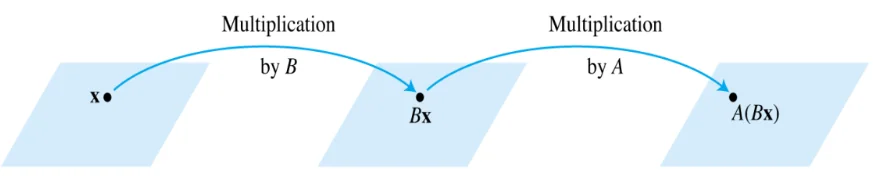
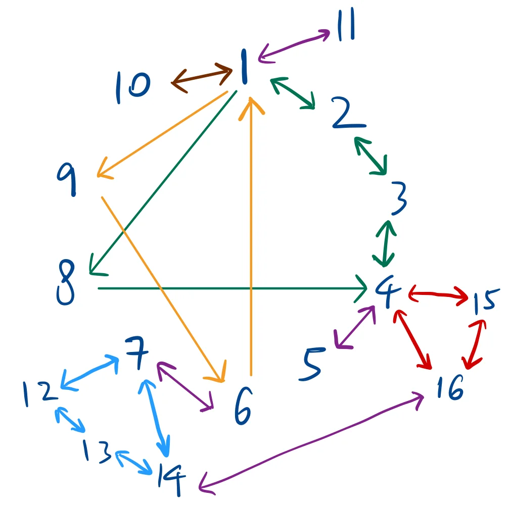

# Inverse of a Matrix

<figure id="fig:span geometric interpretation" data-latex-placement="H">

<figcaption>Transforming by B first then A is written as AB</figcaption>
</figure>

If $`A`$ is an invertible $`n\times n`$ matrix, then for each $`\mathbf{x}`$ in $`\mathbb{R}^n`$, the equation $`A\mathbf{x} = \mathbf{b}`$ has the unique solution
``` math
\mathbf{x} = A^{-1}\mathbf{b}
```
*Proof*

1.  Show that solution exists\
    Substitute $`A^{-1}\mathbf{b}`$ into $`A\mathbf{x}=\mathbf{b}`$,\
    LHS = $`A\mathbf{x}=A(A^{-1})\mathbf{b}=(AA^{-1})\mathbf{b}=I\mathbf{b}=\mathbf{b}`$ = RHS.

2.  Show that solution is unique.\
    Suppose there is some vector $`u`$ such that $`A\mathbf{u}=\mathbf{b}`$,\
    then $`A^{-1}A\mathbf{u}=A^{-1}\mathbf{b} \Rightarrow I\mathbf{u}=A^{-1}\mathbf{b} \Rightarrow \mathbf{u}=A^{-1}\mathbf{b}`$.

**Property**: If $`A`$ is invertible, then $`A^{-1}`$ is invertible, and
``` math
(A^{-1})^{-1}=A
```

**Property**: If $`A`$ and $`B`$ are $`n\times n`$ invertible matrices, then so is $`AB`$ and
``` math
(AB)^{-1}=B^{-1}A^{-1}
```

*Proof*\
To find some matrix $`C`$ s.t. $`(AB)C=I`$ and $`C(AB)=I.`$\
If $`C=B^{-1}A^{-1}`$, then $`AB(B^{-1}A^{-1})=A(BB^{-1})A^{-1}=AIA^{-1}=AA^{-1}=I`$.\
Similar argument applies for $`(B^{-1}A^{-1})(AB)=I`$.

**Property**: If $`A`$ is an invertible matrix, then so is $`A^T`$, and
``` math
(A^T)^{-1}=(A^{-1})^T
```
*Proof*\
To show that $`(A^{-1})^T`$ is the inverse of $`A^T`$.\
Considering the product of $`A^T`$ and $`(A^{-1})^T`$,
``` math
A^T(A^{-1})^T=(A^{-1}A)^T=I^T=I
```
and the product of $`(A^{-1})^T`$ and $`A^T`$,
``` math
(A^{-1})^TA^T=(AA^{-1})^T=I^T=I
```

## Elementary matrix

An elementary matrix $`E`$ is created by performing exactly one elementary row operation on an identity matrix $`I`$.\
Multiplying a matrix $`A`$ by $`E`$ on the left ($`EA`$) performs that same row operation on $`A`$.

For example,
``` math
E = \begin{bmatrix}
    0 & 1 & 0 \\
    1 & 0 & 0 \\
    0 & 0 & 1
\end{bmatrix} \text{ and }A=\begin{bmatrix}
    a & b & c \\
    d & e & f \\
    g & h & i
\end{bmatrix}\Rightarrow EA=\begin{bmatrix}
    d & e & f \\
    a & b & c \\
    g & h & i
\end{bmatrix}
```
Every elementary matrix is invertible, and the inverse is another elementary matrix that reverses the original transformation. For example,
``` math
E_1=\begin{bmatrix}
    0 & 1 & 0 \\
    1 & 0 & 0 \\
    0 & 0 & 1
\end{bmatrix} \Rightarrow E_1^{-1}=\begin{bmatrix}
    0 & 1 & 0 \\
    1 & 0 & 0 \\
    0 & 0 & 1
\end{bmatrix}
```
``` math
E_2=\begin{bmatrix}
    1 & 0 & 0 \\
    0 & 1 & 0 \\
    -4 & 0 & 1
\end{bmatrix} \Rightarrow E_2^{-1}=\begin{bmatrix}
    1 & 0 & 0 \\
    0 & 1 & 0 \\
    4 & 0 & 1
\end{bmatrix}
```

An $`n\times n`$ matrix $`A`$ is invertible iff $`A`$ is row equivalent to $`I_n`$. The same sequence of EROs that reduces $`A`$ to $`I_n`$ transforms $`I_n`$ to $`A^{-1}`$.

*Proof*\
Suppose $`A`$ is an invertible $`n\times n`$ matrix, then $`A\mathbf{x}=\mathbf{b}`$ has a unique solution for any $`\mathbf{b}`$. This means the RREF form of $`A`$ has a pivot in every row and column. For a $`n\times n`$ matrix, this has to be $`I_n`$. Therefore $`A`$ is row equivalent to $`I_n`$.\
There exists some sequence of EROs that transforms $`A`$ to $`I_n`$, and each row operation corresponds to multiplication by an elementary matrix. This can be expressed as
``` math
(E_k\cdots E_2E_1)A=I_n
```
$`A`$ is invertible since RHS=$`I_n`$ is invertible and the product of elementary matrices is invertible.\
Multiplying by $`A^{-1}`$ on the right on both sides,
``` math
(E_k\cdots E_2E_1)=A^{-1}
```
Therefore,
``` math
(E_k\cdots E_2E_1)I_n=A^{-1}
```

### Example

To find the inverse of $`A = \begin{bmatrix} 0 & 1 & 2 \\ 1 & 0 & 3 \\ 4 & -3 & 8 \end{bmatrix}`$, we augment it with the identity matrix $`I`$ and perform Gauss-Jordan elimination:

``` math
\left[ \begin{array}{ccc|ccc}
0 & 1 & 2 & 1 & 0 & 0 \\
1 & 0 & 3 & 0 & 1 & 0 \\
4 & -3 & 8 & 0 & 0 & 1
\end{array} \right]
```

**Step 1: Interchange $`R_1`$ and $`R_2`$ ($`R_1 \leftrightarrow R_2`$)**
``` math
\xrightarrow{R_1 \leftrightarrow R_2}
\left[ \begin{array}{ccc|ccc}
1 & 0 & 3 & 0 & 1 & 0 \\
0 & 1 & 2 & 1 & 0 & 0 \\
4 & -3 & 8 & 0 & 0 & 1
\end{array} \right]
```

**Step 2: Eliminate $`a_{31}`$ ($`R_3 \leftarrow R_3 - 4R_1`$)**
``` math
\xrightarrow{R_3 - 4R_1}
\left[ \begin{array}{ccc|ccc}
1 & 0 & 3 & 0 & 1 & 0 \\
0 & 1 & 2 & 1 & 0 & 0 \\
0 & -3 & -4 & 0 & -4 & 1
\end{array} \right]
```

**Step 3: Eliminate $`a_{32}`$ ($`R_3 \leftarrow R_3 + 3R_2`$)**
``` math
\xrightarrow{R_3 + 3R_2}
\left[ \begin{array}{ccc|ccc}
1 & 0 & 3 & 0 & 1 & 0 \\
0 & 1 & 2 & 1 & 0 & 0 \\
0 & 0 & 2 & 3 & -4 & 1
\end{array} \right]
```

**Step 4: Scale $`R_3`$ to get a leading 1 ($`R_3 \leftarrow \frac{1}{2}R_3`$)**
``` math
\xrightarrow{\frac{1}{2}R_3}
\left[ \begin{array}{ccc|ccc}
1 & 0 & 3 & 0 & 1 & 0 \\
0 & 1 & 2 & 1 & 0 & 0 \\
0 & 0 & 1 & 1.5 & -2 & 0.5
\end{array} \right]
```

**Step 5: Eliminate $`a_{13}`$ and $`a_{23}`$ ($`R_1 \leftarrow R_1 - 3R_3`$ and $`R_2 \leftarrow R_2 - 2R_3`$)**
``` math
\xrightarrow{\substack{R_1 - 3R_3 \\ R_2 - 2R_3}}
\left[ \begin{array}{ccc|ccc}
1 & 0 & 0 & -4.5 & 7 & -1.5 \\
0 & 1 & 0 & -2 & 4 & -1 \\
0 & 0 & 1 & 1.5 & -2 & 0.5
\end{array} \right]
```

Therefore, the inverse matrix is
``` math
A^{-1} = \begin{bmatrix}
-4.5 & 7 & -1.5 \\
-2 & 4 & -1 \\
1.5 & -2 & 0.5
\end{bmatrix}
```

### Invertible Matrix Theorem

Let $`A`$ be an $`n\times n`$ matrix. Then the following statements are logically equivalent:

1.  $`A`$ is an invertible (non-singular) matrix.

2.  $`A`$ is row equivalent to $`I_n`$.

3.  $`A`$ has $`n`$ pivot positions.

4.  $`A\mathbf{x}=\mathbf{0}`$ has only the trivial solution.

5.  The columns of $`A`$ form a linearly independent set.

6.  $`A\mathbf{x}=\mathbf{b}`$ has at least one (in fact, unique) solution for each $`\mathbf{b}`$ in $`\mathbb{R}^n`$.

7.  The columns of $`A`$ span $`\mathbb{R}^n`$.

8.  There is an $`n\times n`$ matrix $`C`$ such that $`CA=I`$.

9.  There is an $`n\times n`$ matrix $`D`$ such that $`AD=I`$.

10. $`A^T`$ is an invertible matrix.

11. The columns of $`A`$ form a basis for $`\mathbb{R}^n`$.

12. $`\mathbf{C}(A) = \mathbb{R}^n`$.

13. $`\dim \mathbf{C}(A) = n`$.

14. Rank of $`A = n`$.

15. $`\mathbf{N}(A) = \{\mathbf{0}\}`$.

16. $`\dim \mathbf{N}(A) = 0`$.

<figure id="fig:span geometric interpretation" data-latex-placement="H">

<figcaption>The links between the statements of invertible matrix theorem.</figcaption>
</figure>

: $`A\mathbf{x}=\mathbf{0}\Rightarrow\mathbf{x}=A^{-1}\mathbf{0}`$.

$`8\Rightarrow 4`$: Given $`C`$ such that $`CA=I`$,
``` math
CA\mathbf{x}=C\mathbf{0}\Rightarrow I\mathbf{x}=\mathbf{0}\Rightarrow\mathbf{x}=\mathbf{0}
```
$`9\Rightarrow 6`$: Given $`D`$ such that $`AD=I`$, choose $`\mathbf{x}=D\mathbf{b}`$,
``` math
A\mathbf{x}=AD\mathbf{b}=I\mathbf{b}=\mathbf{b}
```

# Matrix Factorisation

To solve sequence of equations like $`Ax=b_1, Ax=b_2,\ldots, Ax=b_p`$, it is inefficient to first compute the inverse $`A^{-1}`$ and then multiply it by each vector, $`A^{-1}b_{1}, ..., A^{-1}b_{p}`$.

Instead, the efficient solution is to decompose $`A_{m \times n}`$ into $`L_{m \times m}U_{m \times n}`$.

``` math
L = \begin{bmatrix} 
1 & 0 & \cdots & 0 \\ 
l_{21} & 1 & \cdots & 0 \\ 
\vdots & \vdots & \ddots & \vdots \\ 
l_{m1} & l_{m2} & \cdots & 1 
\end{bmatrix},
\qquad
U = \begin{bmatrix} 
u_{11} & u_{12} & \cdots & u_{1n} \\ 
0 & u_{22} & \cdots & u_{2n} \\ 
\vdots & \vdots & \ddots & \vdots \\ 
0 & 0 & \cdots & u_{mn} 
\end{bmatrix}
```
where $`L`$ is unit lower triangular matrix, $`U`$ is upper triangular matrix.

## Deriving L & U

**Assumption** $`A`$ can be reduced to echelon form without requiring any row interchanges.

First reduce matrix $`A`$ to $`U`$, using elementary row operations. Multiply $`A`$ by a sequence of unit lower triangular elementary matrices ($`E_{1}, \dots, E_{p}`$), such that

``` math
\begin{align*}
           & E_{p} \dots E_{1}A = U \\
  \implies & A = (E_{p} \dots E_{1})^{-1}U
\end{align*}
```
Then $`L = E_{p} \dots E_{1}`$.

**Example** Consider a $`3 \times 3`$ matrix:
``` math
A = \begin{bmatrix} \mathbf{2} & -2 & 3 \\ \mathbf{6} & -7 & 14 \\ \mathbf{4} & -8 & 30 \end{bmatrix}
```

Step 1: Row Reduction to find $`U`$. Apply elementary row operations to eliminate the entries below the pivots to reach echelon form.

First Column: The first pivot is the $`\mathbf{2}`$ in row 1, column 1. Eliminate the entries below it. Multiply by $`E_{21}`$ (which represents $`R_2 - 3R_1`$):
``` math
E_{21}A = \begin{bmatrix} 2 & -2 & 3 \\ 0 & \mathbf{-1} & 5 \\ 4 & -8 & 30 \end{bmatrix}
```
Multiply by $`E_{31}`$ (which represents $`R_3 - 2R_1`$):
``` math
E_{31}(E_{21}A) = \begin{bmatrix} 2 & -2 & 3 \\ 0 & \mathbf{-1} & 5 \\ 0 & \mathbf{-4} & 24 \end{bmatrix}
```

Second Column: The new pivot is the $`\mathbf{-1}`$ in row 2, column 2. Eliminate the entry below it. \* Multiply by $`E_{32}`$ (which represents $`R_3 - 4R_2`$):
``` math
E_{32}(E_{31}E_{21}A) = \begin{bmatrix} 2 & -2 & 3 \\ 0 & -1 & 5 \\ 0 & 0 & 4 \end{bmatrix} = U
```

Step 2: Two Methods to Construct $`L`$

Since $`A`$ has 3 rows, $`L`$ will be a $`3 \times 3`$ unit lower triangular matrix.

**Method 1**: The "Multiplier" Method (Fastest).

At each pivot column, divide the eliminated entries by the pivot for that column, and place the result directly into $`L`$.

Column 1 Multipliers: The pivot is $`\mathbf{2}`$. Divide 6 and 4 by 2 respectively.

Column 2 Multipliers: The new pivot is $`\mathbf{-1}`$. Divide -4 by -1.

Placing these multipliers below the diagonal of 1s gives you $`L`$:
``` math
L = \begin{bmatrix} 1 & 0 & 0 \\ \mathbf{3} & 1 & 0 \\ \mathbf{2} & \mathbf{4} & 1 \end{bmatrix}
```

**Method 2**: The Elementary Inverse Method. Mathematically, $`L`$ is formed by the inverse of the elementary matrices used to reach $`U`$: $`L = E_{21}^{-1}E_{31}^{-1}E_{32}^{-1}`$.

Construct $`L`$ by simply taking the nonzero off-diagonal elements of the elementary inverse matrices and placing them into the appropriate positions in $`L`$.

``` math
L = \begin{bmatrix} 1 & 0 & 0 \\ \mathbf{3} & 1 & 0 \\ 0 & 0 & 1 \end{bmatrix} \begin{bmatrix} 1 & 0 & 0 \\ 0 & 1 & 0 \\ \mathbf{2} & 0 & 1 \end{bmatrix} \begin{bmatrix} 1 & 0 & 0 \\ 0 & 1 & 0 \\ 0 & \mathbf{4} & 1 \end{bmatrix} = \begin{bmatrix} 1 & 0 & 0 \\ \mathbf{3} & 1 & 0 \\ \mathbf{2} & \mathbf{4} & 1 \end{bmatrix}
```

## Solving using $`L`$ & $`U`$

``` math
\begin{align*}
           & Ax = b \\
  \implies & LUx = b
\end{align*}
```
**Forward substitution** Defining $`y= Ux`$, solve for
``` math
Ly=b
```

**Backward substitution** Solve
``` math
Ux=y
```

**Example**

Given the linear system $`Ax = b`$, where:
``` math
A = \begin{bmatrix} 3 & -7 & -2 & 2 \\ -3 & 5 & 1 & 0 \\ 6 & -4 & 0 & -5 \\ -9 & 5 & -5 & 12 \end{bmatrix}, \qquad
b = \begin{bmatrix} -9 \\ 5 \\ 7 \\ 11 \end{bmatrix}
```

Matrix $`A`$ has been factored into $`L`$ and $`U`$:
``` math
L = \begin{bmatrix} 1 & 0 & 0 & 0 \\ -1 & 1 & 0 & 0 \\ 2 & -5 & 1 & 0 \\ -3 & 8 & 3 & 1 \end{bmatrix}, \qquad
U = \begin{bmatrix} 3 & -7 & -2 & 2 \\ 0 & -2 & -1 & 2 \\ 0 & 0 & -1 & 1 \\ 0 & 0 & 0 & -1 \end{bmatrix}
```

**Forward Substitution ($`Ly = b`$)**

Set up the lower triangular system to solve for the intermediate vector $`y`$:
``` math
\begin{bmatrix} 1 & 0 & 0 & 0 \\ -1 & 1 & 0 & 0 \\ 2 & -5 & 1 & 0 \\ -3 & 8 & 3 & 1 \end{bmatrix}
\begin{bmatrix} y_1 \\ y_2 \\ y_3 \\ y_4 \end{bmatrix}
= \begin{bmatrix} -9 \\ 5 \\ 7 \\ 11 \end{bmatrix}
```

Solve the equations sequentially from top to bottom:
``` math
\begin{aligned}
y_1 &= -9 \\
-y_1 + y_2 &= 5 &&\implies y_2 = -4 \\
2y_1 - 5y_2 + y_3 &= 7 &&\implies y_3 = 5 \\
-3y_1 + 8y_2 + 3y_3 + y_4 &= 11 &&\implies y_4 = 1
\end{aligned}
```

This gives us our intermediate vector $`y`$:
``` math
y = \begin{bmatrix} -9 \\ -4 \\ 5 \\ 1 \end{bmatrix}
```

**Step 2: Backward Substitution ($`Ux = y`$)**

Set up the upper triangular system using the newly found vector $`y`$ to solve for $`x`$:
``` math
\begin{bmatrix} 3 & -7 & -2 & 2 \\ 0 & -2 & -1 & 2 \\ 0 & 0 & -1 & 1 \\ 0 & 0 & 0 & -1 \end{bmatrix}
\begin{bmatrix} x_1 \\ x_2 \\ x_3 \\ x_4 \end{bmatrix}
= \begin{bmatrix} -9 \\ -4 \\ 5 \\ 1 \end{bmatrix}
```

Solve the equations sequentially from bottom to top:
``` math
\begin{aligned}
-x_4 &= 1 &&\implies x_4 = -1 \\
-x_3 + x_4 &= 5 &&\implies x_3 = -6 \\
-2x_2 - x_3 + 2x_4 &= -4 &&\implies x_2 = 4 \\
3x_1 - 7x_2 - 2x_3 + 2x_4 &= -9 &&\implies x_1 = 3
\end{aligned}
```

**Final Solution:**
``` math
x = \begin{bmatrix} 3 \\ 4 \\ -6 \\ -1 \end{bmatrix}
```

## Zero Pivots: $`PA = LU`$ Factorization

The standard $`A = LU`$ factorization assumes matrix $`A`$ can be reduced to echelon form without row interchanges. If a pivot becomes zero, you must swap rows, which breaks the standard algorithm.

To solve this, we pre-swap the rows of $`A`$ using a Permutation Matrix $`P`$, which is an Identity matrix with its rows swapped. This yields the generalized factorization:
``` math
PA = LU
```

**Example:** Given matrix $`A`$:
``` math
A = \begin{bmatrix} 1 & 1 & 1 \\ 1 & 1 & -1 \\ 2 & -1 & -1 \end{bmatrix}
```

If we attempt standard row reduction ($`R_2 - R_1`$ and $`R_3 - 2R_1`$), we hit a zero pivot in the second column:
``` math
\begin{bmatrix} 1 & 1 & 1 \\ 0 & \mathbf{0} & -2 \\ 0 & -3 & -3 \end{bmatrix}
```

To fix this, we swap Row 2 and Row 3 using permutation matrix $`P_{23}`$:
``` math
P = \begin{bmatrix} 1 & 0 & 0 \\ 0 & 0 & 1 \\ 0 & 1 & 0 \end{bmatrix}
```

Calculate $`PA`$ to generate the row-swapped matrix:
``` math
PA = \begin{bmatrix} 1 & 0 & 0 \\ 0 & 0 & 1 \\ 0 & 1 & 0 \end{bmatrix} \begin{bmatrix} 1 & 1 & 1 \\ 1 & 1 & -1 \\ 2 & -1 & -1 \end{bmatrix} 
= \begin{bmatrix} 1 & 1 & 1 \\ 2 & -1 & -1 \\ 1 & 1 & -1 \end{bmatrix}
```

Now, factor $`PA`$ normally into $`L`$ and $`U`$: Using pivot 1 in column 1: $`R_2 - \mathbf{2}R_1 \implies l_{21} = 2`$, and $`R_3 - \mathbf{1}R_1 \implies l_{31} = 1`$. The entry below the second pivot ($`-3`$) is already $`0 \implies l_{32} = 0`$.

This gives our final $`L`$ and $`U`$ matrices for $`PA`$:
``` math
L = \begin{bmatrix} 1 & 0 & 0 \\ 2 & 1 & 0 \\ 1 & 0 & 1 \end{bmatrix}, \qquad
U = \begin{bmatrix} 1 & 1 & 1 \\ 0 & -3 & -3 \\ 0 & 0 & -2 \end{bmatrix}
```
