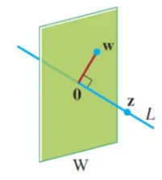
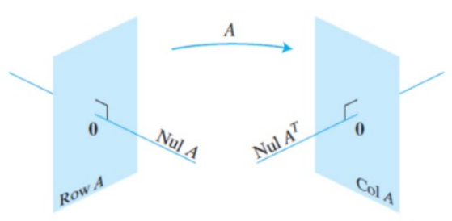
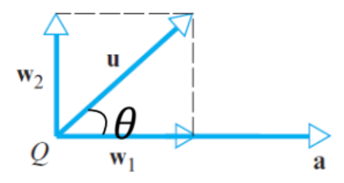

# Orthogonality

Recall that two nonzero vectors $`\mathbf{u}`$, $`\mathbf{v}`$ $`\in`$ $`\mathbb{R}^n`$ are orthogonal if
``` math
\mathbf{u}\cdot\mathbf{v}=0
```
The zero vector is orthogonal to every vector in $`\mathbb{R}^n`$.\
$`\mathbf{u}\cdot\mathbf{v}=0 \iff \theta = \frac{\pi}{2}`$, where $`\theta = \frac{\mathbf{u}\cdot\mathbf{v}}{\|\mathbf{u}\|\|\mathbf{v}\|}`$.

## Orthogonal Complements

If a vector $`\mathbf{z}`$ is orthogonal to every vector in a subspace $`W`$ in $`\mathbb{R}^n`$, then $`\mathbf{z}`$ is orthogonal to $`W`$.\
The set of all vectors $`z`$ that are orthogonal to $`W`$ is the orthogonal complement of $`W`$, denoted by $`W^\perp`$.

1.  Vector $`\mathbf{x} \in W \iff \mathbf{x}`$ is orthogonal to every vector in a set that spans $`W`$.

    - Only need to check if $`\mathbf{x}`$ is perpendicular to the vectors that span $`W`$ (its basis vectors).

2.  $`W^\perp`$ is a subspace of $`\mathbb{R}^n`$.

    - $`W^\perp`$ contains the zero vector and is closed under addition and scalar multiplication.

<figure id="fig:my_image" data-latex-placement="H">

<figcaption><span class="math inline"><em>L</em> = <em>W</em><sup>⟂</sup></span> and <span class="math inline"><em>W</em> = <em>L</em><sup>⟂</sup></span></figcaption>
</figure>

<figure id="fig:my_image" data-latex-placement="H">

<figcaption>The four fundamental subspaces of any matrix</figcaption>
</figure>

An $`m \times n`$ matrix $`A`$ acts as a linear transformation mapping vectors from a domain ($`\mathbb{R}^n`$) to a codomain ($`\mathbb{R}^m`$).\
We have the following relationships:
``` math
(\text{Row } A)^\perp = \text{Nul } A \quad \text{and} \quad (\text{Col } A)^\perp = \text{Nul } A^T
```
*Proof.*

1.  $`\text{Nul } A \subseteq (\text{Row } A)^\perp`$: If a vector $`\mathbf{x}`$ is in $`\text{Nul } A`$, then $`A\mathbf{x} = \mathbf{0}`$. When you compute $`A\mathbf{x}`$, you are taking the dot product of each row of $`A`$ with the vector $`\mathbf{x}`$. Because the result is a zero vector, $`\mathbf{x}`$ must be orthogonal to every single row of $`A`$. Because the rows of $`A`$ span $`\text{Row } A`$, $`\mathbf{x}`$ is orthogonal to the entire row space.

2.  $`(\text{Row } A)^\perp \subseteq \text{Nul } A`$: If we start with a vector $`\mathbf{x}`$ that is orthogonal to $`\text{Row } A`$, it must inherently be orthogonal to each individual row of $`A`$. Therefore, the dot product of each row with $`\mathbf{x}`$ is $`0`$, meaning $`A\mathbf{x} = \mathbf{0}`$. This confirms $`\mathbf{x}`$ is in $`\text{Nul } A`$.

3.  Substituting $`A^T`$ into the first rule gives: $`(\text{Row } A^T)^\perp = \text{Nul } A^T \implies (\text{Col } A)^\perp = \text{Nul } A^T`$.

## Orthogonal Projections

<figure id="fig:my_image" data-latex-placement="H">

<figcaption>Decomposition of <span class="math inline"><strong>u</strong></span></figcaption>
</figure>

Sometimes, we need to break a vector $`\mathbf{u}`$ into two orthogonal vectors relative to reference vector $`\mathbf{a}`$.

#### Projection Theorem

We can express $`\mathbf{u}`$ exactly one way as
``` math
\mathbf{u} = \mathbf{w}_1 + \mathbf{w}_2
```
where $`\mathbf{w}_1`$ is a scalar multiple of $`\mathbf{a}`$, and $`\mathbf{w}_2`$ is a vector orthogonal to $`\mathbf{a}`$.\
$`\mathbf{w}_1`$ is the orthogonal projection of $`\mathbf{u}`$ onto $`\mathbf{a}`$.
``` math
\text{proj}_\mathbf{a} \mathbf{u} = \left( \frac{\mathbf{u} \cdot \mathbf{a}}{\|\mathbf{a}\|^2} \right) \mathbf{a} = \left( \frac{\mathbf{u}\cdot\mathbf{a}}{\|\mathbf{a}\|}\right) \frac{\mathbf{a}}{\|\mathbf{a}\|} = \|\mathbf{u}\|\cos\theta \cdot \hat{\mathbf{a}}
```
$`\mathbf{w}_2`$ is vector component of $`\mathbf{u}`$ orthogonal to $`\mathbf{a}`$ (or the residual).
``` math
\mathbf{w}_2 = \mathbf{u} - \text{proj}_\mathbf{a} \mathbf{u}
```
The norm of the projection is
``` math
\|\text{proj}_\mathbf{a} \mathbf{u}\| = \frac{|\mathbf{u} \cdot \mathbf{a}|}{\|\mathbf{a}\|} = \|\mathbf{u}\| |\cos \theta|
```

#### Pythagoras’ Theorem in $`\mathbb{R}^n`$

If $`\mathbf{u}`$ and $`\mathbf{v}`$ are orthogonal vectors, then
``` math
\|\mathbf{u} + \mathbf{v}\|^2 = \|\mathbf{u}\|^2 + \|\mathbf{v}\|^2
```
*Proof.*
``` math
\|\mathbf{u} + \mathbf{v}\|^2 = (\mathbf{u} + \mathbf{v}) \cdot (\mathbf{u} + \mathbf{v}) = \|\mathbf{u}\|^2 + 2(\mathbf{u} \cdot \mathbf{v}) + \|\mathbf{v}\|^2 = \|\mathbf{u} + \mathbf{v}\|^2 = \|\mathbf{u}\|^2 + \|\mathbf{v}\|^2
```

## Orthogonal Sets & Bases

A set of vectors $`\{\mathbf{u}_1, \dots, \mathbf{u}_p\}`$ in $`\mathbb{R}^n`$ is said to be an orthogonal set if each pair of distinct vectors from the set is orthogonal. Mathematically, this means their dot product is zero:
``` math
\mathbf{u}_i \cdot \mathbf{u}_j = 0 \quad \text{whenever} \quad i \neq j
```

#### Theorem

If $`S = \{\mathbf{u}_1, \dots, \mathbf{u}_p\}`$ is an orthogonal set of nonzero vectors in $`\mathbb{R}^n`$, then $`S`$ is linearly independent and hence is an orthogonal basis for the subspace spanned by $`S`$.\
Note that $`p \leq n`$. If $`p=n`$, then $`S`$ is an orthogonal basis for the entire space $`\mathbb{R}^n`$.\
Note also that not all bases are orthogonal.\
*Proof.* Assume there is a linear combination that equals the zero vector:
``` math
\mathbf{0} = c_1\mathbf{u}_1 + \dots + c_p\mathbf{u}_p
```
If we take the dot product of both sides with $`\mathbf{u}_1`$:
``` math
\mathbf{0} \cdot \mathbf{u}_1 = (c_1\mathbf{u}_1 + c_2\mathbf{u}_2 + \dots + c_p\mathbf{u}_p) \cdot \mathbf{u}_1
```
``` math
0 = c_1(\mathbf{u}_1 \cdot \mathbf{u}_1) + c_2(\mathbf{u}_2 \cdot \mathbf{u}_1) + \dots + c_p(\mathbf{u}_p \cdot \mathbf{u}_1)
```
Because $`S`$ is an orthogonal set, all dot products where $`i \neq j`$ are zero. This leaves:
``` math
0 = c_1(\mathbf{u}_1 \cdot \mathbf{u}_1)
```
Since $`\mathbf{u}_1`$ is a nonzero vector, $`\mathbf{u}_1 \cdot \mathbf{u}_1`$ is not zero. Therefore, $`c_1`$ must be $`0`$. By repeating this for each vector, all weights $`c_i`$ must be zero, proving the set is linearly independent.

### Computing Coordinates Relative to an Orthogonal Basis

#### Theorem

Let $`\{\mathbf{u}_1, \dots, \mathbf{u}_p\}`$ be an orthogonal basis for a subspace $`W`$ of $`\mathbb{R}^n`$. For each $`\mathbf{y}`$ in $`W`$, the weights in the linear combination $`\mathbf{y} = c_1\mathbf{u}_1 + \dots + c_p\mathbf{u}_p`$ are given by:
``` math
c_j = \frac{\mathbf{y} \cdot \mathbf{u}_j}{\mathbf{u}_j \cdot \mathbf{u}_j} \quad (j = 1, \dots, p)
```
The proof for this is similar to the above theorem.

### Orthogonal Projections onto Subspaces

#### Theorem

Let $`W`$ be a subspace of $`\mathbb{R}^n`$. Then each $`\mathbf{y}`$ in $`\mathbb{R}^n`$ can be written uniquely in the form:
``` math
\mathbf{y} = \hat{\mathbf{y}} + \mathbf{z}
```
where $`\hat{\mathbf{y}}`$ is in $`W`$ and $`\mathbf{z}`$ is in $`W^\perp`$ (orthogonal to $`W`$).\
If $`\{\mathbf{u}_1, \dots, \mathbf{u}_p\}`$ is any orthogonal basis of $`W`$, then the orthogonal projection of $`\mathbf{y}`$ onto $`W`$ (denoted as $`\hat{\mathbf{y}}`$ or $`\text{proj}_W \mathbf{y}`$) is calculated as:
``` math
\hat{\mathbf{y}} = \left(\frac{\mathbf{y} \cdot \mathbf{u}_1}{\mathbf{u}_1 \cdot \mathbf{u}_1}\right)\mathbf{u}_1 + \dots + \left(\frac{\mathbf{y} \cdot \mathbf{u}_p}{\mathbf{u}_p \cdot \mathbf{u}_p}\right)\mathbf{u}_p
```
and the residual is $`\mathbf{z} = \mathbf{y} - \hat{\mathbf{y}}`$.\
**Example**: Let $`\{\mathbf{u}_1, \dots, \mathbf{u}_5\}`$ be an orthogonal basis for $`\mathbb{R}^5`$ and let $`\mathbf{y} = c_1\mathbf{u}_1 + \dots + c_5\mathbf{u}_5`$. Consider the subspace $`W = \text{Span}\{\mathbf{u}_1, \mathbf{u}_2\}`$. Write $`\mathbf{y}`$ as the sum of a vector $`\mathbf{z}_1`$ in $`W`$ and a vector $`\mathbf{z}_2`$ in $`W^\perp`$.\
Naturally, group the terms based on the orthogonal basis:
``` math
\mathbf{y} = \underbrace{c_1\mathbf{u}_1 + c_2\mathbf{u}_2}_{\mathbf{z}_1} + \underbrace{c_3\mathbf{u}_3 + c_4\mathbf{u}_4 + c_5\mathbf{u}_5}_{\mathbf{z}_2}
```

1.  $`\mathbf{z}_1`$ is clearly in $`\text{Span}\{\mathbf{u}_1, \mathbf{u}_2\}`$ (which is $`W`$).

2.  To prove $`\mathbf{z}_2`$ is in $`W^\perp`$, we must show it is orthogonal to the basis of $`W`$. Let’s check against $`\mathbf{u}_1`$:
    ``` math
    \mathbf{z}_2 \cdot \mathbf{u}_1 = (c_3\mathbf{u}_3 + c_4\mathbf{u}_4 + c_5\mathbf{u}_5) \cdot \mathbf{u}_1 = c_3(\mathbf{u}_3 \cdot \mathbf{u}_1) + c_4(\mathbf{u}_4 \cdot \mathbf{u}_1) + c_5(\mathbf{u}_5 \cdot \mathbf{u}_1) = 0
    ```
    A similar calculation shows $`\mathbf{z}_2 \cdot \mathbf{u}_2 = 0`$. Thus, $`\mathbf{z}_2`$ is in $`W^\perp`$.

## Orthonormal Sets & Orthogonal Matrices

### Orthonormal sets

A set of vectors $`\{\mathbf{u}_1, \dots, \mathbf{u}_p\}`$ is an orthonormal set if it is an orthogonal set of unit vectors.
``` math
\mathbf{u}_i \cdot \mathbf{u}_j = 0 \quad (\text{for } i \neq j) \quad \text{and} \quad \mathbf{u}_i \cdot \mathbf{u}_i = 1
```
If an orthonormal set spans a subspace $`W`$, it is an orthonormal basis for $`W`$. (It is automatically linearly independent.)\
The simplest example: The standard basis in $`\mathbb{R}^n`$ (e.g., $`\mathbf{e}_1, \mathbf{e}_2, \dots, \mathbf{e}_n`$) is an orthonormal basis.\
**Example**: Show that $`\{\mathbf{v}_1, \mathbf{v}_2, \mathbf{v}_3\}`$ is an orthonormal basis of $`\mathbb{R}^3`$, where: $`\mathbf{v}_1 = \begin{bmatrix} 3/\sqrt{11} \\ 1/\sqrt{11} \\ 1/\sqrt{11} \end{bmatrix}`$, $`\mathbf{v}_2 = \begin{bmatrix} -1/\sqrt{6} \\ 2/\sqrt{6} \\ 1/\sqrt{6} \end{bmatrix}`$, $`\mathbf{v}_3 = \begin{bmatrix} -1/\sqrt{66} \\ -4/\sqrt{66} \\ 7/\sqrt{66} \end{bmatrix}`$.

1.  Check orthogonality: $`\mathbf{v}_1 \cdot \mathbf{v}_2 = -3/\sqrt{66} + 2/\sqrt{66} + 1/\sqrt{66} = 0`$, and so on.

2.  Check unit length: $`\mathbf{v}_1 \cdot \mathbf{v}_1 = 9/11 + 1/11 + 1/11 = 1`$ and so on.

Hence it is an orthonormal set.

### Matrices with Orthonormal Columns

#### Theorem

An $`m \times n`$ matrix $`U`$ has orthonormal columns if and only if $`U^T U = I`$.\
*Proof.* When you multiply $`U^T U`$, the entry in row $`i`$ and column $`j`$ is the dot product of column $`\mathbf{u}_i`$ and column $`\mathbf{u}_j`$.

- If $`i = j`$ (the diagonal entries), $`\mathbf{u}_i^T \mathbf{u}_i = 1`$ (because they are unit vectors).

- If $`i \neq j`$ (the off-diagonal entries), $`\mathbf{u}_i^T \mathbf{u}_j = 0`$ (because they are orthogonal).

``` math
U^T U = \begin{bmatrix} \leftarrow \mathbf{u}_1^T \rightarrow \\ \leftarrow \mathbf{u}_2^T \rightarrow \\ \vdots \\ \leftarrow \mathbf{u}_n^T \rightarrow \end{bmatrix} \begin{bmatrix} \uparrow & \uparrow & & \uparrow \\ \mathbf{u}_1 & \mathbf{u}_2 & \dots & \mathbf{u}_n \\ \downarrow & \downarrow & & \downarrow \end{bmatrix} = \begin{bmatrix} \mathbf{u}_1 \cdot \mathbf{u}_1 & \mathbf{u}_1 \cdot \mathbf{u}_2 & \dots & \mathbf{u}_1 \cdot \mathbf{u}_n \\ \mathbf{u}_2 \cdot \mathbf{u}_1 & \mathbf{u}_2 \cdot \mathbf{u}_2 & \dots & \mathbf{u}_2 \cdot \mathbf{u}_n \\ \vdots & \vdots & \ddots & \vdots \\ \mathbf{u}_n \cdot \mathbf{u}_1 & \mathbf{u}_n \cdot \mathbf{u}_2 & \dots & \mathbf{u}_n \cdot \mathbf{u}_n \end{bmatrix}
```
If the original vectors were orthonormal, it simplifies to:
``` math
U^T U = \begin{bmatrix} 1 & 0 & \dots & 0 \\ 0 & 1 & \dots & 0 \\ \vdots & \vdots & \ddots & \vdots \\ 0 & 0 & \dots & 1 \end{bmatrix} = I
```

#### Theorem

Let $`U`$ be an $`m \times n`$ matrix with orthonormal columns, and let $`\mathbf{x}`$ and $`\mathbf{y}`$ be vectors in $`\mathbb{R}^n`$. Transforming vectors via $`U`$ preserves their lengths and their relationships to one another:

1.  Preserves Length: $`\|U\mathbf{x}\| = \|\mathbf{x}\|`$

2.  Preserves Dot Product: $`(U\mathbf{x}) \cdot (U\mathbf{y}) = \mathbf{x} \cdot \mathbf{y}`$

3.  Preserves Orthogonality: $`(U\mathbf{x}) \cdot (U\mathbf{y}) = 0`$ if and only if $`\mathbf{x} \cdot \mathbf{y} = 0`$

*Proof.* Property 2: $`(U\mathbf{x}) \cdot (U\mathbf{y}) = (U\mathbf{x})^T (U\mathbf{y}) = \mathbf{x}^T U^T U \mathbf{y} = \mathbf{x}^T I \mathbf{y} = \mathbf{x}^T \mathbf{y} = \mathbf{x} \cdot \mathbf{y}`$.\
Property 1 follows as such: $`\|U\mathbf{x}\|^2 = (U\mathbf{x}) \cdot (U\mathbf{x}) = \mathbf{x} \cdot \mathbf{x} = \|\mathbf{x}\|^2`$.\
**Example**: Let $`U = \begin{bmatrix} 1/\sqrt{2} & 2/3 \\ 1/\sqrt{2} & -2/3 \\ 0 & 1/3 \end{bmatrix}`$ and $`\mathbf{x} = \begin{bmatrix} \sqrt{2} \\ 3 \end{bmatrix}`$. Verify that $`\|U\mathbf{x}\| = \|\mathbf{x}\|`$.\
``` math
U\mathbf{x} = \begin{bmatrix} 1/\sqrt{2} & 2/3 \\ 1/\sqrt{2} & -2/3 \\ 0 & 1/3 \end{bmatrix} \begin{bmatrix} \sqrt{2} \\ 3 \end{bmatrix} = \begin{bmatrix} 1 + 2 \\ 1 - 2 \\ 0 + 1 \end{bmatrix} = \begin{bmatrix} 3 \\ -1 \\ 1 \end{bmatrix}
```
Compare norms:

- $`\|U\mathbf{x}\| = \sqrt{3^2 + (-1)^2 + 1^2} = \sqrt{9 + 1 + 1} = \sqrt{11}`$

- $`\|\mathbf{x}\| = \sqrt{(\sqrt{2})^2 + 3^2} = \sqrt{2 + 9} = \sqrt{11}`$

### Orthogonal matrices

If a matrix has orthonormal columns AND is square, it is an orthogonal matrix.\
A orthogonal matrix $`Q`$ is a real square matrix, whose columns and rows are orthonormal vectors.

- $`Q^T Q = Q Q^T = I`$.

- $`Q^T = Q^{-1}`$.

Reason: $`Q`$ is square, so its left inverse is also its right inverse, forcing $`QQ^T = I`$. Just as $`Q^TQ`$ computes the dot products of the columns, $`QQ^T`$ computes the dot products of the rows:
``` math
QQ^T = \begin{bmatrix} \leftarrow \mathbf{r}_1 \rightarrow \\ \leftarrow \mathbf{r}_2 \rightarrow \\ \vdots \end{bmatrix} \begin{bmatrix} \uparrow & \uparrow & \\ \mathbf{r}_1^T & \mathbf{r}_2^T & \dots \\ \downarrow & \downarrow & \end{bmatrix} = \begin{bmatrix} \mathbf{r}_1 \cdot \mathbf{r}_1 & \mathbf{r}_1 \cdot \mathbf{r}_2 \\ \mathbf{r}_2 \cdot \mathbf{r}_1 & \mathbf{r}_2 \cdot \mathbf{r}_2 \end{bmatrix} = \begin{bmatrix} 1 & 0 \\ 0 & 1 \end{bmatrix}
```
Geometrically, if $`Q`$ is $`n \times n`$ orthogonal matrix, there are $`n`$ orthogonal columns in a $`n`$-D space, hence forming a basis for the entire space.\
A classic $`2 \times 2`$ orthogonal matrix $`Q`$ is
``` math
Q = \begin{bmatrix} \cos(30^\circ) & -\sin(30^\circ) \\ \sin(30^\circ) & \cos(30^\circ) \end{bmatrix} = \begin{bmatrix} \sqrt{3}/2 & -1/2 \\ 1/2 & \sqrt{3}/2 \end{bmatrix}
```

- Column 1: Imagine taking the standard $`x`$-axis and rotating counter-clockwise $`30^\circ`$. Length is still 1.

- Column 2: Same thing for the $`y`$-axis.

If matrix $`U`$ is $`m \times n`$ matrix, and $`m > n`$, it is NOT an orthogonal matrix.\
$`U^T U = I`$ is still true, yielding an $`n \times n`$ identity matrix.\
But $`U U^T`$ yields an $`m \times m`$ matrix $`\neq I`$. Instead, $`P = U U^T`$ creates an $`m \times m`$ projection matrix of rank $`n`$. This matrix $`P`$ can be used to project any given vector $`\mathbf{y}`$ onto the column space of $`U`$ (let’s call it $`W`$) using the formula: $`\hat{\mathbf{y}} = U U^T \mathbf{y} = P\mathbf{y}`$. Geometrically, for example if $`m=3`$, $`n=2`$, the two vectors span a flat 2D plane cutting through that 3D space.

## Orthogonal Decomposition

Generalising an earlier theorem in 1-D space to higher-dimensional space,

#### Theorem

Let $`W`$ be a subspace of $`\mathbb{R}^n`$. Then each $`\mathbf{y}`$ in $`\mathbb{R}^n`$ can be written uniquely in the form:
``` math
\mathbf{y} = \hat{\mathbf{y}} + \mathbf{z}
```

- $`\hat{\mathbf{y}}`$ is entirely inside the subspace $`W`$, it is the orthogonal projection of $`\mathbf{y}`$ onto $`W`$, written as $`\text{proj}_W \mathbf{y}`$.

- $`\mathbf{z}`$ is in $`W^\perp`$ (orthogonal to every vector in $`W`$), it is calculated as $`\mathbf{z} = \mathbf{y} - \hat{\mathbf{y}}`$.

**Formula**: If $`\{\mathbf{u}_1, \dots, \mathbf{u}_p\}`$ is any orthogonal basis of $`W`$, then:
``` math
\hat{\mathbf{y}} = \left(\frac{\mathbf{y} \cdot \mathbf{u}_1}{\mathbf{u}_1 \cdot \mathbf{u}_1}\right)\mathbf{u}_1 + \dots + \left(\frac{\mathbf{y} \cdot \mathbf{u}_p}{\mathbf{u}_p \cdot \mathbf{u}_p}\right)\mathbf{u}_p
```
*Proof.* We have the residual $`\mathbf{z} = \mathbf{y} - \hat{\mathbf{y}}`$ and $`\mathbf{z} \cdot \mathbf{u}_j = 0`$ because $`\mathbf{z}`$ is orthogonal to the subspace. So we have
``` math
\begin{align*}
    (\mathbf{y} - \hat{\mathbf{y}}) \cdot \mathbf{u}_j &= 0\\
    \mathbf{y} \cdot \mathbf{u}_j &= \hat{\mathbf{y}} \cdot \mathbf{u}_j\\
    \mathbf{y} \cdot \mathbf{u}_j &= (c_1\mathbf{u}_1 + c_2\mathbf{u}_2 + \dots + c_j\mathbf{u}_j + \dots + c_p\mathbf{u}_p) \cdot \mathbf{u}_j\\
    \mathbf{y} \cdot \mathbf{u}_j &= 0 + 0 + \dots + c_j(\mathbf{u}_j \cdot \mathbf{u}_j) + \dots + 0\\
    c_j &= \frac{\mathbf{y} \cdot \mathbf{u}_j}{\mathbf{u}_j \cdot \mathbf{u}_j}
\end{align*}
```

### The Best Approximation Theorem

#### Theorem

Let $`W`$ be a subspace of $`\mathbb{R}^n`$, let $`\mathbf{y}`$ be any vector in $`\mathbb{R}^n`$, and let $`\hat{\mathbf{y}}`$ be the orthogonal projection of $`\mathbf{y}`$ onto $`W`$. Then $`\hat{\mathbf{y}}`$ is the closest point in $`W`$ to $`\mathbf{y}`$, meaning:
``` math
\|\mathbf{y} - \hat{\mathbf{y}}\| < \|\mathbf{y} - \mathbf{v}\|
```
for all other vectors $`\mathbf{v}`$ in $`W`$ distinct from $`\hat{\mathbf{y}}`$.\
Note: If $`\mathbf{y}`$ is already in $`W`$, then $`\text{proj}_W \mathbf{y} = \mathbf{y}`$ (the distance is zero).\
*Proof.* Rewrite $`(\mathbf{y} - \mathbf{v})`$ as:
``` math
\mathbf{y} - \mathbf{v} = (\mathbf{y} - \hat{\mathbf{y}}) + (\hat{\mathbf{y}} - \mathbf{v})
```
Since $`(\mathbf{y} - \hat{\mathbf{y}})`$ and $`(\hat{\mathbf{y}} - \mathbf{v})`$ are orthogonal, by Pythagoras Theorem:
``` math
\|\mathbf{y} - \mathbf{v}\|^2 = \|\mathbf{y} - \hat{\mathbf{y}}\|^2 + \|\hat{\mathbf{y}} - \mathbf{v}\|^2
```
Since $`\mathbf{v}`$ is not the same point as $`\hat{\mathbf{y}}`$, then $`\|\hat{\mathbf{y}} - \mathbf{v}\|^2 > 0`$, and
``` math
\|\mathbf{y} - \mathbf{v}\| > \|\mathbf{y} - \hat{\mathbf{y}}\|
```

### Projections with Orthonormal Bases

If $`\{\mathbf{u}_1, \dots, \mathbf{u}_p\}`$ is an orthonormal basis for $`W`$, then the formula for the projection onto $`W`$ simplifies to:
``` math
\text{proj}_W \mathbf{y} = (\mathbf{y} \cdot \mathbf{u}_1)\mathbf{u}_1 + (\mathbf{y} \cdot \mathbf{u}_2)\mathbf{u}_2 + \dots + (\mathbf{y} \cdot \mathbf{u}_p)\mathbf{u}_p
```
because the denominators ($`\mathbf{u}_i \cdot \mathbf{u}_i`$) all become 1.\
If $`U = [\mathbf{u}_1 \dots \mathbf{u}_p]`$ is the matrix containing these orthonormal columns, the projection can be calculated via the projection matrix $`UU^T`$:
``` math
\text{proj}_W \mathbf{y} = U U^T \mathbf{y}
```
*Proof.*
``` math
\begin{align*}
    \hat{\mathbf{y}} &= (\mathbf{y} \cdot \mathbf{u}_1)\mathbf{u}_1 + (\mathbf{y} \cdot \mathbf{u}_2)\mathbf{u}_2 + \dots + (\mathbf{y} \cdot \mathbf{u}_p)\mathbf{u}_p\\
    &= \mathbf{u}_1(\mathbf{u}_1^T \mathbf{y}) + \mathbf{u}_2(\mathbf{u}_2^T \mathbf{y}) + \dots + \mathbf{u}_p(\mathbf{u}_p^T \mathbf{y})
\end{align*}
```
Building the $`UU^Ty`$ result:
``` math
U^T \mathbf{y} = \begin{bmatrix} \leftarrow \mathbf{u}_1^T \rightarrow \\ \leftarrow \mathbf{u}_2^T \rightarrow \\ \vdots \\ \leftarrow \mathbf{u}_p^T \rightarrow \end{bmatrix} \mathbf{y} = \begin{bmatrix} \mathbf{u}_1^T \mathbf{y} \\ \mathbf{u}_2^T \mathbf{y} \\ \vdots \\ \mathbf{u}_p^T \mathbf{y} \end{bmatrix}
```
``` math
\begin{align*}
    U (U^T \mathbf{y}) &= \begin{bmatrix} \uparrow & \uparrow & & \uparrow \\ \mathbf{u}_1 & \mathbf{u}_2 & \dots & \mathbf{u}_p \\ \downarrow & \downarrow & & \downarrow \end{bmatrix} \begin{bmatrix} \mathbf{u}_1^T \mathbf{y} \\ \mathbf{u}_2^T \mathbf{y} \\ \vdots \\ \mathbf{u}_p^T \mathbf{y} \end{bmatrix}\\
    &= \mathbf{u}_1(\mathbf{u}_1^T \mathbf{y}) + \mathbf{u}_2(\mathbf{u}_2^T \mathbf{y}) + \dots + \mathbf{u}_p(\mathbf{u}_p^T \mathbf{y})
\end{align*}
```
$`\therefore\:\hat{\mathbf{y}} = UU^T\mathbf{y}`$.

## QR decomposition

If $`A`$ is an $`m \times n`$ matrix with linearly indpendent columns, then $`A`$ can be factorised as
``` math
A = QR
```

- $`Q`$ is an $`m \times n`$ matrix (economy QR) whose columns form an orthonormal basis for the column space of $`A`$ (Col $`A`$).

- $`R`$ is an $`n \times n`$ upper triangular invertible matrix with positive entries on its diagonal.

Note that $`m \geq n`$, otherwise the columns of $`A`$ are linearly dependent, forming a contradiction.\
Properties of $`Q`$:

1.  $`C(Q) = C(A)`$: It means the column space of $`Q`$ is identical to the column space of $`A`$.

2.  $`Q^T Q = I`$: Property of matrix with orthonormal columns.

3.  $`QQ^T = \text{Projection Matrix}`$: $`Q`$ might not be square. This projects any vector onto the column space of $`A`$.

Properties of $`R`$:

1.  Square and Upper Triangular: all entries below of the main diagonal are zero.

2.  Invertibility: If $`A`$ has linearly independent columns, $`R`$ is invertible. If $`A`$ has linearly dependent columns, $`R`$ is NOT invertible (it will have zeros on its diagonal).

Sketch of why we use QR decomposition: Imagine trying to solve the system $`A\mathbf{x} = \mathbf{y}`$ for a very large matrix $`A`$.
``` math
\begin{align*}
    QR\mathbf{x} &= \mathbf{y} & \text{[Substitute $A$ with $QR$]}\\
    Q^T Q R \mathbf{x} &= Q^T \mathbf{y} & \text{[Left multiply by $Q^T$]}\\
    R\mathbf{x} &= Q^T \mathbf{y} & \text{[$Q^TQ=I$]}
\end{align*}
```
This is easier to solve as R is an upper triangular matrix, so we can use back-substitution.

### Gram-Schmidt (GS) Process

This algorithm finds the $`Q`$ matrix. It takes a set of independent vectors (columns of $`A`$) and transforms them into mutually orthogonal vectors.\
If you start with a set of vectors $`W = \{\mathbf{x}_1, \mathbf{x}_2, \dots, \mathbf{x}_n\}`$, the GS process outputs an orthogonal set $`W' = \{\mathbf{v}_1, \mathbf{v}_2, \dots, \mathbf{v}_n\}`$. The subspace spanned by the new orthogonal vectors is exactly identical to the subspace spanned by the original vectors: $`\text{Span}(W) = \text{Span}(W')`$.

#### The algorithm

Given a basis $`\{\mathbf{x}_1, \dots, \mathbf{x}_p\}`$ for a nonzero subspace, construct the orthogonal basis iteratively:

1.  Anchor the first vector: $`\mathbf{v}_1 = \mathbf{x}_1`$.

2.  For the second vector, subtract its projection onto the first: $`\mathbf{v}_2 = \mathbf{x}_2 - \left(\frac{\mathbf{x}_2 \cdot \mathbf{v}_1}{\mathbf{v}_1 \cdot \mathbf{v}_1}\right)\mathbf{v}_1`$.

3.  For the third vector, subtract its projections onto all previous vectors: $`\mathbf{v}_3 = \mathbf{x}_3 - \left(\frac{\mathbf{x}_3 \cdot \mathbf{v}_1}{\mathbf{v}_1 \cdot \mathbf{v}_1}\right)\mathbf{v}_1 - \left(\frac{\mathbf{x}_3 \cdot \mathbf{v}_2}{\mathbf{v}_2 \cdot \mathbf{v}_2}\right)\mathbf{v}_2`$.

4.  Repeat this pattern up to $`p`$ vectors.

*Proof.* The Orthogonal Decomposition Theorem: guarantees that any vector $`\mathbf{x}_{k+1}`$ can be split into a component that lies within a previously established subspace $`W_k`$ (the projection) and a component perfectly orthogonal to $`W_k`$ (the residual). $`\mathbf{v}_{k+1} = \mathbf{x}_{k+1} - \text{proj}_{W_k}\mathbf{x}_{k+1}`$, the algorithm mathematically strips away the interior projection, leaving only the orthogonal residual $`\mathbf{v}_{k+1}`$. Furthermore, because the original vectors are strictly linearly independent, $`\mathbf{x}_{k+1}`$ cannot be entirely contained within $`W_k`$; thus, the residual $`\mathbf{v}_{k+1}`$ will never collapse into the zero vector ($`\mathbf{0}`$), ensuring the newly formed orthogonal basis remains intact and spans the exact same space.

**Orthonormalisation**: The Gram-Schmidt algorithm natively produces an orthogonal set. To achieve the orthonormal set required for matrix $`Q`$, every vector must be normalized so its length equals $`1`$. This is done by dividing the vector by its norm: $`\mathbf{u}_k = \frac{\mathbf{v}_k}{\|\mathbf{v}_k\|}`$.

#### Finding $`R`$

$`R`$ is found using the relationship $`R = Q^T A`$.

#### Full QR decomposition

For $`m \times n`$ matrix $`A`$ where $`m > n`$, the standard method only yields the $`m \times n`$ Economy QR. To obtain a Full QR factorization, $`Q`$ must be expanded into a perfectly square $`m \times m`$ matrix.

1.  To achieve this, append a dummy matrix $`\tilde{A}`$ (such as the Identity matrix $`I`$) to $`A`$ so that the combined matrix $`[A \quad \tilde{A}]`$ reaches a full rank of $`m`$.

2.  Run the Gram-Schmidt process on this massive combined matrix. The original columns form the block $`Q_1`$, while the extra manufactured columns form $`Q_2`$, extending the set to form a complete orthonormal basis for $`\mathbb{R}^m`$.

#### Why append the identity matrix?

If matrix $`A`$ is $`m \times n`$ (where $`m > n`$), its columns only span an $`n`$-dimensional slice of the full $`m`$-dimensional space ($`\mathbb{R}^m`$). To build a square $`m \times m`$ matrix for $`Q`$, we must "discover" the missing $`m-n`$ perpendicular directions. Because the columns of the $`m \times m`$ identity matrix inherently span the entirety of $`\mathbb{R}^m`$, appending them onto $`A`$ guarantees that every possible dimension is represented. When we run G-S across this combined matrix, the algorithm naturally filters out the redundant dimensions (which become $`\mathbf{0}`$ and are discarded) and orthogonalizes the remaining distinct directions, perfectly completing the basis.

#### The 4 cases of $`A`$

$`A`$ could be square or tall, and the columns could be indepedent or dependent.\
**Square matrices**, $`m=n`$: the economy and full decompositions are exactly the same. $`Q`$ is always a perfect square orthogonal matrix, meaning $`Q^T Q = Q Q^T = I`$. The only thing that changes is the invertibility of $`R`$.

- Case 1: Square matrix with independent columns. Factoring $`A`$ yields a square $`Q`$ where $`Q^T Q = Q Q^T = I`$, and a square $`R`$ that is perfectly invertible.

- Case 2: Square matrix with a dependent column. The algorithm can still decompose $`A = QR`$, and $`Q`$ will still be a perfect orthogonal matrix ($`Q^T Q = Q Q^T = I`$). However, $`R`$ will have a row of zeros, making it NOT invertible.\
  **Example**: Let $`A = \begin{bmatrix} 1 & 2 & 3 \\ 1 & 2 & 3 \\ 1 & 1 & 2 \end{bmatrix}`$. Notice that the first two rows are identical, meaning the matrix only has a rank of 2. We will get $`3 \times 3`$ orthogonal matrix $`Q`$, and $`3 \times 3`$ matrix $`R`$ evaluates with zeros across its entire bottom row so $`R`$ cannot be inverted.

**Tall matrices**, $`m>n`$: the difference between Full and Economy QR becomes prominent.\
A tall matrix $`A`$ can be written in block matrix form for a Full QR: $`A = \begin{bmatrix} Q_1 & Q_2 \end{bmatrix} \begin{bmatrix} R_1 \\ 0 \end{bmatrix} = Q_1 R_1`$.

- Tall matrix with independent columns.

  - Full QR: Yields a square $`m \times m`$ matrix for $`Q`$, and a tall $`m \times n`$ matrix for $`R`$ padded with zeros at the bottom.

  - Economy QR: Yields a tall $`m \times n`$ matrix for $`Q`$, and a square $`n \times n`$ matrix for $`R`$. Because $`Q`$ is rectangular, it is not a true orthogonal matrix. While $`Q^T Q = I`$ (an $`n \times n`$ identity matrix), the reverse multiplication $`Q Q^T = P`$ yields a square $`m \times m`$ projection matrix.

- Tall matrix with a dependent column. Regardless of using Full or Economy mode, the presence of dependent columns causes entire rows in $`R`$ to become zero. The number of non-zero rows in $`R`$ will equal the number of truly independent columns in $`A`$.

#### Example - Economy QR

Let $`A`$ be a $`4 \times 3`$ matrix with linearly independent columns:
``` math
A = \begin{bmatrix} \mathbf{x}_1 & \mathbf{x}_2 & \mathbf{x}_3 \end{bmatrix} = \begin{bmatrix} 1 & 3 & 1 \\ 1 & 1 & 1 \\ 1 & -1 & 3 \\ 1 & 1 & -1 \end{bmatrix}
```
Anchor the first vector:
``` math
\mathbf{v}_1 = \mathbf{x}_1 = \begin{bmatrix} 1 \\ 1 \\ 1 \\ 1 \end{bmatrix}
```
Orthogonalize the second vector ($`\mathbf{x}_2`$):
``` math
\mathbf{v}_2 = \begin{bmatrix} 3 \\ 1 \\ -1 \\ 1 \end{bmatrix} - \left( \frac{4}{4} \right) \begin{bmatrix} 1 \\ 1 \\ 1 \\ 1 \end{bmatrix} = \begin{bmatrix} 3 \\ 1 \\ -1 \\ 1 \end{bmatrix} - \begin{bmatrix} 1 \\ 1 \\ 1 \\ 1 \end{bmatrix} = \begin{bmatrix} 2 \\ 0 \\ -2 \\ 0 \end{bmatrix}
```
Orthogonalize the third vector ($`\mathbf{x}_3`$):
``` math
\mathbf{v}_3 = \mathbf{x}_3 - \left( \frac{\mathbf{x}_3 \cdot \mathbf{v}_1}{\mathbf{v}_1 \cdot \mathbf{v}_1} \right) \mathbf{v}_1 - \left( \frac{\mathbf{x}_3 \cdot \mathbf{v}_2}{\mathbf{v}_2 \cdot \mathbf{v}_2} \right) \mathbf{v}_2
```
``` math
\mathbf{v}_3 = \begin{bmatrix} 1 \\ 1 \\ 3 \\ -1 \end{bmatrix} - \left( \frac{4}{4} \right) \begin{bmatrix} 1 \\ 1 \\ 1 \\ 1 \end{bmatrix} - \left( \frac{-4}{8} \right) \begin{bmatrix} 2 \\ 0 \\ -2 \\ 0 \end{bmatrix} = \begin{bmatrix} 1 \\ 0 \\ 1 \\ -2 \end{bmatrix}
```
We divide each vector by its length ($`\|\mathbf{v}_1\| = 2`$, $`\|\mathbf{v}_2\| = \sqrt{8} = 2\sqrt{2}`$, and $`\|\mathbf{v}_3\| = \sqrt{6}`$):
``` math
Q_{economy} = \begin{bmatrix} \mathbf{u}_1 & \mathbf{u}_2 & \mathbf{u}_3 \end{bmatrix} = \begin{bmatrix} 1/2 & 1/\sqrt{2} & 1/\sqrt{6} \\ 1/2 & 0 & 0 \\ 1/2 & -1/\sqrt{2} & 1/\sqrt{6} \\ 1/2 & 0 & -2/\sqrt{6} \end{bmatrix}
```
$`R = Q^T A`$:
``` math
R_{economy} = \begin{bmatrix} \mathbf{u}_1 \cdot \mathbf{x}_1 & \mathbf{u}_1 \cdot \mathbf{x}_2 & \mathbf{u}_1 \cdot \mathbf{x}_3 \\ 0 & \mathbf{u}_2 \cdot \mathbf{x}_2 & \mathbf{u}_2 \cdot \mathbf{x}_3 \\ 0 & 0 & \mathbf{u}_3 \cdot \mathbf{x}_3 \end{bmatrix} = \begin{bmatrix} 2 & 2 & 2 \\ 0 & 2\sqrt{2} & -\sqrt{2} \\ 0 & 0 & \sqrt{6} \end{bmatrix}
```

#### Full QR

Using the same $`A`$ as above, we append the $`4 \times 4`$ Identity matrix ($`I`$) to $`A`$ to guarantee we have raw vectors pointing in every possible dimension:
``` math
[A \mid I] = \begin{bmatrix} 1 & 3 & 1 & 1 & 0 & 0 & 0 \\ 1 & 1 & 1 & 0 & 1 & 0 & 0 \\ 1 & -1 & 3 & 0 & 0 & 1 & 0 \\ 1 & 1 & -1 & 0 & 0 & 0 & 1 \end{bmatrix}
```
Let’s process the first column of the Identity matrix ($`\mathbf{x}_4 = \begin{bmatrix} 1 \\ 0 \\ 0 \\ 0 \end{bmatrix}`$):
``` math
\mathbf{v}_4 = \mathbf{x}_4 - \text{proj}_{\mathbf{v}_1}\mathbf{x}_4 - \text{proj}_{\mathbf{v}_2}\mathbf{x}_4 - \text{proj}_{\mathbf{v}_3}\mathbf{x}_4
```
``` math
\mathbf{v}_4 = \begin{bmatrix} 1/12 \\ -1/4 \\ 1/12 \\ 1/12 \end{bmatrix}
```
Normalising, we get,
``` math
\mathbf{u}_4 = \begin{bmatrix} 1/\sqrt{12} \\ -3/\sqrt{12} \\ 1/\sqrt{12} \\ 1/\sqrt{12} \end{bmatrix}
```
We now possess 4 orthogonal vectors ($`\mathbf{v}_1, \mathbf{v}_2, \mathbf{v}_3, \mathbf{v}_4`$). ince a 4D space can only hold a maximum of 4 mutually perpendicular directions, if we continued the algorithm on the remaining columns of the identity matrix, they would all perfectly cancel out into the zero vector ($`\mathbf{0}`$) and be discarded.
``` math
Q_{full} = \begin{bmatrix} \mathbf{u}_1 & \mathbf{u}_2 & \mathbf{u}_3 & \mathbf{u}_4 \end{bmatrix} = \begin{bmatrix} 1/2 & 1/\sqrt{2} & 1/\sqrt{6} & 1/\sqrt{12} \\ 1/2 & 0 & 0 & -3/\sqrt{12} \\ 1/2 & -1/\sqrt{2} & 1/\sqrt{6} & 1/\sqrt{12} \\ 1/2 & 0 & -2/\sqrt{6} & 1/\sqrt{12} \end{bmatrix}
```
To construct $`R_{full}`$, we take $`R_{economy}`$ and simply pad the bottom with a row of zeros until it matches the dimensions of our original $`4 \times 3`$ matrix $`A`$.
``` math
R_{full} = \begin{bmatrix} 2 & 2 & 2 \\ 0 & 2\sqrt{2} & -\sqrt{2} \\ 0 & 0 & \sqrt{6} \\ 0 & 0 & 0 \end{bmatrix}
```

#### What if $`A`$ had linearly dependent columns?

Let $`A`$ be a $`4 \times 3`$ matrix where the second column is exactly twice the first column (linearly dependent).
``` math
A = \begin{bmatrix} 1 & 2 & 1 \\ 0 & 0 & 1 \\ 1 & 2 & 0 \\ 0 & 0 & 1 \end{bmatrix}
```
Process the first vector ($`\mathbf{x}_1`$):
``` math
\mathbf{v}_1 = \begin{bmatrix} 1 \\ 0 \\ 1 \\ 0 \end{bmatrix} \implies \mathbf{u}_1 = \begin{bmatrix} 1/\sqrt{2} \\ 0 \\ 1/\sqrt{2} \\ 0 \end{bmatrix}
```
Because $`\mathbf{v}_2 = \mathbf{0}`$, we discard it, do not increment our rank counter, and move immediately to the next column.\
Process the third vector ($`\mathbf{x}_3`$):
``` math
\mathbf{v}_3 = \begin{bmatrix} 1 \\ 1 \\ 0 \\ 1 \end{bmatrix} - \left( \frac{1}{2} \right) \begin{bmatrix} 1 \\ 0 \\ 1 \\ 0 \end{bmatrix} = \begin{bmatrix} 1/2 \\ 1 \\ -1/2 \\ 1 \end{bmatrix} \implies \mathbf{u}_2 = \begin{bmatrix} 1/\sqrt{10} \\ 2/\sqrt{10} \\ -1/\sqrt{10} \\ 2/\sqrt{10} \end{bmatrix}
```
Because we discarded a dependent column, our $`4 \times 3`$ matrix only yielded $`2`$ valid orthonormal vectors. Thus, $`Q`$ is a $`4 \times 2`$ matrix.
``` math
Q = [\mathbf{u}_1 \quad \mathbf{u}_2] = \begin{bmatrix} 1/\sqrt{2} & 1/\sqrt{10} \\ 0 & 2/\sqrt{10} \\ 1/\sqrt{2} & -1/\sqrt{10} \\ 0 & 2/\sqrt{10} \end{bmatrix}
```
To find $`R`$, we calculate $`Q^T A`$:
``` math
R = \begin{bmatrix} \mathbf{u}_1^T \\ \mathbf{u}_2^T \end{bmatrix} A = \begin{bmatrix} 2/\sqrt{2} & 4/\sqrt{2} & 1/\sqrt{2} \\ 0 & 0 & 5/\sqrt{10} \end{bmatrix}
```
Observe the second row of $`R`$. Because the second column of $`A`$ was dependent on the first, it did not generate a new orthogonal vector to drop down to. The zeroes stretch horizontally, creating the "staircase" shape that means $`R`$ is not invertible.
