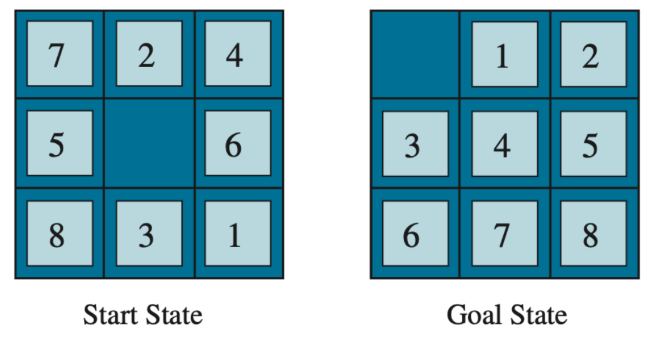

# A\* Search

Minimises both path cost so far *and* estimated cost to goal,
``` math
f(s) = g(s) + h(s)
```

#### Admissible heuristics

A heuristic function is admissible (optimistic) if it never overestimates the true cost to the goal.
``` math
0\leq h(s) \leq h^*(s), \quad \forall s
```
where $`h^*(s)`$ is the true lowest cost to from $`s`$ to the goal.

#### Theorem

If $`h(s)`$ is admissible, A\* is guaranteed to find an optimal path to the goal.\
Because A\* never overestimates, A\* never ignores a shorter path in favour of a longer one. So when A\* reaches the goal for the first time, it is guaranteed to be the optimal one.

#### Example

2D grid: Manhatten distance (for strictly vertical and horizontal movements)
``` math
h(s) = |x_s - x_g| + |y_s - y_g|
```
where $`(x_s, y_s)`$ is coordinate of state $`s`$ and $`(x_g, y_g)`$ is coordinate of goal state.\
The actual steps needed is at least equal to the number of horizontal steps + vertical steps.

#### Example

Unrestricted movement in 2D space: Euclidean distance
``` math
h(s) = \sqrt{(x_s - x_g)^2 + (y_s - y_g)^2}
```

#### Example

8-puzzle

<figure id="fig:my_handwritten_notes" data-latex-placement="H">

<figcaption><span class="math inline"><em>h</em>(<em>s</em>)</span> = number of misplaced tiles or sum of Manhatten distances of each tile to their goal position</figcaption>
</figure>
