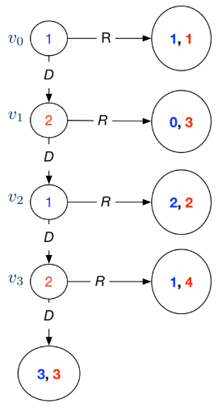

# Game Trees - Backward Induction

<div class="algorithm">

$`done \leftarrow leaves((S, E))`$

</div>

    # Zermelo's Algorithm
    done ← leaves((S, E))
    while done ≠ S:
        next ← { s' ∈ S ∖ done | children(s', (S, E)) ⊆ done }
        for s ∈ next:
            i ← owner(s)
            C ← children(s, (S, E))
            O ← arg max_{s' ∈ C} uᵢ(s')          # optimal choices
            s'' ← any element of O
            for j ∈ N:
                uⱼ(s) ← uⱼ(s'')                   # back utilities up
            done ← done ∪ {s}                     # we have processed s

Extensive form games are games that are played sequentially. It can be defined by
``` math
G = (N, (S, E, s_0), owner, a, u_1,\ldots,u_n)
```

- $`N = \{1,\ldots,n\}`$ is the set of players

- $`(S, E, s_0)`$ is a finite tree with vertex set $`S`$, edge set $`E \subset S \times S`$, and root $`s_0 \in S`$.

- $`owner: interior((S, E))\rightarrow N`$ specifies the owner of each decision node

- $`a: E \rightarrow A`$ associates each edge $`(s, s') \in E`$ with an action

- $`u_i : leaves((S, E))\rightarrow\mathbb{R}`$ is $`i`$’s utility function.

Zermelo’s Algorithm / backward induction can solve extensive form games

- Is guaranteed to terminate

- runs in time polynomial in the size of the game tree, $`O(b^d)`$

- finds optimal strategies for both players

**Example** Centipede Game

<figure id="fig:my_handwritten_notes" data-latex-placement="H">
<p> <span id="fig:my_handwritten_notes" data-label="fig:my_handwritten_notes"></span></p>
</figure>

Based on Zermelo’s Algorithm,

1.  At $`v_3`$, Player 2 chooses $`R`$, since 4\>3. $`v_3`$ effectively becomes the payoff (1, 4).

2.  At $`v_2`$, Player 1 chooses $`R`$, since 2\>1. $`v_2`$ effectively becomes the payoff (2, 2).

3.  At $`v_1`$, Player 2 chooses $`R`$, since 3\>2. $`v_1`$ effectively becomes the payoff (0, 3).

4.  At $`v_0`$, Plyaer 1 chooses $`R`$, since 1\>0. $`v_0`$ effectively becomes the payoff (1, 1).

Based on backward induction, when both players are perfectly rational and can predict each other’s moves, Player 1 just chooses $`R`$ and stops the game.\
The paradox is that they could each have had a greater payoff of (3, 3) if they trusted each other (deviating from the rational path) and played $`D`$ all the way.
