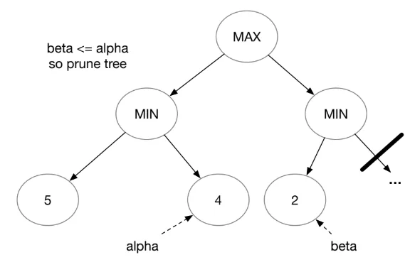

# Minimax Search

<div class="algorithm">

$`done \leftarrow leaves((S, E))`$

</div>

    # Minimax search
    done ← leaves((S, E))
    while done ≠ S:
        next ← { s' ∈ S ∖ done | children(s', (S, E)) ⊆ done }
        for s ∈ next:
            C ← children(s, (S, E))
            if owner(s) = 1:
                O ← arg max_{s' ∈ C} u(s')        # maximise
            else:
                O ← arg min_{s' ∈ C} u(s')        # minimise
            s'' ← any element of O
            u(s) ← u(s'')                         # back score up
            done ← done ∪ {s}

- Here, we are concerned with zero sum games, which are a subset of extended form games.

- For a two player zero sum game (where one player’s win is the other player’s loss)
  ``` math
  G = (N = \{1, 2\},\: (S, E, s_0),\: owner,\: a,\: u)
  ```

  - The components are almost the same as extended form games, except:

  - $`N = \{1,2\}`$ is set of two players

  - $`u: leaves((S, E))\rightarrow \{1,-1\}`$ gives the scores for player 1. The score of player 2 is the negation of score of player 1.

- Minimax is a variation of backward induction, optimised for zero sum games.

## Depth-limited minimax with heuristics

In practice, real game trees are too large for full backward induction. We want to use depth-limited search. We then have to replace the exact utilities at new leaves with some heuristic evaluations. For example, in chess it might be $`h(s) = 9Q + 5R + 3B`$.

## Alpha-beta pruning

An optimisation for minimax.

<figure id="fig:my_handwritten_notes" data-latex-placement="H">
<p> <span id="fig:my_handwritten_notes" data-label="fig:my_handwritten_notes"></span></p>
</figure>

- Keep track of $`\alpha`$, the best (highest) value that Maximiser has found so far.

- $`\beta`$ is the lowest value that Maximiser has found so far.

- If $`\beta \leq \alpha`$, stop searching a branch. There is no point as Maximiser cannot get a higher value $`\alpha`$.
