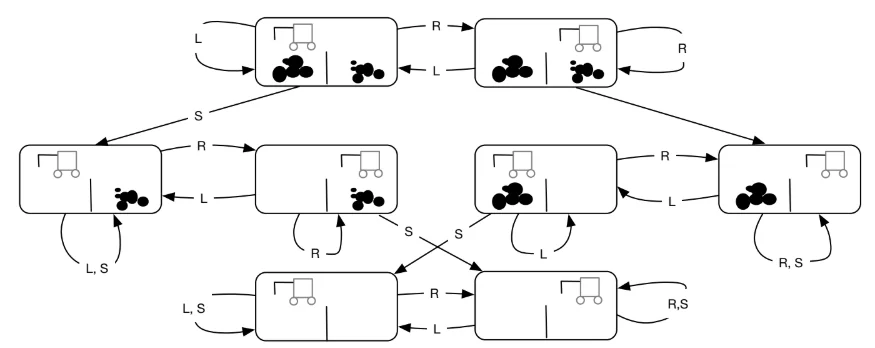

# State Transition Graph

<figure id="fig:my_handwritten_notes" data-latex-placement="H">

<figcaption>State transition graph with valid states and transition/actions</figcaption>
</figure>

**Defining state vector in Code**\

    class VacuumWorldState:
        def __init__(self, 
                     dirtLeft=True, 
                     dirtRight=True, 
                     robotLeft=True):
            self.dirtLeft = dirtLeft
            self.dirtRight = dirtRight
            self.robotLeft = robotLeft

        def robotRight(self):
            return not self.robotLeft
