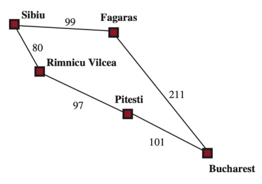

# Uniform Cost Search

<div class="algorithm">

</div>

    function UCS(P = ⟨S, s₀, A, τ, c, G⟩):
        g(s) ← ∞  for all s ∈ S
        agenda ← {s₀}                     # agenda is a set
        while agenda ≠ ∅:
            C ← arg min_{s ∈ agenda} g(s)
            s' ← any element of C
            if s' ∈ G:                    # goal found?
                return "done"
            for a ∈ A:                    # expand s
                s'' ← τ(s', a)
                update g(s'')  (replace existing value if smaller)
                agenda ← agenda ∪ {s''}

- We have the cost function
  ``` math
  c: S \times A \times S \rightarrow \mathbb{R}
  ```

- UCS involves keeping cost of the path to any node. Let this be $`g(s) \in \mathbb{R}`$.

- UCS utilises a priority queue, where the priority is the path cost.

- UCS expands cheapest nodes first (in order of incerasing path cost).

- Always finds optimal path if costs are non-negative ($`\implies`$ path costs either stay the same or increase). If UCS found the goal with cost $`C`$, there can’t be another path with cost $`C' < C`$, since UCS would already have expanded the path, by definition of the priority queue.

- UCS becomes BFS when all step costs are equal.

<figure data-latex-placement="H">
<div class="minipage">

</div>
<div class="minipage">
<p>Execution Example</p>
<ul>
<li><p>Successors are Rimnicu (80) and Fagaras (99)</p></li>
<li><p>Rimnicu is selected for expansion</p></li>
<li><p>Successor is Pitesi (<span class="math inline">80 + 97 = 177</span>)</p></li>
<li><p>Least cost is now Fagaras</p></li>
<li><p>Successor is Bucharest (<span class="math inline">99 + 211 = 310</span>)</p></li>
<li><p>Pitesi now selected for expansion</p></li>
<li><p>Bucharest updated (<span class="math inline">80 + 97 + 101 = 278</span>)</p></li>
<li><p>Bucharest selected for expansion; goal reached with optimal path</p></li>
</ul>
</div>
<figcaption>Handwritten diagram</figcaption>
</figure>
