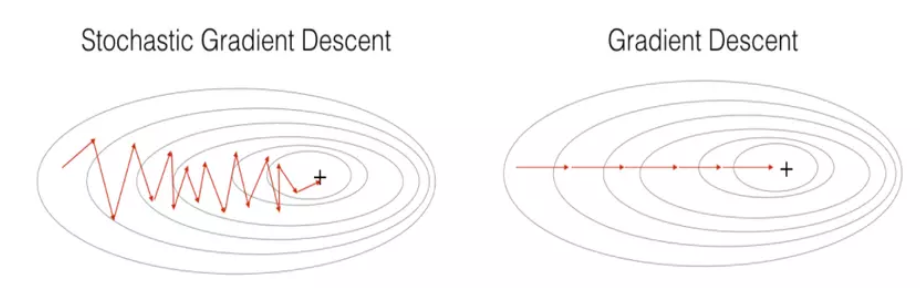
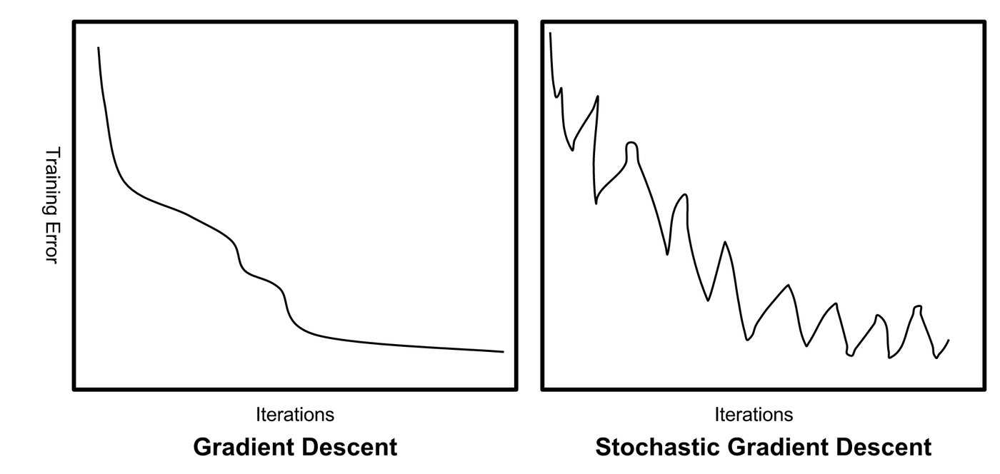

# Optimisation in ML

## Optimisation Formulations

In machine learning, the goal is always to find the best set of parameters $`w`$ for a model. "Best" means the model performs as well as possible, and can be formally defined as an optimisation problem, specifically minimising or maximising some objective function.\
4 main ways.

#### Empirical Loss Minimisation

Given a dataset of $`n`$ training examples ($`x_i, y_i`$), we want to find parameters $`w`$ that minimise the average loss over all examples.
``` math
\min_w \left\{ \frac{1}{n} \sum_{i=1}^{n} \ell(h_w(x_i), y_i) \right\}
```
For example, in linear regression, $`h_w(x)=w^T x`$ and the loss is squared error $`\ell(\hat{y},y)=(\hat{y}-y)^2`$.

#### Regularised Empirical Loss Minimisation

Regularisation aims to prevent overfitting.
``` math
\min_w \left\{ \frac{1}{n} \sum_{i=1}^{n} \ell(h_w(x_i), y_i) + \frac{\lambda}{2} \|w\|^2 \right\}
```
Regularisation term $`\frac{\lambda}{2} \|w\|^2`$ aims to keep the weights small, making the model simpler.\
This is also called L2 regularisation (taking squared of weights).

#### Maximum Likelihood Estimation

This is now from a probabilistic perspective: finding the parameters that make the observed data most probable.
``` math
\max_{\theta \in \Theta} \left\{ \sum_{i=1}^{n} \log p_\theta(X_i) \right\}
```

#### Maximum a Posteriori (MAP) Estimation

MLE only uses the data. MAP includes any prior beliefs about what the parameters should look like, before seeing any data.
``` math
\max_{\theta \in \Theta} \left\{ \sum_{i=1}^{n} \log p(X_i | \theta) + \log p(\theta) \right\}
```
The log-prior term $`\log p(\theta)`$ encodes belief about $`\theta`$.\
If the prior is Gaussian ($`p(\theta) = \mathcal{N}(0,\sigma^2)`$), then $`\log p(\theta) \propto -\|\theta\|^2`$. MAP then becomes identical to regularised ERM. Hence L2 regularisation is equivalent to placing a Gaussian prior on the parameters.

## Mathematical Properties of Functions

### Lipschitz smoothness

Describes how quickly the gradient can change.\
$`\phi: \mathbb{R}^d \to \mathbb{R}`$ is $`L`$-smooth if $`\phi`$ is differentiable and its gradient $`\nabla\phi`$ is $`L`$-Lipschitz continuous:
``` math
\|\nabla\phi(w) - \nabla\phi(w')\| \leq L\|w - w'\|, \quad \forall w, w' \in \mathbb{R}^d
```
This means if you move a little in parameter space from $`w`$ to $`w'`$, the gradient cannot change by more than $`L`$ times that distance. The gradient is not allowed to change abruptly.

- Small $`L`$: the gradient changes slowly, the function is very smooth.

- Large $`L`$: the gradient can change faster, the function has sharper features but is still controlled.

Note: $`\nabla`$ is the gradient operator. It collects all the partial derivatives of a function into a vector. If $`w = (w_1, w_2, \ldots, w_d)`$, then
``` math
\nabla\phi(w) = \begin{pmatrix} \frac{\partial\phi}{\partial w_1} \\ \frac{\partial\phi}{\partial w_2} \\ \vdots \\ \frac{\partial\phi}{\partial w_d} \end{pmatrix}
```
It is a vector that points in the direction of steepest increase of $`\phi`$ at the point $`w`$. In 1D, $`\nabla\phi(w)`$ is just the ordinary derivative $`\phi'(w)`$.

#### Sufficient condition

A way to verify $`L`$-smoothness is through the Hessian (the matrix of second derivatives):
``` math
\nabla^2\phi(w) \preceq LI_d \quad \text{for any } w
```
$`\nabla^2\phi(w)`$ is the Hessian, the matrix of second derivatives. It shows how fast the gradient is changing at $`w`$.
``` math
\nabla^2\phi(w) = \begin{pmatrix} \frac{\partial^2\phi}{\partial w_1^2} & \frac{\partial^2\phi}{\partial w_1 \partial w_2} & \cdots \\ \frac{\partial^2\phi}{\partial w_2 \partial w_1} & \frac{\partial^2\phi}{\partial w_2^2} & \cdots \\ \vdots & & \ddots \end{pmatrix}
```
In 1D, the Hessian is just the second derivative $`\phi''(w)`$.\
The $`\preceq`$ means the matrix inequality - all eigenvalues of $`\nabla^2\phi(w)`$ are at most $`L`$. This bounds how curved the function can be in any direction.\
In 1D, for $`\phi(w)=w^2`$, the Hessian is just the scalar $`\phi''(w)=2`$. The single eigenvalue is 2. So the function is $`L`$-smooth with $`L=2`$.

#### Key inequality

If $`\phi`$ is $`L`$-smooth, then for any $`w`$, $`w'`$:
``` math
|\phi(w') - \phi(w) - \nabla\phi(w)^\top(w' - w)| \leq \frac{L}{2}\|w' - w\|^2
```
The first-order Taylor approximation of $`\phi`$ at point $`w`$ is:
``` math
\phi(w')\approx \phi(w) + \nabla\phi(w)^\top(w' - w)
```
where $`\nabla\phi(w)^\top(w' - w)`$ is a dot product, it measures how much the function is expected to change as you move from $`w`$ to $`w'`$, based on the gradient at $`w`$ alone.\
The true value $`\phi(w')`$ and the approximation $`\phi(w) + \nabla\phi(w)^\top(w' - w)`$ are not exactly. So the left side of the inequality is exactly the error of the tangent approximation — how far off the linear approximation is from the true value.\
This error is at most $`\frac{L}{2}\|w' - w\|^2`$. The function is sandwiched within a quadratic bowl around the tangent plane.\
This inequality is what lets us prove each GD step reduces the objective. How much the function changes per step can be bound.

### Strong convexity

$`\phi:\mathbb{R}^d\to\mathbb{R}`$ is $`\mu`$-strongly convex if:
``` math
\phi(w') \geq \phi(w) + \nabla\phi(w)^\top(w' - w) + \frac{\mu}{2}\|w' - w\|^2, \quad \forall w, w' \in \mathbb{R}^d
```
Comparing to the smoothness inequality: While smoothness gives an upper bound (the function doesn’t grow faster than a quadratic), strong convexity gives a lower bound (the function grows at least as fast as a quadratic).\
Together, smoothness and strong convexity sandwich the function between two parabolas, which is what makes optimization tractable and fast.\
This also means the function curves upward everywhere, and it curves upward by at least $`\mu`$. This guarantees a unique global minimum exists, and the function does not have flat regions or saddle points to get stuck in.

#### Sufficient condition

``` math
\nabla^2\phi(w) \succeq \mu I_d \quad \text{for any } w
```
All eigenvalues of the Hessian are at least $`\mu > 0`$ everywhere. The function is uniformly curved upward in every direction.

#### The PL-Condition (Polyak-Łojasiewicz)

From the strong convexity definition, we can derive the PL-condition:
``` math
\|\nabla\phi(w)\|^2 \geq 2\mu\left(\phi(w) - \min_w \phi(w)\right)
```
This means the gradient norm squared is always at least $`2\mu`$ times the suboptimality gap.

- If you are far from the minimum (large suboptimality gap), the gradient is large — GD takes big steps.

- If you are close to the minimum (small gap), the gradient is small — but the PL-condition guarantees it is not too small relative to how far you still are.

This rules out the gradient vanishing before you reach the minimum, which is what guarantees convergence.\
\
Taking $`L`$-smoothness and $`\mu`$-strong convexity together,
``` math
\mu I_d \preceq \nabla^2 \phi(w) \preceq LI_d
```
The function is squeezed between two parabolas with curvatures $`\mu`$ and $`L`$.\
This leads to the condition number:
``` math
\kappa = \frac{L}{\mu}
```

- $`\kappa`$ close to 1: the function is nearly spherical, easy to optimize.

- $`\kappa`$ very large: the function is elongated and narrow, much harder to optimize (gradient descent zigzags).

## Gradient descent

### The update rule

Gradient descent generates a sequence of parameters starting from some initial point $`w_0`$:
``` math
w_{t+1} = w_t - \eta_t \nabla F(w_t)
```

- $`w_t`$: current parameter estimate at step $`t`$.

- $`\nabla F(w_t)`$: gradient at current point, pointing in the direction of steepest increase.

- $`-\nabla F(w_t)`$: negative gradient, pointing in the direction of steepest decrease.

- $`\eta_t`$: step size (learning rate) at step $`t`$, controlling how far to move.

  - Too large $`\eta > \frac{2}{L}`$: Might overshoot leading to the objective increasing.

  - Too small: progress too slow, too many steps needed.

  - Just right $`\eta = \frac{1}{L}`$: guaranteed decrease of $`\frac{1}{2L}\|\nabla F(w_t)\|^2`$ per step.

  - Hence $`0 < \eta < \frac{1}{L}`$.

Why negative gradient direction?
``` math
\frac{d}{dt}F(w - t\nabla F(w))\bigg|_{t=0} = -\|\nabla F(w)\|^2
```
If we start a point $`w`$ and move in the direction $`-\nabla F(w)`$ by a tiny amount $`t`$, the LHS measures the rate of change of $`F`$ as we move in that direction. The result is the RHS, which is always negative. This formally proves that moving in the negative gradient direction always locally decreases the objective.\
**The gradient is orthogonal to the contour.**\
A contour (level set) is a curve along which the function value stays constant. The negative gradient therefore points directly inward, toward lower contours, which is exactly the direction GD moves.

#### Optimisation complexity

We need to define how fast the convergence is.\
Iteration complexity is the number of steps $`t`$ needed so that
``` math
F(w_t) - F(w_*) \leq \epsilon
```
This is also the suboptimality gap. We want to know how many iterations until this gap is smaller than our required accuracy $`\epsilon`$.

#### Convergence rate of GD

Using the Lipschitz smoothness and PL-condition, we get the following key results.\

1.  **Guaranteed decrease per step**\
    Each step size is
    ``` math
    \eta = \frac{1}{L}
    ```
    Then
    ``` math
    F(w_{t+1}) \leq F(w_t) - \frac{1}{2L}\|\nabla F(w_t)\|^2
    ```
    Each step decreases the objective by at least $`\frac{1}{2L}\|\nabla F(w_t)\|^2`$. The smoother the function (larger $`L`$), the more cautiously GD must step, so the smaller the guaranteed decrease per step.\

2.  **Exponential shrinking of the gap**
    ``` math
    F(w_T) - F(w_*) \leq \left(1 - \frac{\mu}{L}\right)^T(F(w_0) - F(w_*))
    ```
    The suboptimality gap shrinks exponentially with each step. The factor $`(1 - \frac{\mu}{L})`$ is always between 0 and 1, so repeated multiplication (to the power of $`T`$) drives the gap to zero.\

3.  **Iteration complexity**
    ``` math
    T \geq \frac{L}{\mu}\log\frac{F(w_0) - F(w_*)}{\epsilon}
    ```
    At least $`T`$ number of steps are needed to guarantee the suboptimality gap is below $`\epsilon`$. $`F(w_0) - F(w_*)`$ is just a constant.
    ``` math
    O\left(\kappa \log\frac{1}{\epsilon}\right)
    ```
    2 things control how many steps GD needs:

    1.  The $`\log\frac{1}{\epsilon}`$ is favourable: getting 10x more accurate only costs a fixed number of extra steps.

    2.  The $`\kappa = \frac{L}{\mu}`$ is a bottleneck: A large condition number means the landscape is poorly shaped (steep in some directions, flat in others). GD might struggle here.

    Both $`L`$ and $`\mu`$ are properties of the problem itself.

## Scaling problem with GD on large datasets

GD has a practical problem when applied to machine learning with large datasets.\
The empirical risk minimisation for GD:
``` math
\min_{w \in \mathbb{R}^d} \left\{ F(w) = \frac{1}{n}\sum_{i=1}^{n} f_i(w) \right\}
```
where each $`f_i(w)`$ is the loss on a single training example $`i`$. The total objective $`F(w)`$ is an average over all $`n`$ training examples. This is called a finite sum problem.\
However, in the GD update rule we need the gradient of $`F(w)`$. Taking the gradient of the finite sum:
``` math
\nabla F(w) = \frac{1}{n}\sum_{i=1}^{n} \nabla f_i(w)
```
To compute this, we must compute $`\nabla f_i(w)`$ for every single data point $`i = 1, 2, \ldots, n`$, then average them. Every single GD step requires a full pass through the entire dataset.\
Hence GD is computationally expensive as the cost per step grows directly with dataset size $`n`$.

#### Two complexity measures

We saw iteration complexity: the number of GD steps to achieve $`\epsilon`$-error:
``` math
O\left(\kappa\log\frac{1}{\epsilon}\right)
```
This does not depend on $`n`$, only counts steps.\
There is also total complexity: total number of accesses to individual component gradients $`\nabla f_i`$ to achieve $`\epsilon`$-error:
``` math
O\left(n\kappa\log\frac{1}{\epsilon}\right)
```
This scales with $`n`$ because each GD step requires computing $`n`$ individual gradients.

## Stochastic Gradient Descent (SGD)

<figure id="fig:your_custom_label" data-latex-placement="H">

<figcaption>SGD vs GD</figcaption>
</figure>

<figure id="fig:your_custom_label" data-latex-placement="H">

<figcaption>SGD vs GD error</figcaption>
</figure>

SGD is the direct solution to the scaling problem of GD. Instead of computing the gradient over all $`n`$ data points at every step, SGD approximates the gradient using just one randomly picked data point per step. This makes each step $`n`$ times cheaper.\
The standard GD update step is:
``` math
w_{t+1} = w_t - \eta_t \nabla F(w_t)
```
Now the SGD update is:
``` math
w_{t+1} = w_t - \eta_t \nabla f_{i_t}(w_t), \quad i_t \sim \text{Uniform}\{1, 2, \dots, n\}
```
The only difference is that SGD uses one randomly sampled gradient instead of the average of all $`n`$ gradients.\
The stochastic gradient is a valid substitute for the full gradient because it is an unbiased estimator of it:
``` math
\mathbb{E}_{i_t}[\nabla f_{i_t}(w_t)] = \nabla F(w_t)
```
Since $`i_t`$ is drawn uniformly from $`\{1,2,\ldots,n\}`$, the expected value of any single $`\nabla f_{i_t}(w_t)`$ is exactly the average over all $`n`$ gradients, which is $`\nabla F(w_t)`$. So SGD is the same as GD in expectation at every step:
``` math
\mathbb{E}_{i_t}[w_{t+1}] = w_t - \eta_t \nabla F(w_t)
```
This means on average, each SGD step moves in the right direction. Any single step may be noisy and imprecise, but averaged over many steps, SGD heads toward the minimum.\
\
**Comparison of complexities**\

<div class="table-wrap">

<table>
<thead>
<tr>
<th style="text-align: center;"></th>
<th colspan="2" style="text-align: center;">Iteration Complexity</th>
<th colspan="2" style="text-align: center;">Total Complexity</th>
</tr>
</thead>
<tbody>
<tr>
<td style="text-align: center;"></td>
<td style="text-align: center;">GD</td>
<td style="text-align: center;">SGD</td>
<td style="text-align: center;">GD</td>
<td style="text-align: center;">SGD</td>
</tr>
<tr>
<td style="text-align: center;">Strongly convex</td>
<td style="text-align: center;"><span class="math inline">$O\left(\kappa\log\frac{1}{\epsilon}\right)$</span></td>
<td style="text-align: center;"><span class="math inline">$\tilde{O}\left(\kappa\log\frac{1}{\epsilon} + \frac{\kappa\sigma^2}{\mu\epsilon}\right)$</span></td>
<td style="text-align: center;"><span class="math inline">$O\left(n\kappa\log\frac{1}{\epsilon}\right)$</span></td>
<td style="text-align: center;"><span class="math inline">$\tilde{O}\left(\kappa\log\frac{1}{\epsilon} + \frac{\kappa\sigma^2}{\mu\epsilon}\right)$</span></td>
</tr>
</tbody>
</table>

</div>

\
\
For GD, each step accesses all $`n`$ components, so the total complexity (GD) is the iteration complexity (GD) times n.\
For SGD, each step only accesses 1 component, so the total complexity (SGD) = iteration complexity (SGD).\
SGD iteration complexity:
``` math
\tilde{O}\left(\kappa\log\frac{1}{\epsilon} + \frac{\kappa\sigma^2}{\mu\epsilon}\right)
```
SGD needs more iterations than GD because each step is noisy. There are two terms:

1.  $`\kappa \log \frac{1}{\epsilon}`$: same as GD, this is the base number of steps needed.

2.  $`\frac{\kappa \sigma^2}{\mu \epsilon}`$: extra steps needed because of the noise from using only one gradient per step. $`\sigma^2`$ measures how different individual gradients $`\nabla f_i(w)`$ are from each other. If individual gradients vary widly, t he higher the variance $`\sigma^2`$, the noisier the steps, hence more steps SGD needs to compensate.

For large $`n`$, SGD’s total complexity is free of $`n`$, compared to GD’s total complexity which scales with $`n`$. SGD can perform $`n`$ steps for the same cost as one GD step, so even though each SGD step is noisier and less accurate, the sheer volume of steps compensates. SGD is the standard method in large scale machine learning.\
\
**Step size**\
The step size for GD was simply $`\eta = \frac{1}{L}`$.\
The step size for SGD is more carefully chosen:
``` math
\eta = \min\left\{\frac{\mu\epsilon}{L\sigma^2}, \frac{1}{L}\right\}
```
The extra term to consider keeps the step size small enough to control the noise from the variance $`\sigma^2`$. The noisier the gradients, the smaller the step must be to prevent SGD from bouncing around and overshooting.\
So SGD needs to consider gradient noise in addition to smoothness when choosing step size.\
Note that $`\tilde{O}`$ is used for SGD as the exact complexity involves some hidden logaorithmic factors, but is basically the same as $`O`$.

# Sampling

## Monte-Carlo Integration

Under sampling, we want to estimate expectations of functions under some probability distribution.\
Given a probability distribution $`p`$ and a function $`f`$, we want to compute:
``` math
\mathbb{E}_{X \sim p}[f(X)] = \int f(x)p(x)dx
```
i.e. the values of $`f(x)`$ weighted by how probable each $`x`$ is.\
However, this integral is often intractable, meaning there is no closed form solution. $`p`$ may be too complex or the integral may be over a very high-dimensional space when standard numerical integration becomes computationally impossible.\
\
Monte-Carlo integration approximates the integral using random samples.

- Step 1: Draw $`M`$ random samples from $`p`$:
  ``` math
  x_1, x_2, \dots, x_M \sim p(x)
  ```

- Step 2: Approximate the expectation by averaging $`f`$ over the samples:
  ``` math
  \frac{1}{M}\sum_{i=1}^{M} f(x_i) \approx \mathbb{E}_{X \sim p}[f(X)]
  ```

If $`x_1,\ldots,x_M`$ are i.i.d, samples from $`p`$, then by Law of Large Numbers, the sample average converges to the true expectation as $`M\to\infty`$.
``` math
\frac{1}{M}\sum_{i=1}^{M} f(x_i) \xrightarrow{M \to \infty} \mathbb{E}_{X \sim p}[f(X)]
```
The approximation error shrinks to zero with more samples.\
\
The Monte-Carlo integration sounds simple, but the requirement is that we must be able to draw samples from $`p(x)`$. In practice this may be hard because:

- $`p(x)`$ may only be known up to a normalizing constant.

- $`p(x)`$ may be a complex high dimensional distribution like a posterior in Bayesian inference.

## Bayesian Regression

Bayesian regression is a probabilistic approach to regression. Unlike standard regression which finds a single best set of parameters, Bayesian regression maintains a full probability distribution over parameters. This allows it to express uncertainty in its predictions, which is very useful in practice.\
**Posterior distribution**\
After observing training inputs $`\mathbf{X}`$, the training data (outputs) $`\mathbf{y}`$ we update our belief about $`w`$ using Bayes’ theorem:
``` math
p(w|\mathbf{y}) \propto p(\mathbf{y}|w, \mathbf{X})p(w) = \prod_{i=1}^{n} p(y_i|x_i, w)p(w)
```
The posterior $`p(w|\mathbf{y})`$ combines the likelihood $`\prod_{i=1}^{n} p(y_i|x_i, w)`$ of $`n`$ independent training examples and the prior $`p(w)`$.\
**Predictive distribution**\
Given a new input $`x`$, we want to predict new output $`y`$. Instead of plugging in the best $`w`$ like in standard regression, we need to average the prediction over all possible values of $`w`$, weighted by how probable each $`w`$ is under the posterior:
``` math
p(y|\mathbf{y}, x) = \int p(y|w, x)p(w|\mathbf{y})dw
```
This is an expection of $`p(y|w,x)`$ under the posterior distribution $`p(w|\mathbf{y})`$.\
Monte-Carlo approximates the predictive distribution integral above by drawing samples $`w_1,\ldots, w_M`$ from the posterior $`p(w|\mathbf{y})`$ and averaging:
``` math
\frac{1}{M}\sum_{i=1}^{M} p(y|w_i, x) \approx p(y|\mathbf{y}, x)
```

## Langevin Monte-Carlo (LMC)

So we need to draw samples from the posterior $`p(w|\mathbf{y})`$ to approximate the predictive distribution, but the posterior is too complex to sample from directly. LMC algorithm is a gradient-based sampling method, that constructs a sequence of points that gradually converges to the target distribution. Recall that the update step for GD is:
``` math
w_{t+1} = w_t - \eta\nabla F(w_t)
```
The LMC update is:
``` math
w_{t+1} = w_t + \eta\nabla\log p(w_t) + \sqrt{2\eta}\xi_k, \quad \xi_k \sim \mathcal{N}(0, I_d)
```
The gradient term ($`\eta\nabla\log p(w_t)`$) is positive, because we want to maximise the log probability, moving towards regions of high probability.\
There is an extra noise term $`\sqrt{2\eta}\xi_k`$, which is a random Gaussian pertubation added at every step.

- Without the noise term, LMC would just be gradient ascent on $`log p(w)`$, converging to a single point - the mode of the distribution. That is MAP estimation, not sampling.

- Exploration: the random perturbation prevents the chain from getting stuck at a single point. It forces the algorithm to explore the full distribution, not just climb to the peak.

- Correct distribution: the specific scaling $`\sqrt{2\eta}`$ is chosen so that the sequence of points $`w_0,w_1,\ldots`$ asymptotically follows the target distribution $`p(w)`$. So the noise and gradient terms together produce the right balance so that regions of high probability are visited proportionally more often.

2 issues with LMC:

1.  Burn-in period: The sequence $`w_0, w_1, \ldots`$ starts from some arbitrary point $`w_0`$, which is likely far from the target distribution. The early particles are therefore not representative samples - they are just the algorithm finding its way toward the high probability region.\
    The burn-in period is the initial phase of the chain that we discard. Only after burn-in do the particles start resembling samples from the true distribution.

2.  Sample correlation: Consecutive samples $`w_t`$ and $`w_{t+1}`$ are highly correlated because each step only moves a small distance. Using correlated samples defeats the purpose of Monte-Carlo: we need approximately independent samples for the average to be accurate.\
    The solution is thinning: we run the chain for many steps but only retain every $`k`$-th sample, discarding the intermediate ones. This reduces correlation between retained samples.

Note: LMC draws samples $`w_0, w_1, \ldots`$ from $`p(x)`$ when we cannot sample directly, and MC integration then uses those to approximate some intractable integral.\
In the context of Bayesian regression, LMC draws samples from the posterior $`p(w|\mathbf{y})`$, and MC integration approximates the predictive distribution $`p(y|\mathbf{y},x)`$.

## Bayesian Inference with LMC

To perform Bayesian Inference, the LMC update rule becomes:
``` math
w_{t+1}=w_{t}+\eta\nabla log~p(w_{t}|y)+\sqrt{2\eta}\xi_{k}
```
where the gradient of the log posterior is:
``` math
\nabla log~p(w_{t}|y)=\Sigma_{i=1}^{N}\nabla~log~p(y_{i}|x_{i},w)+\nabla~log~p(w)
```
The posterior distribution $`p(w|y)`$ is the target PDF $`p`$. We want to sample from this posterior distribution.\

- $`\Sigma_{i=1}^{N}\nabla~log~p(y_{i}|x_{i},w)`$ is the gradient of the log likelihood, summed over all training examples. This is the data-driven term, pushing $`w`$ toward parameters that explain the data well.

- $`\nabla\log p(w)`$ is the gradient of the log prior. For the Gaussian prior $`\mathcal{N}(0,\sigma_0^2)`$, this equals $`-\frac{w}{\sigma_0^2}`$, pulling $`w`$ back to zero.

These two terms together balance fitting the data and staying close to the prior, which is the same tension as regularised ERM.
