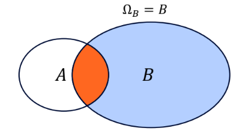

# Conditional Probability

## Joint Probability

Considering 2 events A and B, the probability that both occur together is
``` math
P(A \cap B)
```
Events A and B are independent iff
``` math
P(A \cap B) = P(A)P(B).
```
A set of events $`\{A_i \mid i \in I\}`$ is independent iff for every finite subset J $`\subset`$ I,
``` math
P(\cap_{i \in J}A_i) = \prod_{i \in J}P(A_i).
```

Eg: Flipping a coin twice, with\
A = {Heads on first flip}, B = {Heads on second flip}\
Then $`P(A \cap B) = P(A)P(B) = (\frac{1}{2})(\frac{1}{2}) = \frac{1}{4}`$

## Conditional Probability

Suppose some event B has occured, and the event of interest is A,\
the conditional probability of A given B is
``` math
P_{B}A = P(A \mid B) = \frac{P(A \cap B)}{P(B)}\text{ ,  for P(B)}> 0.
```

1.  $`0 \leq P_B(A) \leq 1`$ $`\because (A \cap B) \subset B \Rightarrow 0 \leq P(A \cap B) \leq P(B)
        \Rightarrow 0 \leq \frac{P(A \cap B)}{P(B)} \leq 1.`$

2.  $`P_B(B) = 1`$ $`\because P(B \cap B) = P(B) \Rightarrow \frac{P(B \cap B)}{P(B)} = 1`$

3.  If $`A_1, A_2, \ldots`$ are disjoint, then $`P_B(\bigcup_{i}A_i) = \sum_{i}P_B(A_i)`$ $`\frac{P((\bigcup_{i}A_{i}) \cap B)}{P(B)}
        = \frac{P(\bigcup_{i}(A_{i} \cap B))}{P(B)} = \frac{\sum_{i}P(A_{i} \cap B)}{P(B)}
        = \sum_{i}\frac{P(A_i \cap B)}{P(B)} = \sum_{i}P(A_{i} \mid B)`$

<div class="minipage">



</div>

<div class="minipage">

By dividing by $`P(B)`$, we normalise the universe to just B. When A occurs in this universe, B must also occur, hence we take $`P(A \cap B)`$.

</div>

If A and B are independent,
``` math
P(A \mid B) = \frac{P(A)P(B)}{P(B)} = P(A)
```
.

#### Multiplicative Rule

Following from the definition of conditional probaility, we have
``` math
P(A \cap B) = P(A \mid B)P(B)
```
For independent events A and B, $`P(A\mid B) = P(A) \Rightarrow P(A \cap B) = P(A)P(B).`$

Extending to multiple events,
``` math
\begin{align*}
    P(A \cap B \cap C) &= P(A)\cdot P(B \mid A)\cdot P(C \mid B \cap A) \\
                       &= P(A \mid B \cap C) \cdot P(B \mid C) \cdot P(C)
\end{align*}
```

#### Law of Total Probability

Let $`B_1, B_2, \ldots, B_k`$ be a partition of sample space $`\Omega`$.

(i.e. $`B_i \cap B_j = \emptyset, \forall i \neq j, and \cup_{i=1}^{k}B_{i} = \Omega.`$)

Then for any event A,
``` math
\begin{align*}
    P(A) &= \sum_{i=1}^{k} P(A \mid B_{i})P(B_{i})\\
    &= P(A \cap B_1) + P(A \cap B_2) +\ldots + P(A \cap B_k)
\end{align*}
```
*i.e. P(A) is the sum of probabilities in each scenario, weighted by each scenario’s probability.*

#### Bayes’ Theorem

For $`P(B) > 0`$,
``` math
P(A \mid B) = \frac{P(B \mid A)\cdot P(A)}{P(B)} = \frac{P(B \mid A)\cdot P(A)}{P(B\mid A)\cdot P(A) + P(B\mid A^c)\cdot P(A^c)}
```

*Derivation:* By Multiplicative Rule,
``` math
P(A \cap B) = P(A\mid B)\cdot P(B) = P(B\mid A)\cdot P(A)
```
Rearranging, we get Bayes’ Theorem.

### Naive Bayes classifier

Applications in supervised learning.

**Goal**: Classify an input (some object, e.g. an email, image, etc.) into one of several classes using probability.

Let $`C`$ be a class label (e.g. spam/not spam), and $`X = (x_1, x_2, \ldots, x_d)`$ be observed features (certain words in the email).

By Bayes’ Theorem,
``` math
P(C \mid X) = \frac{P(X \mid C)P(C)}{P(X)}
```

To find the classifier $`\hat{c} := \arg\max_c P(C|X) = \arg\max_c P(X|C)P(C).`$

Here, $`\arg\max_c P(C \mid X)`$ refers to finding the class $`c`$ that maximises the probability of the class given the data.

This is proportional to $`P(X \mid C)P(C)`$. We can ignore the denominator $`P(X)`$, which is a constant for all classes, $`C`$, during the maximisation process.

From the labelled data, it is easy to find $`P(C)`$. The challenge is to find
``` math
P(X \mid C) = P(x_1, x_2, \ldots, x_d \mid C).
```

The **assumption** of Naive Bayes is that all features are conditionally independent, given the class.

Then, we have
``` math
P(x_1, x_2, \ldots, x_d \mid C) = \prod_{i=1}^{d}P(x_i \mid C)
```

The Naive Bayes classifier is now
``` math
\begin{align*}
    \hat{c} &:= \arg\max_c \prod_{i=1}^{d}P(x_i \mid C)P(C) \\
            &:= \arg\max_c P(x_1 \mid C)P(x_2 \mid C)\ldots P(x_d \mid C)P(C)
\end{align*}
```

Example calculation of an email spam filter:

From the data, we have
``` math
\begin{gather*}
    P(\text{spam}) = 0.3, \quad P(\text{not spam}) = 0.7 \\
    P(x_1 \mid \text{spam}) = 0.8, \quad P(x_2 \mid \text{spam}) = 0.5, \quad P(x_3 \mid \text{spam}) = 0.3 \\
    P(x_1 \mid \text{not spam}) = 0.2, \quad P(x_2 \mid \text{not spam}) = 0.1, \quad P(x_3 \mid \text{not spam}) = 0.2
\end{gather*}
```

Given an input feature {"free", "offer", "click"} $`= \{x_1, x_2, x_3\} = \{1, 1, 0\}`$,

For class $`C`$ = spam,
``` math
P(x_1\mid C)P(x_2\mid C)P(x_3\mid C)P(C) = 0.8\cdot0.5\cdot0.7\cdot0.3 = 0.084
```

For class $`C`$ = not spam,
``` math
P(x_1\mid C)P(x_2\mid C)P(x_3\mid C)P(C) = 0.2\cdot0.1\cdot0.8\cdot0.7 = 0.0112
```

Conclusion: Likely spam.
