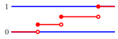
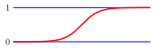
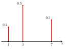
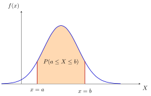
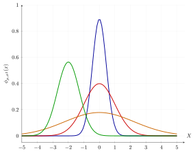
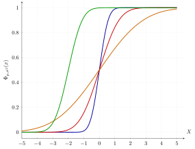
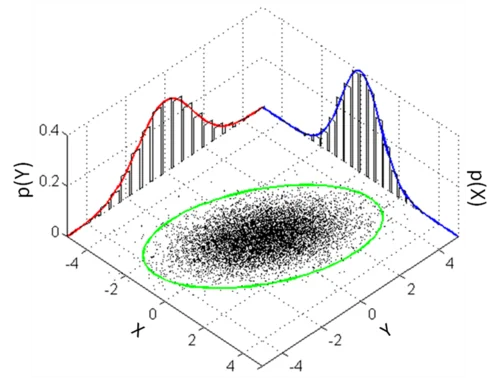

# Random Variables and Distributions

## Random variables

A random variable is a function that maps outcomes from a sample space to a real number.
``` math
X: \Omega \rightarrow \mathbb{R}
```

### Example

Rolling two dice, we have $`\Omega = {(i, j)\mid i,j\in \{1,2,3,4,5,6\}}`$.

We can define several random variables on $`\Omega`$.

1.  Sum: $`X((i,j)) = i + j`$

2.  Larger of the two: $`X((i, j)) = \max(i, j)`$

3.  Indicator of doubles: $`X(\omega) = \begin{cases}
            1 & \text{if }i = j \\
            0 & \text{else}
        \end{cases}`$

#### Discrete Random Variables

X has a finite or countably infinite range of possible values.
``` math
\text{Range}(X) = \{n_1, n_2, \ldots, n_k\} \text{ or } \{n_1, n_2, \ldots\}
```

#### Continuous Random Variables

X takes values in an uncountable subset/interval of $`\mathbb{R}`$.
``` math
\text{Range}(X) \subset \mathbb{R}\text{, an interval/continuum}
```

### Probability law of random variables

For a probability space $`(\Omega, P)`$, and random variable $`X: \Omega \rightarrow \mathbb{R}`$,

and for any set $`A \subseteq \mathbb{R}`$, the probability law/distribution of X is

``` math
P_X(A) = P(X\in A) = P(X^{-1}(A)) = P(\{\omega\in\Omega: X(\omega)\in A\})
```

Instead of discussing $`P`$ on $`\Omega`$, we look at the push-forward measure of $`P`$ by $`X`$, where $`P_X(A)`$ is the likelihood of event $`A\subseteq\mathbb{R}`$ occuring.

The corresponding sample space is $`\Omega' = \text{Range}(X) = \{X(\omega)\mid \omega\in\Omega\}`$.

We say that $`X`$ follows the probability distribution $`P_X`$.

Proof that $`P_X`$ is a valid probability measure:

1.  $`0\leq P_X(A)\leq 1`$

2.  $`P_X(\Omega') = P(X^{-1}(\Omega')) = P(\Omega) = 1`$

3.  For $`A_1, A_2,\ldots\subset\Omega',\: A_i\cap A_j=\emptyset,\:i\neq j`$, (disjoint sets)\
    $`P_X(\cup A_i) = P(X^{-1}(\cup A_{i})) = P(\cup X^{-1}(A_i))
        = \sum P(X^{-1}(A_i)) = \sum P_X(A_i)`$

## Cumulative Distribution Function

The CDF of some discrete/continuous random variable $`X`$ is
``` math
F_X(t) = P_X(\{x\mid x\leq t\}) = P(X\leq t) = P(X\in (-\infty,t])
```

<figure data-latex-placement="h">
<div class="minipage">

<p>Discrete CDF</p>
</div>
<div class="minipage">

<p>Continuous CDF</p>
</div>
</figure>

Properties:

1.  $`F_X(t)`$ is non-decreasing.

2.  $`\lim\limits_{t\to -\infty}F_X(t) = 0,\: \lim\limits_{t\to +\infty}F_X(t) = 1`$

3.  $`F_X(t)`$ is right-continuous ($`\lim\limits_{x\to t^{+}}F(x) = F(t)`$).

$`P(X\in (a, b]) = F_X(b) - F_X(a)`$.

## Probability Mass Function

The PMF of some discrete random variable $`X`$ is
``` math
p_X(x) = P_X({x}) = P(X = x)
```

<figure data-latex-placement="h">

<figcaption>Probability Mass Function</figcaption>
</figure>

Properties:

1.  $`p_X(x) \geq 0`$

2.  $`\sum\limits_{x\in \text{Range}(X)}p_X(x) = 1`$

3.  $`F_X(x) = \sum\limits_{t\leq x}p_X(t)`$\
    E.g. For the probability that a dice roll is 3 or less, we sum the PMF values for 1, 2, 3.

Referring to the discrete CDF graph, the height of each vertical jump is equal to the probability $`p_X(x)`$ of that specific value.

The CDF $`F_X(x)`$ is right-continuous to ensure that $`F_X(x) = P(X \leq x)`$ includes the probability of $`x`$ itself ($`P(X=x)`$).

Example for number of "heads" in 2 coin flips:

$`\Omega = \{(H,H), (H,T), (T,H), (T,T)\}`$,

$`X(\omega)`$ = Number of $`H`$

$`\Omega' = \text{Range}(X) = \{0,1,2\}`$
``` math
p_X(0) = \frac{1}{4},\:p_X(1) = \frac{1}{2}, \:p_X(2) = \frac{1}{4}
```

### Bernoulli Distribution

A discrete random variable $`X`$ with a Bernoulli Distribution takes two values,
``` math
X\in \{0,1\}
```
and with probability mass function
``` math
P(X=1) = p,\:P(X=0)=1-p
```
Used to model scenarios with binary outcomes, like Heads or Tails.

### Categorical Distribution

A random variable $`X`$ with a Categorical Distribution takes one of K-discrete categories,
``` math
X\in \{1,2,\ldots,K\}
```
and with probability mass function
``` math
P(X=i) = p_i,\hspace{0.5cm}p_i\geq 0,\hspace{0.5cm} \sum_{i=1}^K p_i=1
```
It is a multi-class extension of the Bernoulli Distribution. When $`K=2`$, it becomes the Bernoulli Distribution.

## Probability Density Function

The PDF of some continuous random variable $`X`$ is, (given some event A)
``` math
f_X(A) = P(X\in A) = \int_A f_X(x)\,\mathrm{d}x
```

<figure data-latex-placement="H">

<figcaption><span class="math inline"><em>P</em>(<em>a</em> ≤ <em>X</em> ≤ <em>b</em>) = ∫<sub><em>a</em></sub><sup><em>b</em></sup><em>f</em><sub><em>X</em></sub>(<em>x</em>) d<em>x</em></span></figcaption>
</figure>

Properties:

1.  $`f_X(x) = \frac{\mathrm{d}}{\mathrm{d}x}F_X(x)`$, when $`f_X`$ is continuous.\
    PDF graph is the derivative of CDF graph, and CDF is the integral of the PDF graph.

2.  $`f_X(x) \geq 0`$

3.  $`\int_{-\infty}^{+\infty}f_X(x)\mathrm{d}x = 1`$

4.  $`F_X(x) = P_X((-\infty, x]) = \int_{-\infty}^{x} f_X(t) \, dt`$

## Gaussian/Normal Distribution

The Gaussian Distribution has a symmetric bell curve shape.

Since it is a continous probability distribution, it can be modelled by a PDF or CDF.

Gaussian/normal distribution $`N(\mu,\sigma^2)`$
``` math
f_X(x) = \frac{1}{\sqrt{2\pi\sigma^2}} \exp(-\frac{(x-\mu)^2}{2\sigma^2})
```

- $`\mu`$ is the mean (center of the distribution / long-run arithmetic average value).

- $`\sigma^2`$ is the variance (spread of the distribution).

- The term $`\frac{1}{\sqrt{2\pi\sigma^2}}`$ is the normalization constant required to satisfy the condition $`\int p(x)dx = 1`$.

The **Standard Gaussian distribution** is $`N(0,1)`$.
``` math
f_{X}(x)=\frac{1}{\sqrt{2\pi}}\exp(\frac{-x^2}{2})
```

#### Proportionality ($`\propto`$)

The constant normalization factors is usually omitted for simplification. A PDF is often written as
``` math
p(x) = \frac{g(x)}{Z} \Rightarrow p(x) \propto g(x)
```

- $`g(x)`$ is the **unnormalized function** (containing $`x`$).

- $`Z`$ is the **normalization constant** (independent of $`x`$), defined as $`Z = \int g(x)dx`$.

By extension, we can identify a Gaussian by Inspection. If a function has the quadratic form in its exponent, it is a Gaussian distribution, even if the constant is missing.\
Example:
``` math
p(x) \propto \exp\left( -\frac{1}{2\sigma^2}x^2 + \frac{\mu}{\sigma^2}x \right)
```
By completing the square in the exponent, we can identify this as $`\mathcal{N}(\mu, \sigma^2)`$:
``` math
\text{RHS} = \exp\left( -\frac{1}{2\sigma^2}(x - \mu)^2 \right) \cdot \exp\left( \frac{\mu^2}{2\sigma^2} \right)
```
The term $`\exp\left( \frac{\mu^2}{2\sigma^2} \right)`$ is constant with respect to $`x`$ and can be absorbed into the proportionality constant.

<figure data-latex-placement="H">
<div class="minipage">

</div>
<div class="minipage">

</div>
<figcaption>CDF of normal distribution</figcaption>
</figure>

### Gaussian Integral

To prove that the Gaussian PDF integrates to 1, we use the standard Gaussian integral result:
``` math
\int_{-\infty}^{\infty} e^{-x^2} \, dx = \sqrt{\pi}
```
By applying the change of variable $`y = \frac{1}{\sqrt{2\sigma^2}}(x - \mu)`$, we can derive:
``` math
\int_{-\infty}^{\infty} \exp\left( -\frac{1}{2\sigma^2}(x - \mu)^2 \right) \, dx = \sqrt{2\pi\sigma^2}
```
The general form of the Gaussian integral is
``` math
\int_{-\infty}^{\infty} e^{-ax^2} \, dx = \sqrt{\frac{\pi}{a}}
```

## Bayesian Inference

### Example

- **Context:** A factory produces products labeled with a weight of 100g.

- **Data (Observations):** We sample $`n=3`$ products with weights:
  ``` math
  x_1 = 99\text{g}, \quad x_2 = 101\text{g}, \quad x_3 = 103\text{g}
  ```

- **Likelihood Model:** The actual weight $`X`$ is known to follow a Gaussian distribution with variance $`\sigma^2 = 1`$.
  ``` math
  X \sim \mathcal{N}(\mu, 1)
  ```

- **Prior Belief:** Before seeing the data, we model our uncertainty about the mean $`\mu`$ using a Prior distribution.
  ``` math
  \mu \sim \mathcal{N}(\mu_0, \sigma_0^2) = \mathcal{N}(100, 4)
  ```
  i.e. we are guessing that the mean is 100 with a variance of 4.

### The Goal

We wish to find the **posterior distribution** $`P(\mu \mid x_1, \dots, x_n)`$, which represents our updated belief about the mean $`\mu`$ after observing the data.

### Bayes’ Rule Formulation

Using Bayes’ Rule, the posterior is proportional to the likelihood times the prior:
``` math
P(\mu \mid x_1, \dots, x_n) = \frac{P(x_1, \dots, x_n \mid \mu) P(\mu)}{P(x_1, \dots, x_n)}
```
Since the denominator $`P(x_1, \dots, x_n)`$ does not depend on $`\mu`$, we treat it as a normalization constant and write:
``` math
P(\mu \mid x_1, \dots, x_n) \propto P(x_1, \dots, x_n \mid \mu) \cdot P(\mu)
```

### Defining the Components

1\. The Likelihood Function\
Since the samples are independent, the joint probability is the product of individual probabilities:
``` math
\begin{align*}
P(x_1, \dots, x_n \mid \mu) &= \prod_{i=1}^{n} P(x_i \mid \mu) \\
&= \prod_{i=1}^{n} \frac{1}{\sqrt{2\pi\sigma^2}} \exp\left( -\frac{1}{2\sigma^2}(x_i - \mu)^2 \right) \\
&\propto \exp\left( -\frac{1}{2\sigma^2} \sum_{i=1}^{n} (x_i - \mu)^2 \right)
\end{align*}
```

. The Prior Function\
Our prior belief is a single Gaussian centered at $`\mu_0`$:
``` math
\begin{align*}
P(\mu) &= \frac{1}{\sqrt{2\pi\sigma_0^2}} \exp\left( -\frac{1}{2\sigma_0^2}(\mu - \mu_0)^2 \right) \\
&\propto \exp\left( -\frac{1}{2\sigma_0^2}(\mu - \mu_0)^2 \right)
\end{align*}
```

### The Combined Equation

Multiplying the Likelihood and Prior (by adding their exponents):
``` math
P(\mu | \text{data}) \propto \exp\left( \left[ -\frac{1}{2\sigma^2} \sum_{i=1}^{n} (x_i - \mu)^2 \right] + \left[ -\frac{1}{2\sigma_0^2}(\mu - \mu_0)^2 \right] \right)
```

### The math

### Expanding the Squares

We expand the quadratic terms. Note that any term **not** containing $`\mu`$ is effectively a constant relative to $`\mu`$ and can be absorbed into the proportionality constant.
``` math
\begin{align*}
\sum_{i=1}^{n}(x_i - \mu)^2 &= \sum x_i^2 - 2\mu\sum x_i + n\mu^2 \\
(\mu - \mu_0)^2 &= \mu^2 - 2\mu\mu_0 + \mu_0^2
\end{align*}
```
Discarding terms without $`\mu`$ (like $`\sum x_i^2`$ and $`\mu_0^2`$), the relevant part of the exponent is:
``` math
-\frac{1}{2} \left[ \frac{n\mu^2 - 2\mu\sum x_i}{\sigma^2} + \frac{\mu^2 - 2\mu\mu_0}{\sigma_0^2} \right]
```

### Grouping Coefficients

We group the terms by $`\mu^2`$ and $`\mu`$:
``` math
-\frac{1}{2} \left[ \mu^2 \left( \frac{n}{\sigma^2} + \frac{1}{\sigma_0^2} \right) - 2\mu \left( \frac{\sum x_i}{\sigma^2} + \frac{\mu_0}{\sigma_0^2} \right) \right]
```
This matches the standard Gaussian form $`-\frac{1}{2\sigma_{new}^2}(\mu - \mu_{new})^2`$, which expands to $`-\frac{1}{2\sigma_{new}^2}(\mu^2 - 2\mu\mu_{new})`$.

### The posterior parameters

By comparing coefficients, we derive the Posterior Variance ($`\sigma_n^2`$) and Mean ($`\mu_n`$):

**Posterior Variance ($`\sigma_n^2`$):**
``` math
\frac{1}{\sigma_n^2} = \frac{n}{\sigma^2} + \frac{1}{\sigma_0^2} \quad \Rightarrow \quad \sigma_n^2 = \frac{\sigma^2 \sigma_0^2}{n\sigma_0^2 + \sigma^2}
```

**Posterior Mean ($`\mu_n`$):**
``` math
\frac{\mu_n}{\sigma_n^2} = \frac{\sum x_i}{\sigma^2} + \frac{\mu_0}{\sigma_0^2} \quad \Rightarrow \quad \mu_n = \sigma_n^2 \left( \frac{\sum x_i}{\sigma^2} + \frac{\mu_0}{\sigma_0^2} \right)
```

### Numerical Calculation

We apply the values from the problem:

- $`n = 3`$, $`\sum x_i = 303`$

- Data: $`\sigma^2 = 1`$

- Prior: $`\mu_0 = 100`$, $`\sigma_0^2 = 4`$

**Calculate Variance:**
``` math
\begin{equation*}
\sigma_n^2 = \frac{1 \cdot 4}{3(4) + 1} = \frac{4}{13} \approx 0.308
\end{equation*}
```

**Calculate Mean:**
``` math
\begin{equation*}
\mu_n = \frac{4}{13} \left( \frac{303}{1} + \frac{100}{4} \right) = \frac{4}{13} (303 + 25) = \frac{4}{13}(328) = \frac{1312}{13} \approx 100.92
\end{equation*}
```

**Conclusion:** The posterior distribution is $`\mu \sim \mathcal{N}(100.92, 0.308)`$.

### Interpretationss

The formulas:
``` math
\begin{align*}
\text{Variance:} \quad \hat{\sigma}_n^2 &= \frac{\sigma^2 \sigma_0^2}{n\sigma_0^2 + \sigma^2} \\
\text{Mean:} \quad \hat{\mu}_n &= \hat{\sigma}_n^2 \left( \frac{\sum x_i}{\sigma^2} + \frac{\mu_0}{\sigma_0^2} \right)
\end{align*}
```

### 1. Prior unconfidence ($`\sigma_0^2 \to \infty`$)

Imagine we have zero confidence in our prior belief (variance is infinite).

- As $`\sigma_0^2 \to \infty`$, the term $`\frac{1}{\sigma_0^2} \to 0`$.

- The prior effectively vanishes from the equation.

**Limit of the Variance:**
``` math
\begin{equation*}
\lim_{\sigma_0^2 \to \infty} \hat{\sigma}_n^2 = \frac{\sigma^2}{n}
\end{equation*}
```

**Limit of the Mean:**
``` math
\begin{equation*}
\lim_{\sigma_0^2 \to \infty} \hat{\mu}_n = \frac{\sigma^2}{n} \left( \frac{\sum x_i}{\sigma^2} + 0 \right) = \frac{1}{n} \sum_{i=1}^{n} x_i = \bar{x}
\end{equation*}
```

**Interpretation:** This recovers the **Frequentist Result**. Without a prior, our best guess is simply the sample mean ($`\bar{x}`$) and the standard error depends purely on the data variance.

### 2. Infinite Data ($`n \to \infty`$)

Imagine we collect a massive amount of data.

- The prior information ($`\mu_0, \sigma_0^2`$) becomes negligible compared to the weight of the evidence.

- We are more confident that the real mean is the sample mean.

- Note that actual data (i.e. the factory machine) still has its own variance. Our variance is the representation of our confidence.

**Limit of the Variance:**
``` math
\begin{equation*}
\lim_{n \to \infty} \hat{\sigma}_n^2 = \lim_{n \to \infty} \frac{\sigma^2 \sigma_0^2}{n\sigma_0^2 + \sigma^2} = 0
\end{equation*}
```
(Our uncertainty shrinks to zero; we become perfectly confident).

**Limit of the Mean:**
``` math
\begin{align*}
\lim_{n \to \infty} \hat{\mu}_n &= \lim_{n \to \infty} \hat{\sigma}_n^2 \left( \frac{\sum_{i=1}^n x_i}{\sigma^2} + \frac{\mu_0}{\sigma_0^2} \right) \\
&= \lim_{n \to \infty} \left( \frac{\sigma^2 \sigma_0^2}{n\sigma_0^2 + \sigma^2} \right) \frac{n\bar{x}}{\sigma^2} + \left( \frac{\sigma^2 \sigma_0^2}{n\sigma_0^2 + \sigma^2} \right) \frac{\mu_0}{\sigma_0^2} \\
&= \lim_{n \to \infty} \frac{\sigma_0^2 \bar{x}}{\sigma_0^2 + \frac{\sigma^2}{n}} + 0 \\
&= \bar{x}
\end{align*}
```
(The estimate converges to the true empirical average).

### The core philosophy of Bayesian Inference

The prior distribution compensates for the lack of data when the sample size is small.

- **Small $`n`$:** The Prior $`\mu_0`$ pulls the estimate towards our initial belief.

- **Large $`n`$:** Large sample size dominates, and the Prior is eventually forgotten.

## Multivariate Random Variables

We now consider two random variables, $`X`$ and $`Y`$, and assign probability to $`Z=(X,Y)`$.

For any set $`A\in\mathbb{R}^2`$,
``` math
P_{(X,Y)}(A) = P((X,Y)\in A) = P((X,Y)^{-1}A) = P(\{\omega\in\Omega:(X(\omega),Y(\omega))\in A\})
```
This is a joint distribution on $`X,Y`$.

### Cumulative Distributive Function

For two random variables $`X,Y`$, their CDF is
``` math
F_{X,Y}(x,y) = P(X\leq x,Y\leq y) = P(X\in (-\infty,x],Y\in(-\infty,y])
```
``` math
F_{X,Y}: \mathbb{R}^2 \rightarrow \mathbb{R}
```

### Joint Distribution/PMF (Discrete)

For two random variables $`X,Y`$, their joint PMF is
``` math
p_{X,Y}(x,y) = P_{X,Y}(\{x,y\}) = P(X=x, Y=y)
```

Properties:

1.  $`p_{X,Y}(x,y) \geq 0`$

2.  $`\sum\limits_{(x,y)\in\text{Range}(X,Y)}p_{X,Y}(x,y) = 1`$

### Marginal Distribution/PMF (Discrete)

Given the joint PMF $`p_{X,Y}(x,y)`$, the marginal distributions/PMFs of $`X`$ and $`Y`$ are found by summing over all possible values of the other variable.
``` math
p_X(x) = \sum\limits_{y}p_{X,Y}(x,y)
```
``` math
p_Y(y) = \sum\limits_{x}p_{X,Y}(x,y)
```

<div class="table-wrap">

| <span style="color: white"></span> | <span style="color: white">$`\mathbf{Y=0}`$</span> | <span style="color: white">$`\mathbf{Y=1}`$</span> | <span style="color: white"></span> |
|:---|:--:|:--:|:---|
| $`\mathbf{X=0}`$ | $`1/10`$ | $`2/10`$ | $`3/10`$ |
| $`\mathbf{X=1}`$ | $`3/10`$ | $`4/10`$ | $`7/10`$ |
|  | $`4/10`$ | $`6/10`$ | $`1`$ |

</div>

The marginal distributions are found in the margins of the table.

### Conditional Distribution/PMF (Discrete)

For discrete random variables $`X,Y`$ and $`P(Y=y) > 0`$,
``` math
P_{X\mid Y}(x\mid y) = P(X=x\mid Y=y) = \frac{P(X=x, Y=y)}{P(Y=y)}
```
The probability of $`X=x`$ given $`Y=y`$.

Multiplicative Rule:
``` math
P(X=x, Y=y) = P(X=x\mid Y=y)\cdot P(Y=y)
```
The Joint Probability is the product of the Marginal and the Conditional.

### Example (Sampling Without Replacement)

Box contains 3 white and 3 black balls. Draw 2 balls without replacement.\
$`X =`$ result of first draw ($`1 =`$ white, $`0 =`$ black)\
$`Y =`$ result of second draw ($`1 =`$ white, $`0 =`$ black)

PMF:
``` math
\begin{align*}
    P(X = 0, Y = 0) &= \frac{3}{6} \times \frac{2}{5} = \frac{1}{5}, & P(X = 1, Y = 1) &= \frac{1}{5} \\
    P(X = 0, Y = 1) &= \frac{3}{6} \times \frac{3}{5} = \frac{3}{10}, & P(X = 1, Y = 0) &= \frac{3}{10}
\end{align*}
```

Marginals:
``` math
\begin{equation*}
    P(X = 1) = \frac{1}{2}, \quad P(Y = 1) = \frac{1}{2}
\end{equation*}
```

We can conclude $`X`$ and $`Y`$ are not independent.

Conditionals:

Since $`P(X = 1, Y = 1) = \frac{1}{5}`$ and $`P(Y = 1) = \frac{1}{2}`$, the conditional distribution is:
``` math
\begin{equation*}
    P(X = 1 \mid Y = 1) = \frac{2}{5} < \frac{1}{2} = P(X=1)
\end{equation*}
```

Knowing the second ball is white makes the first less likely to be white.

### Joint Distribution/PDF (Continuous)

For continuous random variables $`X,Y`$ and $`A\subset \mathbb{R}^2`$,
``` math
P((X,Y)\in A) = \iint_A f_{X,Y}(x,y)\:\mathrm{d}x\:\mathrm{d}y
```
where $`f_{X,Y}(x,y)`$ is the joint PDF.

Properties:

1.  $`f_{X,Y}(x,y)\geq 0`$

2.  $`\iint_{\mathbb{R}^2}f_{X,Y}(x,y)\:\mathrm{d}x\:\mathrm{d}y = 1`$

### Marginal Distribution/PDF (Continuous)

Given the joint PDF $`f_{X,Y}(x,y)`$, the marginal distributions/PDFs of $`X`$ and $`Y`$ are found by integrating out the other variable.
``` math
f_X(x) = \int_{-\infty}^{+\infty}f_{X,Y}(x,y)\:\mathrm{d}y
```
``` math
f_Y(y) = \int_{-\infty}^{+\infty}f_{X,Y}(x,y)\:\mathrm{d}x
```

Properties:

1.  $`f_X(x) \geq 0`$

2.  $`\int_{-\infty}^{+\infty}f_X(x)\:\mathrm{d}x = 1`$

### Conditional Distribution/PDF (Continuous)

For continuous random variables $`X,Y`$ and $`f_Y(y) > 0`$,
``` math
f_{X\mid Y}(x\mid y) = \frac{f_{X,Y}(x,y)}{f_Y(y)}
```

Multiplicative Rule: $`f_{X,Y}(x,y) = f_{X\mid Y}(x\mid y)f_Y(y)`$

<figure id="fig:joint_comparison" data-latex-placement="htbp">
<figure>

<figcaption>Empirical Scatter Plot</figcaption>
</figure>
<figure>

<figcaption>Theoretical PDF Surface</figcaption>
</figure>
<figcaption>Comparison of Joint Probability Representations</figcaption>
</figure>

Geometrically, the conditional PDF $`f_{Y|X}(y|x)`$ is obtained by taking a cross-sectional slice of the joint density surface at a fixed $`X=x`$, then normalizing the resulting 1D curve to ensure its area integrates to one.

## Independence of Random Variables

Two random variables $`X,Y`$ are independent if, for event sets $`A,B`$,
``` math
P(X\in A,Y\in B) = P(X\in A)\cdot P(Y\in B) \iff P_{X,Y}(A \times B) = P_X(A)\cdot P_Y(B)
```

Discrete Case: $`A\perp B \iff p_{X,Y}{x,y} = p_X(x)p_Y(y)`$

Continuous Case: $`A\perp B \iff f_{X,Y}{x,y} = f_X(x)f_Y(y)`$

Conditional PMF and PDF: $`p_{X\mid Y}(x\mid y) = p_X(x)`$ and $`f_{X,Y}(x,y) = f_X(x)`$
