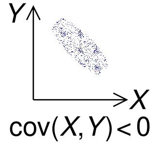
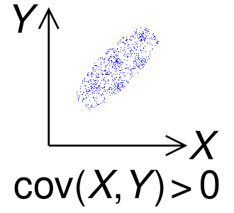
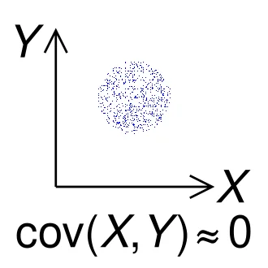

# Variance

For a random variable $`X`$, the variance is
``` math
\begin{align*}
    \text{Var}(X)=\mathbb{V}[X] &= \mathbb{E}[(X - \mathbb{E}[X])^2] \\
    &=\mathbb{E}[X^2] - (\mathbb{E}[X])^2
\end{align*}
```

Variance measures the average of the squared distances from the mean.

Standard deviation is
``` math
\sigma = \sqrt{\mathbb{V}[X]}
```

For a constant $`c`$,

1.  $`\mathbb{V}[c]=0`$\
    $`\because\mathbb{E}[(c-\mathbb{E}[c])^2]=\mathbb{E}[(c-c)^2]=\mathbb{E}[0]=0`$

2.  $`\mathbb{V}[X+c] = \mathbb{V}[X]`$\
    $`\because\mathbb{E}[((X+c)-\mathbb{E}[X+c])^2]=\mathbb{E}[(X+c-(\mathbb{E}[X]+c))^2]=\mathbb{E}[(X-\mathbb{E}[X])^2]`$

3.  $`\mathbb{V}[cX]=c^2\mathbb{V}[X]`$\
    $`\because\mathbb{E}[(cX-\mathbb{E}[cX])^2]=\mathbb{E}[(cX-c\mathbb{E}[X])^2]=\mathbb{E}[c^2(X-\mathbb{E}[X])^2]=c^2\mathbb{E}[(X-\mathbb{E}[X])^2]`$

## Covariance

For random variables $`X`$, $`Y`$,
``` math
\begin{align*}
    \text{Cov}(X,Y)&=\mathbb{E}[(X-\mathbb{E}[X])(Y-\mathbb{E}[Y])] \\
    &= \mathbb{E}[XY]-\mathbb{E}[X]\mathbb{E}[Y]
\end{align*}
```

Note that Variance is a specific case of Covariance, i.e.
``` math
\text{Cov}(X,X)=\mathbb{V}[X]
```

<figure id="fig:three_images" data-latex-placement="H">
<figure id="fig:img1">

<figcaption><span class="math inline"><em>X</em></span> and <span class="math inline"><em>Y</em></span> move inversely.</figcaption>
</figure>
<figure id="fig:img2">

<figcaption><span class="math inline"><em>X</em></span> and <span class="math inline"><em>Y</em></span> move together.</figcaption>
</figure>
<figure id="fig:img3">

<figcaption>No linear pattern.</figcaption>
</figure>
</figure>

For random variables $`X`$, $`Y`$ and constants $`c_1`$, $`c_2`$,
``` math
\begin{align*}
    \mathbb{V}[c_1X+c_2Y]&=c_1^2\mathbb{V}[X]+c_2^2\mathbb{V}[Y]+2c_1c_2\mathbb{E}[(X-\mathbb{E}[X])(Y-\mathbb{E}[Y])] \\
    &=c_1^2\mathbb{V}[X]+c_2^2\mathbb{V}[Y]+2c_1c_2\text{Cov}(X,Y)
\end{align*}
```

*Proof.*\
``` math
\begin{align*}
    \mathbb{V}[c_1X+c_2Y]&=\mathbb{E}[((c_1X+c_2Y)-(c_1\mathbb{E}[X]+c_2\mathbb{E}[Y]))^2] \\
    &=\mathbb{E}[(c_1(X-\mathbb{E}[X])+c_2(Y-\mathbb{E}[Y]))^2] \\
    &=\mathbb{E}[c_1^2(X-\mathbb{E}[X])^2]+\mathbb{E}[c_2^2(Y-\mathbb{E}[Y])^2]+2c_1c_2(X-\mathbb{E}[X])(Y-\mathbb{E}[Y]) \\
    &=c_1^2\mathbb{V}[X] + c_2^2\mathbb{V}[Y] + 2c_1c_2\text{Cov}(X,Y)
\end{align*}
```

The implication is that when Cov$`(X,Y)>0`$, $`\mathbb{V}(X+Y)>\mathbb{V}(X)+\mathbb{V}(Y)`$.

For example, if portfolio has multiple stocks that tend to move together (Cov), the combined portfolio is riskier. Conversely, the risk decreases if negatively correlated stocks are held together.

### Independence

By extension, if $`X`$ and $`Y`$ are independent, Cov$`(X,Y)=0`$. Then,
``` math
\mathbb{V}[X+Y]=\mathbb{V}[X]+\mathbb{V}[Y]
```

However, zero Covariance does not imply independence.\
For example, let random variable $`X`$ take three values:

1.  $`P(X=-1)=\frac{1}{3}`$

2.  $`P(X=0)=\frac{1}{3}`$

3.  $`P(X=1)=\frac{1}{3}`$

Let $`Y=X^2`$.\
We know that $`Y`$ is dependent on $`X`$.\
Calculating covariance,\
We have $`\mathbb{E}[X]=\frac{-1+0+1}{3}=0`$.\
Calculating $`XY`$,

- $`X=-1,Y=1\rightarrow XY=-1`$

- $`X=0,Y=0\rightarrow XY=0`$

- $`X=1,Y=1\rightarrow XY=1`$

So $`\mathbb{E}[XY]=\frac{-1+0+1}{3}=0`$\
Therefore,
``` math
\begin{align*}
    \text{Cov}(X,Y)&=\mathbb{E}[XY]-\mathbb{E}[X]\mathbb{E}[Y] \\
    &=0
\end{align*}
```

Takeaway: Covariance only tests for linear relationships. For non-linear cases like $`Y=X^2`$, Covariance might be 0 even though the variables are dependent on each other.

## Variance-covariance matrix

``` math
\begin{bmatrix}
    \mathbb{V}[X] & \text{Cov}(X, Y) & \text{Cov}(X, Z) \\
    \text{Cov}(Y, X) & \mathbb{V}[Y] & \text{Cov}(Y, Z) \\
    \text{Cov}(Z, X) & \text{Cov}(Z, Y) & \mathbb{V}[Z]
\end{bmatrix}
```

## Correlation coefficient

``` math
\rho_{X,Y} = \frac{\text{Cov}(X, Y)}{\sigma_X \sigma_Y}
```
where $`\sigma_X`$ and $`\sigma_Y`$, the standard deviations of $`X`$ and $`Y`$, are the normalisation factor.

Thus, we have $`\rho_{X,Y}\in[-1,1]`$, by Cauchy-Schwarz inequality.

For example, two random variables $`Y`$ and $`X`$ have the strongest linear relationship when $`Y=X`$. Then
``` math
\text{Cov}(X,Y)=\text{Cov}(X,X)=\sigma_X^2
```
The correlation coefficient is
``` math
\rho_{X,Y}=\frac{\sigma_X^2}{\sigma_X^2}=1
```

## Change of Variables

### PMF (Discrete case)

Let $`X`$ be a random variable with PMF $`p_X(x)`$.\
Let $`Y=g(X)`$.\
Then the PMF of $`Y`$ is obtained by summing up all the original $`x`$ values that transform into that $`y`$.
``` math
p_Y(y)=\sum_{x:g(x)=y}p_X(x)
```
Examples:

- $`Y=X^2:X\in\{1,2,3,4,5,6\}\rightarrow Y\in \{1,4,9,16,25,26\}`$
  ``` math
  p_Y(16)=P(X=4)=\frac{1}{6}
  ```

- $`Y=X\mod 3: X\in\{1,2,3,4,5,6\}\rightarrow Y\in\{0,1,2\}`$
  ``` math
  p_Y(0)=P(X=3) + P(X=6) = \frac{1}{6} + \frac{1}{6} = \frac{1}{3}
  ```

### PDFs (Continuous case, single variable)

Define random variables $`X`$ and $`Y=g(X)`$, where $`g`$ is continuously differentiable and one-to-one.\
Then the PDFs $`f_X`$ and $`f_Y`$ satisfy
``` math
f_X(x)=f_Y(g(x))\left|\frac{\mathrm{d}g(x)}{\mathrm{d}x}\right|
```
$`\left|\frac{\mathrm{d}g(x)}{\mathrm{d}x}\right|`$ here is the scaling factor.

*Proof.* By definition, the Cumulative Distribution Function (CDF) is
``` math
F_X(x) = P(X \leq x)
```

Case 1: $`g(x)`$ is strictly increasing.\
The inequality is preserved:
``` math
P(X \leq x) = P(g(X) \leq g(x)) = P(Y \leq g(x)) = F_Y(g(x))
```
So, we have the identity
``` math
F_X(x) = F_Y(g(x))
```

To obtain the PDF, we differentiate both sides with respect to $`x`$.\
On the right side, we apply the Chain Rule:
``` math
\frac{d}{dx} F_X(x) = \frac{d}{dx} F_Y(g(x))
```
``` math
f_X(x) = f_Y(g(x)) \cdot g'(x)
```
Since $`g`$ is increasing, $`g'(x) > 0`$, so this matches our formula.

Case 2: If $`g(x)`$ were strictly *decreasing*, the inequality would flip ($`X \leq x \iff Y \geq g(x)`$), leading to a negative sign.\
To cover both cases, we take the absolute value of the derivative:

``` math
f_X(x) = f_Y(g(x)) \cdot \left| \frac{dg(x)}{dx} \right|
```

*Intuitive explanation.*\
In a PDF, since probability is area, the probability mass in a tiny interval of $`X`$ must equal the probability mass in the corresponding interval of $`Y`$.
``` math
f_X(x) \cdot dx = f_Y(y) \cdot dy
```

The relationship between the interval widths ($`dy`$ vs $`dx`$) is determined by the derivative (the slope of the transformation):
``` math
\frac{dy}{dx} = g'(x) \implies dy = g'(x) \cdot dx
```

Substitute $`dy`$ back into the area equation:
``` math
\begin{align*}
    f_X(x) \cdot dx &= f_Y(y) \cdot (\underbrace{g'(x) \cdot dx}_{dy}) \\
    f_X(x) &= f_Y(y) \cdot g'(x)
\end{align*}
```
To ensure the density is positive (even if $`g(x)`$ is decreasing), we take the absolute value of the derivative:
``` math
f_X(x) = f_Y(g(x)) \cdot \left| \frac{dg(x)}{dx} \right|
```

Example. $`Y=aX+b\rightarrow f_X(x)=|a|f_Y(ax+b)`$.

### PDFs (Continuous case, multiple variables)

Let $`X_1,\ldots,X_n`$ be $`n`$ continuous random variables, transformed to $`n`$ new random variables $`Y_1,\ldots, Y_n`$ using a set of functions
``` math
Y_i=g_i(X_1,X_2,\ldots,X_n)\:, \quad \text{for } i \in [1,\ldots,n]
```
We then have a Jacobian matrix of size $`n\times n`$.
``` math
J = 
\begin{pmatrix}
    \frac{\partial y_1}{\partial x_1} & \cdots & \frac{\partial y_1}{\partial x_n} \\
    \vdots & \ddots & \vdots \\
    \frac{\partial y_n}{\partial x_1} & \cdots & \frac{\partial y_n}{\partial x_n}
\end{pmatrix}
```
Each row $`i`$ tells us how each output $`Y_i`$ changes as any of the inputs $`X_1,\ldots,X_n`$ change. While in single variable calculus, the derivative is just a single number (the slope), for multivariable calculus, the Jacobian matrix is the collection of all the slopes at once.\
Then, the Jacobian determinant replaces $`g'(x)`$ in the 1D case. It tells us how much the **volume** is transformed.

The joint PDFs $`f_{X_1,\ldots,X_n}`$ and $`f_{Y1,\ldots,Y_n}`$ satisfy
``` math
f_{X_1,\ldots,X_n}(x_1,\ldots,x_n)=f_{Y1,\ldots,Y_n}(g_1(x),\ldots,g_n(x))\cdot |\det J(x_1,\ldots,x_n)|
```
where $`|\det J(x_1,\ldots,x_n)|`$ represents the absolute value of the determinant of the $`n\times n`$ Jacobian matrix. This number represents the volume scaling factor of the transformation in $`n`$-dimensional space.

In vector notation, with $`\mathbf{X}=(X_1,\ldots,X_n)`$, $`\mathbf{Y}=(Y_1,\ldots,Y_n)`$, $`\varphi=(g_1,\ldots,g_n)`$,
``` math
f_X(x)=f_Y(\varphi(x))|\det J_{\varphi}(x)|
```
In terms of $`f_Y`$,
``` math
f_Y(y)=f_X(\text{inverse of x})\cdot \frac{1}{|\det A|}
```

Example. $`Y=AX+b \rightarrow f_X(x)=f_Y(AX+b)|\det A|`$.

### Gaussian distribution - Change of variable

Let $`X`$ follow the Gaussian distribution $`N(\mu, \sigma^2)`$,
``` math
f_X(x) = \frac{1}{\sqrt{2\pi\sigma^2}} e^{-\frac{(x-\mu)^2}{2\sigma^2}}.
```

Change of variable: $`Y = aX + b`$. Then,
``` math
\begin{align*}
    & f_X(x) = |a| f_Y(ax + b) \\
    \iff & f_Y(y) = \frac{1}{|a|} f_X \left( \frac{y - b}{a} \right) \\
    \iff & f_Y(y) = \frac{1}{\sqrt{2\pi a^2 \sigma^2}} \exp(-\frac{(y - (a\mu + b))^2}{2a^2 \sigma^2}) \\
    \iff & f_Y(y) = N(a\mu + b, a^2 \sigma^2)
\end{align*}
```

Takeaway: If we apply a linear transformation to a Gaussian random variable, the result is also a Gaussian distribution.

- The new mean ($`a\mu + b`$): The center of the curve moves as expected according to $`a`$ and $`b`$.

- The new variance ($`a^2\sigma^2`$): The spread is increased by the square of the multiplier.\
  Note that the variance is not affected by the shift ($`b`$).

### Multivariate Gaussian distribution - Change of variable

Let $`X_1`$ and $`X_2`$ independently follow the standard Gaussian distribution $`N(0,1)`$.
``` math
f_{X_1}(x_1)=\frac{1}{\sqrt{2\pi}}\exp(\frac{-x^2}{2})
```
The joint PDF of ($`X_1,X_2`$) is
``` math
f_{X_1,X_2}(x_1,x_2)=(\frac{1}{\sqrt{2\pi}}\exp(\frac{-x^2}{2}))(\frac{1}{\sqrt{2\pi}}\exp(\frac{-x^2}{2}))=\frac{1}{2\pi}\exp(-\frac{x_1^2+x_2^2}{2})
```
Generalising to $`d`$-variate **standard** Gaussian distribution $`N(\mathbf{0},I_d)`$,
``` math
f_X(x)=\frac{1}{(2\pi)^{d/2}}\exp(-\frac{x_d^Tx_d}{2})
```
Here, $`x_d^Tx_d = \begin{bmatrix}
    x_1 & x_2 & \cdots & x_d
\end{bmatrix} \cdot \begin{bmatrix}
    x_1 \\ x_2 \\ \vdots \\ x_d
\end{bmatrix} = x_1^2 + x_2^2 + \cdots + x_d^2`$.\
Also, the covariance matrix $`I_d = \begin{bmatrix}
    1 & 0 & \cdots & 0 \\
    0 & 1 & \cdots & 0 \\
    \vdots & \vdots & \ddots & \vdots \\
    0 & 0 & \cdots & 1
\end{bmatrix}`$, meaning the variance of each variable is 1, and there is zero covariance between any of the variables.

Letting $`X`$ follow $`N(\mathbf{0},I_d)`$, we apply a change of variables $`Y=AX+\mu`$, where $`\mu\in\mathbb{R}^d`$.\
$`\mu`$ is basically a vector of $`d`$ numbers.\
To find the PDF of $`Y`$, apply the change of variables formula:
``` math
f_Y(y)=f_X(\text{inverse }x)\cdot \frac{1}{|\det A|}
```
Since
``` math
X=A^{-1}(Y-\mu),
```
Substituting in, we get
``` math
f_Y(y)=\frac{1}{|\det A|}\cdot \frac{1}{(2\pi)^{d/2}}\exp(-\frac{1}{2}[A^{-1}(y-\mu)]^T[A^{-1}(y-\mu)])
```
Defining the new covariance matrix as $`\Sigma = AA^T`$, we have
``` math
\det(\Sigma)=\det(A)\det(A^T)=(\det(A))^2\Rightarrow |\det A|=\sqrt{\det\Sigma}
```
and
``` math
\begin{align*}
    [A^{-1}(y-\mu)]^T &= (y-\mu)^T(A^{-1})^T \\
    \Rightarrow [A^{-1}(y-\mu)]^T[A^{-1}(y-\mu)] &= (y-\mu)^T(A^{-1})^TA^{-1}(y-\mu) \\ 
    &= (y-\mu)^T\Sigma^{-1}(y-\mu)
\end{align*}
```

Finally, we get
``` math
f_Y(y) = \frac{1}{(2\pi)^{d/2} \sqrt{|\det \Sigma|}} \exp\left( -\frac{1}{2} (y - \mu)^\top \Sigma^{-1} (y - \mu) \right)
```
Comparing to the d-variate **standard** Gaussian distribution $`N(\mathbf{0},I_d)`$,\
the d-variate Gaussian distribution $`f_X(x)`$ is $`N(\mu, \Sigma)`$, where $`\mathbb{E}[X]=\mu`$ and $`\Sigma=AA^T`$ is the variance-covariance matrix.

## Moments

For a random variable $`X`$, the $`k`$-th momemnt is
``` math
\mu_k=\mathbb{E}[X^k]
```
Each subsequent moment provides more information about the structure of the distribution.\
For example,\
The first moment tells us about the mean, the second moment tells us about the variance,
``` math
\mathbb{E}[X] = \mu_1\quad\mathbb{V}[X] = \mathbb{E}[X^2]-(\mathbb{E}[X])^2=\mu_2-\mu_1^2
```
The third moment tells us about skewness, the fourth tells us about kurtosis, and so on.

A probability distribution is uniquely specified by its moment generating function (MGF). Note: It is not uniquely specified by its moments.

The moment generating function (MGF) is
``` math
M_X(t) = \mathbb{E}[e^{tX}] = 
\begin{cases} 
   \displaystyle \sum_{x} e^{tx} p_X(x) & (\text{discrete}), \\[15pt]
   \displaystyle \int e^{tx} f_X(x) \mathrm{d}x & (\text{continuous}).
\end{cases}
```

We use $`\mathbb{E}[e^{tX}]`$ because from the taylor expansion of $`e`$,
``` math
e^{tX}=1+tX+\frac{(tX)^2}{2!}+\frac{(tX)^3}{3!}\cdots
```
Taking expectation,
``` math
\begin{align*}
    M_X(t)&=\mathbb{E}[e^{tX}]=\mathbb{E}[1]+\mathbb{E}[tX]+\mathbb{E}[\frac{t^2X^2}{2!}]+\cdots \\
    &= 1 + t\mathbb{E}[X] + \frac{t^2}{2!}\mathbb{E}[X^2] + \frac{t^3}{3!}\mathbb{E}[X^3]+\cdots
\end{align*}
```
Therefore, by taking the $`k`$-th derivative,
``` math
M_X^{(k)}(t)=\mu_k + \mu_{k+1}t + \frac{\mu_{k+2}}{2!}t^2 + \frac{\mu_{k+3}}{3!}t^3+\cdots
```
and setting $`t=0`$, we get the moments
``` math
\mu_k=M_X^{(k)}(0)
```

### Example for Gaussian distribution

For a Standard Normal Distribution ($`Z \sim \mathcal{N}(0, 1)`$), the MGF is defined as
``` math
\begin{align*}
    M_Z(t) = \mathbb{E}[e^{tZ}] &= \int_{-\infty}^{\infty} e^{tz} \frac{1}{\sqrt{2\pi}} e^{-\frac{z^2}{2}} \, dz \\
           &= \frac{1}{\sqrt{2\pi}} \int_{-\infty}^{\infty} e^{-\frac{1}{2}(z^2 - 2tz)} \, dz
\end{align*}
```

We complete the square in the exponent: $`-\frac{1}{2}(z^2 - 2tz) = -\frac{1}{2}(z^2 - 2tz + t^2 - t^2) = -\frac{1}{2}(z-t)^2 + \frac{t^2}{2}`$. Substituting this back into the integral:
``` math
\begin{align*}
    M_Z(t) &= \frac{1}{\sqrt{2\pi}} \int_{-\infty}^{\infty} e^{-\frac{1}{2}(z-t)^2 + \frac{t^2}{2}} \, dz \\
           &= e^{\frac{t^2}{2}} \underbrace{\int_{-\infty}^{\infty} \frac{1}{\sqrt{2\pi}} e^{-\frac{1}{2}(z-t)^2} \, dz}_{=1}
\end{align*}
```
The integral is equal to 1 because it represents the total probability of a Normal distribution with mean $`t`$ and variance $`1`$. Thus:
``` math
M_Z(t) = e^{t^2/2}
```

Then for a General Normal Distribution ($`X \sim \mathcal{N}(\mu, \sigma^2)`$),

We use the linear transformation property $`X = \mu + \sigma Z`$:
``` math
\begin{align*}
    M_X(t) &= \mathbb{E}[e^{tX}] \\
           &= \mathbb{E}[e^{t(\mu + \sigma Z)}] \\
           &= e^{t\mu} \cdot \mathbb{E}[e^{(t\sigma)Z}] \quad (\text{Since } e^{t\mu} \text{ is constant}) \\
           &= e^{t\mu} \cdot M_Z(t\sigma)
\end{align*}
```

Using the result $`M_Z(u) = e^{u^2/2}`$ from Part 1 with $`u = t\sigma`$:
``` math
\begin{align*}
    M_X(t) &= e^{t\mu} \cdot e^{(t\sigma)^2 / 2} \\
           &= \exp\left(\mu t + \frac{1}{2}\sigma^2 t^2\right)
\end{align*}
```
The Gaussian distribution is characterised by only the mean and variance.

## Poisson distribution

The Poisson distribution models the number of events occuring in some fixed interval (of time or space), given a constant average rate $`\lambda`$, independence of events.

For a random variable $`X`$ that follow a Poisson distribution, we write
``` math
X\sim \text{Po}(\lambda)
```

The Poisson distribution is basically a limit of the Binomial distribution $`B(n,p)`$.\
Recall that for $`X\sim B(n,p)`$,
``` math
P(X=k)=\binom{n}{k}p^k(1-p)^{n-k}
```
Consider some time interval \[$`0,t`$\] divided into $`n`$ tiny parts. Some event occurs on average $`\lambda`$ times in \[$`0,t`$\].\
The probability of the event occuring in each of the $`n`$ parts is roughly $`\frac{\lambda}{n}`$.\
If $`n`$ is sufficiently large, each part can have at most one event.\
Taking limit of the Binomial distribution as $`n\rightarrow\infty`$,
``` math
\lim\limits_{n\to \infty}\left[\binom{n}{k} \cdot (\frac{\lambda}{n})^k \cdot (1-\frac{\lambda}{n})^{n-k} \right]
```
We get
``` math
P(X=k)=\frac{e^{-\lambda} \cdot \lambda^k}{k!}
```
This is the probability that some event occurs $`k`$ times in \[$`0,t`$\], given that it occurs $`\lambda`$ times on average in \[$`0,t`$\].

The MGF for some Poisson distribution is
``` math
\begin{align*}
    M_X(t)=\mathbb{E}[e^{tX}]&=\sum_{k=0}^{+\infty}e^{tk}\cdot\frac{e^{-\lambda} \cdot \lambda^k}{k!}\\
    &=e^{-\lambda}\sum_{k=0}^{+\infty}\frac{e^{tk}\lambda^k}{k!} \\
    &=e^{-\lambda}\sum_{k=0}^{+\infty}\frac{(e^t\lambda)^k}{k!} \\
    &=e^{-\lambda}\cdot e^{e^{t}\cdot \lambda} \\
    &=e^{\lambda(e^t-1)}
\end{align*}
```

Taking first and second derivatives of $`M_X(t)`$ and setting $`t=0`$,
``` math
\mu_1=M'_X(0)=\lambda, \quad \mu_2=M''_X(0)=\lambda + \lambda^2
```
Then
``` math
\mathbb{E}[X]=\mu_1=\lambda, \quad \mathbb{V}[X]=\mu_2-\mu_1^2=\lambda
```
Poisson distribution’s mean and variance are both $`\lambda`$.
