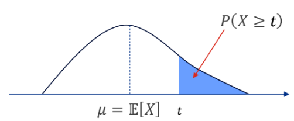
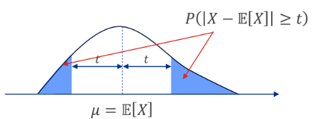
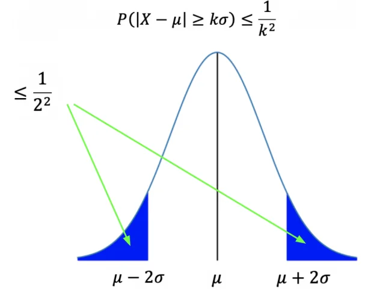

# Concentration Inequalities

## Markov’s Inequality

For a non-negative (discrete or continuous) random variable $`X`$, and $`t > 0`$,
``` math
P(X \geq t) \leq \frac{\mathbb{E}[X]}{t}
```

*Proof.*
``` math
\begin{align*}
    \mathbb{E}[X] &= \int_0^{\infty}xf_X(x)\:\mathrm{d}x \\
    &= \int_0^{t}xf_X(x)\mathrm{d}x + \int_t^{\infty}xf_X(x)\:\mathrm{d}x && [\text{split integral at }t]\\
    &\geq \int_t^{\infty}xf_X(x)\:\mathrm{d}x && [\because k\geq 0,\: \mathbf{x\geq 0},\: f_X(x)\geq 0]\\
    &\geq \int_t^{\infty}kf_X(x)\:\mathrm{d}x && [\text{because x }\geq \text{ t in the integral}]\\
    &= t\int_t^{\infty}f_X(x)\mathrm{d}x \\
    &= t\cdot P(X\geq t)
\end{align*}
```

<figure id="fig:my_image" data-latex-placement="H">

<figcaption>Markov’s inequality</figcaption>
</figure>

**$`\mathbf{X}`$ must be non-negative - Counterexample**

Let $`X`$ be a discrete random variable such that
``` math
X = \begin{cases} 
    100 & \text{with probability } 0.5 \\
    -100 & \text{with probability } 0.5
    \end{cases}
```

EV is
``` math
\begin{align*}
    \mathbb{E}[X] &= \sum x \cdot P(X=x) \\
    &= (100 \cdot 0.5) + (-100 \cdot 0.5) \\
    &= 50 - 50 \\
    &= 0
\end{align*}
```

Let $`t = 50`$. Using Markov’s inequality,

``` math
P(X\geq 50) \leq \frac{\mathbb{E}[X]}{50}
```
``` math
\text{LHS} = P(X\geq 50) = P(X = 100) = 0.5
```
``` math
\text{RHS} = \frac{\mathbb{E}[X]}{t} = \frac{0}{50} = 0
```
Hence, we get a contradiction ($`0.5 \leq 0`$).\
Takeaway: Negative numbers can skew the mean, making it aritficially small.

## Chebyshev’s Inequality

For any random variable $`X`$, and $`t > 0`$,
``` math
P \Bigl( |X-\mathbb{E}[X]| \geq t \Bigr) \leq \frac{\mathbb{V}[X]}{t^2}
```

*Proof.*
``` math
\begin{align*}
    P \Bigl( |X - \mathbb{E}[X]| \geq t \Bigr) &= P\Bigl((X - \mathbb{E}[X])^2 \geq t^2 \Bigr) && [\because t>0] \\
    &\leq \frac{\mathbb{E}[(X - \mathbb{E}[X])^2]}{t^2} && [\text{Markov's Inequality}] \\
    &= \frac{\mathbb{V}[X]}{t^2}
\end{align*}
```

<figure id="fig:my_image" data-latex-placement="H">

<figcaption>Chebyshev’s inequality</figcaption>
</figure>

### Alternative form

Let $`t = k\sigma`$, $`k > 0`$, $`\sigma = \sqrt{\mathbb{V}[X]}`$.
``` math
P \Bigl( |X-\mathbb{E}[X]| \geq k\sigma \Bigr) \leq \frac{\sigma^2}{(k\sigma)^2}  = \frac{1}{k^2}
```
With $`k=2`$, $`\frac{1}{k^2} = \frac{1}{4}`$, meaning 75% of data is within 2 standard deviations from the mean.

<figure id="fig:my_image" data-latex-placement="H">

<figcaption><span class="math inline"><em>σ</em></span>-form of Chebyshev’s inequality</figcaption>
</figure>

### Markov vs Chebyshev’s inequality

- **Values of** $`\mathbf{X}`$: For Markovs’s, $`X`$ only takes non-negative values, while in Chebyshev’s $`X`$ can take any value (Squaring the distance from the mean term removes negative values). Markov’s is concerned with position of $`X`$, while Chebyshev’s cares more about distance from the mean.

- **Distribution**: Markov’s only requires $`\mathbb{E}[X]`$, Chebyshev’s requires $`\mathbb{E}[X]`$ and $`\mathbb{V}[X]`$.

- **Results**: Chebyshev’s gives a better estimate than Markov’s.\
  Consider a factory producing light bulbs, with $`\mathbb{E}[X]=1000`$, $`\mathbb{V}[X]=2500`$. We want to find $`P(X \geq 2000)`$.\
  Markov’s Inequality:
  ``` math
  P(X \geq 2000) \leq \frac{\mathbb{E}[X]}{2000} = \frac{1000}{2000} = 0.5
  ```
  Chebyshev’s Inequality:
  ``` math
  P\Bigl(|X-1000| \geq 1000 \Bigr) \leq \frac{\mathbb{V}[X]}{t^2} = \frac{2500}{1000^2} = 0.0025
  ```

## (Weak) Law of large numbers

Suppose $`X_1, X_2, \ldots, X_n`$ are independent and identically distributed (iid) random variables,
``` math
\mathbb{E}[X_i] = \mu,\quad \mathbb{V}[X_i] = \sigma^2,\quad \text{for } i = 1,\ldots,n
```
The empirical average of outcomes is
``` math
\overline{X}_n = \frac{1}{n}\sum_{i=1}^n X_i
```
Then
``` math
\mathbb{E}[\overline{X}_n] = \mu, \quad \mathbb{V}[\overline{X}_n] = \frac{n\sigma^2}{n^2} = \frac{\sigma^2}{n}
```
\[Variance decreases as we get more samples ($`n \to \infty`$)\].\
Using Chebyshev’s inequality, and for any $`\epsilon > 0`$,
``` math
P \Bigl(|\overline{X}_n - \mu| \geq \epsilon \Bigr) \leq \frac{\frac{\sigma^2}{n}}{\epsilon^2} = \frac{\sigma^2}{n\epsilon^2}
```
``` math
\lim\limits_{n \to \infty} P \Bigl(|\overline{X}_n - \mu| \geq \epsilon \Bigr) \leq 0
```
Since probability cannot be less than 0,
``` math
\lim\limits_{n \to \infty} P \Bigl(|\overline{X}_n - \mu| \geq \epsilon \Bigr) \leq 0
```
or
``` math
\lim\limits_{n \to \infty} P \Bigl(|\overline{X}_n - \mu| < \epsilon \Bigr) = 1
```
Interpretation: For a **large number** $`n`$, the calculated average $`\overline{X}_n`$ converges to $`\mu`$ with absolute certainty. This is because the variance decreases with increasing number of samples.

## Hoeffding’s Inequality

For **independent** random variables $`X_1, \ldots, X_n`$, with $`a_i \leq X_i \leq b_i`$, then
``` math
P \Bigl(|\overline{X}_n - \mathbb{E}[\overline{X}_n]| \geq t \Bigr) \leq 2\exp \left(-\frac{2n^2t^2}{\sum_{i=1}^n(b_i - a_i)^2}\right)
```
Note:

- As the sample size $`n`$ or error margin $`t`$ increase, the negative exponent gets more negative, probability $`\rightarrow`$ 0.

- If the bounds ($`b_i - a_i`$) are small, the negative exponent gets more negative, probability $`\rightarrow`$ 0.

Because of the exponenet term, Hoeffding’s inequality gives a tighter bound than Chebyshev’s inequality.
``` math
(\text{Chebyshev's}) \quad O(\frac{1}{nt^2}) \quad \gg \quad \exp(-O(nt^2)) \quad (\text{Hoeffding's})
```
(assuming independence of variables).

#### Example

For **iid** random variables $`X_1,\ldots,X_n`$ following Bernoulli distribution, $`p = 0.5`$,

(Chebyshev’s) $`\mathbb{E}[\overline{X}_n] = 0.5,\: \mathbb{V}[\overline{X}_n] = \frac{\mathbb{V}[X]}{n} = \frac{p(1-p)}{n} = \frac{1}{4n}`$,
``` math
P\Bigl(|\overline{X}_n - \mathbb{E}[\overline{X}_n]|\geq t \Bigr) \leq \frac{\mathbb{V}[\overline{X}_n]}{t^2} = \frac{1}{4nt^2}
```

(Hoeffding’s) $`0\leq X_i \leq 1 \Rightarrow \sum_{i=1}^n(b_i - a_i)^2 = n`$,
``` math
P\Bigl(|\overline{X}_n - \mathbb{E}[\overline{X}_n]| \geq t\Bigr) \leq 2\exp\left(-\frac{2n^2t^2}{n}\right) = 2\exp(-2nt^2)
```

### Markov v Chebyshev v Hoeffding

<div class="table-wrap">

<table>
<thead>
<tr>
<th style="text-align: left;"><strong><strong>Feature</strong></strong></th>
<th style="text-align: left;"><strong>Markov’s</strong></th>
<th style="text-align: left;"><strong>Chebyshev’s</strong></th>
<th style="text-align: left;"><strong>Hoeffding’s</strong></th>
</tr>
</thead>
<tbody>
<tr>
<td style="text-align: left;"><strong><strong>Feature</strong></strong></td>
<td style="text-align: left;"><strong>Markov</strong></td>
<td style="text-align: left;"><strong>Chebyshev</strong></td>
<td style="text-align: left;"><strong>Hoeffding</strong></td>
</tr>
<tr>
<td style="text-align: left;"><p><strong></strong></p>
<p><strong>Requirements</strong><br />
</p></td>
<td style="text-align: left;">Variable must be <strong>Non-Negative</strong> (<span class="math inline"><em>X</em> ≥ 0</span>).</td>
<td style="text-align: left;">• Finite Mean (<span class="math inline"><em>μ</em></span>) and Variance (<span class="math inline"><em>σ</em><sup>2</sup></span>).<br />
• Data can be unbounded or dependent.</td>
<td style="text-align: left;">• Variables must be <strong>Independent</strong>.<br />
• Variables must be <strong>Bounded</strong> (<span class="math inline"><em>a</em> ≤ <em>X</em> ≤ <em>b</em></span>).</td>
</tr>
<tr>
<td style="text-align: left;"><p><strong></strong></p>
<p><strong>Parameters Used</strong><br />
</p></td>
<td style="text-align: left;"><strong>Mean</strong> (<span class="math inline"><em>μ</em></span>).</td>
<td style="text-align: left;">Mean (<span class="math inline"><em>μ</em></span>) + <strong>Variance</strong> (<span class="math inline"><em>σ</em><sup>2</sup></span>).</td>
<td style="text-align: left;">Mean (<span class="math inline"><em>μ</em></span>) + <strong>Bounds</strong> (<span class="math inline"><em>a</em>, <em>b</em></span>) + Sample Size (<span class="math inline"><em>n</em></span>).</td>
</tr>
<tr>
<td style="text-align: left;"><p><strong></strong></p>
<p><strong>What it Bounds</strong><br />
</p></td>
<td style="text-align: left;">"Prob. that <span class="math inline"><em>X</em></span> is huge?"<br />
<em>(One-sided tail)</em></td>
<td style="text-align: left;">"Prob. that <span class="math inline"><em>X</em></span> is far from mean?"<br />
<em>(Two-sided distance)</em></td>
<td style="text-align: left;">"Prob. that average is far from mean?"<br />
<em>(Two-sided distance)</em></td>
</tr>
<tr>
<td style="text-align: left;"><p><strong></strong></p>
<p><strong>The Result</strong><br />
</p></td>
<td style="text-align: left;"><strong>Loose (Linear Decay):</strong><br />
Error drops as <span class="math inline">$\frac{1}{t}$</span>.<br />
<em>(Weakest guarantee)</em></td>
<td style="text-align: left;"><strong>Medium (Polynomial Decay):</strong><br />
Error drops as <span class="math inline">$\frac{1}{t^2}$</span> or <span class="math inline">$\frac{1}{n}$</span>.<br />
<em>(Solid, but conservative)</em></td>
<td style="text-align: left;"><strong>Tight (Exponential Decay):</strong><br />
Error drops as <span class="math inline"><em>e</em><sup>−<em>n</em></sup></span>.<br />
<em>(Strongest guarantee)</em></td>
</tr>
<tr>
<td style="text-align: left;"><p><strong></strong></p>
<p><strong>Best Use Case</strong></p></td>
<td style="text-align: left;">When you know <strong>almost nothing</strong> (only the Mean) about the distribution.</td>
<td style="text-align: left;">When data has <strong>high variance</strong> or "heavy tails" (e.g., income, stock market).</td>
<td style="text-align: left;">When data is <strong>bounded</strong> (e.g., polls, test scores) and you need high confidence.</td>
</tr>
</tbody>
</table>

</div>

## Central Limit Theorem

For a random variable $`X`$ with mean $`\mu`$ and standard deviation $`\sigma`$, the standardisation of $`X`$ is the new random variable
``` math
Z = \frac{X - \mu}{\sigma}
```
Note that $`Z`$ has mean 0 and standard deviation 1. Note also that if $`X`$ has a Gaussian distribution, then the distribution of $`X`$ is the standard Gaussian distribution $`Z`$.

Suppose **iid** random variables $`X_1, \ldots, X_n`$ each with mean $`\mathbb{E}[X]=\mu`$ and $`\mathbb{V}[X]=\sigma^2`$. Let $`\overline{X}_n`$ be the average such that
``` math
\overline{X}_n = \frac{X_1 + \ldots + X_n}{n} = \frac{\sum_{i=1}^nX_i}{n}
```
The mean and variance are
``` math
\mathbb{E}[\overline{X}_n] = \mu,\quad \mathbb{V}[\overline{X}_n] = \frac{\sigma^2}{n},\quad \sigma_{\overline{X}_n} = \frac{\sigma}{\sqrt{n}}
```
We can then standardise $`\overline{X}_n`$
``` math
Z_n = \frac{\overline{X}_n - \mu}{\sigma / \sqrt{n}}
```
By the Central Limit Theorem,
``` math
\lim\limits_{n\to\infty}P(Z_n \leq t) = \lim\limits_{n\to\infty}P(\frac{\sqrt{n}(\overline{X}_n - \mu)}{\sigma}\leq t) = \frac{1}{\sqrt{2\pi}}\int_{-\infty}^t \exp(-\frac{u^2}{2})\:\mathrm{d}u = \Phi(t)
```
This means that for large $`n`$, $`Z_n`$ converges in distribution to the standard Gaussian distribution, and the probability that $`Z_n \leq t`$ is just the area under the standard Gaussian PDF, from $`-\infty \to t`$. So as $`n \to \infty`$,
``` math
\overline{X}_n \sim N(\mu, \frac{\sigma^2}{n}), \quad Z_n \sim N(0, 1)
```

<figure id="fig:my_image" data-latex-placement="H">

<figcaption>Central Limit Theorem</figcaption>
</figure>

### Application of CLT - Normal approximation to binomial

Recall that for a Binomial random variable $`X \sim B(n, p)`$,
``` math
P(X=k) = \binom{n}{k} p^k (1-p)^{n-k}
```
**The problem** is that computing this exact probability becomes extremely hard when $`n`$ and $`k`$ are large. The factorials inside the $`\binom{n}{k}`$ term grow massively.\
Instead, we can see the Binomial variable as a sum of individual Bernoulli trials.\
We define the total successes as $`S_n = \sum_{i=1}^n X_i`$, where each individual trial $`X_i \in \{0, 1\}`$.\
For each individual Bernoulli trial:
``` math
\mathbb{E}[X_i] = p,\quad \mathbb{V}[X_i] = p(1 - p)
```
Because $`S_n`$ is a sum of independent trials, we can apply the CLT. By standardising this sum, the distribution becomes approximately normal, as $`n \to \infty`$,
``` math
\frac{S_n - np}{\sqrt{np(1-p)}} \approx \mathcal{N}(0, 1)
```
We can find the probability that number of successes falls within some lower and upper bounds.
``` math
\begin{align*}
P(k \le S_n \le k') &= P\left(\frac{k - np}{\sqrt{np(1-p)}} \le \frac{S_n - np}{\sqrt{np(1-p)}} \le \frac{k' - np}{\sqrt{np(1-p)}}\right) \\
\\
&\approx P\left(\frac{k - np}{\sqrt{np(1-p)}} \le Z \le \frac{k' - np}{\sqrt{np(1-p)}}\right) \quad \text{where } Z \sim \mathcal{N}(0, 1) \\
\\
&= \Phi\left(\frac{k' - np}{\sqrt{np(1-p)}}\right) - \Phi\left(\frac{k - np}{\sqrt{np(1-p)}}\right)
\end{align*}
```
**Example** Flipping a fair coin $`n = 40000`$ times, what is the probability of getting between 19,600 and 20,400 heads?\
Here, computing the exact binomial PMF is not feasible. We use the normal approximation.\
Let $`S_n`$ be the total number of heads. For a fair coin, the probability of heads is $`p = 0.5`$.
``` math
S_n \sim B(40000, 0.5)
```
Calculating the mean and s.d. for each trial:

- $`\mathbb{E}[S_n] = np = 40,000 \times 0.5 = 20,000`$

- $`\sigma = \sqrt{Var(S_n)} = \sqrt{np(1-p)} = \sqrt{40,000 \times 0.5 \times 0.5} = \sqrt{10,000} = 100`$

Thus, we have
``` math
S_n \approx \mathcal{N}(20000, 100^2)
```
Solving,
``` math
\begin{align*}
P(19600 \le S_n \le 20400) &= P\left(\frac{19600 - 20000}{100} \le \frac{S_n - 20000}{100} \le \frac{20400 - 20000}{100}\right) \\
\\
&\approx P(-4 \le Z \le 4) \quad \text{where } Z \sim \mathcal{N}(0, 1) \\
&= \Phi(4) - \Phi(-4) \\
&\approx 1 - 0 \approx 0.9999
\end{align*}
```

**Example** A factory produces items with a defective probability $`p`$. If we inspect $`n`$ items, what is the probability regarding the number of defective items?\
Let $`S_n`$ be the total number of defective items in the sample size of $`n`$, then apply the equation above.

**Example** If an advertisement has a click through rate of $`p`$, and the website gets $`n`$ unique visitors a day, what is the probability regarding the number of clicks?\
Let $`S_n`$ be the total number of ad clicks in the sample size of $`n`$ visitors, then apply the equation above.
