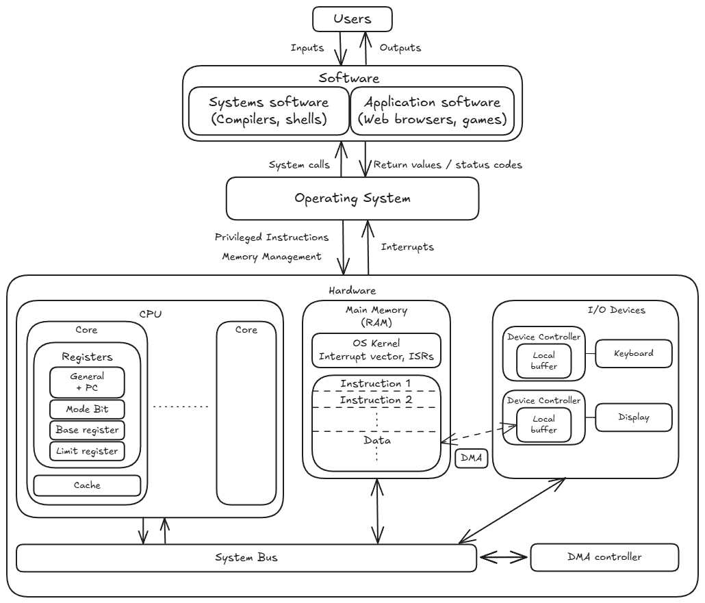
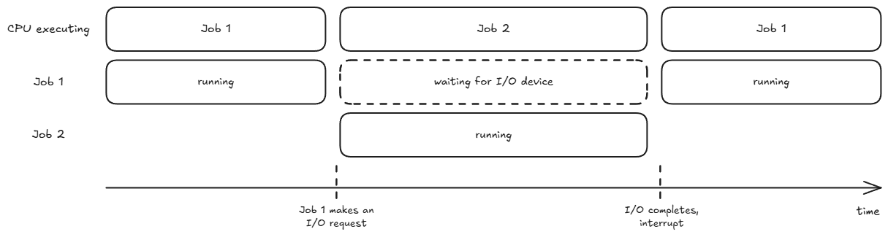
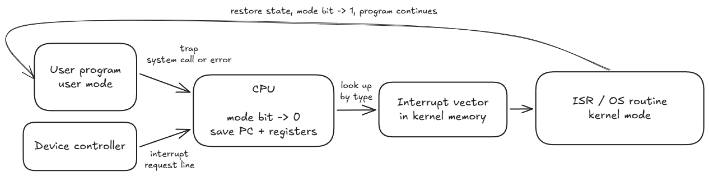
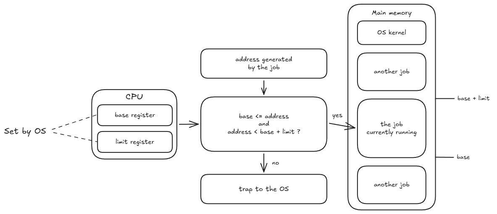
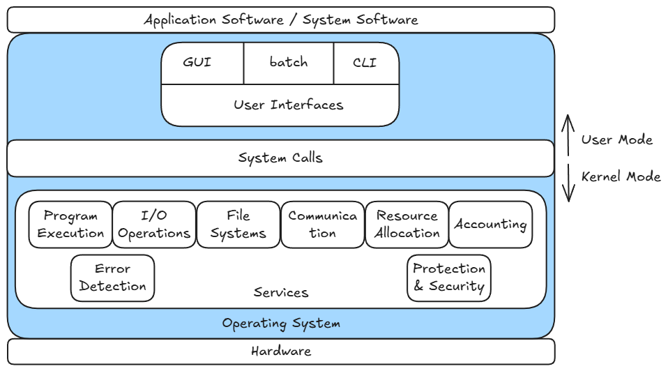
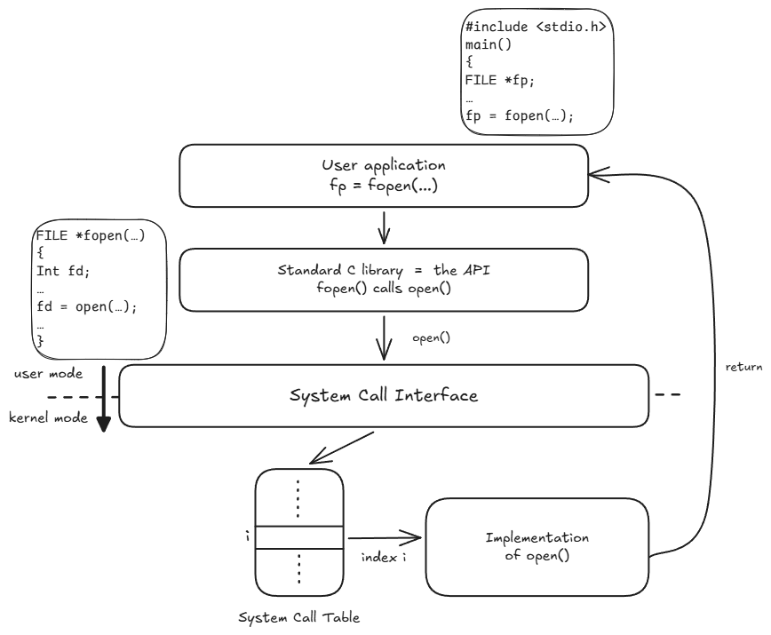
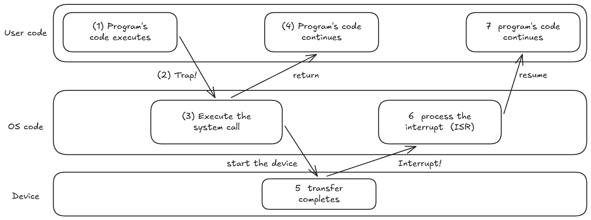

# Motivations for an operating system
An OS serves 2 goals:

1. User convenience: By abstracting away hardware complexity.
2. Efficient hardware utilisation: Allocate resources (like CPU/memory/IO devices) smartly.

Contradiction: To achieve peak efficiency, the OS needs to collect data, monitor programs, and run resource-scheduling algorithms. However, running those tracking routines consumes CPU cycles and memory space, which adds background overhead and can reduce pure user-facing performance or simplicity.

An OS is a program that acts as an intermediary between a user and the computer hardware.



The **kernel** is the core of the OS, that is loaded into memory at boot and is always running & ready to accept new commands from both users and hardware.

Roles of the OS:

1. Resource allocator: When multiple programs or users compete for limited hardware, the system must decide the allocation of resources.
2. Control Program: Controlling the execution of user programs to prevent errors, infinite loops, memory leaks, and unauthorized access to I/O devices

**Recap**: The CPU roughly operates in a Fetch-Decode-Execute cycle:

1. **Fetch** an instruction from a certain memory address in the RAM. The Program Counter (PC) holds this address.
2. **Decode** that instruction.
3. **Execute** that instruction.
The CPU only processes instructions that are already loaded into main memory (RAM).

# Types of Computing Systems
Without an OS, programs would have been manually loaded into memory one at a time. Below are some ways that an OS handles this process for us.

## Simple Batch System
Similar jobs are batched together (What defines similar?). The OS has a simple supervisor code that ensures only 1 job is in RAM at a time by transferring control between programs.

This is inefficient: Whenever a program needs to perform an I/O operation (like read or print), the CPU cannot fetch the next instruction. Clock cycles are wasted until the current instruction finishes execution.

## Multiprogramming System
To overcome the inefficiency of Simple Batch, the solution is to keep multiple programs in RAM simultaneously.

Given Job 1 and Job 2 currently in RAM, when Job 1 has to perform some I/O operation, the OS changes the PC to point to Job 2, so that the CPU can execute Job 2.



This is more complex that Simple Batch and some mechanisms are required:

1. **Memory Management**: Memory must be partitioned so Job 1 cannot illegally read or overwrite Job 2's memory space.
2. **CPU Scheduling**: When Job 1 pauses, the OS must decide which job in RAM is executed next.
3. **I/O Device Scheduling**: If Job 1 and Job 2 both ask to write to the printer at once, the OS must queue and coordinate access.

## Time-sharing/Multitasking Systems
Multiprogramming systems swtiches jobs when another job performs some I/O operation. However, if Job 1 occupies the CPU with a long-running task (like a multi-hour mathematical computation), there is no opportunity to switch to Job 2.

In Time-sharing systems, the CPU switches jobs at artificial time intervals (every few miliseconds). To humans, all programs appear to be executing simultaneously.
If main memory (RAM) is too small to fit all user jobs, the OS temporarily writes idle jobs out to hard disk ("swap out") and reads active ones back into RAM ("swap in").

## Specialised OS Architectures
Building on Multiprogramming and Time-sharing systems, OS design branched out based on specific constraints.

- Desktop systems: Maximise user responsiveness and convenience rather than raw CPU utilization.
- Embedded & Cyber-physical systems: Small microcontrollers built inside cars, smart grids, or medical gear that operate under strict resource constraints, like minimal RAM, low processing speeds.
- Real-time systems: The computer directly controls a physical mechanism (e.g., an airbag deployment sensor or flight control surface). There are fixed time constraints that jobs have to completed by.
- Handheld/mobile systems: Battery-powered portable devices (smartphones, tablets) where limitations include limited memory, processor speed and display size.

## Multiprocessor System
Since a single CPU core can physically execute one instruction at any given instant, by having multiple CPU cores, instructions can be executed in parallel.

In a shared-memory architecture, multiple CPU cores share the same physical bus and main memory (RAM). Each core has its own registers and cache.

An obvious advantage is increased throughput as more instructions processed at once. Other advantages:

- Economy of Scale: Core 0 and Core 1 share the exact same RAM sticks, motherboards, power supplies, and storage, making it vastly cheaper than buying two separate computers.
- Increased Reliability: If Core 0 suffers a hardware fault, the OS can disable it and continue running the system on Core 1 at reduced capacity, preventing a total crash.

# How OS works with hardware
An OS (the kernel) is a software program stored in RAM. The OS relies on certain hardware features of the CPU and motherboards to do its job. These features fall into two groups:

- **Computer-system operation** — features for **performance**: let the CPU and the I/O devices run *concurrently*.
- **Hardware protection** — features for **safety**: stop a user program from damaging the OS or another job.

## Computer-system operation
1. **Device Controllers & Local Buffers**
   - Physical I/O hardware operates at speeds which are thousands to millions of times slower than the CPU.
   - Each **Device Controller** (a dedicated mini-processor) is in charge of one *device type*, so one controller can serve several devices. E.g. 1 USB controller handles the mouse, keyboard and printer. Each controller has a **Local Buffer**, which is storage on the controller chip.
   - The CPU issues a command to the controller ("read this data") and immediately moves on to other work. The controller carries out the slow physical operation on its own, staging the data in its local buffer, and moves that data between the buffer and RAM.
   - OS Goal Achieved: **I/O devices and the CPU can execute concurrently.**
2. **Hardware Interrupts & Interrupt Vector**
   - The OS populates the **Interrupt Vector** (an array of kernel function pointers stored in RAM) during boot with the memory addresses of its own **Interrupt Service Routines (ISRs)**, one per interrupt type.
   - When a device controller finishes, it signals the CPU over an **Interrupt Request Line**. The CPU then:
     1. Saves the running program's registers and PC are saved. Also called a **context switch**.
     2. Work out the source of the interrupt and the action it requires.
        - **Vectored**: the device supplies its interrupt type, and the CPU uses that as an index into the interrupt vector to reach the right ISR directly.
     3. The **interrupt service routine** copies data from the controller's buffer into RAM and updates process statuses.
     4. Either restore the saved state and resume the interrupted program or sometimes the OS may call the scheduler and give the CPU to a different job (because the ISR may have made a higher-priority job ready after its I/O completed, or the interrupt was the signal to the OS that this job's slice was over).
   - **Incoming interrupts are disabled while an interrupt is being processed**, to prevent *loss of interrupts*: a second interrupt arriving mid-save would overwrite the half-saved state. ISRs must therefore be short.
   - A **trap** is a CPU-generated interrupt caused by a software error or request (e.g. divide by zero, or a deliberate request for an OS service). An interrupt is hardware-caused and *asynchronous*; a trap is software-caused and *synchronous*. Both are dispatched through the interrupt vector.
   - **An OS is interrupt-driven.** The alternative is **polling**: looping to continuously check every controller for status updates, which burns CPU cycles and adds latency.
   - OS Goal Achieved: Asynchronous, event-driven I/O management.

Trap vs Interrupt; mode bit.


3. **Direct Memory Access (DMA)**
   - Used for **high-speed I/O devices** that transmit at close to memory speeds (e.g., streaming a 4K video or reading a large file). Interrupting the CPU for every single byte would flood it with interrupt overhead.
   - **The CPU initiates the transfer; the controller moves the data.** Three steps:
     1. **Configure** — the OS sets up the **DMA Controller** with source, destination and transfer size. This is one command, not one per byte. The OS then **schedules useful CPU work**: the CPU does not wait for the transfer, it goes off and runs another job.
     2. **Transfer** — the controller moves the whole block between the device and RAM, **without CPU intervention**. The CPU and the transfer proceed at the same time.
     3. **Completion interrupt** — when the block is done, the controller raises an interrupt to tell the CPU. That is **ONE interrupt per block** instead of one per byte, and it re-enters the CPU through the 4 stages of item 2 above.
   - OS Goal Achieved: Maximize system throughput by offloading bulk data transfer management to dedicated hardware.

## Hardware protection
4. **Dual-Mode Execution**
   - The hardware has **two modes of operation**. In **user mode**, the CPU runs user processes. In **monitor mode**, it runs OS processes. Monitor mode is also called **supervisor**, **system** or **kernel mode**.
   - A **mode bit** in a CPU status register shows the current mode:

     | Mode bit | Mode |
     | --- | --- |
     | 0 | Monitor (kernel) |
     | 1 | User |

   - The CPU runs **privileged instructions** only in monitor mode. If a program tries one in user mode, the CPU makes a trap. These include all I/O instructions, and the instructions that load the base and limit registers, set the mode bit, stop interrupts, or load the interrupt vector.
   - The machine starts in monitor mode. The OS sets the mode bit to 1 before it gives control to a user program. After that, **only an interrupt or a trap can change the mode back to monitor**.
   - A user program can not use a trap to run its own code in monitor mode. When a trap happens, the hardware sets the mode bit to 0 and loads the PC from the interrupt vector at the same time. So a program can trigger a switch to monitor mode, but the interrupt vector always sends the CPU to OS code.
   - **Kernel mode and root/admin are not the same.** Kernel mode and user mode are hardware modes; root/Administrator is a user account in the OS. A job from a root user still runs in user mode. A root user runs kernel-mode code only in an indirect way, for example when it loads a kernel module.
   - OS Goal Achieved: Only OS code can run privileged instructions. A user program can not bypass the OS to reach the hardware.
5. **I/O Protection**
   - Many jobs use the same I/O devices. If a program writes to a device controller directly, the OS does not see the request. Then the OS can not queue the request or apply its permissions.
   - All I/O instructions are privileged instructions.
   - Thus a user program must ask the OS with a trap. This is a **system call**.
   - The OS rejects two types of requests:
     1. The operation is not valid. Example: the file does not exist.
     2. The access is not authorized. Example: the user has no permission for that device.
   - OS Goal Achieved: The OS receives all I/O requests, thus it keeps them correct and legal.
6. **Memory Protection: Base and Limit Registers**
   - Multiprogramming keeps several jobs in RAM at the same time. A job must not read or write the memory of another job, or the memory of the OS.
   - Two CPU registers track the limits of the current job:
     - The **base register** holds the smallest legal physical address of the job.
     - The **limit register** holds the size of the range.
   - The hardware compares every address that the job makes:

     ```
     base <= address < base + limit
     ```

     If the address is outside this range, the CPU makes a trap.

     

   - The instructions that load the base and limit registers are privileged instructions. Thus only the OS sets the limits. In monitor mode the OS has access to all memory, because it must load user jobs and read their data.
   - OS Goal Achieved: Each job uses only its own memory.

# OS Services


The OS gives 8 services:

| Service | Function |
| --- | --- |
| Program execution | Load a program into RAM, run it, and end it. A program can not load itself. |
| I/O operations | The program can not do I/O itself, thus the OS does it for the program. |
| File systems | Read, write, create, delete and search files. A disk holds bytes in blocks. Files and directories are an abstraction of the OS. |
| Communication | Send data between processes, with shared memory or with message passing. Memory protection isolates processes, thus the OS must permit each exchange. |
| Resource allocation | Divide the CPU, the memory, the files and the I/O devices between concurrent jobs. |
| Accounting | Record which user uses which resource, and how much. |
| Error detection | Monitor the CPU, the memory, the I/O devices and the user programs for errors. The traps of items 4 to 6 arrive here. |
| Protection and security | Control the access between concurrent jobs (protection), and authenticate external users (security). |

## System Calls
- **Why a user program makes a system call.** We saw that some important operations are not accessible in user mode. For example, a user program can not read a file, write to the screen, get more memory, start a process or read the clock with its own instructions. This means that the program must ask the OS through a system call.
- **A system call and a trap are not the same.**
  - A trap is a hardware event where the CPU stops the program, changes to kernel mode, and goes to a fixed address.
  - A system call is one *intentional* cause of a trap.
  - *Unintentional* causes of traps are errors, for example a division by zero, an address outside the base/limit range, or an invalid instruction.
- **System calls** are the interface between a user program and the OS. Most system calls are assembly-language instructions. A program in C or C++ can also make a system call.
- A system call is different from a usual function call. A function call moves the PC to an address in the memory of the program, and it does not change the mode bit. **A system call makes a trap. Then the CPU changes from user mode to kernel mode.**
- The **API** and the system call are two different layers. The API is a library function, and it runs in user mode. Example: `fopen()` in the standard C library calls the `open()` system call. Then `fopen()` puts the **file descriptor** from `open()` into the `FILE *` structure.

  

- The sequence has three steps. The program calls the API. The API makes the system call. The **system call interface** receives the system call.
- The interface uses the number of the call as an index into the **table of system calls**. Then the interface starts that OS routine.
- The program supplies a number, for example 4. The program does not supply an address. Thus the program can not send the CPU to an address of its selection. The table contains all the addresses that a trap can go to, and only the OS writes the table. The program selects a routine from the table, but the program does not select the code in the routine. The interrupt vector uses the same principle.
- An API is necessary for 3 reasons:
  1. Portability. `fopen()` is the same on each OS, but the system calls below `fopen()` are different.
  2. Convenience. The API adds buffers, format control and error control.
  3. Cost. A trap and a mode change take much time. Thus the library keeps data in a buffer and makes fewer system calls.

## Two Directions


# Synthesis: trace one complete I/O request

Follows a single `read()` from the user program to the returned data.

| # | Stage | What happens |
| --- | --- | --- |
| 01 | `read()` — API request | The user program calls the library function. This is still **user mode**, and still an ordinary function call (§System Calls). |
| 02 | System call / trap | The library issues the **trap instruction**. The hardware saves the process context, sets the mode bit to 0 and loads the PC from the interrupt vector, so control lands in the OS. The system call interface indexes the **table of system calls** by call number. Now in **kernel mode**. |
| 03 | Device driver & controller setup | The kernel passes the request to the **device driver** for that device type. The driver writes the command into the **device controller's** registers, or configures the **DMA controller** with source, destination and size. The OS then moves the calling process to the **waiting (blocked)** state and schedules a different job — the CPU does not wait for the device. |
| 04 | Hardware I/O transfer | The controller performs the slow physical operation on its own: it reads the media into its **local buffer**, or DMA moves the block straight into RAM. This runs **concurrently** with whatever job the CPU is now running. |
| 05 | Hardware interrupt / ISR | On completion the controller raises the **interrupt request line**. The CPU runs the 4 interrupt stages (SAVE → IDENTIFY → HANDLE → CONTINUE). The **ISR** copies the data out of the controller's buffer if DMA did not already place it in RAM, and updates process status. |
| 06 | Return to user mode | The OS marks the waiting process **ready**, and when the scheduler picks it, restores its saved state and sets the mode bit to 1. `read()` returns the data to the user program, which continues as if nothing happened. |

Three points this trace makes that the individual sections do not:

- **The mode bit flips twice, in opposite directions.** Stage 02 goes user → kernel and only the hardware can do it (via the trap). Stage 06 goes kernel → user and only the OS can do it (setting the mode bit is a privileged instruction).
- **The process that asked for the I/O is not the process that runs during it.** Stages 03 to 05 happen while the CPU executes some *other* job. This is exactly the multiprogramming argument from the start of the notes, now with the hardware that makes it work.
- **The **device driver** is the layer that makes the kernel portable.** The kernel's file-read code is the same for a disk and a USB stick; the driver is the per-device-type code that knows which registers that particular controller has. It is the same idea as the API in stage 01, one layer down.