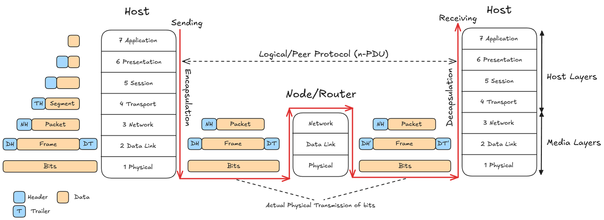
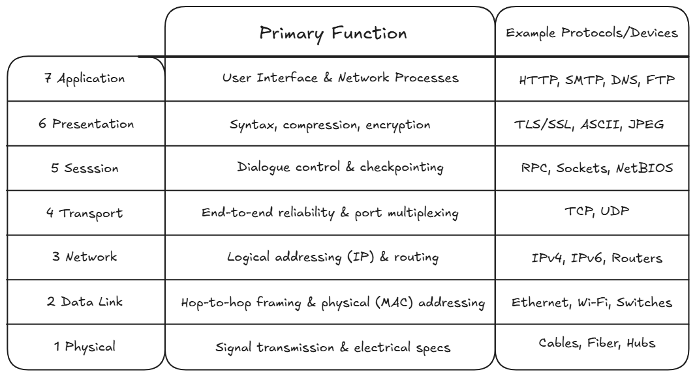
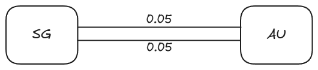

# Network Layers and Physical Resilience

## 1. Network Architecture & Layering Mechanics

### 1.1 Why Networks Use Layers
* **Separation of Concerns:** Computer networks are complex systems made of hardware, operating system drivers, transmission media, and user applications. Layering breaks the network into a vertical stack so each layer handles one specific job.
* **Service Abstraction:** Layer $n$ provides a clear service to the layer directly above it (Layer $n+1$) through an interface called a **Service Access Point (SAP)**. Layer $n+1$ does not need to know how Layer $n$ works internally.
* **Modularity:** You can change or upgrade a protocol inside one layer (e.g., upgrading from Wi-Fi to Ethernet) without changing or breaking the layers above or below it, as long as the interface between them stays the same.

---

### 1.2 Protocols vs. Services
* **Protocols (Horizontal Peer-to-Peer Communication):**
  * A protocol is a set of rules and message formats used between two machines communicating at the **same layer** (e.g., transport entity to transport entity).
  * Protocols define message syntax (structure), transmission timing/order, and what action to take when receiving a message.
  * Peer layers do not talk to each other directly across the wire. Data must travel down the local machine's stack, across the physical cable, and up the destination machine's stack.
* **Services (Vertical Communication via SAP):**
  * A service is what Layer $n$ makes available to Layer $n+1$ directly above it.
  * The conceptual connection point where Layer $n$ passes data to Layer $n+1$ is called an $(n)\text{-SAP}$. It is named after the underlying service provider (Layer $n$).

---

### 1.3 Data Units and the Encapsulation Lifecycle
* **Service Data Unit (SDU):** The raw data passed across an $(n)\text{-SAP}$ from Layer $n+1$ down to Layer $n$. It is the payload that Layer $n$ must deliver.
* **Protocol Data Unit (PDU):** The complete data packet built by Layer $n$. It combines Layer $n$'s control header (and optional trailer) with the SDU payload:
  $$\text{PDU}_n = \text{Header}_n + \text{SDU}_n \ (+ \text{Trailer}_n)$$
* **Layer Boundary Invariant:**
  $$\text{PDU}_n = \text{SDU}_{n-1}$$
  The full PDU built at Layer $n$ becomes the raw SDU payload handed down to Layer $n-1$.
* **Encapsulation (Sending):** Moving down the stack from application to physical wire, each layer adds its own control header to the data.
* **Decapsulation (Receiving):** Moving up the stack from physical wire to application, each layer checks its own header, strips it off, and passes the remaining payload up.

{width=62%}

---

### 1.4 Header Processing at Intermediate Switches/Routers vs. End Hosts
* **End Hosts:** End machines run the complete protocol stack (Layers 1 to 7 in OSI, or Layers 1 to 5 in TCP/IP).
* **Intermediate Switching Nodes (Routers / Switches):**
  * Standard intermediate forwarding devices operate only up to **Layer 3 (Network Layer)**.
  * **Hop-by-Hop L2 Replacement:** When an intermediate router receives bits from an incoming link:
    1. It reassembles the bits into a Layer 2 frame.
    2. It strips and discards the Layer 2 header ($DH$) and trailer ($DT$).
    3. It reads the Layer 3 Network Header ($NH$) to check the destination IP address and pick the outgoing link.
    4. It encapsulates the packet into a brand-new Layer 2 frame with new local MAC addresses and trailer before sending it onto the next hop.
  * The Layer 3 Network Header ($NH$) and all higher-layer headers ($TH$, application data) remain unchanged end-to-end.

---

## 2. Reference Models: OSI vs. TCP/IP

### 2.1 Layer Comparison & Responsibilities

| Layer # | OSI 7-Layer Model | TCP/IP 5-Layer Model | PDU Name | Implementation Domain | Core Functions & Examples |
| :---: | :--- | :--- | :---: | :---: | :--- |
| **7** | Application | **Application** (combines OSI 5–7) | Message / Data | User Space (Software) | Interfaces network services to user programs: HTTP, SMTP, DNS, FTP |
| **6** | Presentation | | | | Data translation, encryption/decryption, data compression: ASCII, JPEG |
| **5** | Session | | | | Manages dialogue and connections between software processes |
| **4** | Transport | **Transport (Host-to-Host)** | Segment | OS Kernel (Software) | End-to-end process-to-process delivery, port numbers, reliability, flow control: TCP, UDP |
| **3** | Network | **Network (Internet)** | Packet / Datagram | OS Kernel (Software) | Logical addressing (IP addresses) and path routing across subnets: IPv4, IPv6, ICMP |
| **2** | Data Link | **Data Link (Network Access)** | Frame | Network Adapter / Firmware | Direct node-to-node delivery over one physical link, MAC addressing, framing, hop-to-hop flow/error control: Ethernet, Wi-Fi |
| **1** | Physical | **Physical** | Bit | Hardware / Medium | Transmitting raw electrical/optical bit streams over physical cables or radio links |

---

## 3. Network Resilience & Availability Modeling

### 3.1 Operational Reliability Parameters
* **Mean Time to Failure (MTTF):** The average continuous uptime of a link or device before it breaks.
* **Mean Time to Repair (MTTR):** The average downtime required to repair a failed link or device and bring it back online.
* **Mean Time Between Failures (MTBF):** The total cycle time from one failure to the next:
  $$\text{MTBF} = \text{MTTF} + \text{MTTR}$$

---

### 3.2 Link Availability & Failure Probabilities
For any individual network link $i$:
* **Link Availability ($r_i$):** The steady-state probability that link $i$ is working:
  $$r_i = \frac{\text{MTTF}}{\text{MTBF}} = \frac{\text{MTTF}}{\text{MTTF} + \text{MTTR}}$$
* **Link Failure Probability / Unavailability ($b_i$):** The steady-state probability that link $i$ is down:
  $$b_i = \frac{\text{MTTR}}{\text{MTBF}} = \frac{\text{MTTR}}{\text{MTTF} + \text{MTTR}}$$
* **Complementary Relation:**
  $$r_i + b_i = 1 \iff b_i = 1 - r_i$$

#### System Downtime Calculation
Over an operational time window $T_{\text{window}}$ (such as 1 year):
$$\text{Allowable Downtime} = b \times T_{\text{window}} = (1 - r) \times T_{\text{window}}$$

#### The "Nines" Rule
High-availability systems are described by the number of "nines" of reliability ($k$ nines):
$$r = 1 - 10^{-k} \iff b = 10^{-k}$$
* **Three 9s ($99.9\%$):** $b = 10^{-3} = 0.001$
* **Four 9s ($99.99\%$):** $b = 10^{-4} = 0.0001$
* **Five 9s ($99.999\%$):** $b = 10^{-5} = 0.00001$
* **Six 9s ($99.9999\%$):** $b = 10^{-6} = 0.000001$

---

## 4. Network Topological Resilience Calculations

### 4.1 Fundamental Independence Assumption
All link failures are assumed to be **statistically independent**:
$$P(\text{Link } A \text{ and Link } B \text{ fail}) = P(A) \times P(B)$$

---

### 4.2 Series Topology
In a series topology, data must pass through every link. If any link breaks, the entire connection is broken.

{width=55%}

* **Availability ($r_{\text{series}}$):** Probability that all links work at the same time:
  $$r_{\text{series}} = \prod_{i=1}^{n} r_i = r_1 \times r_2 \times \cdots \times r_n$$
* **Failure Probability ($b_{\text{series}}$):** Probability that at least one link breaks:
  $$b_{\text{series}} = 1 - r_{\text{series}} = 1 - \prod_{i=1}^{n} (1 - b_i)$$

---

### 4.3 Parallel Topology
In a parallel topology, alternative paths exist. Communication breaks only if all redundant links fail at the same time.

{width=55%}

* **Failure Probability ($b_{\text{parallel}}$):** Probability that all independent links break together:
  $$b_{\text{parallel}} = \prod_{i=1}^{n} b_i = b_1 \times b_2 \times \cdots \times b_n$$
* **Availability ($r_{\text{parallel}}$):** Probability that at least one working path survives:
  $$r_{\text{parallel}} = 1 - b_{\text{parallel}} = 1 - \prod_{i=1}^{n} b_i$$

---

### 4.4 Hybrid Networks: Path-Based Reduction Framework
To find the end-to-end disconnection probability in a series-parallel graph:
1. Identify all independent parallel routes that connect the source to the destination.
2. For each route that contains links in series, calculate that route's availability $r_{\text{route}}$ by multiplying the individual link availabilities.
3. Find each route's failure probability:
   $$b_{\text{route}} = 1 - r_{\text{route}}$$
4. The system is disconnected only if all independent routes fail at the same time. Multiply their failure probabilities together:
   $$b_{\text{total}} = \prod b_{\text{route}}$$
5. Find total system availability:
   $$r_{\text{total}} = 1 - b_{\text{total}}$$

{width=55%}

---

## 5. Exam Problem Archetypes

### Archetype 1: Downtime Calculation from Nines
* **Problem:** A carrier-grade telecommunications network requires 6 nines ($99.9999\%$) availability. Calculate the maximum allowable downtime in seconds per year (assume a 365-day year).
* **Step 1: Extract failure probability $b$:**
  $$r = 99.9999\% = 1 - 10^{-6} \implies b = 10^{-6}$$
* **Step 2: Convert 1 year into total seconds:**
  $$T_{\text{year}} = 365 \text{ days} \times 24 \frac{\text{hours}}{\text{day}} \times 60 \frac{\text{minutes}}{\text{hour}} \times 60 \frac{\text{seconds}}{\text{minute}} = 31{,}536{,}000 \text{ seconds}$$
* **Step 3: Compute downtime:**
  $$\text{Downtime} = b \times T_{\text{year}} = 10^{-6} \times 31{,}536{,}000 \text{ s} = \mathbf{31.536 \text{ seconds}}$$

---

### Archetype 2: Series-Parallel Graph Reduction
* **Problem:** Node SG connects to Node SF. There are two independent parallel links between SG and intermediate node HW. Node HW connects to SF via one link. Additionally, a direct long-range link connects SG straight to SF. Each link fails independently with probability $b = 0.05$. Calculate the probability that SG is disconnected from SF.
* **Step 1: Reduce the parallel section between SG and HW:**
  Both parallel links must fail for the segment between SG and HW to break:
  $$b_{\text{SG-HW}} = b \times b = 0.05 \times 0.05 = 0.0025$$
  $$r_{\text{SG-HW}} = 1 - 0.0025 = 0.9975$$
* **Step 2: Calculate availability of the indirect route (SG $\to$ HW $\to$ SF):**
  This route is a series combination of the reduced SG-HW link and the HW-SF link:
  $$r_{\text{indirect}} = r_{\text{SG-HW}} \times r_{\text{HW-SF}} = 0.9975 \times (1 - 0.05) = 0.9975 \times 0.95 = 0.947625$$
* **Step 3: Convert the indirect route into a failure probability:**
  $$b_{\text{indirect}} = 1 - r_{\text{indirect}} = 1 - 0.947625 = 0.052375$$
* **Step 4: Combine the two independent paths (Direct vs. Indirect):**
  SG is disconnected from SF only if both the direct link and the indirect route fail at the same time:
  $$P(\text{Disconnected}) = b_{\text{direct}} \times b_{\text{indirect}} = 0.05 \times 0.052375 = \mathbf{0.00261875} \quad (\approx 0.262\%)$$
* **Step 5: Total Network Availability:**
  $$r_{\text{total}} = 1 - P(\text{Disconnected}) = 1 - 0.00261875 = \mathbf{0.99738125} \quad (\approx 99.738\%)$$