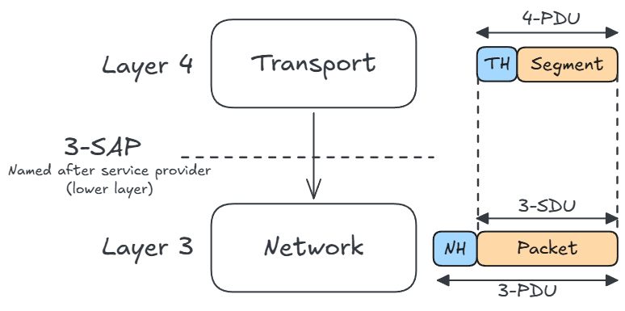
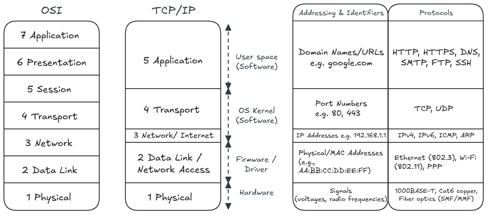
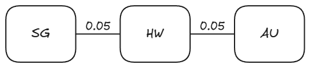
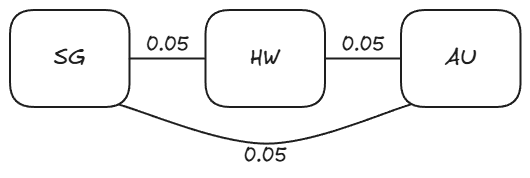

# Network Layers and Physical Resilience

A computer network is basically an interconnected collection of hosts/end systems (laptops, servers, phones) connected by transmission media (cables, fiber optics, radio waves) and forwarding devices (routers) that allow them to exchange data and share resources. The internet is built upon computer networks.

By the principle of separation of concerns (abstraction), computer networks are decomposed into independent layers.
Each layer solves one problem and provides a service to the layer above it, while hiding the implementation details of how it does its own job.

The benefits of layering are obvious:

- **Manage complexity**: Provides explicit structure to complex networks. Interfaces are clearly defined.
- **Modularity**: Systems are easier to update. Changes to one layer doesn't affect the other layers.

Some layering concepts:

- **Protocols**: Formal rules & conventions governing communication between *peering* entities on different machines (horizontal).
  - Defines message format/syntax, order of messages being transmitted, actions taken upon message tranmission and receipt.
  - Note that horizontal communication is just an abstraction. Data actually moves down the layers of the sending machine, and then up the layers of the receiving host.
- **Services & Service Access Points (SAP)**: Layer $n$ provides services to upper layer $n+1$ via a interface at a SAP.
- Data Units:
  - Service Data Unit (**SDU**): Raw data passed from layer $n+1$ down to layer $n$.
  - Protocol Data Unit (**PDU**): Complete packet generated at layer $n$, where PDU = Header + SDU.
- Encapsulation & Decapsulation:
  - Sender (**Encapsulation**): As data moves down the stack, each layer wraps the payload with its own control header.
  - Receiver (**Decapsulation**): As data moves up the stack, each layer reads and strips off its corresponding header to deliver the payload upward.

## Network Architecture Models

Network Architecture is a set of layers and protocols with specifications enabling hardware/software developers to build systems compliant with a particular architecture.

### Open Systems Interconnection (OSI) 7-Layer Model

This model is more of a conceptual reference model.

{width=62%}

### Transmission Control Protocol (TCP)/ Internet Protocol (IP) 5-Layer Model

The modern internet is built on this model.

## Network Resilience & Reliability

Network Reliability: The probability that a network performs satisfactorily over a specified period of time.

### The reliability parameters

- Mean Time to Failure (MTTF): The expected time a link/system operates correctly before it fails.
- Mean Time to Repair (MTTR): The expected downtime required to troubleshoot, repair, and restore the link/system to operation.
- Mean Time Between Failures (MTBF): The total elapsed time between consecutive failures.

$$ MTBF=MTTF+MTTR $$

### Link Availiablity

For an individual link $i$:

- Link Availability ($r_i$): The percentage/probability of time that link $i$ is functional.
- Link Failure Probability ($b_i$): The percentage/probability of time that link $i$ is broken/dysfunctional.

$$ r_i + b_i = 1 $$

Quick reference for availability:

| Availability % | Downtime per year | Downtime per month | Downtime per week |
| :--- | :--- | :--- | :--- |
| **90% ("one nine")** | 36.5 days | 72 hours | 16.8 hours |
| **99% ("two nines")** | 3.65 days | 7.20 hours | 1.68 hours |
| **99.9% ("three nines")** | 8.76 hours | 43.8 minutes | 10.1 minutes |
| **99.95%** | 4.38 hours | 21.56 minutes | 5.04 minutes |
| **99.99% ("four nines")** | 52.56 minutes | 4.32 minutes | 1.01 minutes |
| **99.999% ("five nines")** | 5.26 minutes | 25.9 seconds | 6.05 seconds |
| **99.9999% ("six nines")** | 31.5 seconds | 2.59 seconds | 0.605 seconds |
| **99.99999% ("seven nines")** | 3.15 seconds | 0.259 seconds | 0.0605 seconds |

### Network Resilience

Network Resilience: A measure of network fault tolerance, expressed as the probability that nodes remain connected despite link failures.

We assume that the probabilities of link failures are statistically independent of one another.

Assume link failure probability $b_i = 0.05$ for all links.

{width=55%}

$$r_{\text{series}} = \prod_{i=1}^{n} r_i = 0.95 \times 0.95 = 0.9025$$

$$b_{\text{series}} = 1 - 0.9025 = 0.0975 \quad (9.75\%)$$

{width=55%}

$$b_{\text{parallel}} = \prod_{i=1}^{n} b_i = 0.05 \times 0.05 = 0.0025 \quad (0.25\%)$$

$$r_{\text{parallel}} = 1 - 0.0025 = 0.9975 \quad (99.75\%)$$

{width=55%}

$$r_{\text{SG-HW-AU}} = r_{\text{SG-HW}} \times r_{\text{HW-AU}} = (1 - 0.05) \times (1 - 0.05) = 0.9025$$

$$b_{\text{SG-HW-AU}} = 1 - r_{\text{SG-HW-AU}} = 1 - 0.9025 = 0.0975$$

$$b_{\text{SG-AU}} = 0.05$$

$$\text{Prob(Disconnected)} = 0.0975 \times 0.05 = 0.004875 \quad (0.4875\%)$$
