# Data Link Layer (DLL): Flow & Error Control

## 1. Fundamentals & Architecture

The Data Link Layer (DLL) is divided into two primary sublayers:

* [This chapter] **Logical Link Control (LLC):** Focuses on the point-to-point logical link between two communicating peers. It handles flow control, error control (ARQ), independent of the underlying physical transmission medium.
* [Next chapter] **Media Access Control (MAC):** Focuses on multi-point, shared-medium local area networks (LANs). It handles physical (MAC) addressing, frame delimiter assembly, and channel access arbitration among multiple competing hosts.

### Universal Timing & Link Utilization Parameters
To evaluate protocol performance across physical media, we define the following parameters:

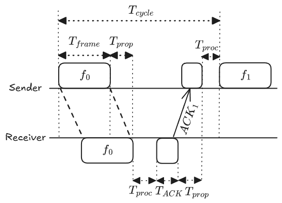

* $T_{\text{frame}}$: Frame transmission time (time required to emit all bits of the frame onto the medium; $T_{\text{frame}} = \frac{L}{R}$, where $L$ is frame length in bits, and $R$ is data rate in bps).
* $T_{\text{prop}}$: Signal propagation delay (time for a bit to travel the physical distance across the medium; $T_{\text{prop}} = \frac{D}{V}$, where $D$ is distance, and $V$ is signal velocity).
* $T_{\text{proc}}$: Internal hardware processing time at the sender and receiver.
* $T_{\text{ack}}$: Transmission time to emit the acknowledgment packet onto the medium.
* $T_{\text{cycle}}$: Total elapsed time to complete one send-and-acknowledge cycle:
  $$T_{\text{cycle}} = T_{\text{frame}} + T_{\text{prop}} + T_{\text{proc}} + T_{\text{ack}} + T_{\text{prop}} + T_{\text{proc}}$$

**Link Utilization ($U$)** measures the fraction of total cycle time spent carrying useful frame transmission:
$$U = \frac{T_{\text{frame}}}{T_{\text{cycle}}}$$

Under standard course assumptions:

* Saturated data input (sender always has frames ready to transmit).
* Negligible processing and acknowledgment transmission times ($T_{\text{proc}} \approx 0, T_{\text{ack}} \approx 0$).

The total cycle simplifies to:
$$T_{\text{cycle}} = T_{\text{frame}} + 2T_{\text{prop}}$$

The link utilization formula becomes:
$$U = \frac{T_{\text{frame}}}{T_{\text{frame}} + 2T_{\text{prop}}} = \frac{1}{1 + 2\left(\frac{T_{\text{prop}}}{T_{\text{frame}}}\right)} = \frac{1}{1 + 2a}$$

where the **Normalized Propagation Delay** is defined as:
$$a = \frac{T_{\text{prop}}}{T_{\text{frame}}}$$

**Physical Significance of $a$:**

* If $a < 1$: Frame transmission delay dominates the channel ($L/R$ is large relative to propagation delay), yielding high baseline channel efficiency.
* If $a > 1$: Signal propagation delay dominates the channel (long-haul propagation or very high bitrate), leaving the medium idle for most of the cycle while waiting for round-trip signal propagation.

### Transmission Impairments & Correction Overview
In real physical channels, noise, attenuation, and distortion introduce transmission errors:

* **Lost Frame:** The frame is completely lost on the medium, or its header is corrupted beyond recognition. Handled by a sender-side retransmission timer (timeout control).
* **Damaged Frame:** The frame arrives, but bit errors exist (detected via Parity bits or Cyclic Redundancy Checks, CRC). Handled by negative acknowledgments (NAK) or sender timeouts.
* **Automatic Repeat Request (ARQ):** Combines error detection with timers and retransmissions to provide reliable link-layer delivery.

---

## 2. Stop-and-Wait Protocol Family

### Flow Control (Error-Free)
Flow control prevents the transmitter from overflowing the receiver's incoming buffer.

* **Mechanism:** The sender transmits one frame and halts transmission, waiting for an explicit acknowledgment ($\text{ACK}$) before sending the next frame.
* **Alternating Sequence Numbers:** A 1-bit binary sequence number ($0$ and $1$) is sufficient:
  * Frames alternate between $f_0$ and $f_1$.
  * $\text{ACK}_1$ confirms successful receipt of $f_0$ and informs the sender that the receiver is waiting for $f_1$.
* **Utilization:**
  $$U = \frac{1}{1 + 2a}$$
* **Bottleneck:** When $a \gg 1$, utilization drops toward zero because the sender spends the vast majority of each cycle idling.

### Error Control: Stop-and-Wait ARQ
Extends Stop-and-Wait flow control to handle transmission losses:

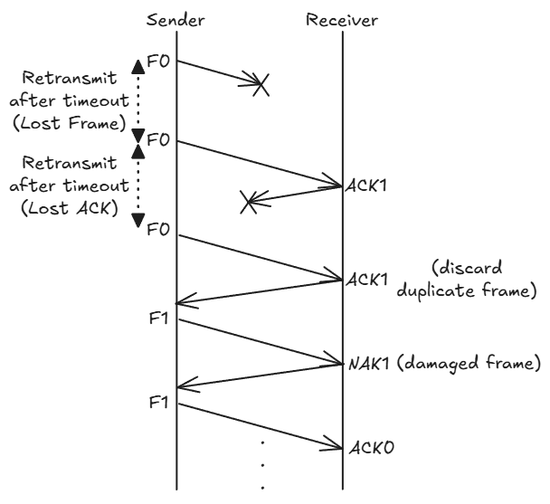

* **Retransmission Timer:** The sender starts a timer upon emitting a frame. If no valid ACK arrives before the timer expires ($T_{\text{timeout}} > T_{\text{frame}} + 2T_{\text{prop}}$), the sender retransmits the frame.
* **Negative Acknowledgments (NAK):** If the receiver detects a corrupted frame, it can return a NAK to prompt an immediate retransmission without waiting for sender timeout.
* **Duplicate Detection:** If an ACK is lost, the sender times out and retransmits the previous frame. The receiver detects the duplicate sequence number, discards the duplicate payload, and re-sends the ACK to allow the sender to advance.
* **Link Utilization with Frame Error Probability ($P$):**
  Assuming an independent frame loss/error probability $P$ per transmission attempt:
  $$U_{\text{SaW}}^{\text{ARQ}} = \frac{1 - P}{1 + 2a}$$

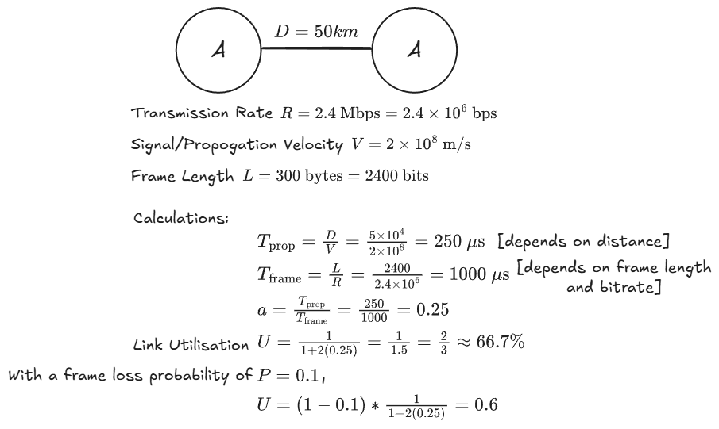

---

## 3. Sliding Window Protocol Family

### Flow Control & Window Mechanics
Sliding window flow control eliminates the idling bottleneck of Stop-and-Wait by allowing up to $N$ frames to be transmitted without waiting for an acknowledgment.

* **Sequence Numbering:** Frames are indexed using a $k$-bit field, giving a modular sequence number space of $2^k$ (values $[0, 2^k - 1]$ modulo $2^k$).
* **Cumulative Acknowledgments:** An ACK carries the sequence number of the next expected frame, implicitly confirming receipt of all preceding frames.
* **Theoretical Window Bound (Error-Free Flow Control):**
  $$N \le 2^k$$
* **Auxiliary Control Features:**
  * **Receiver Not Ready (RNR):** An RNR frame acknowledges received frames while closing the sender's transmission window, temporarily suspending further transmissions until a regular ACK is sent.
  * **Piggybacking:** In full-duplex communication, acknowledgment numbers are embedded directly in the header of reverse-direction data frames.

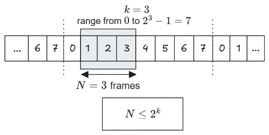

### Window Edge Movement Rules (Lecture Definition)
The window defines the sequence numbers currently permitted to be sent or received:

* **Sender's Window:**
  * **Trailing Edge (lower bound / left):** Moves forward (window shrinks) *when frames are sent*.
  * **Leading Edge (upper bound / right):** Moves forward (window expands) *when ACKs are received*.
* **Receiver's Window:**
  * **Trailing Edge (lower bound / left):** Moves forward (window shrinks) *when frames are received*.
  * **Leading Edge (upper bound / right):** Moves forward (window expands) *when ACKs are sent*.

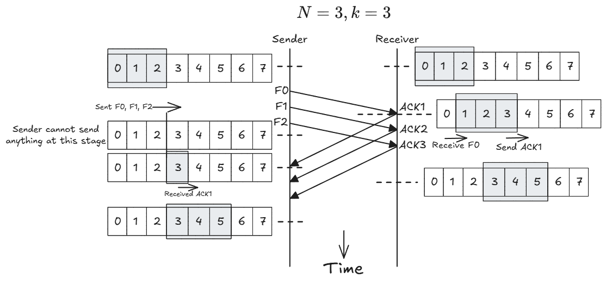

### Performance of Sliding Window (Error-Free)
Normalizing frame transmission time to $T_{\text{frame}} = 1$ (making cycle time $1 + 2a$):

* **Case I: Full Pipe ($N \ge 1 + 2a$)**
  * The sender has sufficient window capacity to transmit continuously until the first acknowledgment returns at $t = 1 + 2a$.
  * Channel experiences zero idle time:
    $$U = 1.0 \quad (100\%)$$

* **Case II: Window Exhaustion ($N < 1 + 2a$)**
  * The sender exhausts its window capacity of $N$ frames at $t = N$ and must remain idle until the first ACK arrives at $t = 1 + 2a$.
  * Link utilization is constrained by the active transmission time:
    $$U = \frac{T_{\text{useful}}}{T_{\text{cycle}}} = \frac{N}{1 + 2a}$$

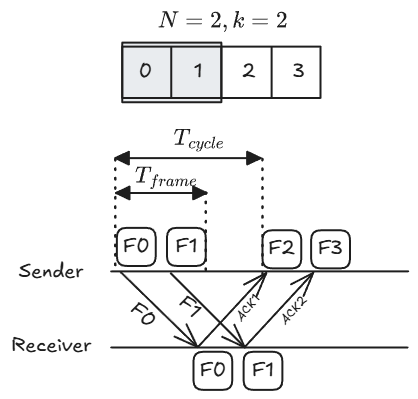

---

### Sliding Window Error Control: Go-Back-N ARQ (GBN)

In Go-Back-N ARQ, the receiver accepts frames strictly in sequential order and maintains zero out-of-order buffering ($W_{\text{rx}} = 1$).

* **Sender's Window ($W_{\text{tx}} = N$):**
  * **Trailing Edge (lower bound / left):** Moves forward (window shrinks) *when frames are sent*. On timeout or receiving $\text{NAK}(n)$, rewinds back to $n$ to retransmit frame $n$ and all subsequent frames.
  * **Leading Edge (upper bound / right):** Moves forward (window expands) *when cumulative ACKs are received*.
* **Receiver's Window ($W_{\text{rx}} = 1$):**
  * **Trailing Edge (lower bound / left):** Moves forward (window shrinks) *when expected in-order frames are received*. If a frame is damaged or out of order, does not move (frame and subsequent frames are discarded).
  * **Leading Edge (upper bound / right):** Moves forward (window expands) *when cumulative ACKs (RR) are sent*. Sends $\text{NAK}(n)$ (REJ) if an erroneous/out-of-order frame is detected.

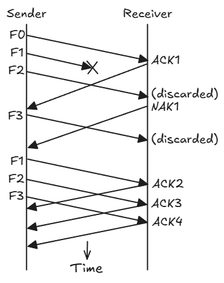

#### Maximum Window Size for Go-Back-N
Applying the non-overlap invariant with a 1-slot receiver window ($W_{\text{rx}} = 1$ and $W_{\text{tx}} = N$):
$$W_{\text{tx}} + W_{\text{rx}} \le 2^k \implies N + 1 \le 2^k \implies N \le 2^k - 1$$

* **Failure at $N = 2^k$ (e.g., $k = 3$, $N = 8$):** If an entire window of 8 frames is received but all ACKs are lost, the receiver advances its expected sequence pointer to $0$. The sender times out and retransmits the old frame $0$. The receiver cannot distinguish the retransmitted old frame $0$ from a brand new frame $0$ and mistakenly accepts duplicate data.
* **Resolution at $N = 2^k - 1$ (e.g., $k = 3$, $N = 7$):** If all ACKs are lost, the sender retransmits old frame $0$. The receiver expects frame $7$, so old frame $0$ falls outside the 1-slot expectation and is correctly rejected.

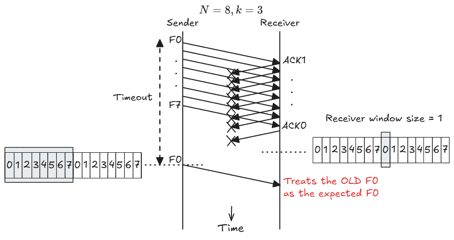

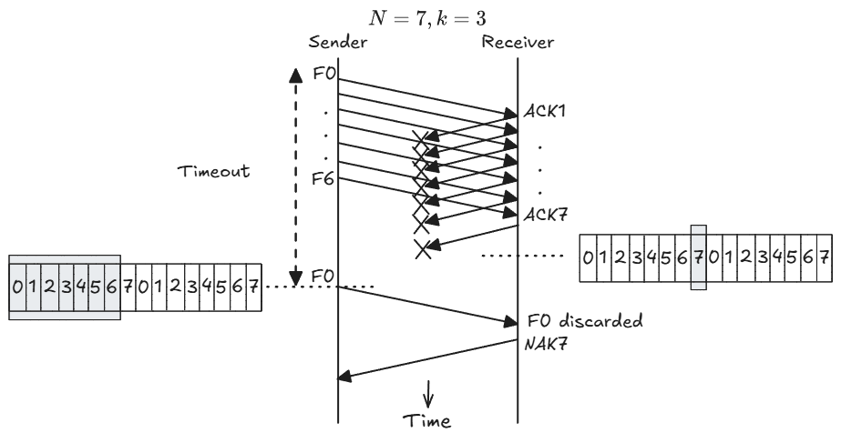

---

### Sliding Window Error Control: Selective Reject ARQ (SR)

Selective Reject (Selective Repeat) minimizes redundant retransmissions by buffering valid out-of-order frames that fall within an open receive window.

* **Sender's Window ($W_{\text{tx}} = N$):**
  * **Trailing Edge (lower bound / left):** Moves forward (window shrinks) *when frames are sent*. On timeout or receiving $\text{NAK } n$, retransmits *only* frame $n$ without rewinding other transmitted frames.
  * **Leading Edge (upper bound / right):** Moves forward (window expands) *when ACKs are received*.
* **Receiver's Window ($W_{\text{rx}} = N$):**
  * **Trailing Edge (lower bound / left):** Moves forward (window shrinks) *when contiguous in-order frames are received and delivered to the network layer*. Stays pinned at missing frame $n$ while buffering subsequent valid out-of-order frames.
  * **Leading Edge (upper bound / right):** Moves forward (window expands) *when ACKs are sent*. Sends $\text{SREJ } n$ / $\text{NAK } n$ for missing frames while keeping the window open for future frames.

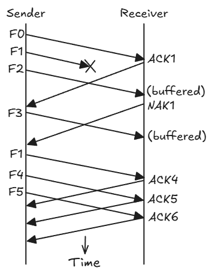

#### Maximum Window Size for Selective Reject
Because both sender and receiver maintain active windows of size $N$, the non-overlap condition requires:
$$W_{\text{tx}} + W_{\text{rx}} \le 2^k \implies 2N \le 2^k \implies N \le 2^{k - 1}$$

* **Failure at $N > 2^{k-1}$ (e.g., $k = 3$, $N = 5$):** If frames $0$ through $4$ are accepted and all ACKs are lost, the receiver advances its window to $[5, 6, 7, 0, 1]$. Upon sender timeout, retransmitted frame $0$ falls inside the receiver's open window and is mistakenly accepted as new data.
* **Resolution at $N = 2^{k-1}$ (e.g., $k = 3$, $N = 4$):** When frames $0$ through $3$ are accepted, the receiver advances its window to $[4, 5, 6, 7]$. A retransmitted frame $0$ falls outside this window, preventing ambiguity and triggering a duplicate ACK 4.

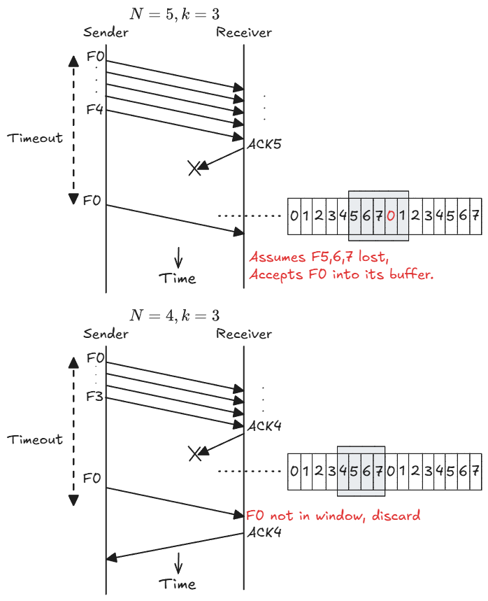

---

## 4. Protocol Comparison & Exam Formulas

### Structural Comparison

| Feature | Stop-and-Wait ARQ | Go-Back-N ARQ (GBN) | Selective Reject ARQ (SR) |
| :--- | :--- | :--- | :--- |
| **Sender Window ($W_{\text{tx}}$)** | $1$ | $N \le 2^k - 1$ | $N \le 2^{k-1}$ |
| **Receiver Buffering ($W_{\text{rx}}$)** | $1$ | $1$ (in-order only) | $N$ (out-of-order buffer) |
| **Retransmission Scope** | Current frame only | Erroneous frame + all subsequent | Erroneous frame only |

### Examination Link Utilization Formulas

* **Stop-and-Wait ARQ (Frame loss $P$):**
  $$U_{\text{SaW}} = \frac{1 - P}{1 + 2a}$$

* **Sliding Window (Error-Free):**
  $$U = \begin{cases} 1 & N \ge 1 + 2a \\ \dfrac{N}{1 + 2a} & N < 1 + 2a \end{cases}$$

* **Selective Reject ARQ (Frame loss $P$):**
  $$U_{\text{SR}} = \begin{cases} 1 - P & N \ge 1 + 2a \\[0.5em] \dfrac{N(1 - P)}{1 + 2a} & N < 1 + 2a \end{cases}$$

* **Go-Back-N ARQ:**
  $$U_{\text{GBN}}^{\text{ARQ}} = \begin{cases} \dfrac{1 - P}{1 + 2aP} & N \ge 1 + 2a \\[1em] \dfrac{N(1 - P)}{(1 + 2a)(1 - P + NP)} & N < 1 + 2a \end{cases}$$

  *(Note: This theoretical formula accounts for cascading window retransmissions. For course examinations, this formula is **not** used or tested. By course convention, always use the simplified **Selective Reject ARQ formula** above to compute Go-Back-N link utilization).*